Arquivo original: `Aula 00 Orientação a Objetos.pdf`

## Página 1

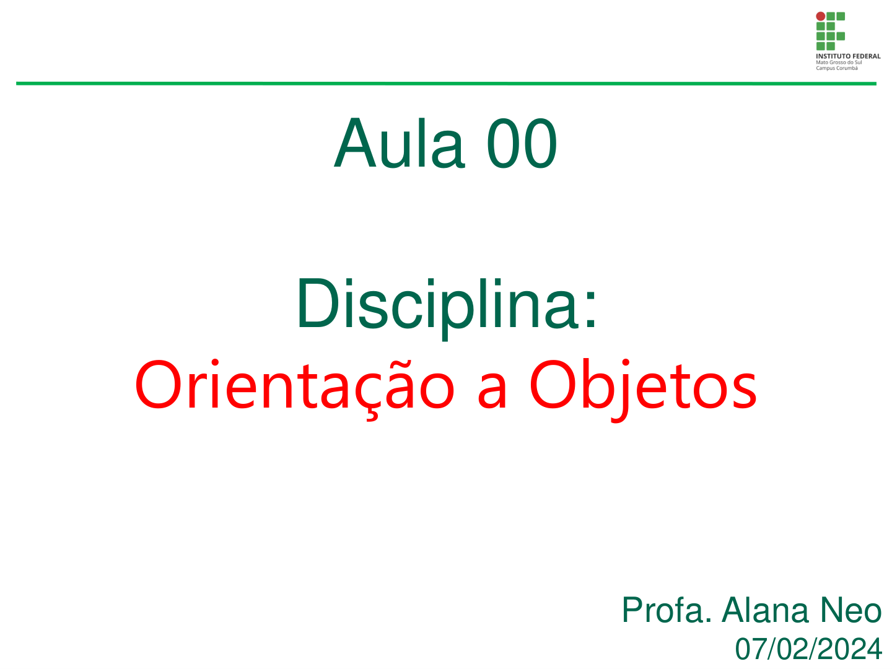

Aula 00

      Disciplina:
Orientação a Objetos

                                Profa. Alana Neo
                                        07/02/2024

## Página 2

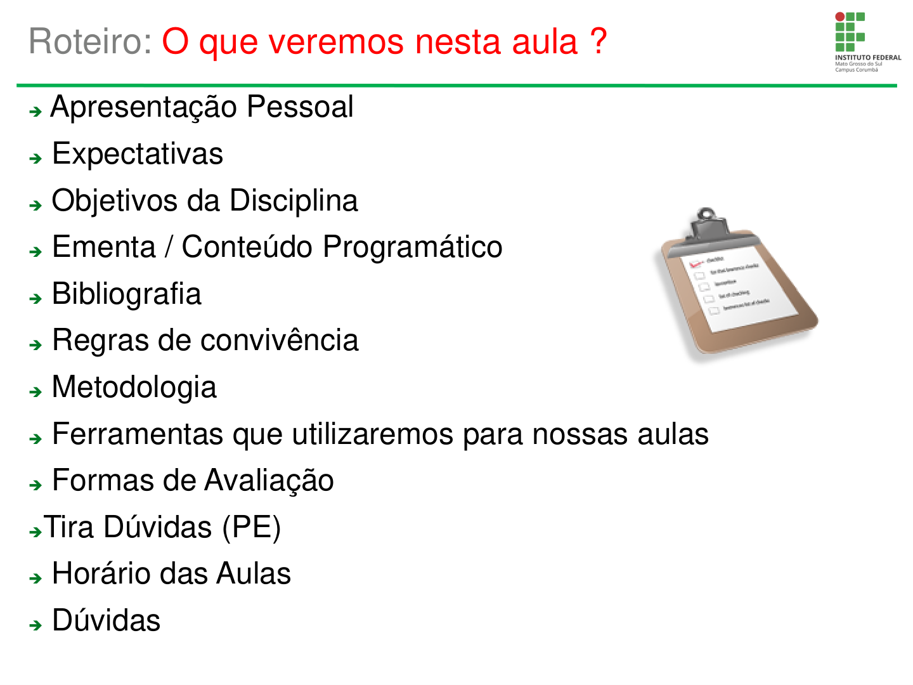

Roteiro: O que veremos nesta aula ?

➔Apresentação Pessoal
➔Expectativas
➔Objetivos da Disciplina
➔Ementa / Conteúdo Programático
➔Bibliografia
➔Regras de convivência
➔Metodologia
➔Ferramentas que utilizaremos para nossas aulas
➔Formas de Avaliação
➔Tira Dúvidas (PE)
➔Horário das Aulas
➔Dúvidas

## Página 3

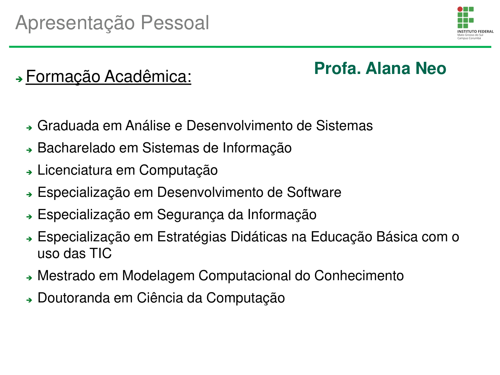

Apresentação Pessoal

                                      Profa. Alana Neo➔Formação Acadêmica:

 ➔Graduada em Análise e Desenvolvimento de Sistemas
 ➔Bacharelado em Sistemas de Informação
  ➔Licenciatura em Computação
  ➔Especialização em Desenvolvimento de Software
  ➔Especialização em Segurança da Informação
  ➔Especialização em Estratégias Didáticas na Educação Básica com o
   uso das TIC
 ➔Mestrado em Modelagem Computacional do Conhecimento
 ➔Doutoranda em Ciência da Computação

## Página 4

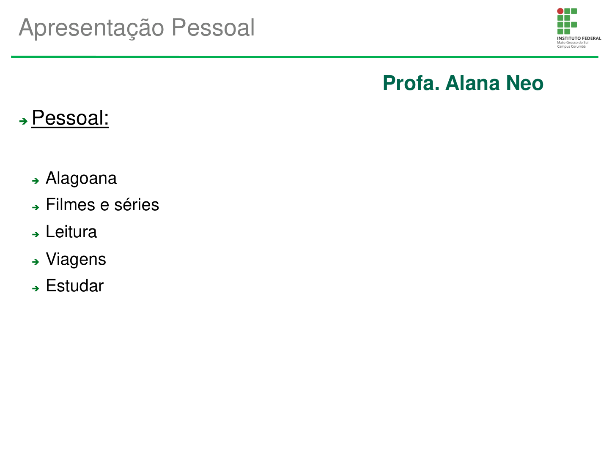

Apresentação Pessoal

                                      Profa. Alana Neo

➔Pessoal:

 ➔Alagoana
 ➔Filmes e séries
  ➔Leitura
 ➔Viagens
 ➔Estudar

## Página 5

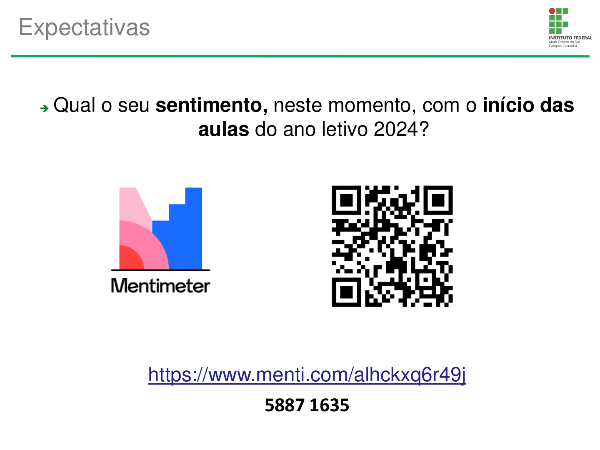

Expectativas

  ➔Qual o seu sentimento, neste momento, com o início das
                  aulas do ano letivo 2024?

              https://www.menti.com/alhckxq6r49j

                        5887 1635

## Página 6

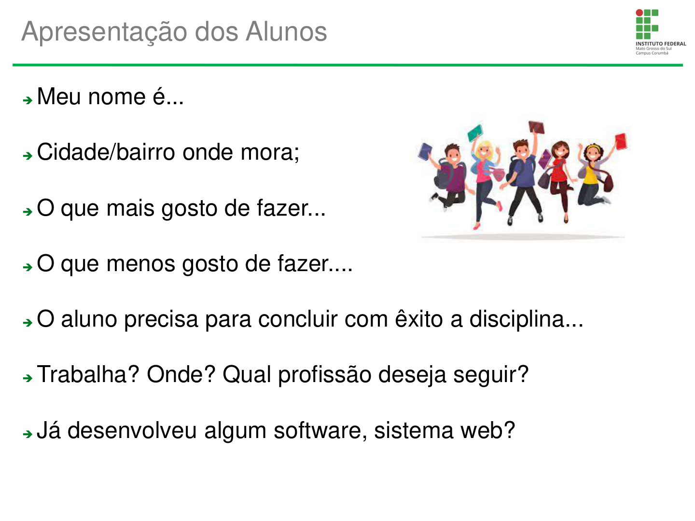

Apresentação dos Alunos

➔Meu nome é...

➔Cidade/bairro onde mora;

➔O que mais gosto de fazer...

➔O que menos gosto de fazer....

➔O aluno precisa para concluir com êxito a disciplina...

➔Trabalha? Onde? Qual profissão deseja seguir?

➔Já desenvolveu algum software, sistema web?

## Página 7

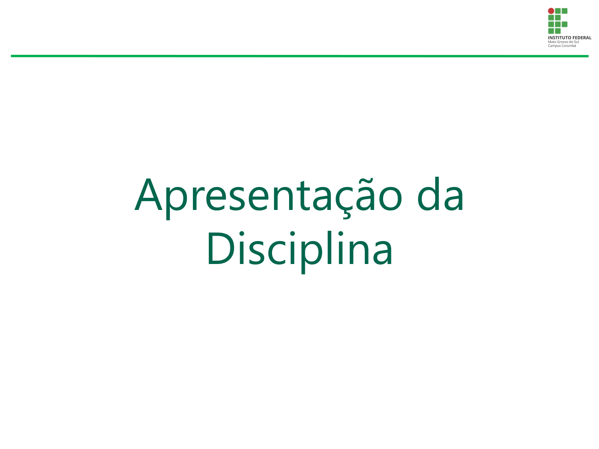

Apresentação da
    Disciplina

## Página 8

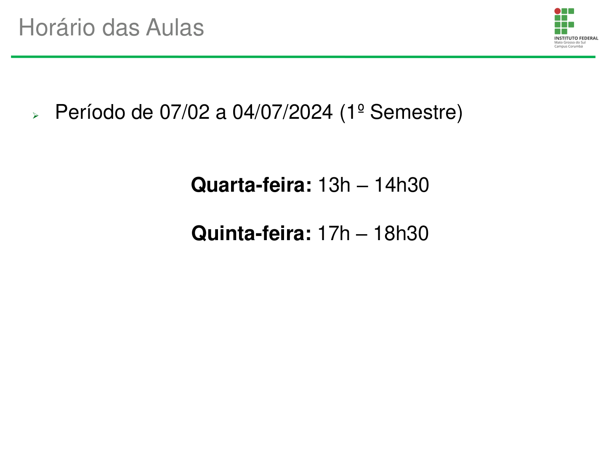

Horário das Aulas

 ➢Período de 07/02 a 04/07/2024 (1º Semestre)

                  Quarta-feira: 13h – 14h30

                   Quinta-feira: 17h – 18h30

## Página 9

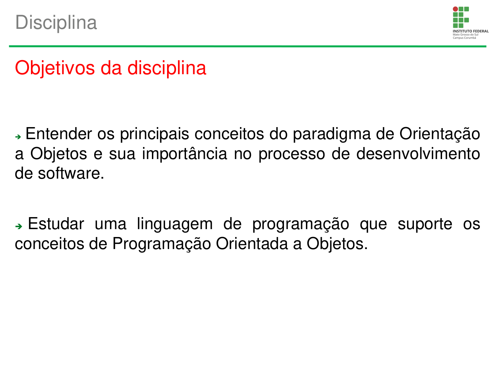

Disciplina

Objetivos da disciplina

➔Entender os principais conceitos do paradigma de Orientação
a Objetos e sua importância no processo de desenvolvimento
de software.

➔Estudar uma linguagem de programação que suporte os
conceitos de Programação Orientada a Objetos.

## Página 10

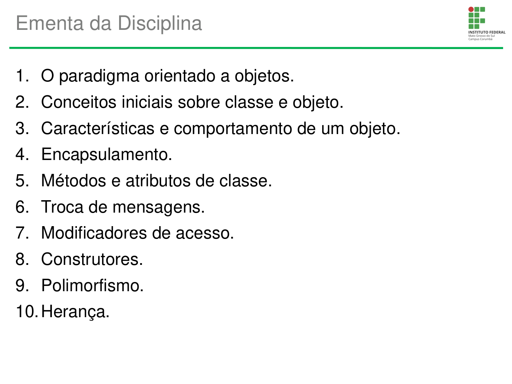

Ementa da Disciplina

1. O paradigma orientado a objetos.
2. Conceitos iniciais sobre classe e objeto.
3.  Características e comportamento de um objeto.
4. Encapsulamento.
5. Métodos e atributos de classe.
6. Troca de mensagens.
7. Modificadores de acesso.
8. Construtores.
9. Polimorfismo.
10.Herança.

## Página 11

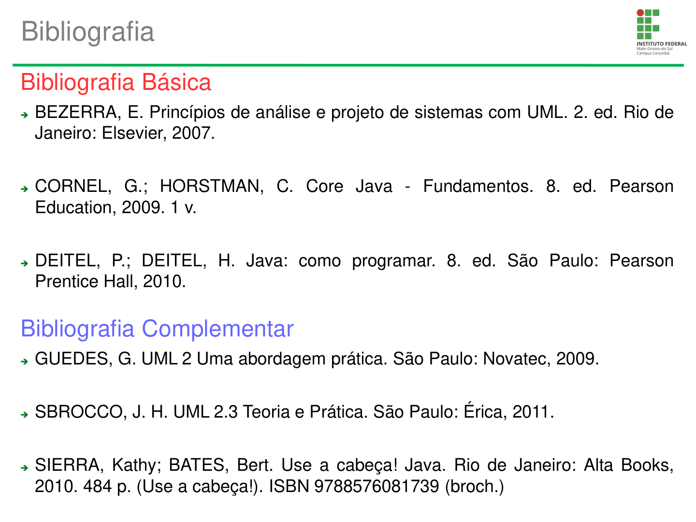

Bibliografia

Bibliografia Básica
➔BEZERRA, E. Princípios de análise e projeto de sistemas com UML. 2. ed. Rio de
  Janeiro: Elsevier, 2007.

➔CORNEL,  G.; HORSTMAN, C. Core Java  - Fundamentos.  8.  ed. Pearson
  Education, 2009. 1 v.

➔DEITEL,  P.; DEITEL, H. Java: como programar.  8. ed. São Paulo: Pearson
  Prentice Hall, 2010.

Bibliografia Complementar
➔GUEDES, G. UML 2 Uma abordagem prática. São Paulo: Novatec, 2009.

➔SBROCCO, J. H. UML 2.3 Teoria e Prática. São Paulo: Érica, 2011.

➔SIERRA, Kathy; BATES, Bert. Use a cabeça! Java. Rio de Janeiro: Alta Books,
  2010. 484 p. (Use a cabeça!). ISBN 9788576081739 (broch.)

## Página 12

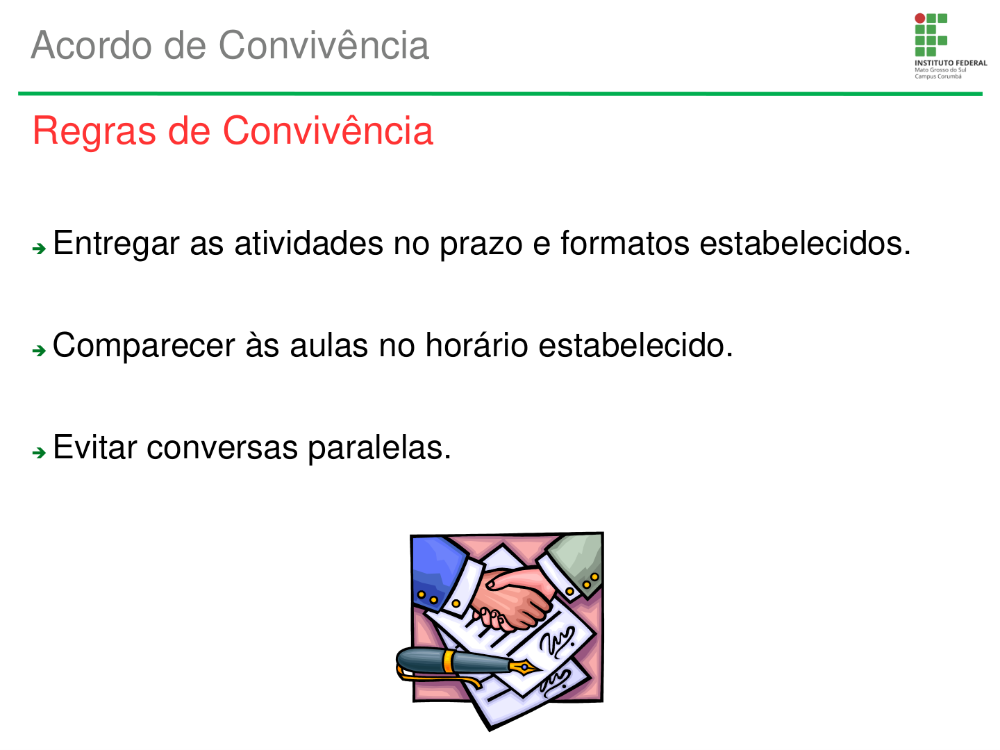

Acordo de Convivência

Regras de Convivência

➔Entregar as atividades no prazo e formatos estabelecidos.

➔Comparecer às aulas no horário estabelecido.

➔Evitar conversas paralelas.

## Página 13

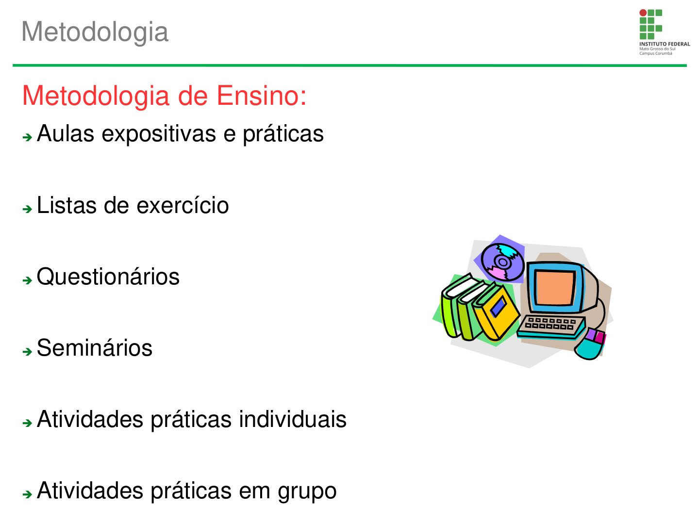

Metodologia

Metodologia de Ensino:
➔Aulas expositivas e práticas

➔Listas de exercício

➔Questionários

➔Seminários

➔Atividades práticas individuais

➔Atividades práticas em grupo

## Página 14

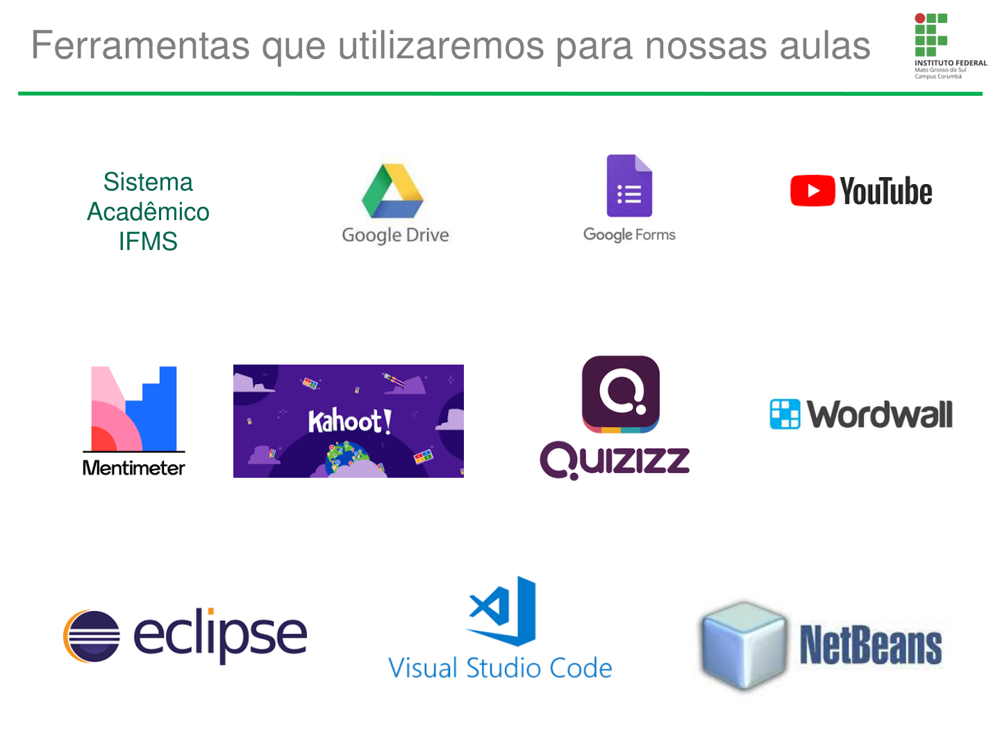

Ferramentas que utilizaremos para nossas aulas

      Sistema
    Acadêmico
      IFMS

## Página 15

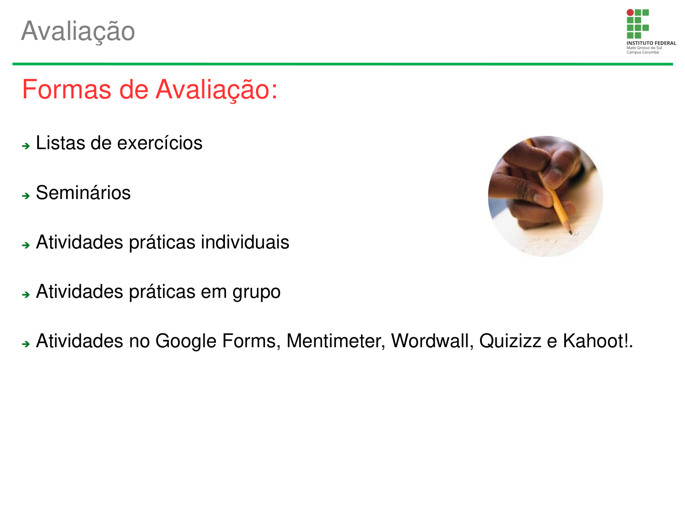

Avaliação

Formas de Avaliação:

➔Listas de exercícios

➔Seminários

➔Atividades práticas individuais

➔Atividades práticas em grupo

➔Atividades no Google Forms, Mentimeter, Wordwall, Quizizz e Kahoot!.

## Página 16

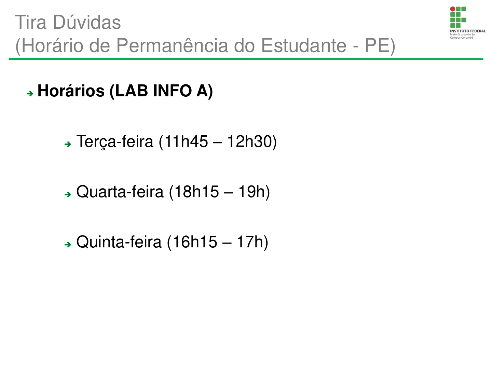

Tira Dúvidas
(Horário de Permanência do Estudante - PE)

 ➔Horários (LAB INFO A)

       ➔Terça-feira (11h45 – 12h30)

      ➔Quarta-feira (18h15 – 19h)

       ➔Quinta-feira (16h15 – 17h)

## Página 17

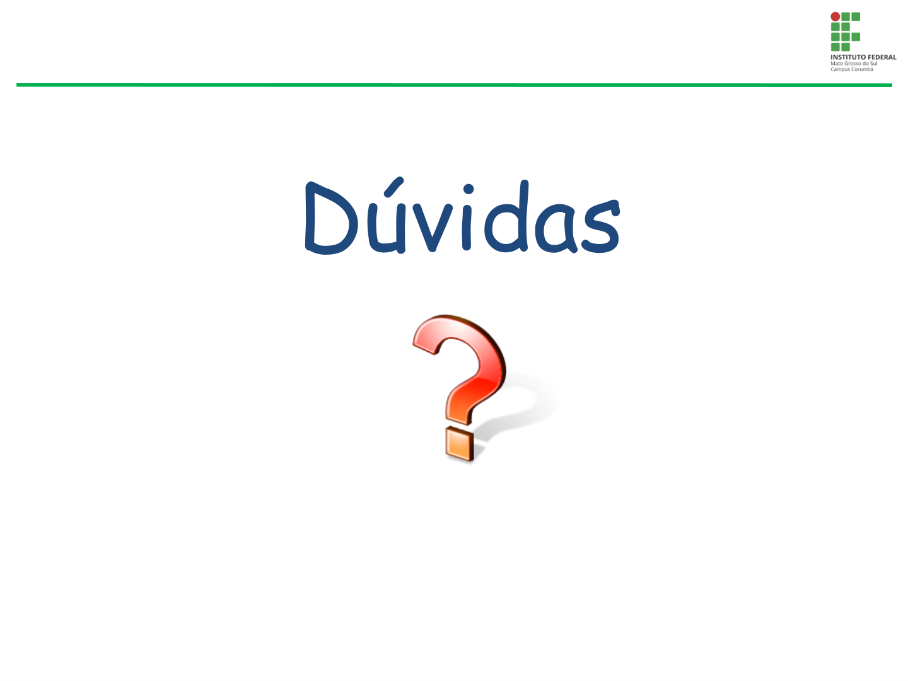

Dúvidas

## Página 18

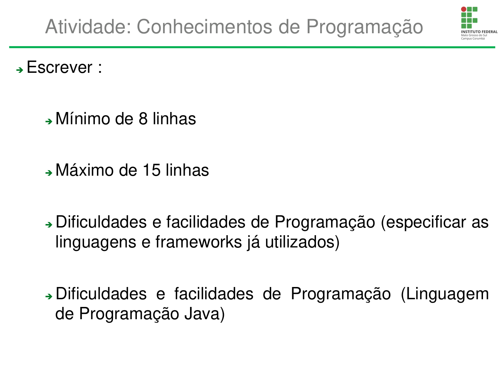

Atividade: Conhecimentos de Programação

➔Escrever :

   ➔Mínimo de 8 linhas

   ➔Máximo de 15 linhas

    ➔Dificuldades e facilidades de Programação (especificar as
     linguagens e frameworks já utilizados)

    ➔Dificuldades e facilidades de Programação (Linguagem
    de Programação Java)

## Página 19

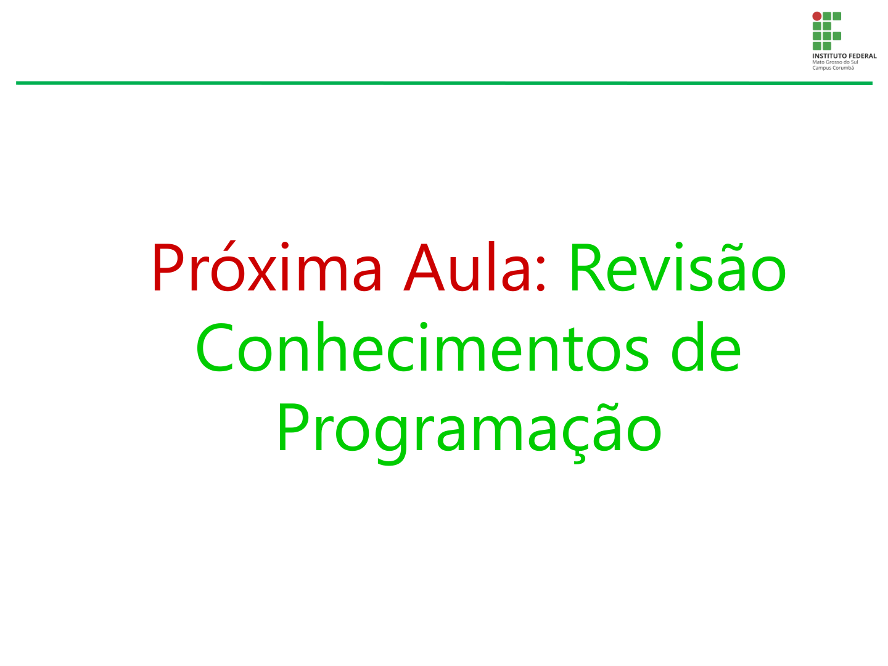

Próxima Aula: Revisão
 Conhecimentos de
    Programação

## Página 20

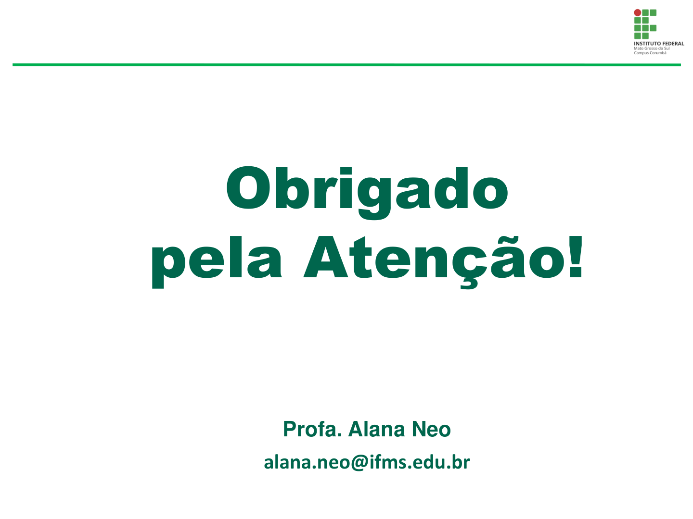

Obrigado
pela Atenção!

             Profa. Alana Neo

            alana.neo@ifms.edu.br
