Arquivo original: `Aula 01 Introdução à Programação Orientada a Objetos.pdf`

## Página 1

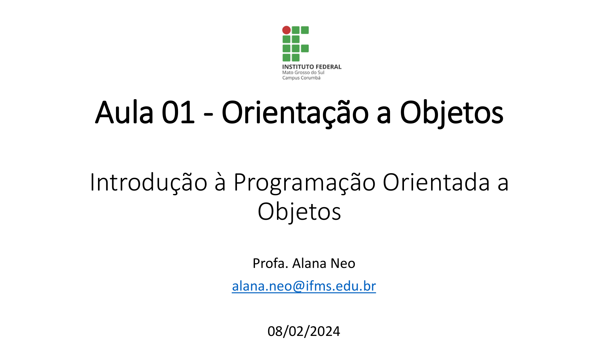

Aula 01 - Orientação a Objetos

Introdução à Programação Orientada a
              Objetos

                           Profa. Alana Neo

                     alana.neo@ifms.edu.br

                         08/02/2024

## Página 2

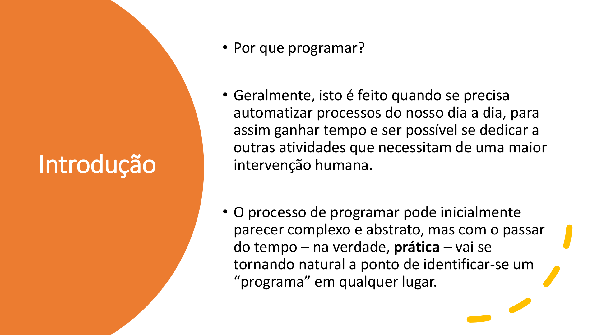

• Por que programar?

                                • Geralmente, isto é feito quando se precisa
                           automatizar processos do nosso dia a dia, para
                          assim ganhar tempo e ser possível se dedicar a
                            outras atividades que necessitam de uma maior
                            intervenção humana.Introdução

                                • O processo de programar pode inicialmente
                           parecer complexo e abstrato, mas com o passar
                       do tempo – na verdade, prática – vai se
                          tornando natural a ponto de identificar-se um
                         “programa” em qualquer lugar.

## Página 3

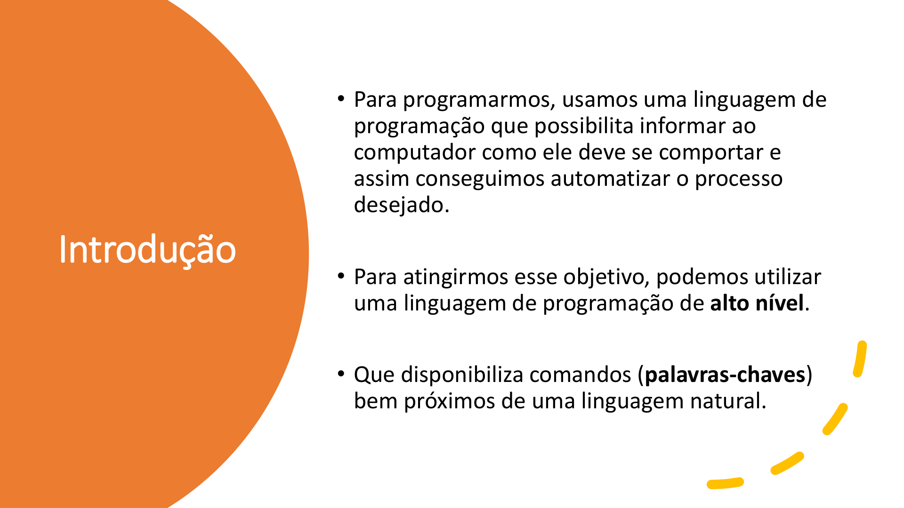

• Para programarmos, usamos uma linguagem de
                         programação que possibilita informar ao
                        computador como ele deve se comportar e
                          assim conseguimos automatizar o processo
                            desejado.
Introdução
                                • Para atingirmos esse objetivo, podemos utilizar
                    uma linguagem de programação de alto nível.

                                • Que disponibiliza comandos (palavras-chaves)
                    bem próximos de uma linguagem natural.

## Página 4

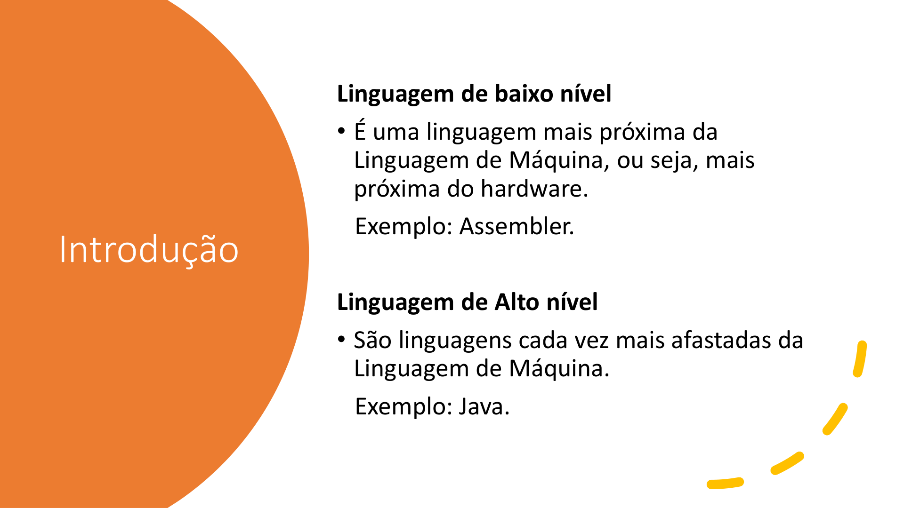

Linguagem de baixo nível
                              • É uma linguagem mais próxima da
                       Linguagem de Máquina, ou seja, mais
                        próxima do hardware.
                        Exemplo: Assembler.
Introdução

                     Linguagem de Alto nível
                              • São linguagens cada vez mais afastadas da
                       Linguagem de Máquina.
                        Exemplo: Java.

## Página 5

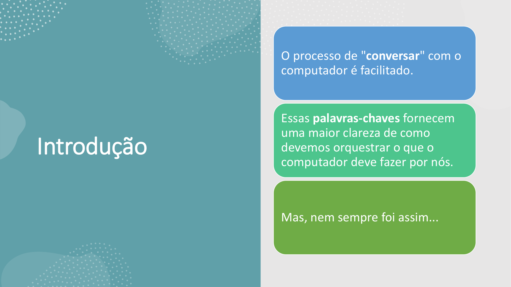

O processo de "conversar" com o
                                     computador é facilitado.

                                           Essas palavras-chaves fornecem
                               uma maior clareza de como
                                   devemos orquestrar o que oIntrodução
                                     computador deve fazer por nós.

                                     Mas, nem sempre foi assim...

## Página 6

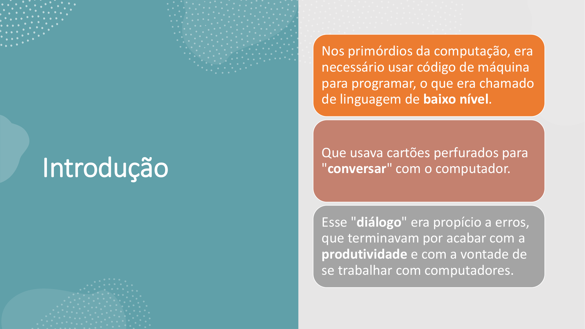

Nos primórdios da computação, era
                                            necessário usar código de máquina
                                          para programar, o que era chamado
                                     de linguagem de baixo nível.

                                  Que usava cartões perfurados para
                                           "conversar" com o computador.Introdução

                                           Esse "diálogo" era propício a erros,
                                     que terminavam por acabar com a
                                          produtividade e com a vontade de
                                           se trabalhar com computadores.

## Página 7

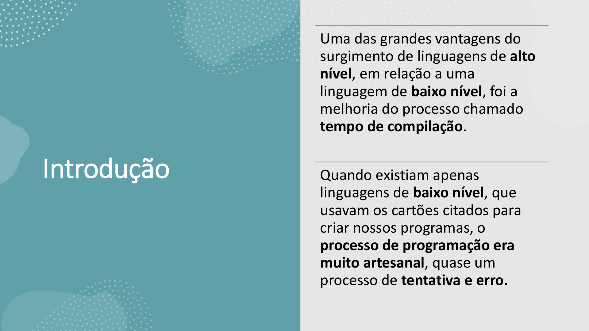

Uma das grandes vantagens do
                                      surgimento de linguagens de alto
                                               nível, em relação a uma
                                     linguagem de baixo nível, foi a
                                      melhoria do processo chamado
                                tempo de compilação.

Introdução                 Quando existiam apenas
                                        linguagens de baixo nível, que
                                  usavam os cartões citados para
                                               criar nossos programas, o
                                      processo de programação era
                                   muito artesanal, quase um
                                      processo de tentativa e erro.

## Página 8

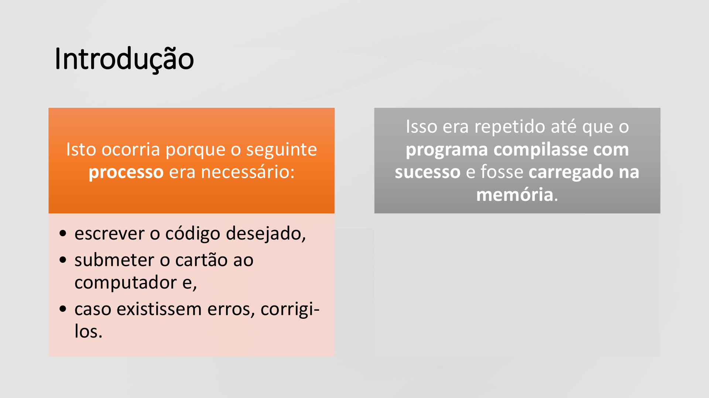

Introdução

                                            Isso era repetido até que o
  Isto ocorria porque o seguinte        programa compilasse com
    processo era necessário:           sucesso e fosse carregado na
                                         memória.

• escrever o código desejado,
• submeter o cartão ao
  computador e,
• caso existissem erros, corrigi-
   los.

## Página 9

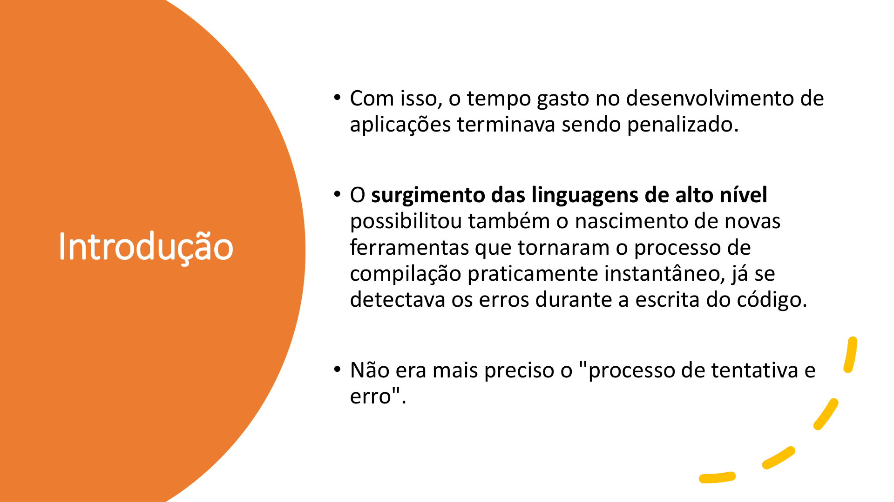

• Com isso, o tempo gasto no desenvolvimento de
                             aplicações terminava sendo penalizado.

                                • O surgimento das linguagens de alto nível
                               possibilitou também o nascimento de novas
                           ferramentas que tornaram o processo deIntrodução
                          compilação praticamente instantâneo, já se
                           detectava os erros durante a escrita do código.

                                • Não era mais preciso o "processo de tentativa e
                               erro".

## Página 10

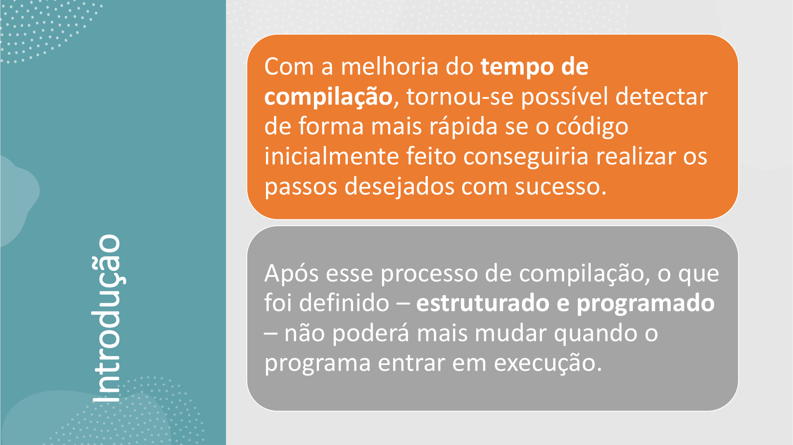

Com a melhoria do tempo de
              compilação, tornou-se possível detectar
             de forma mais rápida se o código
                inicialmente feito conseguiria realizar os
              passos desejados com sucesso.

             Após esse processo de compilação, o que
                   foi definido – estruturado e programado
             – não poderá mais mudar quando o
             programa entrar em execução.Introdução

## Página 11

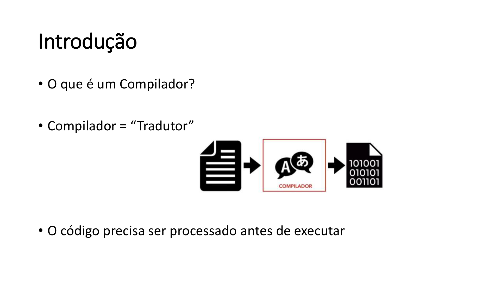

Introdução

• O que é um Compilador?

• Compilador = “Tradutor”

• O código precisa ser processado antes de executar

## Página 12

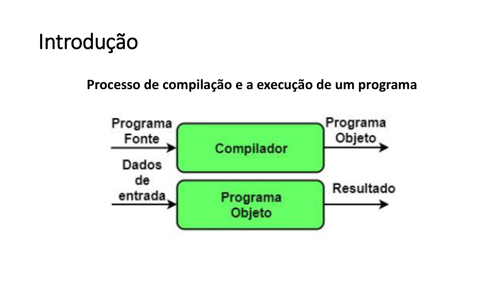

Introdução

       Processo de compilação e a execução de um programa

## Página 13

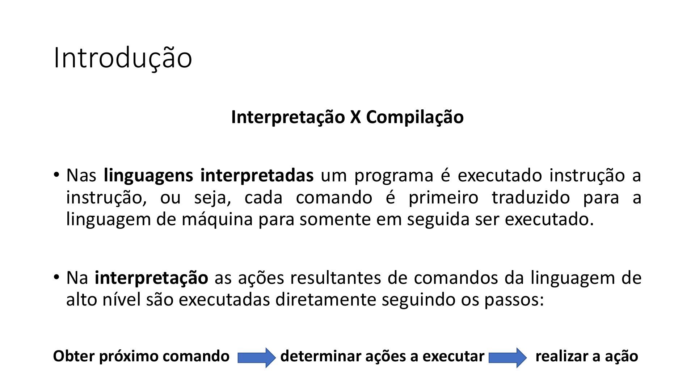

Introdução

                    Interpretação X Compilação

• Nas linguagens interpretadas um programa é executado instrução a
  instrução, ou  seja, cada comando é primeiro traduzido para a
 linguagem de máquina para somente em seguida ser executado.

• Na interpretação as ações resultantes de comandos da linguagem de
  alto nível são executadas diretamente seguindo os passos:

Obter próximo comando      determinar ações a executar        realizar a ação

## Página 14

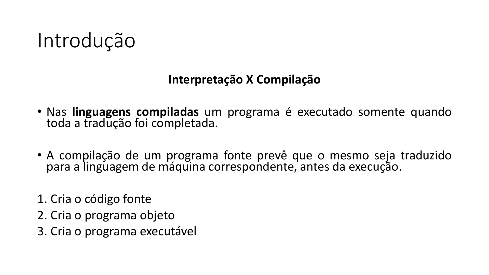

Introdução

                       Interpretação X Compilação

• Nas linguagens compiladas um programa é executado somente quando
 toda a tradução foi completada.

• A compilação de um programa fonte prevê que o mesmo seja traduzido
  para a linguagem de máquina correspondente, antes da execução.

1. Cria o código fonte
2. Cria o programa objeto
3. Cria o programa executável

## Página 15

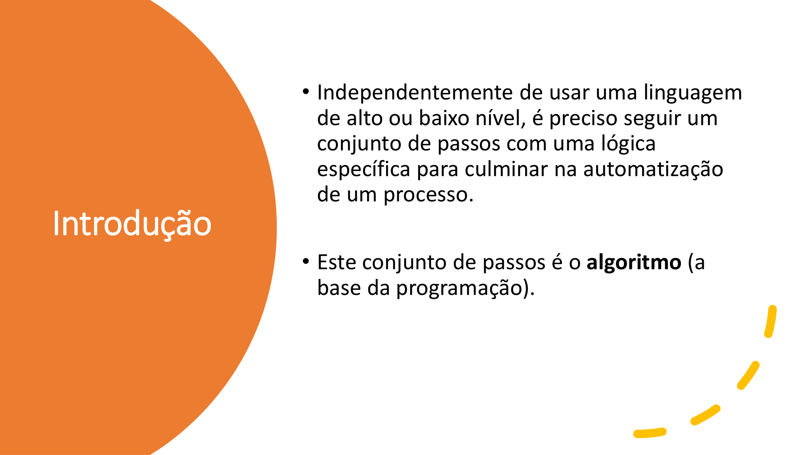

• Independentemente de usar uma linguagem
                      de alto ou baixo nível, é preciso seguir um
                         conjunto de passos com uma lógica
                            específica para culminar na automatização
                      de um processo.
Introdução
                              • Este conjunto de passos é o algoritmo (a
                        base da programação).

## Página 16

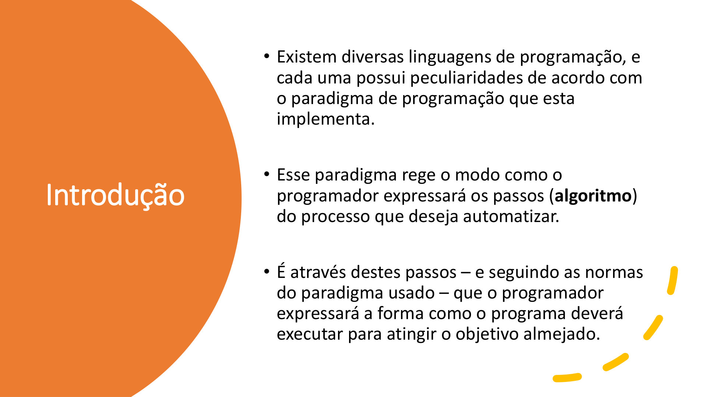

• Existem diversas linguagens de programação, e
                         cada uma possui peculiaridades de acordo com
                       o paradigma de programação que esta
                          implementa.

                                • Esse paradigma rege o modo como o
                         programador expressará os passos (algoritmo)Introdução
                       do processo que deseja automatizar.

                                • É através destes passos – e seguindo as normas
                       do paradigma usado – que o programador
                            expressará a forma como o programa deverá
                            executar para atingir o objetivo almejado.

## Página 17

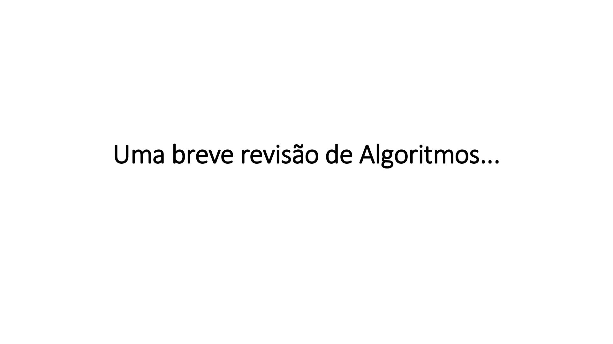

Uma breve revisão de Algoritmos...

## Página 18

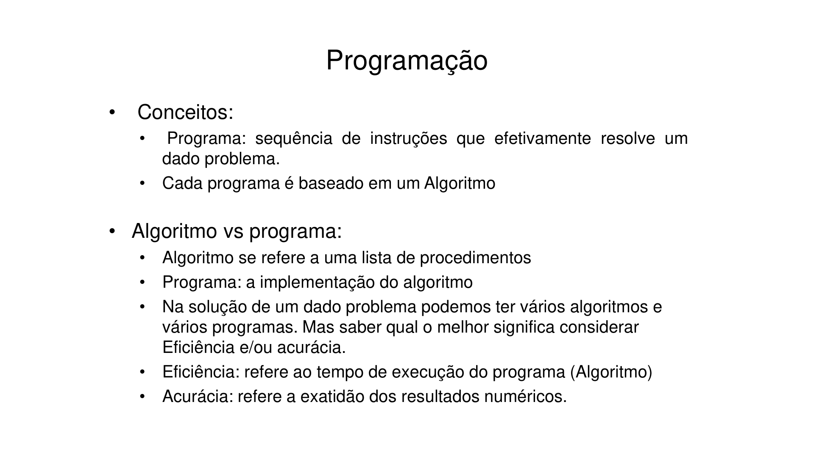

Programação

•  Conceitos:
     •  Programa: sequência de instruções que efetivamente resolve um
      dado problema.
     •  Cada programa é baseado em um Algoritmo

•  Algoritmo vs programa:
     •  Algoritmo se refere a uma lista de procedimentos
     •  Programa: a implementação do algoritmo
     •  Na solução de um dado problema podemos ter vários algoritmos e
       vários programas. Mas saber qual o melhor significa considerar
       Eficiência e/ou acurácia.
     •  Eficiência: refere ao tempo de execução do programa (Algoritmo)
     •  Acurácia: refere a exatidão dos resultados numéricos.

## Página 19

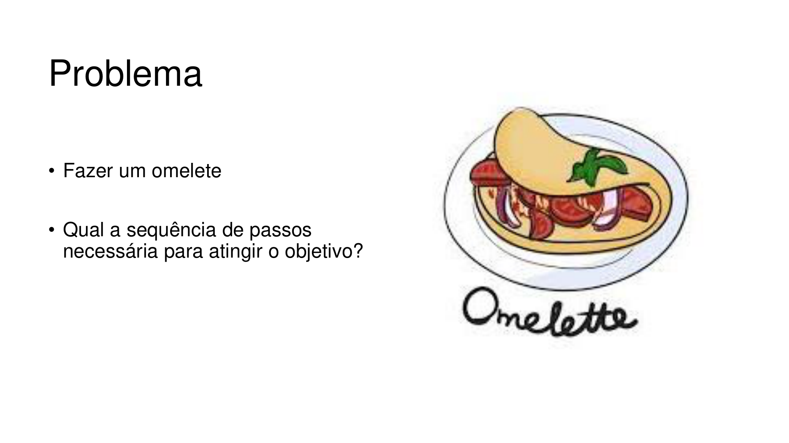

Problema

• Fazer um omelete

• Qual a sequência de passos
  necessária para atingir o objetivo?

## Página 20

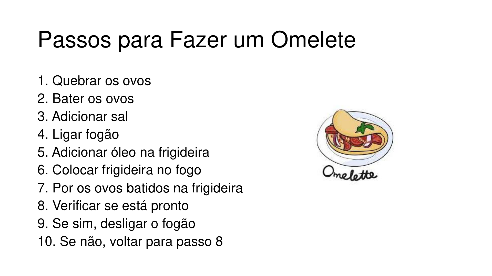

Passos para Fazer um Omelete

1. Quebrar os ovos
2. Bater os ovos
3. Adicionar sal
4. Ligar fogão
5. Adicionar óleo na frigideira
6. Colocar frigideira no fogo
7. Por os ovos batidos na frigideira
8. Verificar se está pronto
9. Se sim, desligar o fogão
10. Se não, voltar para passo 8

## Página 21

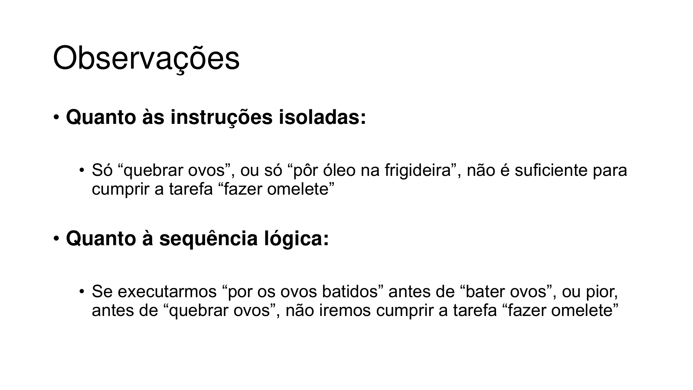

Observações

• Quanto às instruções isoladas:

    • Só “quebrar ovos”, ou só “pôr óleo na frigideira”, não é suficiente para
     cumprir a tarefa “fazer omelete”

• Quanto à sequência lógica:

    • Se executarmos “por os ovos batidos” antes de “bater ovos”, ou pior,
     antes de “quebrar ovos”, não iremos cumprir a tarefa “fazer omelete”

## Página 22

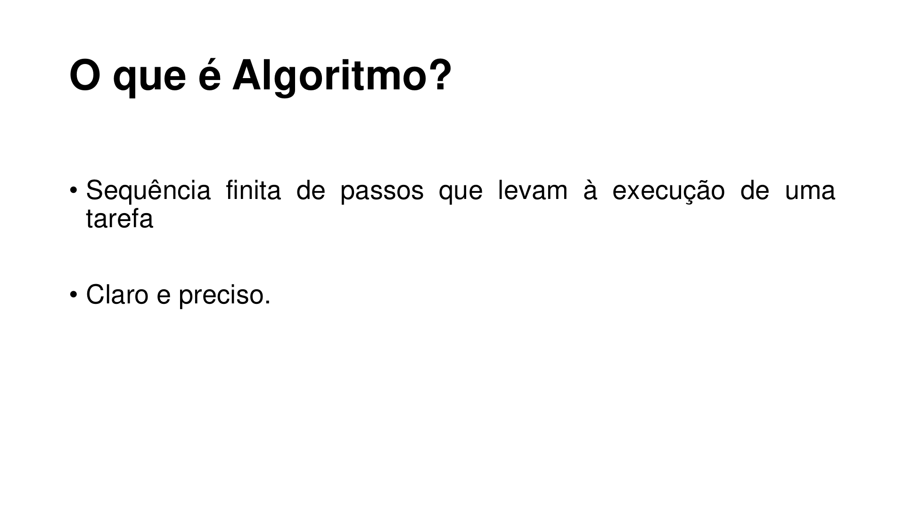

O que é Algoritmo?

• Sequência  finita de passos que levam à execução de uma
  tarefa

• Claro e preciso.

## Página 23

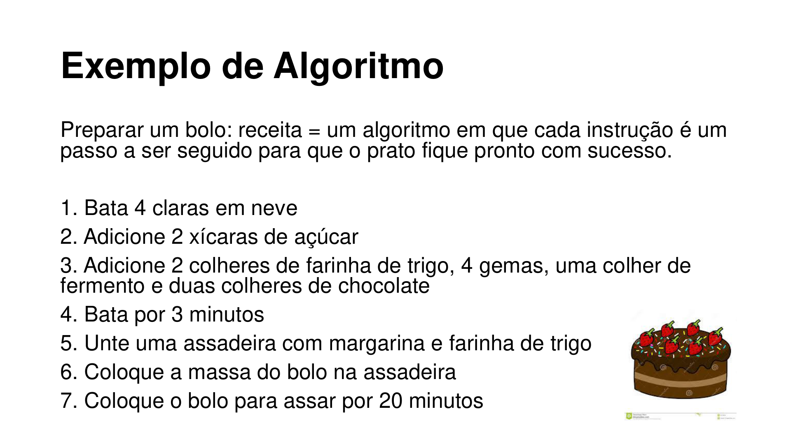

Exemplo de Algoritmo

Preparar um bolo: receita = um algoritmo em que cada instrução é um
passo a ser seguido para que o prato fique pronto com sucesso.

1. Bata 4 claras em neve
2. Adicione 2 xícaras de açúcar
3. Adicione 2 colheres de farinha de trigo, 4 gemas, uma colher de
fermento e duas colheres de chocolate
4. Bata por 3 minutos
5. Unte uma assadeira com margarina e farinha de trigo
6. Coloque a massa do bolo na assadeira
7. Coloque o bolo para assar por 20 minutos

## Página 24

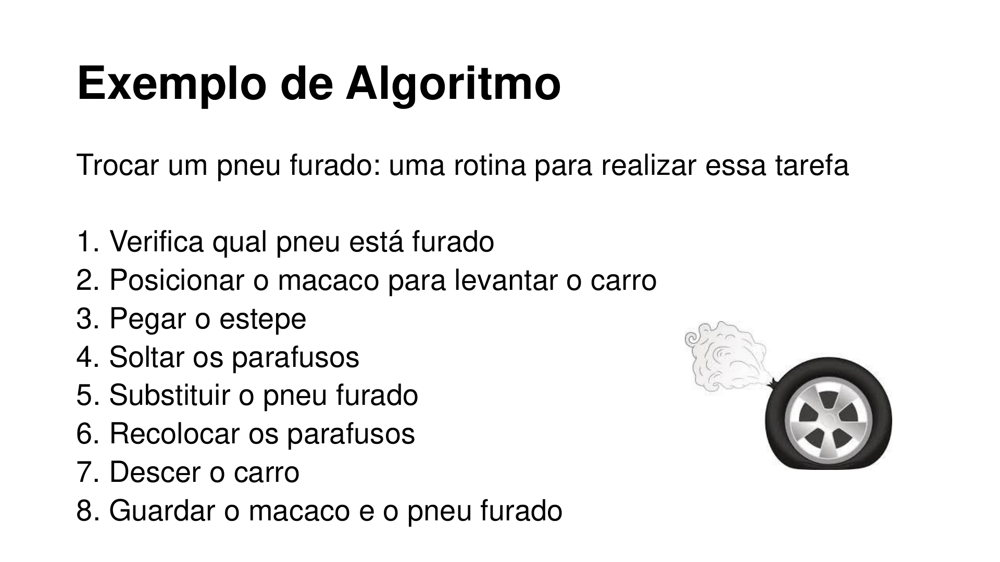

Exemplo de Algoritmo

Trocar um pneu furado: uma rotina para realizar essa tarefa

1. Verifica qual pneu está furado
2. Posicionar o macaco para levantar o carro
3. Pegar o estepe
4. Soltar os parafusos
5. Substituir o pneu furado
6. Recolocar os parafusos
7. Descer o carro
8. Guardar o macaco e o pneu furado

## Página 25

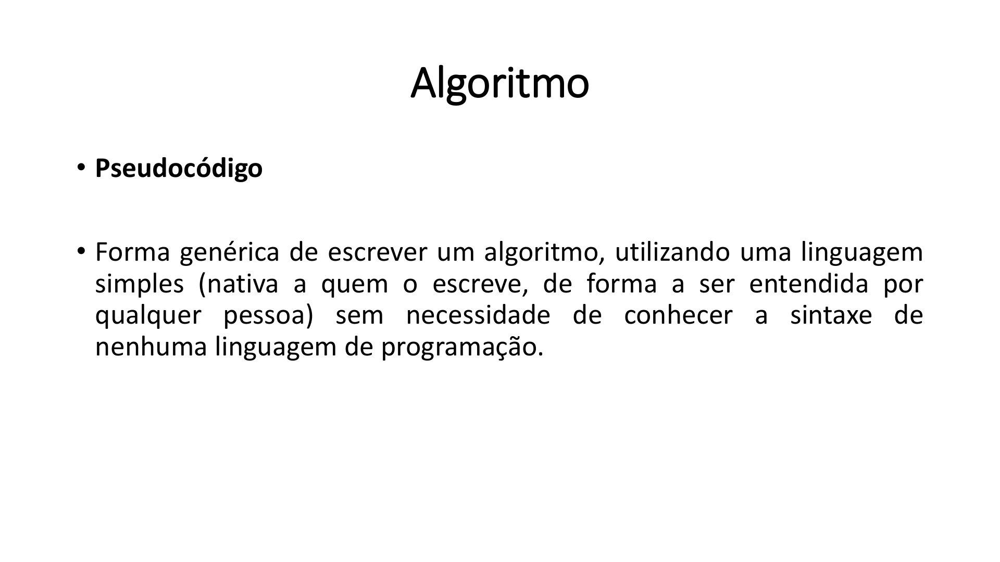

Algoritmo

• Pseudocódigo

• Forma genérica de escrever um algoritmo, utilizando uma linguagem
 simples (nativa a quem o escreve, de forma a ser entendida por
 qualquer  pessoa) sem  necessidade de  conhecer  a  sintaxe de
 nenhuma linguagem de programação.

## Página 26

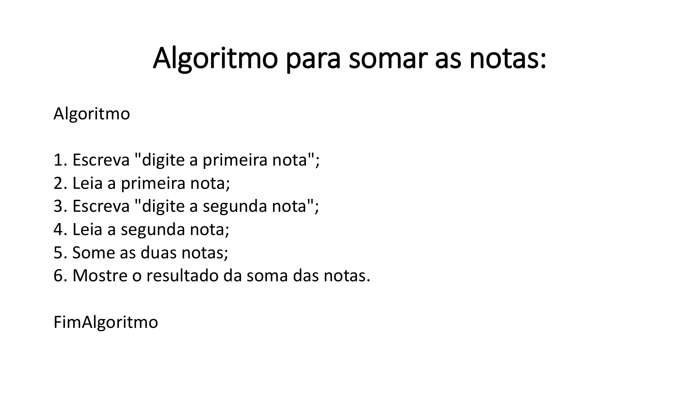

Algoritmo para somar as notas:

Algoritmo

1. Escreva "digite a primeira nota";
2. Leia a primeira nota;
3. Escreva "digite a segunda nota";
4. Leia a segunda nota;
5. Some as duas notas;
6. Mostre o resultado da soma das notas.

FimAlgoritmo

## Página 27

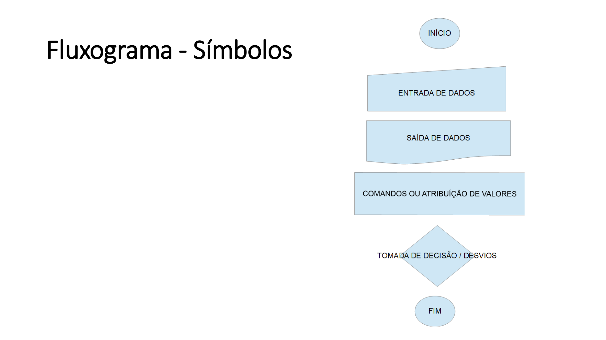

Fluxograma - Símbolos

## Página 28

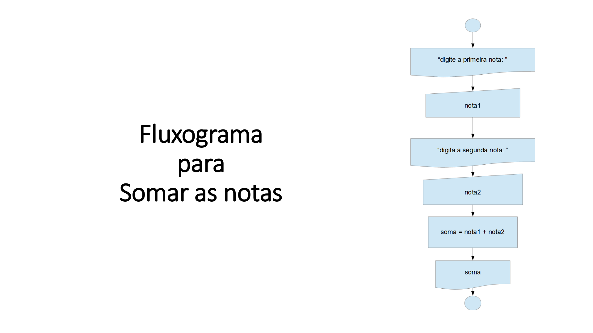

Fluxograma
     para
Somar as notas

## Página 29

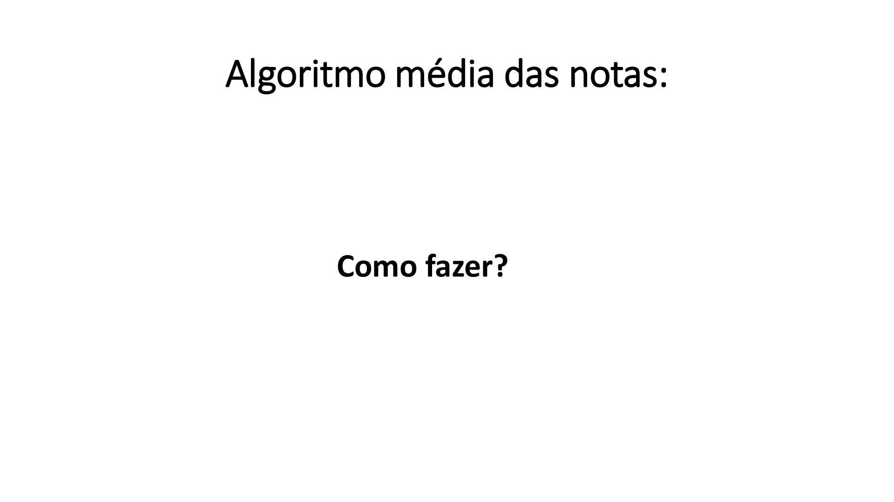

Algoritmo média das notas:

     Como fazer?

## Página 30

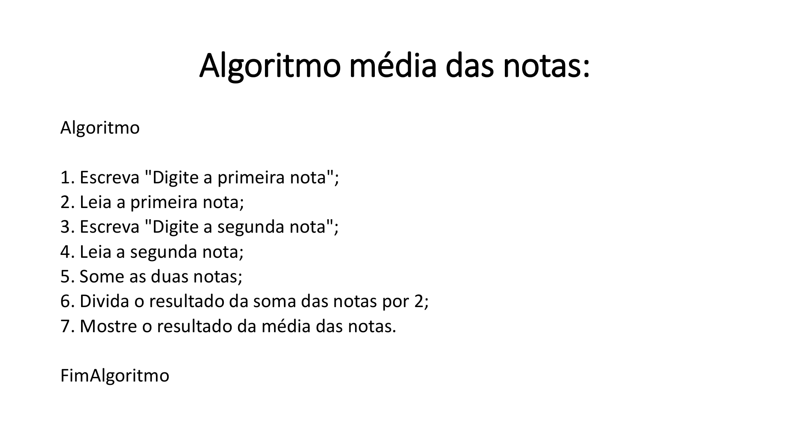

Algoritmo média das notas:

Algoritmo

1. Escreva "Digite a primeira nota";
2. Leia a primeira nota;
3. Escreva "Digite a segunda nota";
4. Leia a segunda nota;
5. Some as duas notas;
6. Divida o resultado da soma das notas por 2;
7. Mostre o resultado da média das notas.

FimAlgoritmo

## Página 31

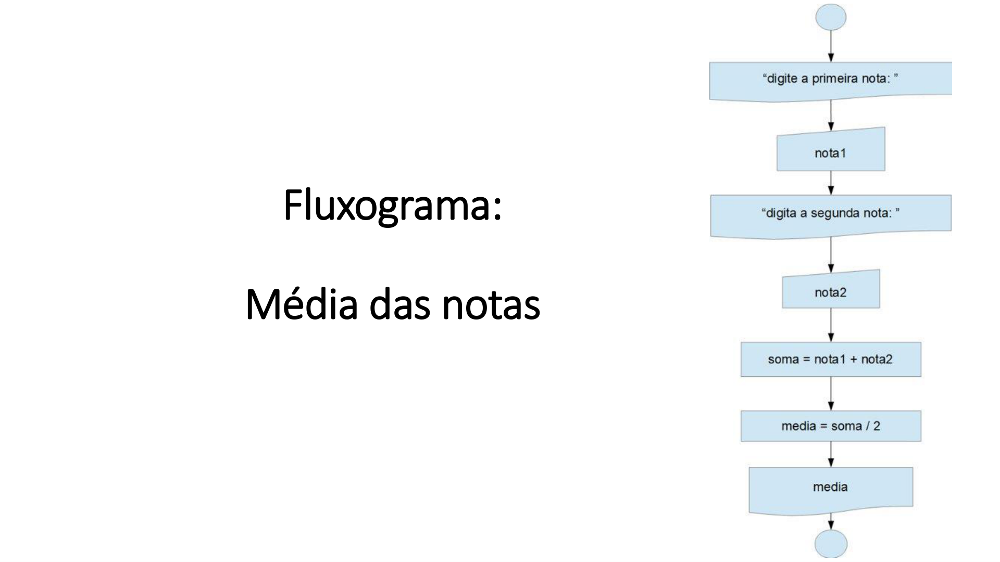

Fluxograma:

Média das notas

## Página 32

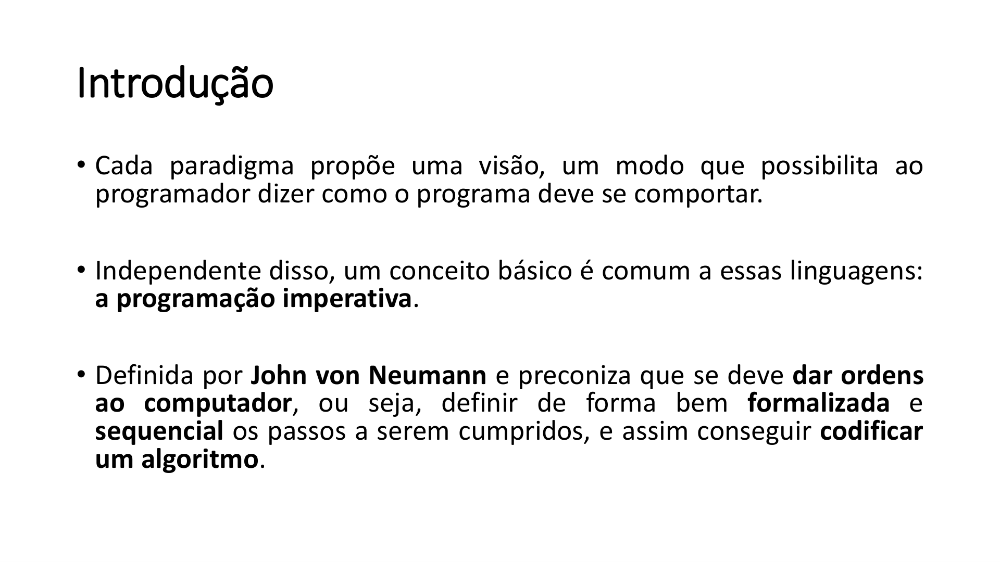

Introdução

• Cada paradigma propõe uma visão, um modo que possibilita ao
 programador dizer como o programa deve se comportar.

• Independente disso, um conceito básico é comum a essas linguagens:
 a programação imperativa.

• Definida por John von Neumann e preconiza que se deve dar ordens
 ao computador, ou  seja,  definir de forma bem formalizada e
 sequencial os passos a serem cumpridos, e assim conseguir codificar
 um algoritmo.

## Página 33

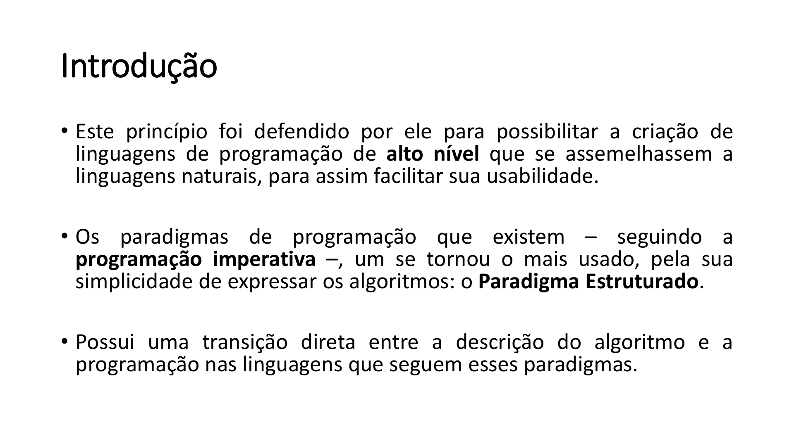

Introdução

• Este princípio foi defendido por ele para possibilitar a criação de
 linguagens de programação de alto nível que se assemelhassem a
 linguagens naturais, para assim facilitar sua usabilidade.

• Os  paradigmas  de  programação  que  existem  –  seguindo  a
 programação imperativa –, um se tornou o mais usado, pela sua
  simplicidade de expressar os algoritmos: o Paradigma Estruturado.

• Possui uma transição direta entre a descrição do algoritmo e a
 programação nas linguagens que seguem esses paradigmas.

## Página 34

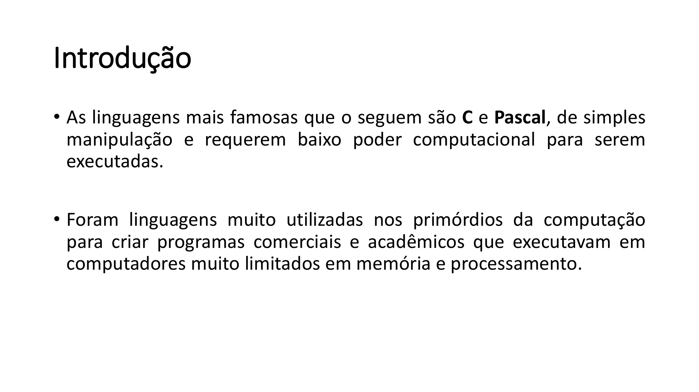

Introdução

• As linguagens mais famosas que o seguem são C e Pascal, de simples
 manipulação e requerem baixo poder computacional para serem
 executadas.

• Foram linguagens muito utilizadas nos primórdios da computação
 para criar programas comerciais e acadêmicos que executavam em
 computadores muito limitados em memória e processamento.

## Página 35

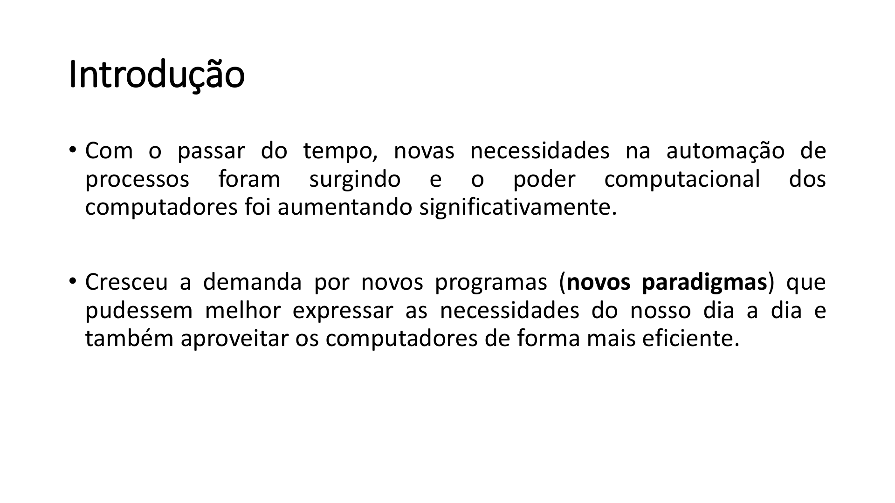

Introdução

• Com o passar do tempo, novas necessidades na automação de
 processos  foram  surgindo  e  o  poder  computacional  dos
 computadores foi aumentando significativamente.

• Cresceu a demanda por novos programas (novos paradigmas) que
 pudessem melhor expressar as necessidades do nosso dia a dia e
 também aproveitar os computadores de forma mais eficiente.

## Página 36

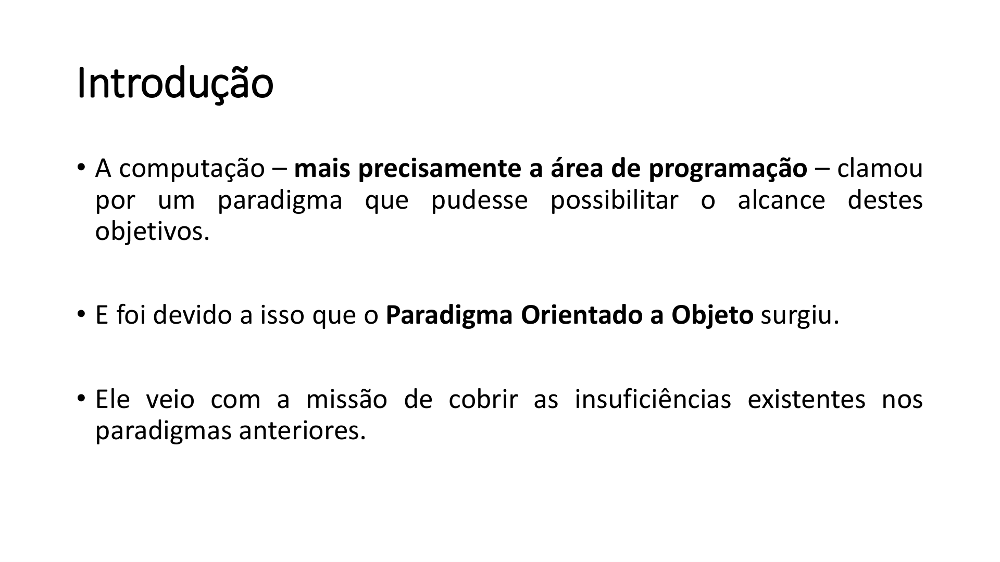

Introdução

• A computação – mais precisamente a área de programação – clamou
 por um  paradigma que  pudesse  possibilitar o  alcance  destes
  objetivos.

• E foi devido a isso que o Paradigma Orientado a Objeto surgiu.

• Ele veio com a missão de cobrir as insuficiências existentes nos
 paradigmas anteriores.

## Página 37

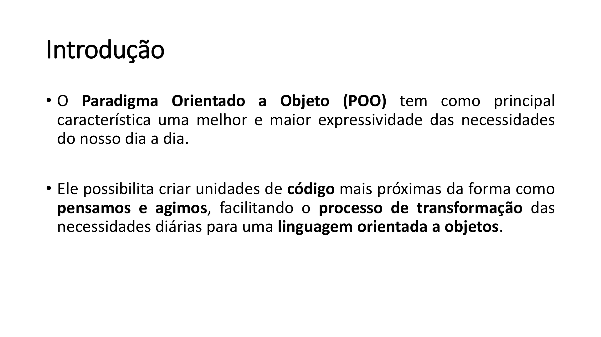

Introdução

• O  Paradigma  Orientado a  Objeto (POO) tem como  principal
  característica uma melhor e maior expressividade das necessidades
 do nosso dia a dia.

• Ele possibilita criar unidades de código mais próximas da forma como
 pensamos e agimos, facilitando o processo de transformação das
 necessidades diárias para uma linguagem orientada a objetos.

## Página 38

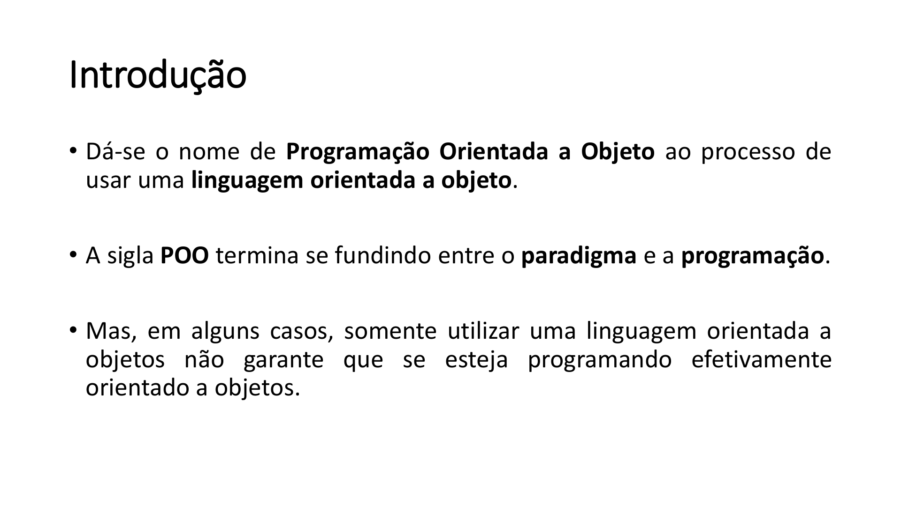

Introdução

• Dá-se o nome de Programação Orientada a Objeto ao processo de
 usar uma linguagem orientada a objeto.

• A sigla POO termina se fundindo entre o paradigma e a programação.

• Mas, em alguns casos, somente utilizar uma linguagem orientada a
 objetos não  garante que  se  esteja programando  efetivamente
 orientado a objetos.

## Página 39

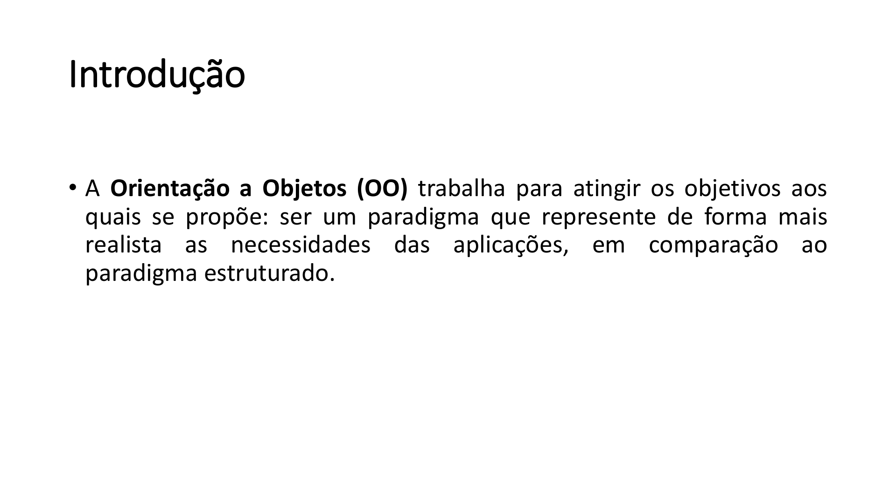

Introdução

• A Orientação a Objetos (OO) trabalha para atingir os objetivos aos
 quais se propõe: ser um paradigma que represente de forma mais
  realista  as  necessidades  das  aplicações, em  comparação  ao
 paradigma estruturado.

## Página 40

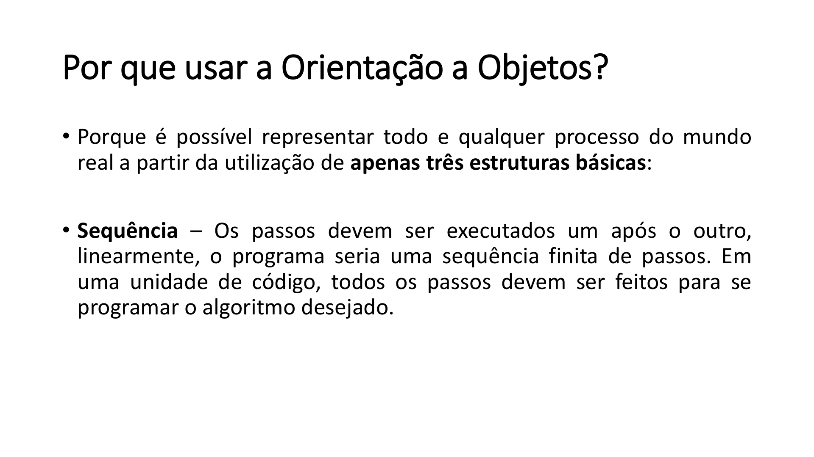

Por que usar a Orientação a Objetos?

• Porque é possível representar todo e qualquer processo do mundo
  real a partir da utilização de apenas três estruturas básicas:

• Sequência – Os passos devem ser executados um após o outro,
 linearmente, o programa seria uma sequência finita de passos. Em
 uma unidade de código, todos os passos devem ser feitos para se
 programar o algoritmo desejado.

## Página 41

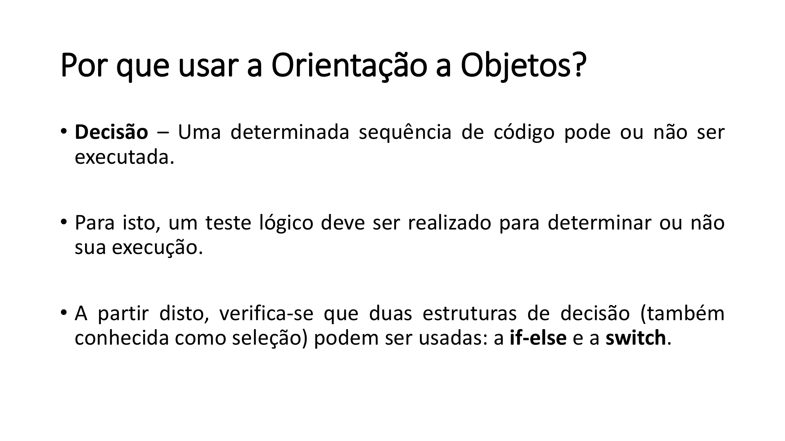

Por que usar a Orientação a Objetos?

• Decisão – Uma determinada sequência de código pode ou não ser
 executada.

• Para isto, um teste lógico deve ser realizado para determinar ou não
 sua execução.

• A partir disto, verifica-se que duas estruturas de decisão (também
 conhecida como seleção) podem ser usadas: a if-else e a switch.

## Página 42

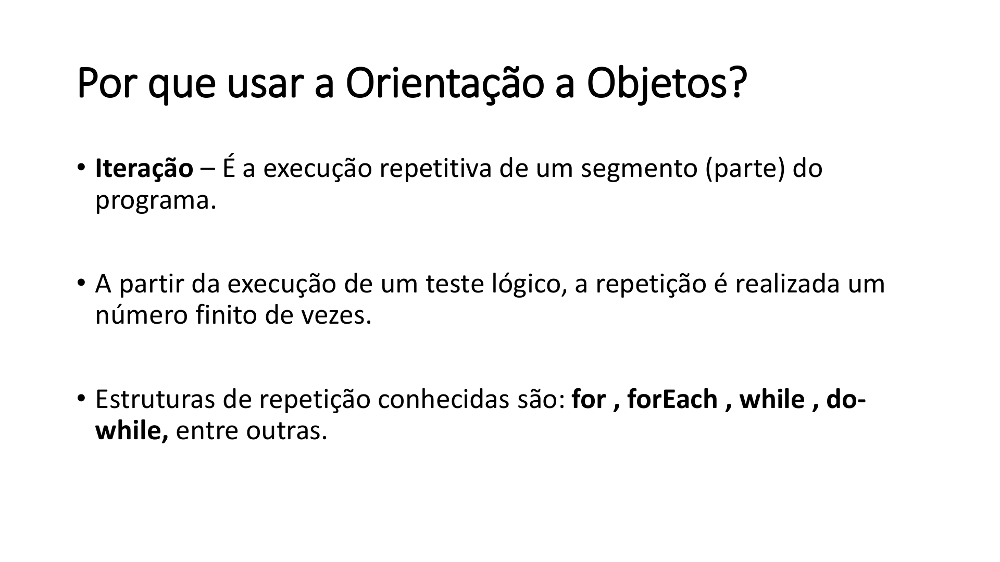

Por que usar a Orientação a Objetos?

• Iteração – É a execução repetitiva de um segmento (parte) do
 programa.

• A partir da execução de um teste lógico, a repetição é realizada um
 número finito de vezes.

• Estruturas de repetição conhecidas são: for , forEach , while , do-
  while, entre outras.

## Página 43

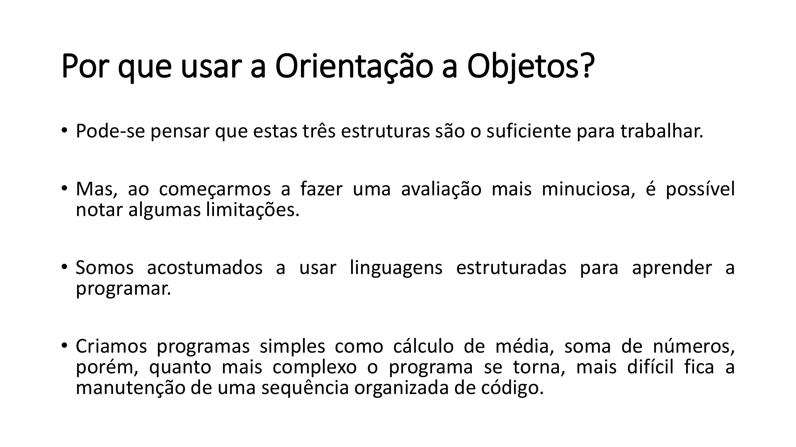

Por que usar a Orientação a Objetos?

• Pode-se pensar que estas três estruturas são o suficiente para trabalhar.

• Mas, ao começarmos a fazer uma avaliação mais minuciosa, é possível
  notar algumas limitações.

• Somos acostumados a usar linguagens estruturadas para aprender a
  programar.

• Criamos programas simples como cálculo de média, soma de números,
 porém, quanto mais complexo o programa se torna, mais difícil fica a
 manutenção de uma sequência organizada de código.

## Página 44

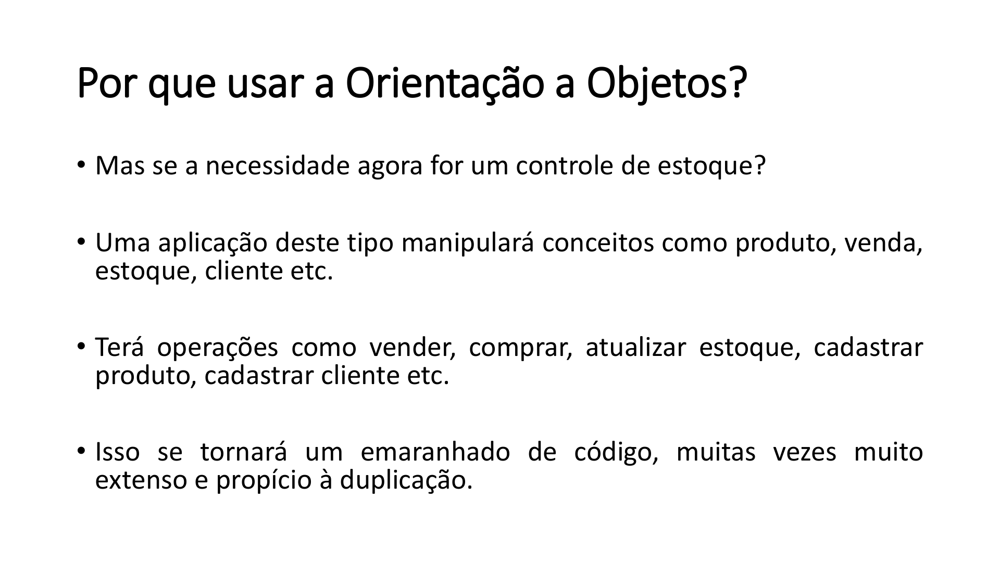

Por que usar a Orientação a Objetos?

• Mas se a necessidade agora for um controle de estoque?

• Uma aplicação deste tipo manipulará conceitos como produto, venda,
 estoque, cliente etc.

• Terá operações como vender, comprar, atualizar estoque, cadastrar
 produto, cadastrar cliente etc.

• Isso se tornará um emaranhado de código, muitas vezes muito
 extenso e propício à duplicação.

## Página 45

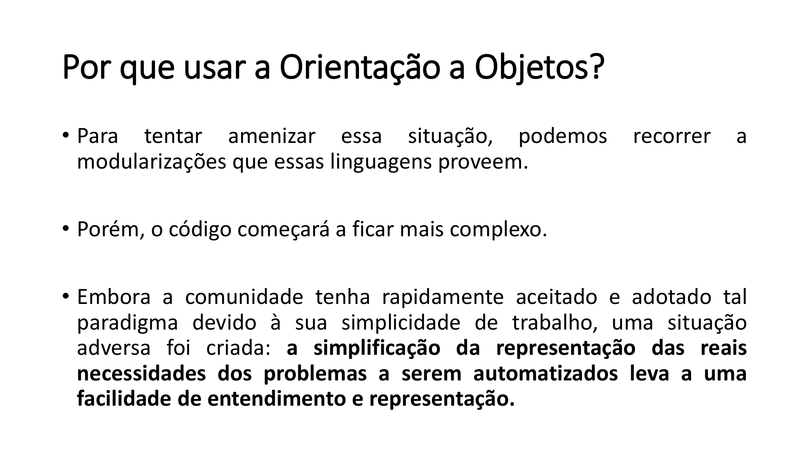

Por que usar a Orientação a Objetos?

• Para   tentar  amenizar  essa   situação,  podemos   recorrer  a
 modularizações que essas linguagens proveem.

• Porém, o código começará a ficar mais complexo.

• Embora a comunidade tenha rapidamente aceitado e adotado tal
 paradigma devido à sua simplicidade de trabalho, uma situação
 adversa  foi  criada: a  simplificação da representação das  reais
 necessidades dos problemas a serem automatizados leva a uma
  facilidade de entendimento e representação.

## Página 46

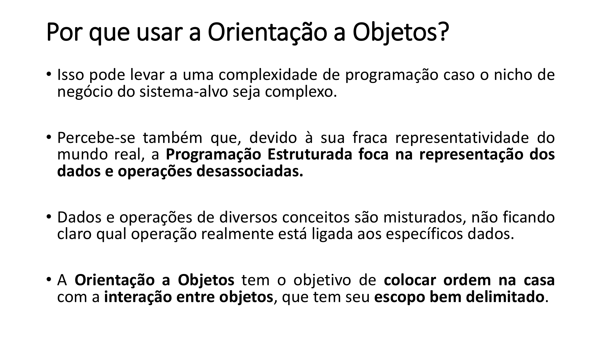

Por que usar a Orientação a Objetos?

• Isso pode levar a uma complexidade de programação caso o nicho de
 negócio do sistema-alvo seja complexo.

• Percebe-se também que, devido à sua fraca representatividade do
 mundo real, a Programação Estruturada foca na representação dos
 dados e operações desassociadas.

• Dados e operações de diversos conceitos são misturados, não ficando
  claro qual operação realmente está ligada aos específicos dados.

• A Orientação a Objetos tem o objetivo de colocar ordem na casa
 com a interação entre objetos, que tem seu escopo bem delimitado.

## Página 47

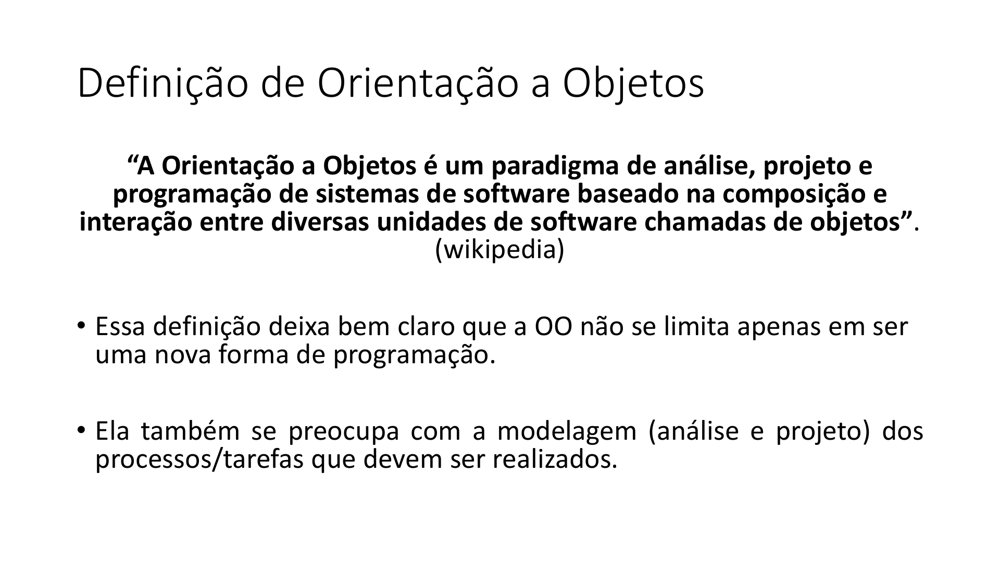

Definição de Orientação a Objetos

    “A Orientação a Objetos é um paradigma de análise, projeto e
  programação de sistemas de software baseado na composição e
interação entre diversas unidades de software chamadas de objetos”.
                              (wikipedia)

• Essa definição deixa bem claro que a OO não se limita apenas em ser
 uma nova forma de programação.

• Ela também se preocupa com a modelagem (análise e projeto) dos
  processos/tarefas que devem ser realizados.

## Página 48

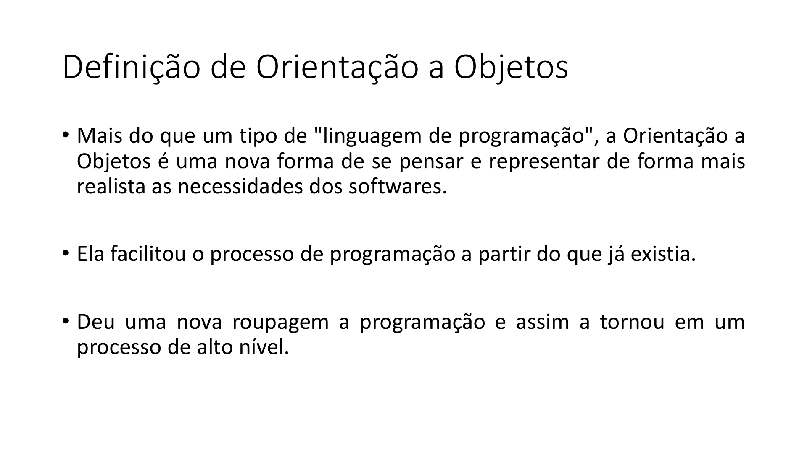

Definição de Orientação a Objetos

• Mais do que um tipo de "linguagem de programação", a Orientação a
 Objetos é uma nova forma de se pensar e representar de forma mais
  realista as necessidades dos softwares.

• Ela facilitou o processo de programação a partir do que já existia.

• Deu uma nova roupagem a programação e assim a tornou em um
 processo de alto nível.

## Página 49

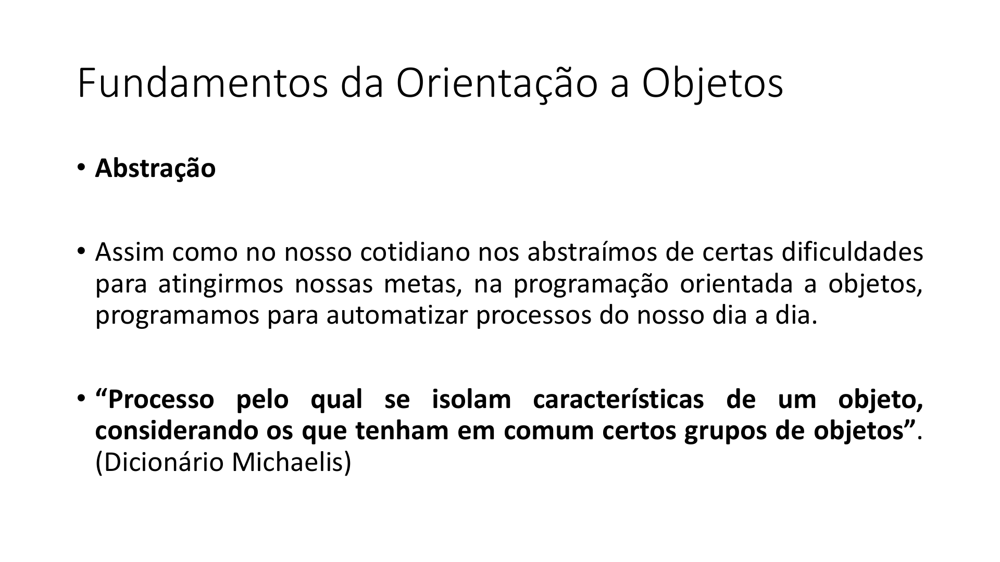

Fundamentos da Orientação a Objetos

• Abstração

• Assim como no nosso cotidiano nos abstraímos de certas dificuldades
 para atingirmos nossas metas, na programação orientada a objetos,
 programamos para automatizar processos do nosso dia a dia.

• “Processo  pelo  qual  se  isolam  características de um  objeto,
 considerando os que tenham em comum certos grupos de objetos”.
  (Dicionário Michaelis)

## Página 50

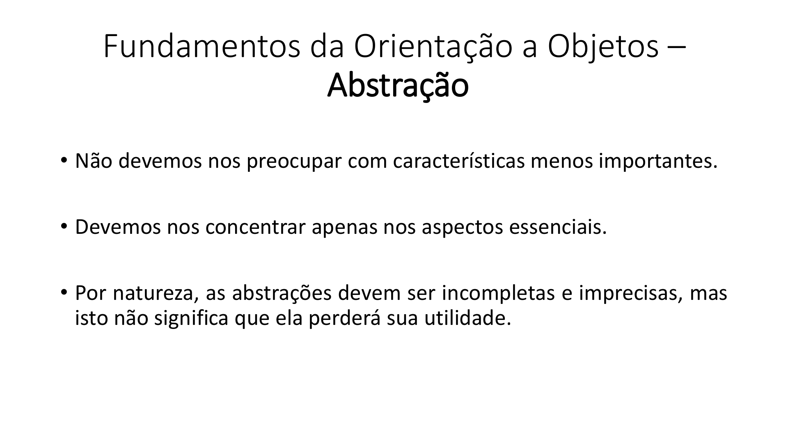

Fundamentos da Orientação a Objetos –
                 Abstração

• Não devemos nos preocupar com características menos importantes.

• Devemos nos concentrar apenas nos aspectos essenciais.

• Por natureza, as abstrações devem ser incompletas e imprecisas, mas
  isto não significa que ela perderá sua utilidade.

## Página 51

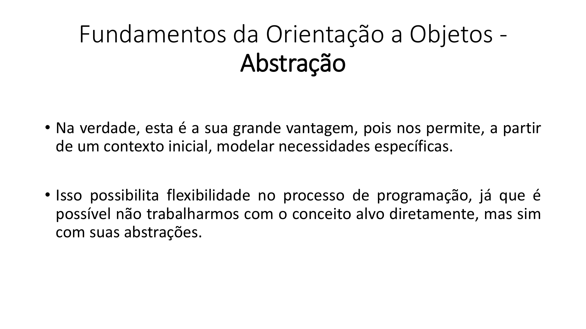

Fundamentos da Orientação a Objetos -
                 Abstração

• Na verdade, esta é a sua grande vantagem, pois nos permite, a partir
 de um contexto inicial, modelar necessidades específicas.

• Isso possibilita flexibilidade no processo de programação, já que é
  possível não trabalharmos com o conceito alvo diretamente, mas sim
 com suas abstrações.

## Página 52

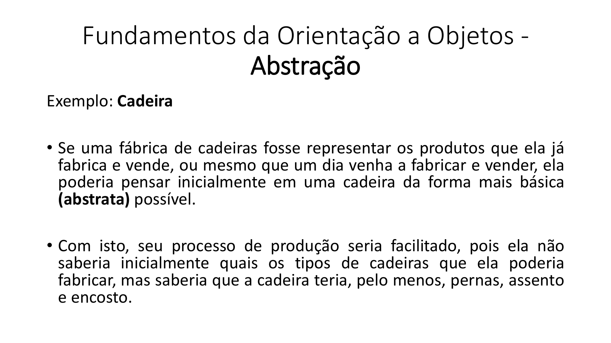

Fundamentos da Orientação a Objetos -
                 Abstração

Exemplo: Cadeira

• Se uma fábrica de cadeiras fosse representar os produtos que ela já
  fabrica e vende, ou mesmo que um dia venha a fabricar e vender, ela
 poderia pensar inicialmente em uma cadeira da forma mais básica
  (abstrata) possível.

• Com isto, seu processo de produção seria facilitado, pois ela não
  saberia inicialmente quais os tipos de cadeiras que ela poderia
  fabricar, mas saberia que a cadeira teria, pelo menos, pernas, assento
 e encosto.

## Página 53

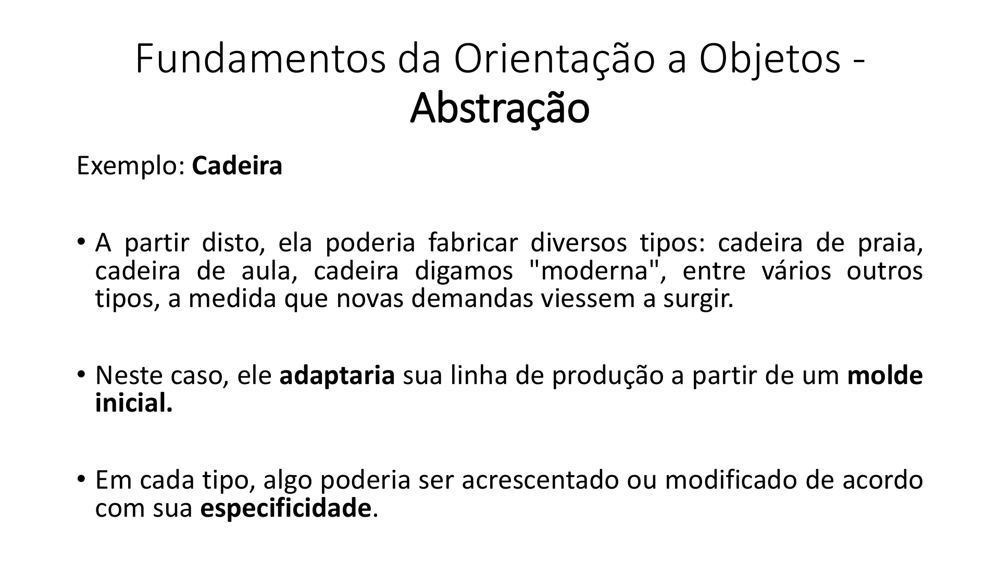

Fundamentos da Orientação a Objetos -
                 Abstração

Exemplo: Cadeira

• A partir disto, ela poderia fabricar diversos tipos: cadeira de praia,
  cadeira de aula, cadeira digamos "moderna", entre vários outros
  tipos, a medida que novas demandas viessem a surgir.

• Neste caso, ele adaptaria sua linha de produção a partir de um molde
  inicial.

• Em cada tipo, algo poderia ser acrescentado ou modificado de acordo
 com sua especificidade.

## Página 54

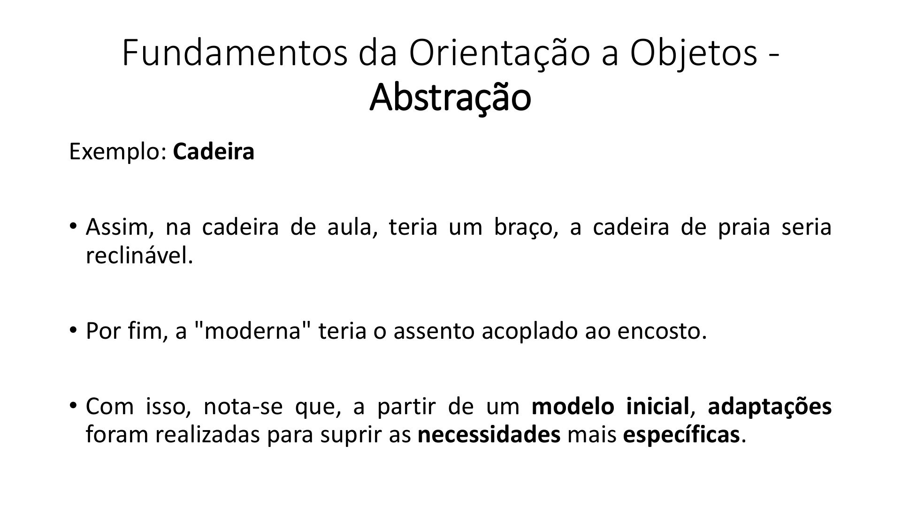

Fundamentos da Orientação a Objetos -
                 Abstração

Exemplo: Cadeira

• Assim, na cadeira de aula, teria um braço, a cadeira de praia seria
  reclinável.

• Por fim, a "moderna" teria o assento acoplado ao encosto.

• Com isso, nota-se que, a partir de um modelo inicial, adaptações
 foram realizadas para suprir as necessidades mais específicas.

## Página 55

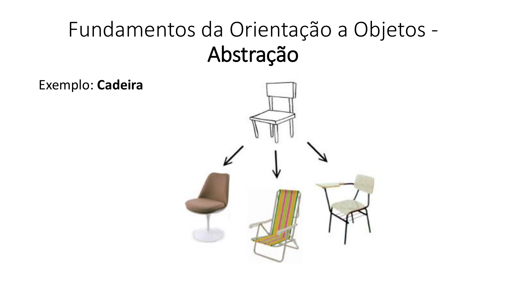

Fundamentos da Orientação a Objetos -
                 Abstração

Exemplo: Cadeira

## Página 56

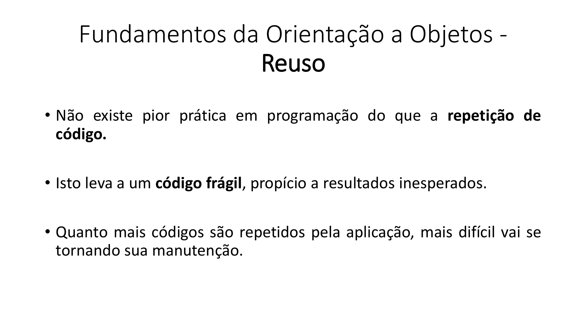

Fundamentos da Orientação a Objetos -
                 Reuso

• Não existe pior prática em programação do que a repetição de
  código.

• Isto leva a um código frágil, propício a resultados inesperados.

• Quanto mais códigos são repetidos pela aplicação, mais difícil vai se
 tornando sua manutenção.

## Página 57

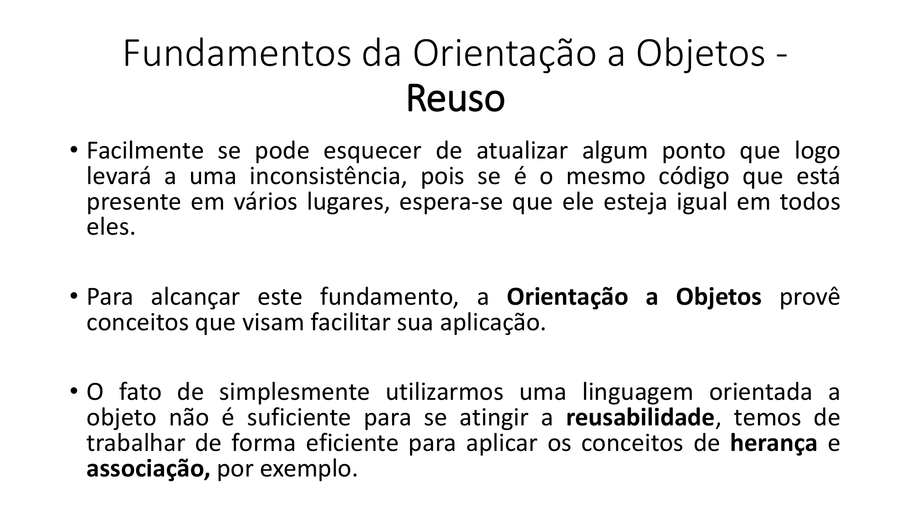

Fundamentos da Orientação a Objetos -
                 Reuso
• Facilmente se pode esquecer de atualizar algum ponto que logo
  levará a uma inconsistência, pois se é o mesmo código que está
 presente em vários lugares, espera-se que ele esteja igual em todos
  eles.

• Para  alcançar  este fundamento, a Orientação a Objetos provê
 conceitos que visam facilitar sua aplicação.

• O fato de simplesmente utilizarmos uma linguagem orientada a
 objeto não é suficiente para se atingir a reusabilidade, temos de
  trabalhar de forma eficiente para aplicar os conceitos de herança e
  associação, por exemplo.

## Página 58

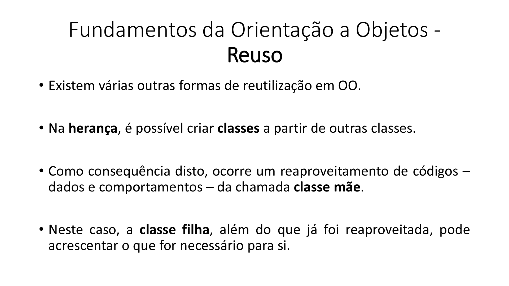

Fundamentos da Orientação a Objetos -
                 Reuso

• Existem várias outras formas de reutilização em OO.

• Na herança, é possível criar classes a partir de outras classes.

• Como consequência disto, ocorre um reaproveitamento de códigos –
 dados e comportamentos – da chamada classe mãe.

• Neste caso, a classe filha, além do que já foi reaproveitada, pode
 acrescentar o que for necessário para si.

## Página 59

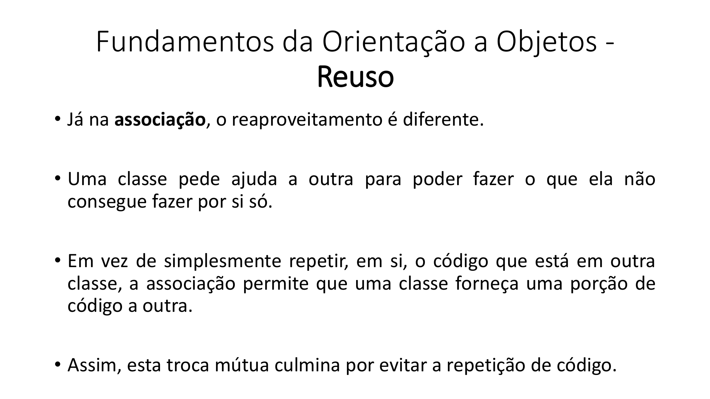

Fundamentos da Orientação a Objetos -
                 Reuso

• Já na associação, o reaproveitamento é diferente.

• Uma classe pede ajuda a outra para poder fazer o que ela não
 consegue fazer por si só.

• Em vez de simplesmente repetir, em si, o código que está em outra
  classe, a associação permite que uma classe forneça uma porção de
 código a outra.

• Assim, esta troca mútua culmina por evitar a repetição de código.

## Página 60

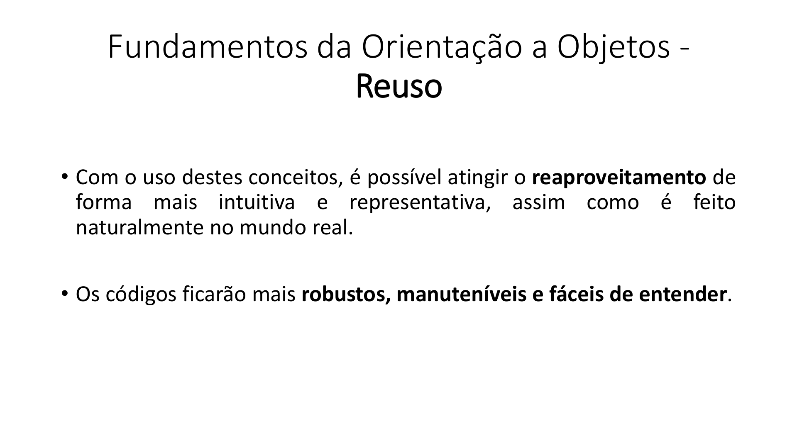

Fundamentos da Orientação a Objetos -
                 Reuso

• Com o uso destes conceitos, é possível atingir o reaproveitamento de
 forma  mais  intuitiva  e  representativa,  assim  como  é  feito
 naturalmente no mundo real.

• Os códigos ficarão mais robustos, manuteníveis e fáceis de entender.

## Página 61

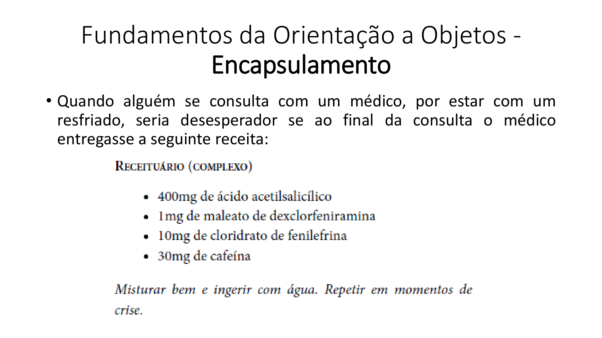

Fundamentos da Orientação a Objetos -
             Encapsulamento

• Quando alguém se consulta com um médico, por estar com um
  resfriado,  seria desesperador se ao  final da consulta o médico
 entregasse a seguinte receita:

## Página 62

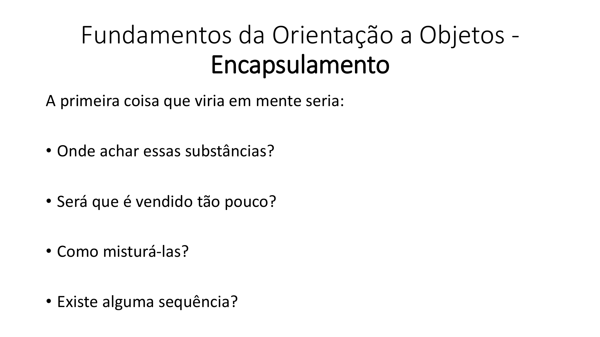

Fundamentos da Orientação a Objetos -
             Encapsulamento

A primeira coisa que viria em mente seria:

• Onde achar essas substâncias?

• Será que é vendido tão pouco?

• Como misturá-las?

• Existe alguma sequência?

## Página 63

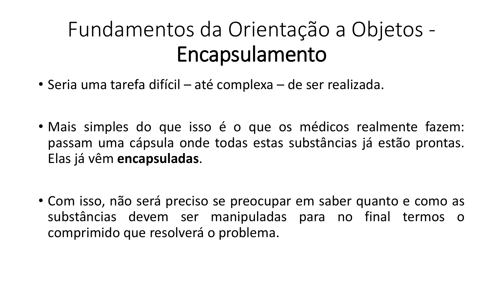

Fundamentos da Orientação a Objetos -
             Encapsulamento

• Seria uma tarefa difícil – até complexa – de ser realizada.

• Mais simples do que isso é o que os médicos realmente fazem:
 passam uma cápsula onde todas estas substâncias já estão prontas.
  Elas já vêm encapsuladas.

• Com isso, não será preciso se preocupar em saber quanto e como as
  substâncias devem  ser  manipuladas  para  no  final  termos  o
 comprimido que resolverá o problema.

## Página 64

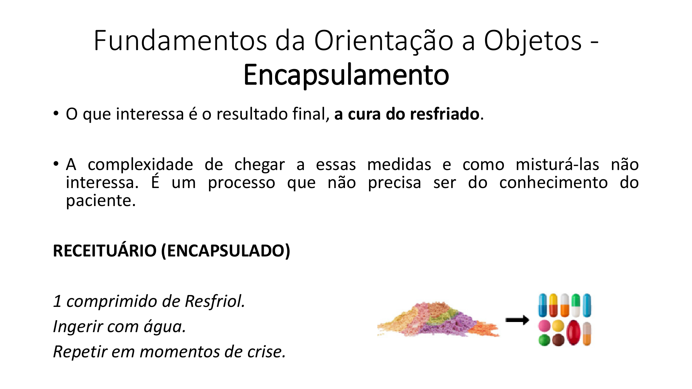

Fundamentos da Orientação a Objetos -
             Encapsulamento
• O que interessa é o resultado final, a cura do resfriado.

• A complexidade de chegar a essas medidas e como misturá-las não
  interessa. É um processo que não precisa ser do conhecimento do
  paciente.

RECEITUÁRIO (ENCAPSULADO)

1 comprimido de Resfriol.
Ingerir com água.
Repetir em momentos de crise.

## Página 65

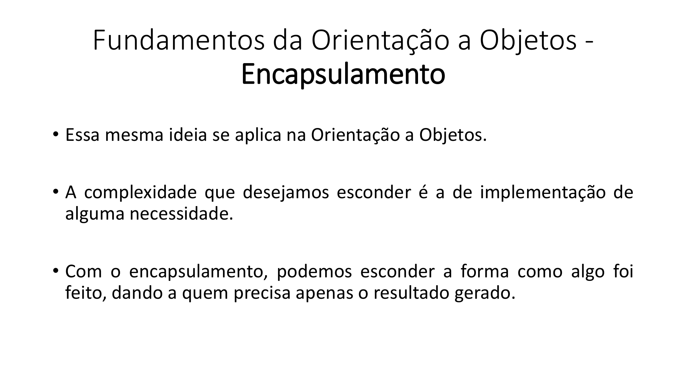

Fundamentos da Orientação a Objetos -
             Encapsulamento

• Essa mesma ideia se aplica na Orientação a Objetos.

• A complexidade que desejamos esconder é a de implementação de
 alguma necessidade.

• Com o encapsulamento, podemos esconder a forma como algo foi
  feito, dando a quem precisa apenas o resultado gerado.

## Página 66

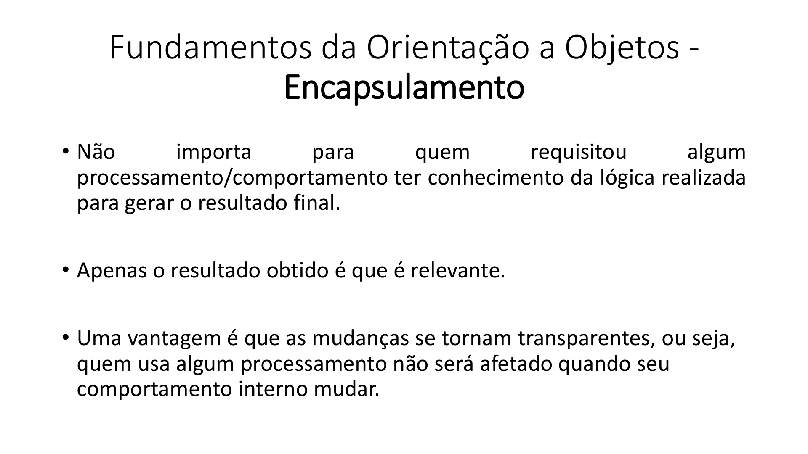

Fundamentos da Orientação a Objetos -
             Encapsulamento

• Não      importa      para    quem      requisitou     algum
 processamento/comportamento ter conhecimento da lógica realizada
 para gerar o resultado final.

• Apenas o resultado obtido é que é relevante.

• Uma vantagem é que as mudanças se tornam transparentes, ou seja,
 quem usa algum processamento não será afetado quando seu
 comportamento interno mudar.

## Página 67

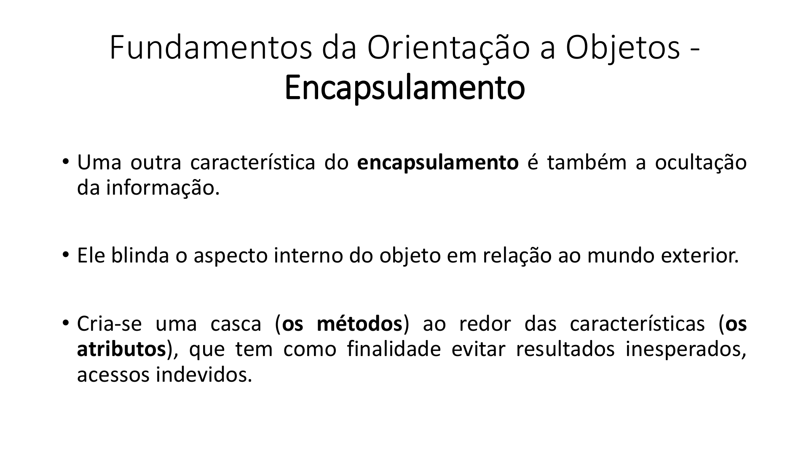

Fundamentos da Orientação a Objetos -
             Encapsulamento

• Uma outra característica do encapsulamento é também a ocultação
 da informação.

• Ele blinda o aspecto interno do objeto em relação ao mundo exterior.

• Cria-se uma casca (os métodos) ao redor das características (os
  atributos), que tem como finalidade evitar resultados inesperados,
 acessos indevidos.

## Página 68

Atividade no Wordwall

https://wordwall.net/play/18026/104/848

## Página 69

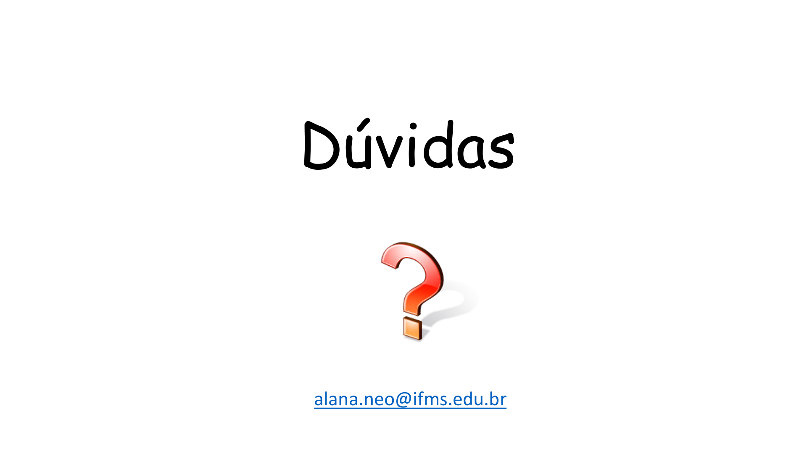

Dúvidas

  alana.neo@ifms.edu.br
