# Aula 03 Fundamentos Java

Arquivo original: `Aula 03 Fundamentos Java.pdf`

## Página 1

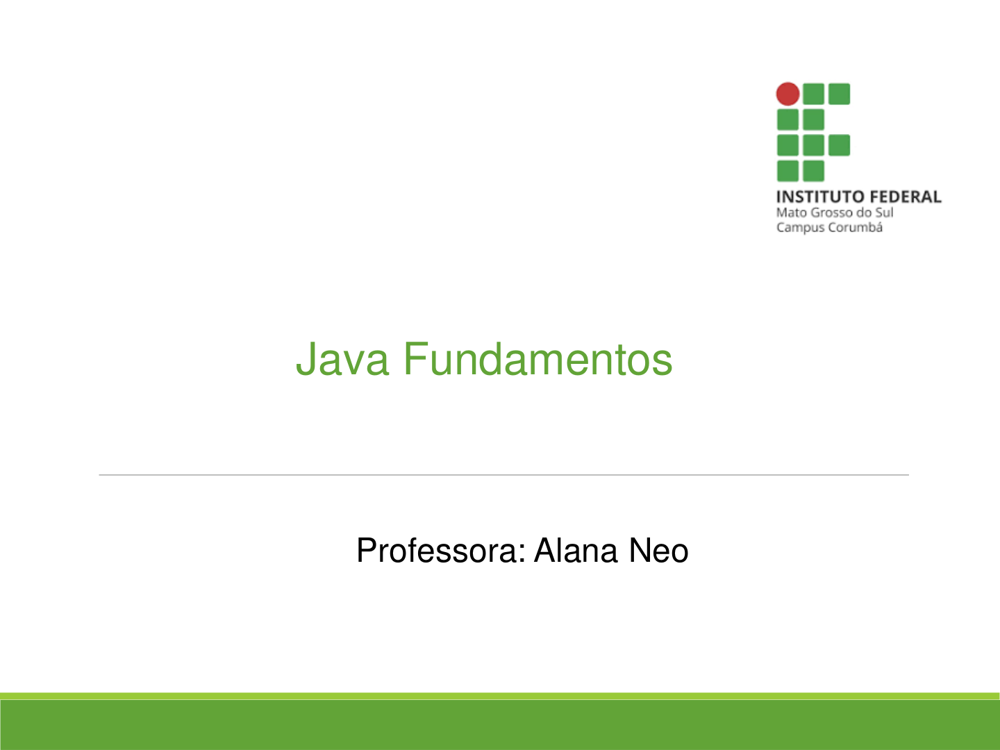

Java Fundamentos

    Professora: Alana Neo

## Página 2

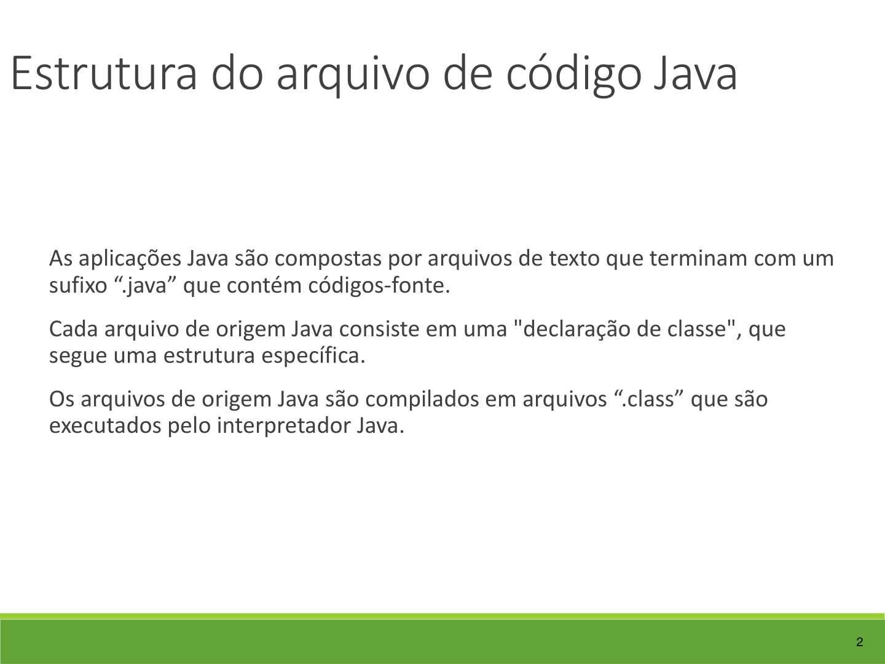

Estrutura do arquivo de código Java

   As aplicações Java são compostas por arquivos de texto que terminam com um
    sufixo “.java” que contém códigos-fonte.

   Cada arquivo de origem Java consiste em uma "declaração de classe", que
   segue uma estrutura específica.

   Os arquivos de origem Java são compilados em arquivos “.class” que são
    executados pelo interpretador Java.

                                                                                                                             2

## Página 3

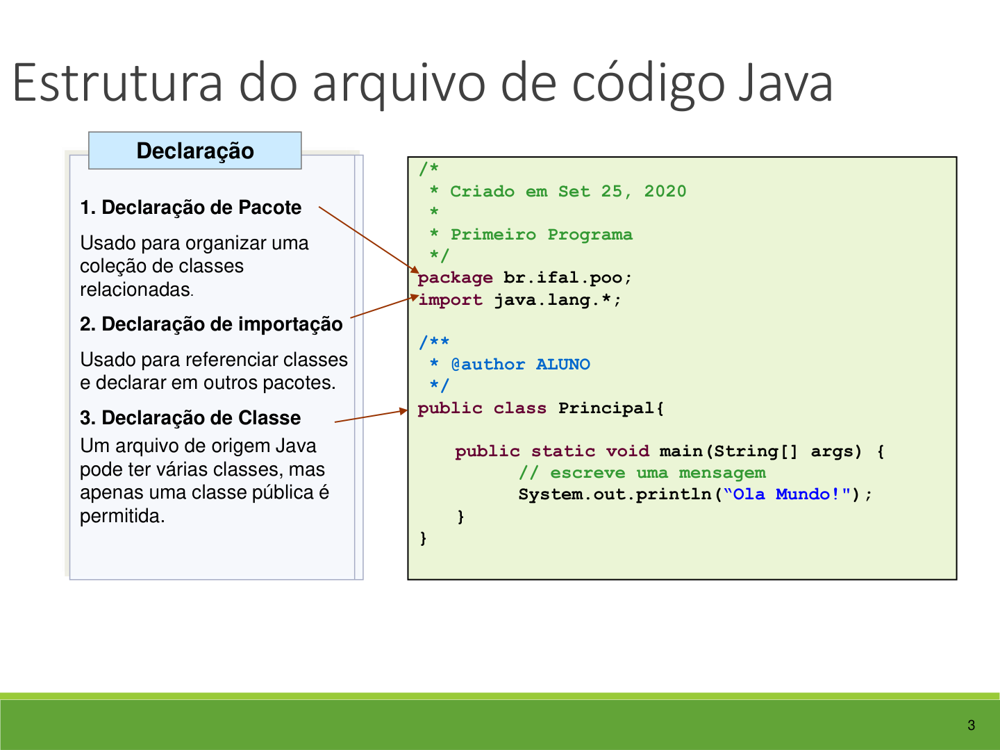

Estrutura do arquivo de código Java

           Declaração
                                      /*
                                       * Criado em Set 25, 2020
         1. Declaração de Pacote            *
                                       * Primeiro Programa      Usado para organizar uma
                                       */
       coleção de classes
                                      package br.ifal.poo;
        relacionadas.                                      import java.lang.*;
         2. Declaração de importação
                                      /**
      Usado para referenciar classes       * @author ALUNO
      e declarar em outros pacotes.         */
                                      public class Principal{
         3. Declaração de Classe
     Um arquivo de origem Java             public static void main(String[] args) {
      pode ter várias classes, mas                  // escreve uma mensagem
       apenas uma classe pública é                 System.out.println(“Ola Mundo!");
        permitida.                           }
                                      }

                                                                                                                             3

## Página 4

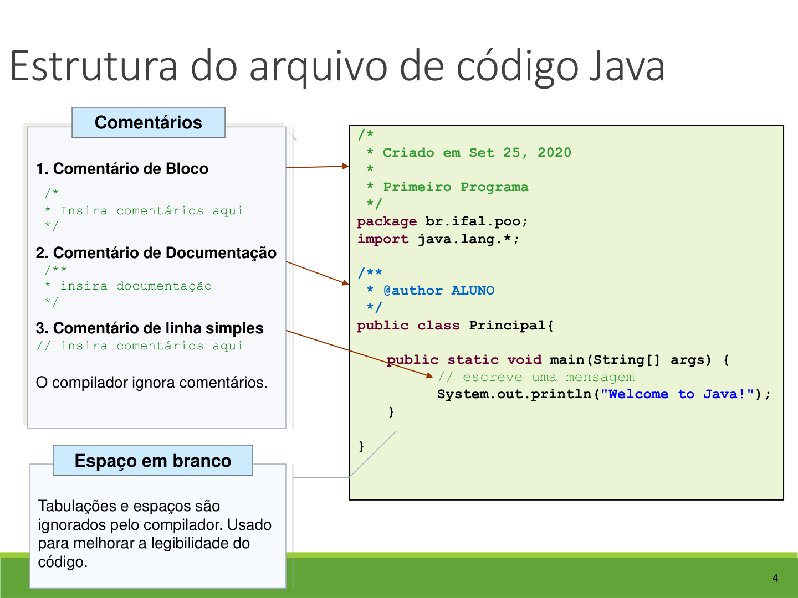

Estrutura do arquivo de código Java

         Comentários
                                        /*
                                          * Criado em Set 25, 2020
    1. Comentário de Bloco                  *
                                          * Primeiro Programa    /*
                                         */    * Insira comentários aqui
                                         package br.ifal.poo;    */
                                         import java.lang.*;
    2. Comentário de Documentação
    /**                                  /**
    * insira documentação                                          * @author ALUNO
    */                                         */
    3. Comentário de linha simples           public class Principal{
   // insira comentários aqui
                                            public static void main(String[] args) {
                                                  // escreve uma mensagem  O compilador ignora comentários.
                                                  System.out.println("Welcome to Java!");
                                            }

                                         }
      Espaço em branco

    Tabulações e espaços são
    ignorados pelo compilador. Usado
    para melhorar a legibilidade do
    código.
                                                                                                                             4

## Página 5

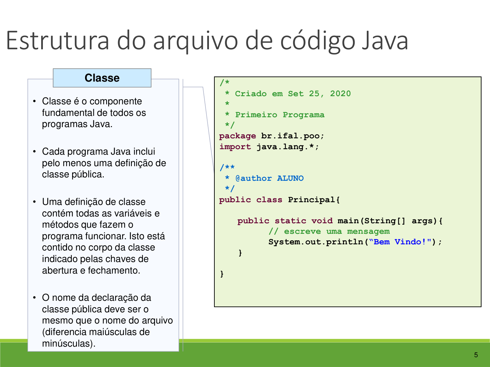

Estrutura do arquivo de código Java

              Classe                                        /*
                                          * Criado em Set 25, 2020
        • Classe é o componente                                          *
        fundamental de todos os               * Primeiro Programa
       programas Java.                     */
                                         package br.ifal.poo;
                                         import java.lang.*;
        • Cada programa Java inclui
        pelo menos uma definição de                                        /**
        classe pública.                                          * @author ALUNO
                                         */
        • Uma definição de classe              public class Principal{
       contém todas as variáveis e
                                            public static void main(String[] args){       métodos que fazem o
                                                  // escreve uma mensagem
       programa funcionar. Isto está
                                                  System.out.println(“Bem Vindo!");
        contido no corpo da classe                                            }
        indicado pelas chaves de
        abertura e fechamento.                                         }

        • O nome da declaração da
        classe pública deve ser o
      mesmo que o nome do arquivo
         (diferencia maiúsculas de
        minúsculas).
                                                                                                                             5

## Página 6

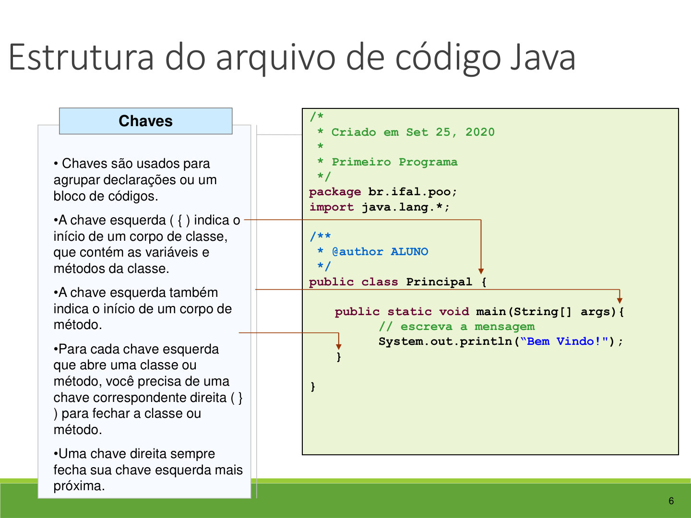

Estrutura do arquivo de código Java

            Chaves                  /*
                                          * Criado em Set 25, 2020
                                          *
          • Chaves são usados para              * Primeiro Programa
       agrupar declarações ou um             */
                                         package br.ifal.poo;       bloco de códigos.
                                         import java.lang.*;
       •A chave esquerda ( { ) indica o
         início de um corpo de classe,           /**
      que contém as variáveis e              * @author ALUNO
      métodos da classe.                    */
                                         public class Principal {
       •A chave esquerda também
        indica o início de um corpo de              public static void main(String[] args){
       método.                                     // escreva a mensagem
                                                  System.out.println(“Bem Vindo!");
       •Para cada chave esquerda                                            }
      que abre uma classe ou
       método, você precisa de uma                                         }
       chave correspondente direita ( }
          ) para fechar a classe ou
       método.

      •Uma chave direita sempre
       fecha sua chave esquerda mais
       próxima.
                                                                                                                             6

## Página 7

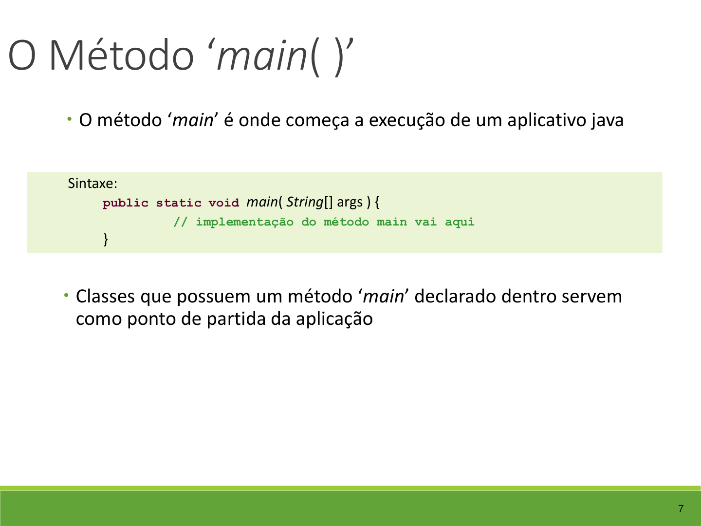

O Método ‘main( )’

    O método ‘main’ é onde começa a execução de um aplicativo java

          Sintaxe:
             public static void main( String[] args ) {
                      // implementação do método main vai aqui
                    }

      Classes que possuem um método ‘main’ declarado dentro servem
      como ponto de partida da aplicação

                                                                                                                             7

## Página 8

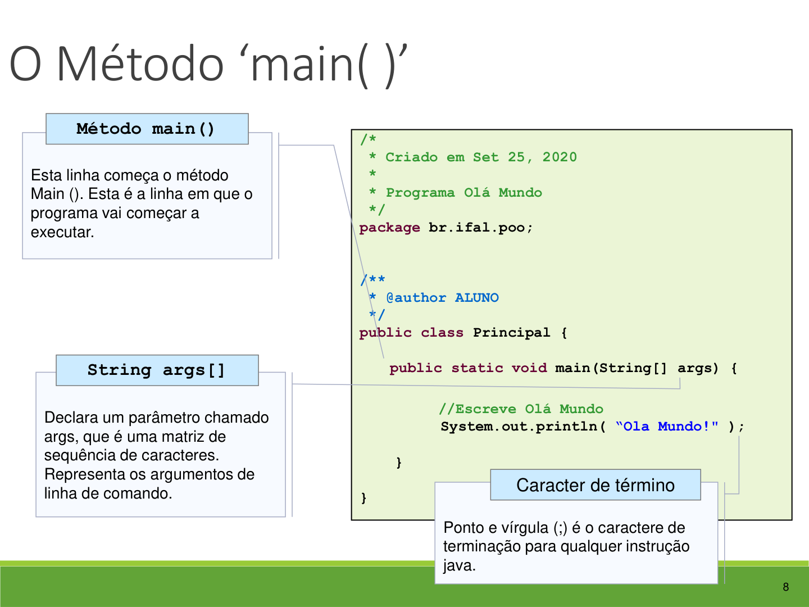

O Método ‘main( )’

      Método main()
                                        /*
                                         * Criado em Set 25, 2020
   Esta linha começa o método                *
   Main (). Esta é a linha em que o             * Programa Olá Mundo
   programa vai começar a                   */
   executar.                              package br.ifal.poo;

                                        /**
                                         * @author ALUNO
                                         */
                                        public class Principal {

       String args[]                   public static void main(String[] args) {

                                                 //Escreve Olá Mundo
     Declara um parâmetro chamado
                                                  System.out.println( “Ola Mundo!" );
     args, que é uma matriz de
    sequência de caracteres.                                            }
    Representa os argumentos de
                                                           Caracter de término     linha de comando.                     }

                                                     Ponto e vírgula (;) é o caractere de
                                                        terminação para qualquer instrução
                                                                  java.

                                                                                                                             8

## Página 9

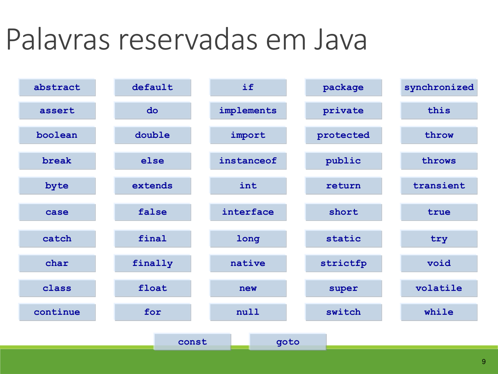

Palavras reservadas em Java

     abstract         default            if            package       synchronized

      assert            do          implements        private           this

     boolean          double          import         protected         throw

      break            else         instanceof        public          throws

       byte           extends           int            return         transient

       case            false         interface         short            true

      catch           final            long           static            try

       char           finally          native         strictfp          void

      class           float            new            super          volatile

     continue           for             null           switch           while

                              const            goto

                                                                                                                             9

## Página 10

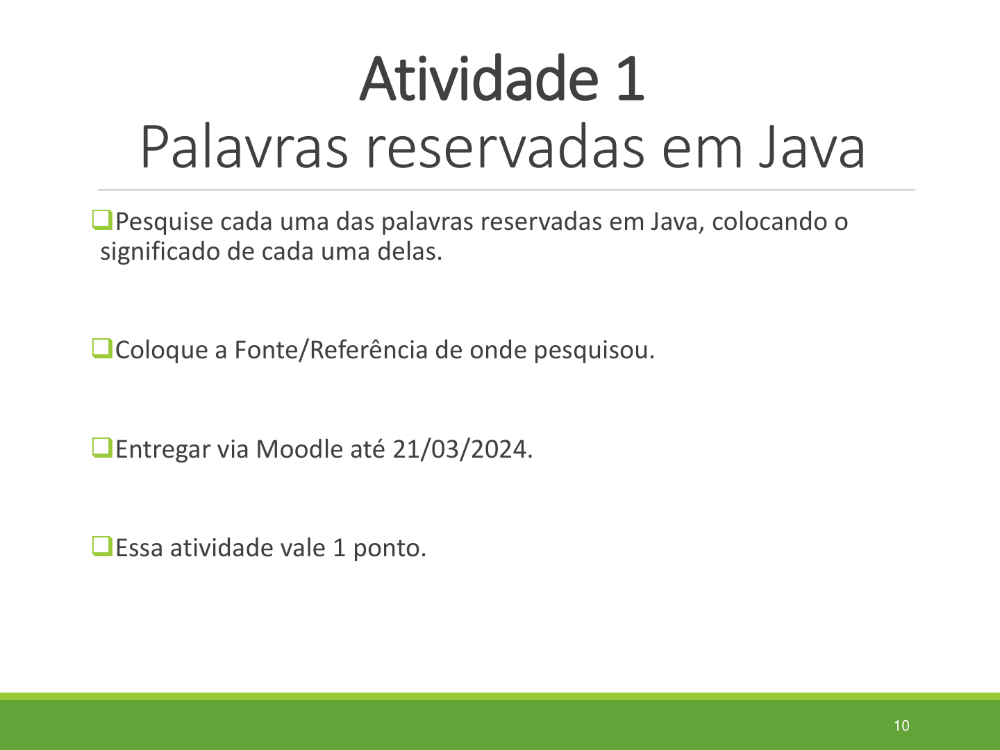

Atividade 1
  Palavras reservadas em Java

❑Pesquise cada uma das palavras reservadas em Java, colocando o
 significado de cada uma delas.

❑Coloque a Fonte/Referência de onde pesquisou.

❑Entregar via Moodle até 21/03/2024.

❑Essa atividade vale 1 ponto.

                                                                                                  10

## Página 11

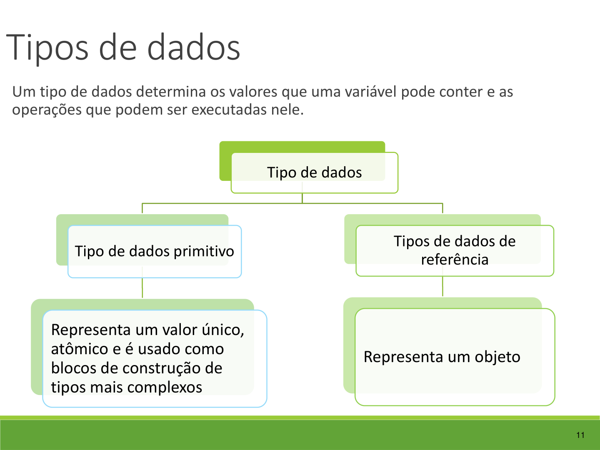

Tipos de dados

Um tipo de dados determina os valores que uma variável pode conter e as
 operações que podem ser executadas nele.

                                   Tipo de dados

                                                      Tipos de dados de
         Tipo de dados primitivo
                                                             referência

      Representa um valor único,
     atômico e é usado como                                             Representa um objeto
      blocos de construção de
      tipos mais complexos

                                                                                                                            11

## Página 12

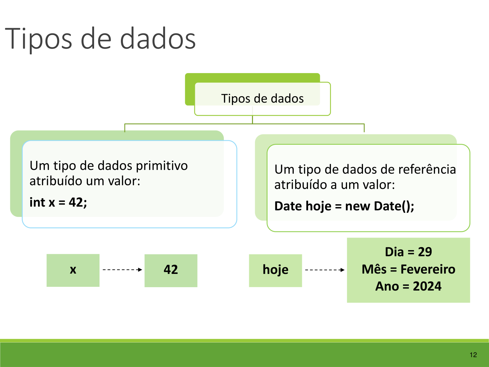

Tipos de dados

                                     Tipos de dados

  Um tipo de dados primitivo                          Um tipo de dados de referência
    atribuído um valor:                                              atribuído a um valor:
     int x = 42;                                       Date hoje = new Date();

                                                          Dia = 29
          x            42             hoje         Mês = Fevereiro
                                              Ano = 2024

                                                                                                                            12

## Página 13

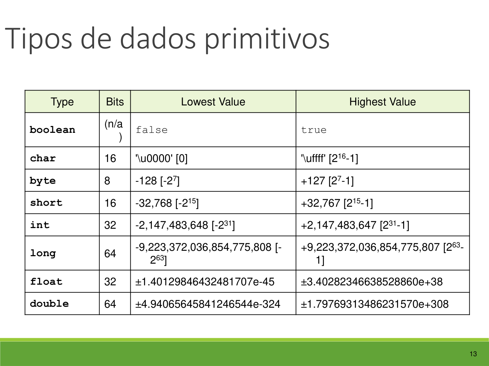

Tipos de dados primitivos

        Type       Bits          Lowest Value                    Highest Value

                     (n/a
    boolean         false                    true
                                )

    char        16    '\u0000' [0]                                     '\uffff' [216-1]

    byte        8     -128 [-27]                    +127 [27-1]

    short       16    -32,768 [-215]                  +32,767 [215-1]

    int         32    -2,147,483,648 [-231]            +2,147,483,647 [231-1]

                         -9,223,372,036,854,775,808 [-    +9,223,372,036,854,775,807 [263-
    long        64
                                  263]                                 1]

    float       32   ±1.40129846432481707e-45    ±3.40282346638528860e+38

    double      64   ±4.94065645841246544e-324   ±1.79769313486231570e+308

                                                                                                                            13

## Página 14

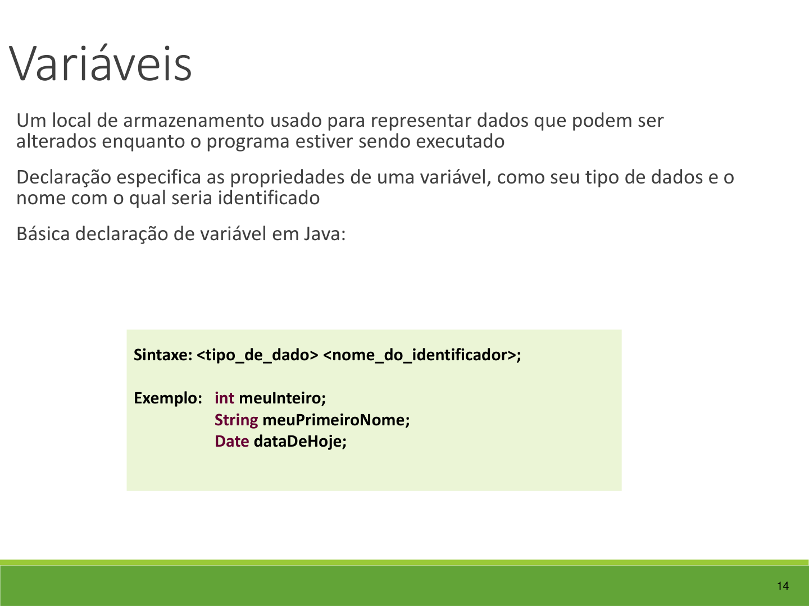

Variáveis

 Um local de armazenamento usado para representar dados que podem ser
 alterados enquanto o programa estiver sendo executado

 Declaração especifica as propriedades de uma variável, como seu tipo de dados e o
 nome com o qual seria identificado

 Básica declaração de variável em Java:

                 Sintaxe: <tipo_de_dado> <nome_do_identificador>;

               Exemplo:  int meuInteiro;
                            String meuPrimeiroNome;
                        Date dataDeHoje;

                                                                                                                            14

## Página 15

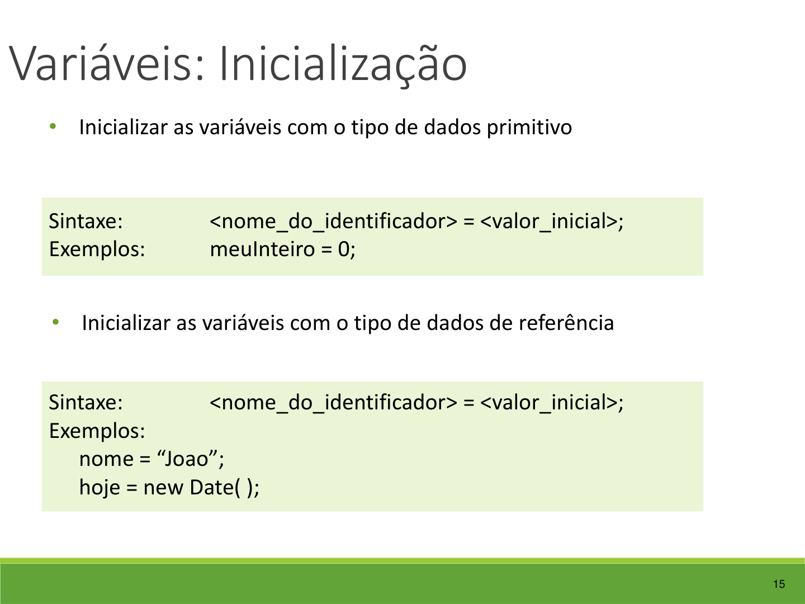

Variáveis: Inicialização

     •   Inicializar as variáveis com o tipo de dados primitivo

    Sintaxe:        <nome_do_identificador> = <valor_inicial>;
    Exemplos:      meuInteiro = 0;

     •   Inicializar as variáveis com o tipo de dados de referência

    Sintaxe:        <nome_do_identificador> = <valor_inicial>;
    Exemplos:
     nome = “Joao”;
       hoje = new Date( );

                                                                                                                            15

## Página 16

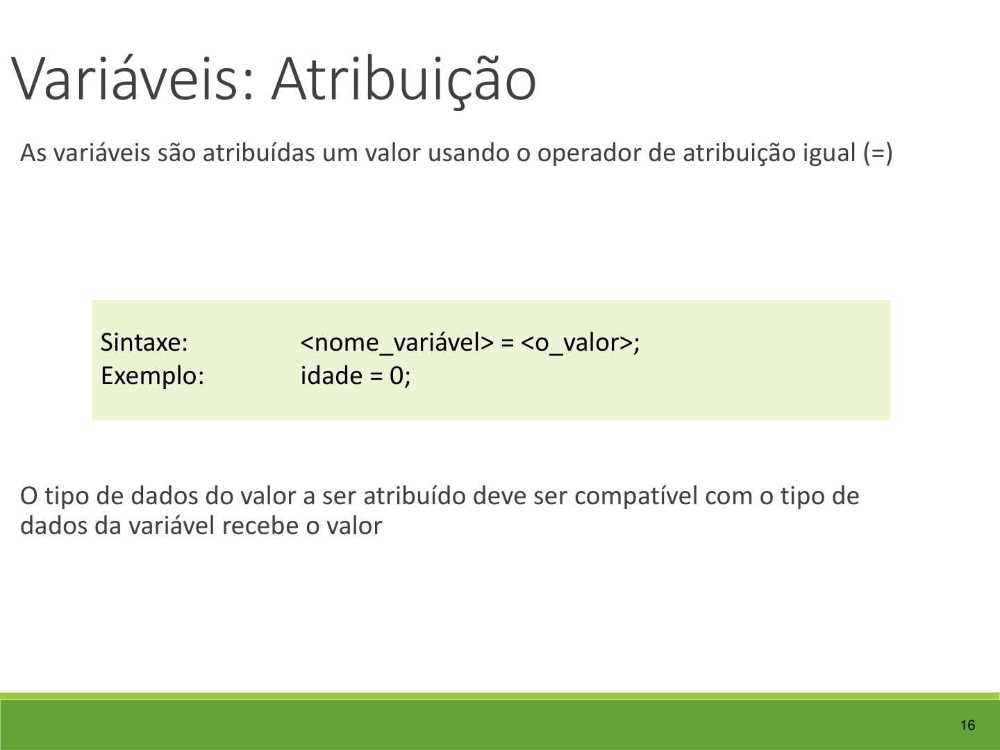

Variáveis: Atribuição

 As variáveis são atribuídas um valor usando o operador de atribuição igual (=)

        Sintaxe:         <nome_variável> = <o_valor>;
       Exemplo:        idade = 0;

 O tipo de dados do valor a ser atribuído deve ser compatível com o tipo de
 dados da variável recebe o valor

                                                                                                                            16

## Página 17

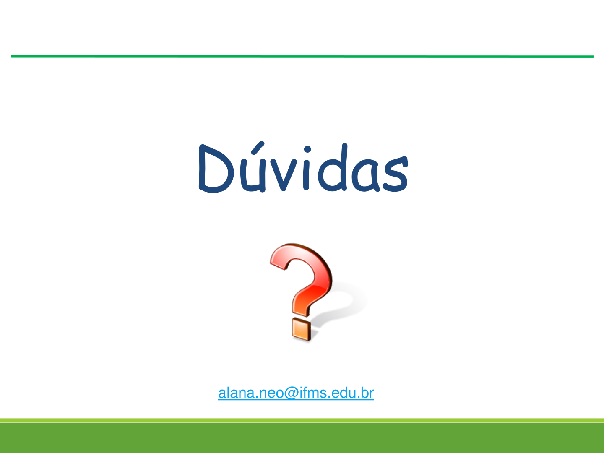

Dúvidas

   alana.neo@ifms.edu.br
