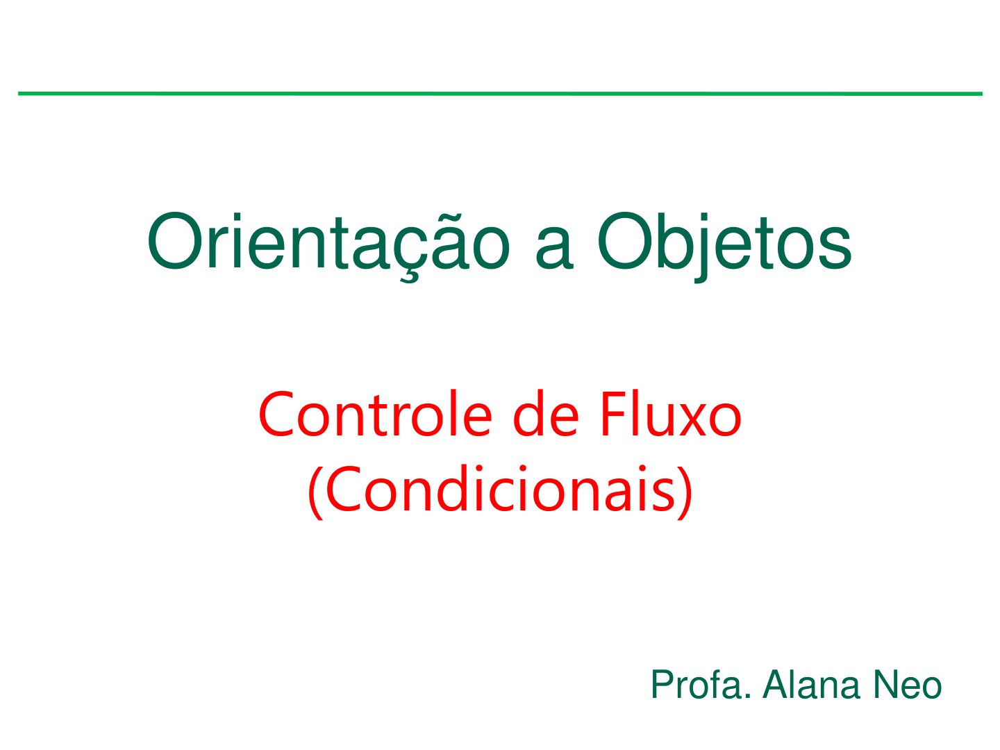
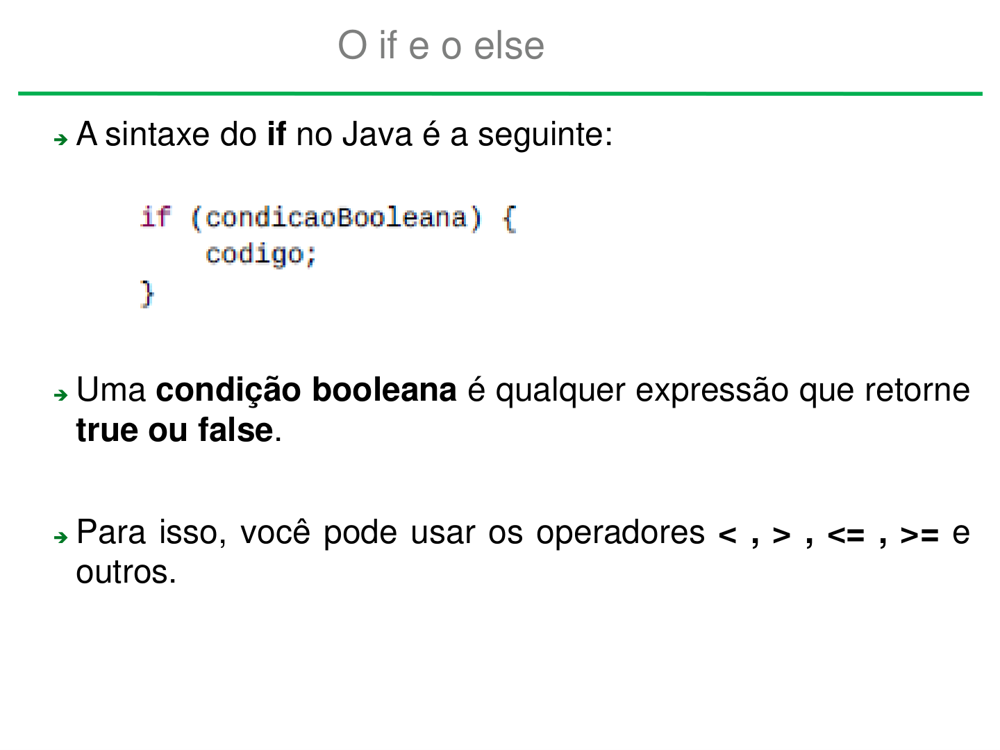
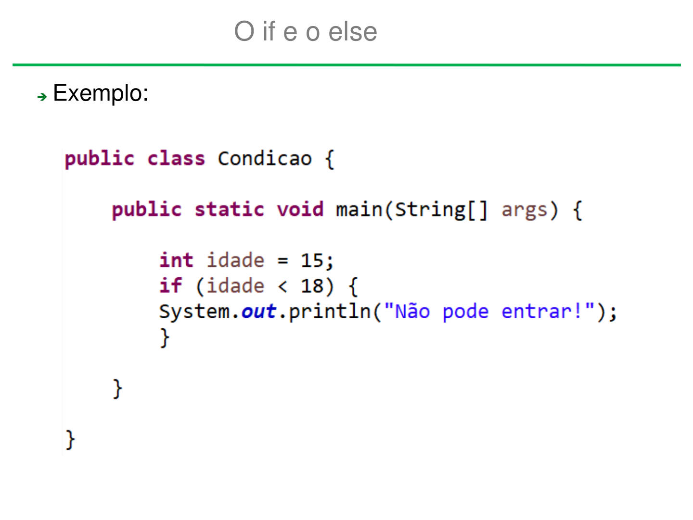
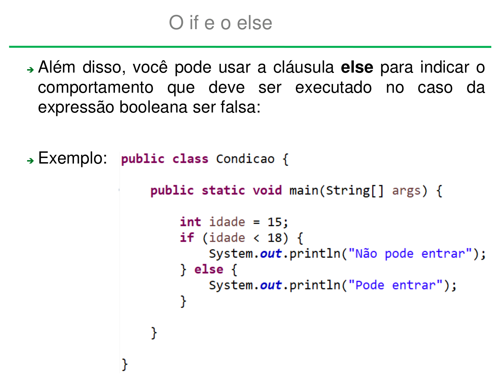
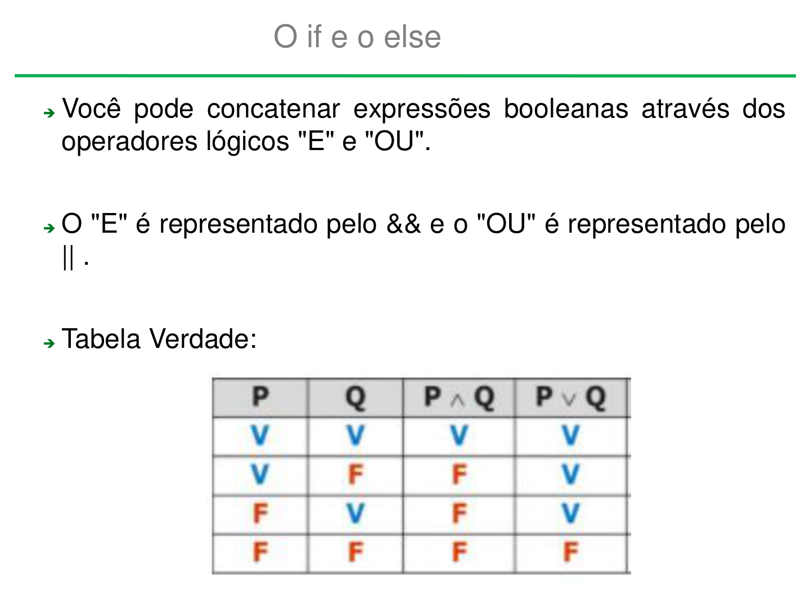
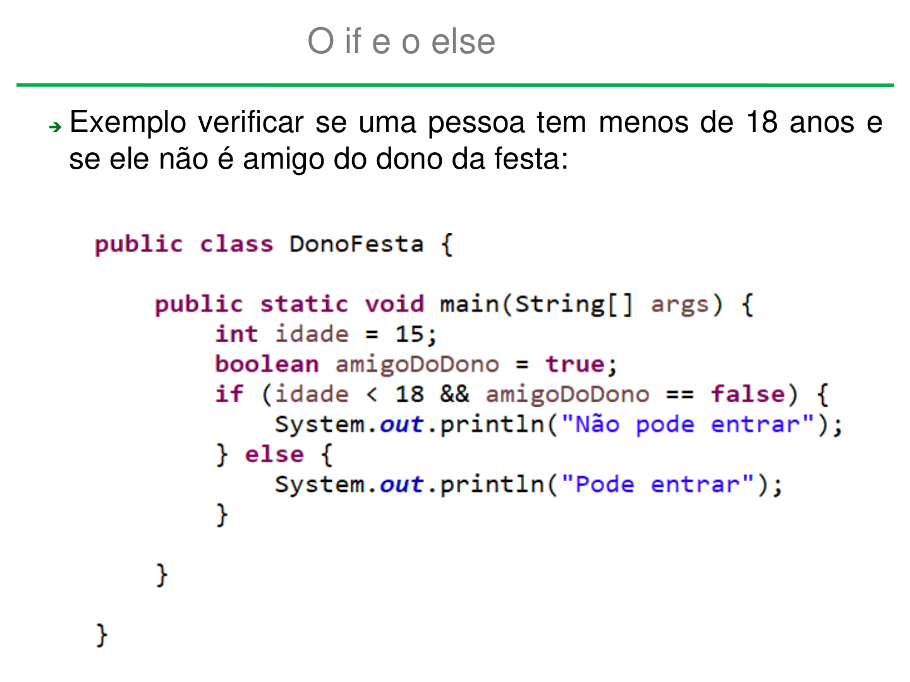
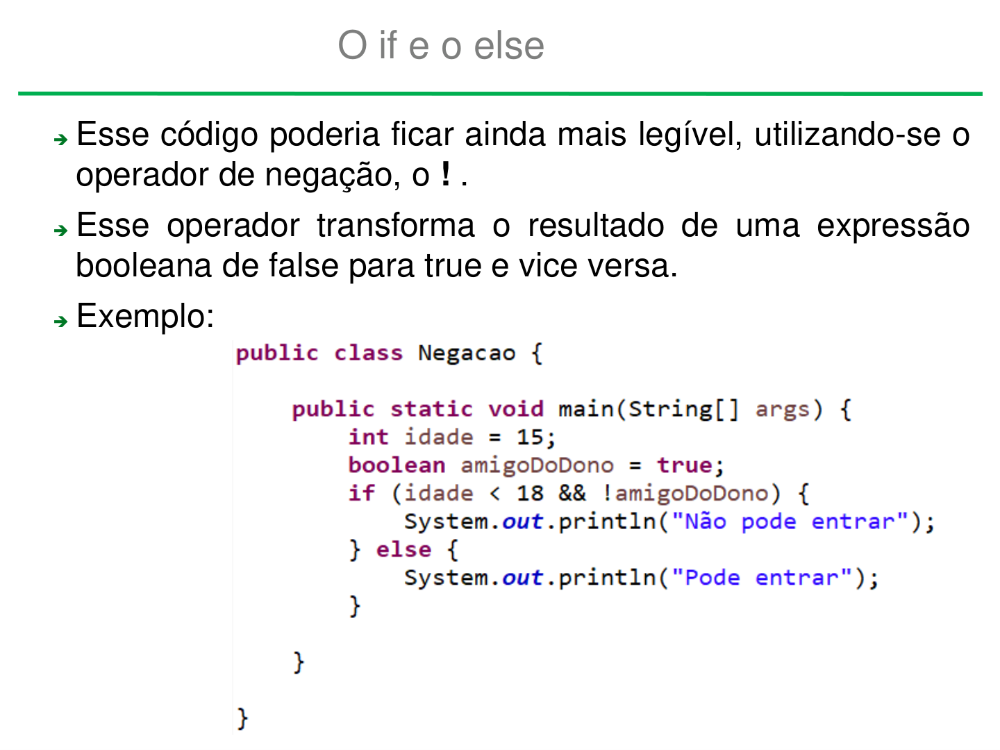
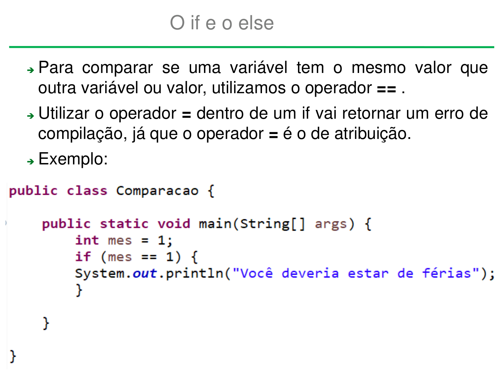
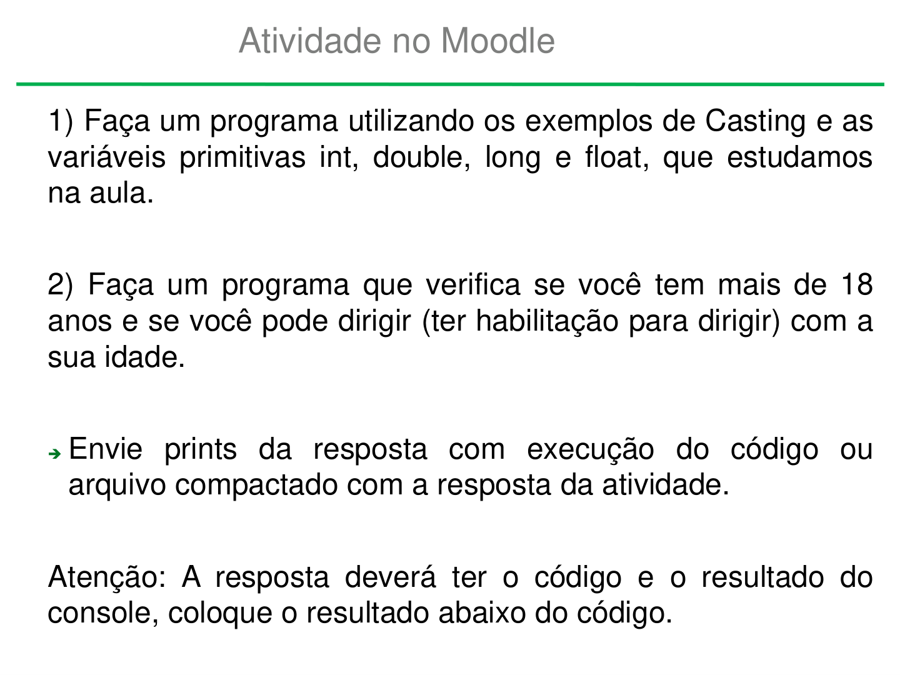
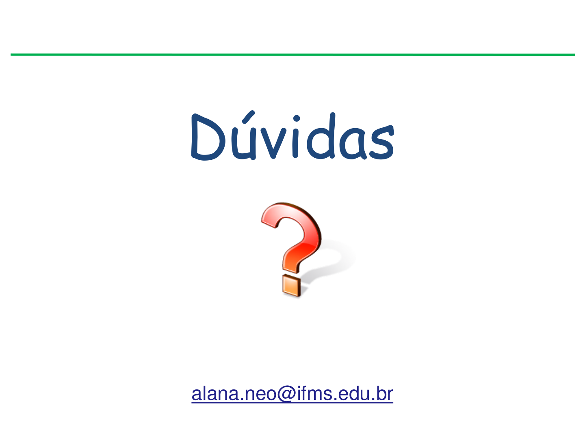

# Aula 06 Condicionais

Arquivo original: `Aula 06 Condicionais.pdf`

## Página 1

Orientação a Objetos

    Controle de Fluxo
      (Condicionais)

                             Profa. Alana Neo

## Página 2

O if e o else

➔A sintaxe do if no Java é a seguinte:

➔Uma condição booleana é qualquer expressão que retorne
 true ou false.

➔Para isso, você pode usar os operadores < , > , <= , >= e
  outros.

## Página 3

O if e o else

➔Exemplo:

## Página 4

O if e o else

➔Além disso, você pode usar a cláusula else para indicar o
 comportamento que  deve  ser  executado no  caso da
 expressão booleana ser falsa:

➔Exemplo:

## Página 5

O if e o else

➔Você pode concatenar expressões booleanas através dos
 operadores lógicos "E" e "OU".

➔O "E" é representado pelo && e o "OU" é representado pelo
   || .

➔Tabela Verdade:

## Página 6

O if e o else

➔Exemplo verificar se uma pessoa tem menos de 18 anos e
 se ele não é amigo do dono da festa:

## Página 7

O if e o else

➔Esse código poderia ficar ainda mais legível, utilizando-se o
 operador de negação, o ! .
➔Esse operador transforma o resultado de uma expressão
 booleana de false para true e vice versa.
➔Exemplo:

## Página 8

O if e o else

➔Para comparar se uma variável tem o mesmo valor que
 outra variável ou valor, utilizamos o operador == .
➔Utilizar o operador = dentro de um if vai retornar um erro de
 compilação, já que o operador = é o de atribuição.
➔Exemplo:

## Página 9

Atividade no Moodle

1) Faça um programa utilizando os exemplos de Casting e as
variáveis primitivas int, double, long e float, que estudamos
na aula.

2) Faça um programa que verifica se você tem mais de 18
anos e se você pode dirigir (ter habilitação para dirigir) com a
sua idade.

➔Envie  prints da resposta com execução do código ou
 arquivo compactado com a resposta da atividade.

Atenção: A resposta deverá ter o código e o resultado do
console, coloque o resultado abaixo do código.

## Página 10

Dúvidas

 alana.neo@ifms.edu.br
