Arquivo original: `Aula 08 Conceitos de Orientação a Objetos.pdf`

## Página 1

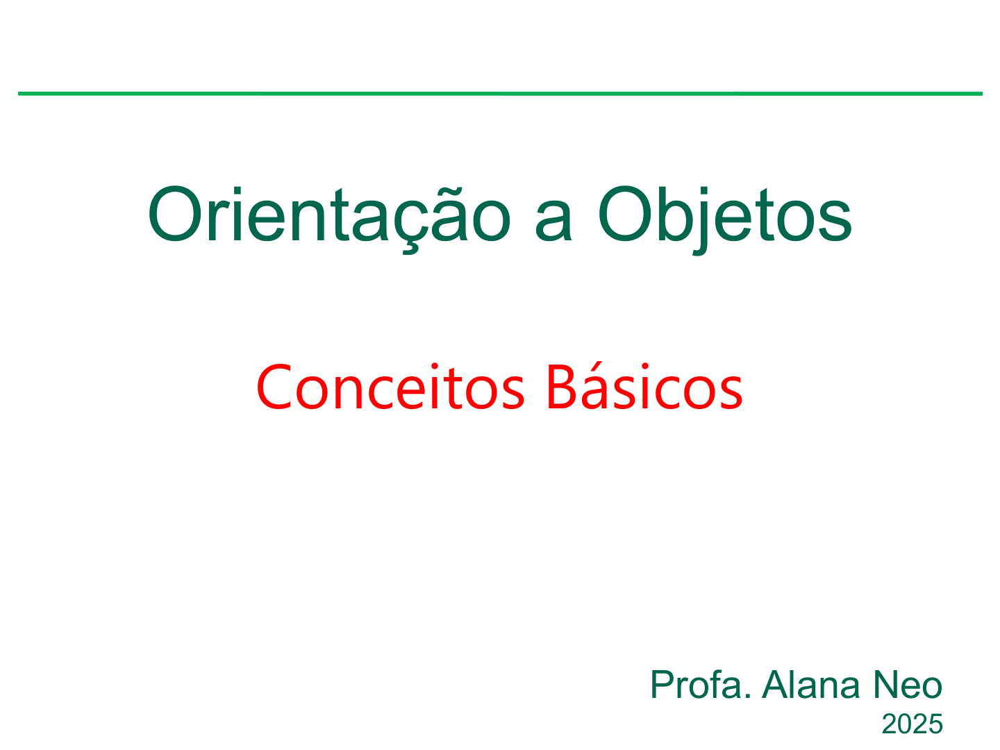

Orientação a Objetos

    Conceitos Básicos

                             Profa. Alana Neo
                                               2025

## Página 2

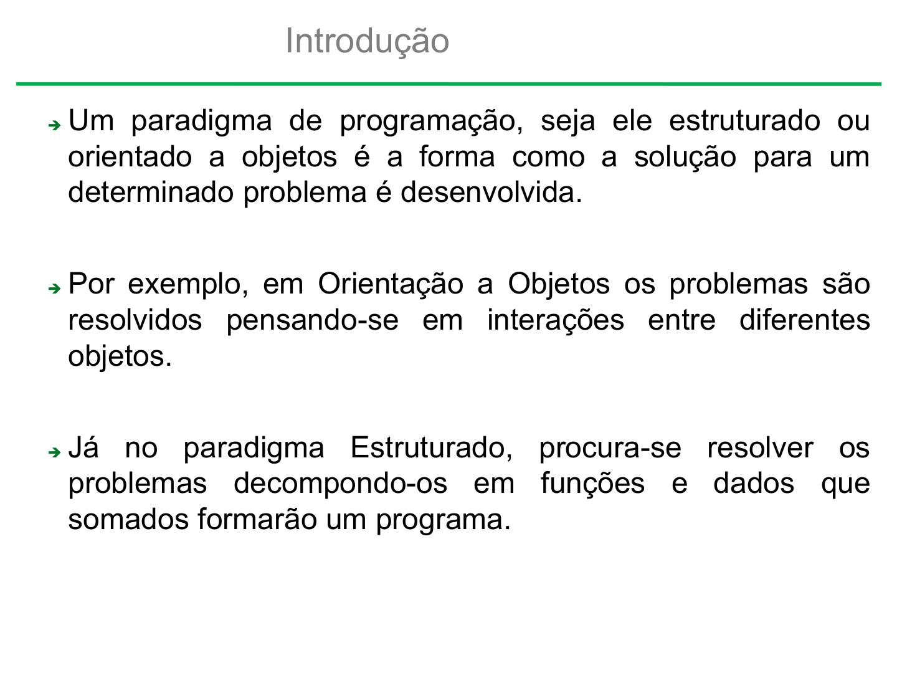

Introdução

➔Um paradigma de programação, seja ele estruturado ou
 orientado a objetos é a forma como a solução para um
 determinado problema é desenvolvida.

➔Por exemplo, em Orientação a Objetos os problemas são
  resolvidos pensando-se em  interações  entre  diferentes
  objetos.

➔Já  no  paradigma  Estruturado,  procura-se  resolver  os
 problemas  decompondo-os em  funções  e  dados  que
 somados formarão um programa.

## Página 3

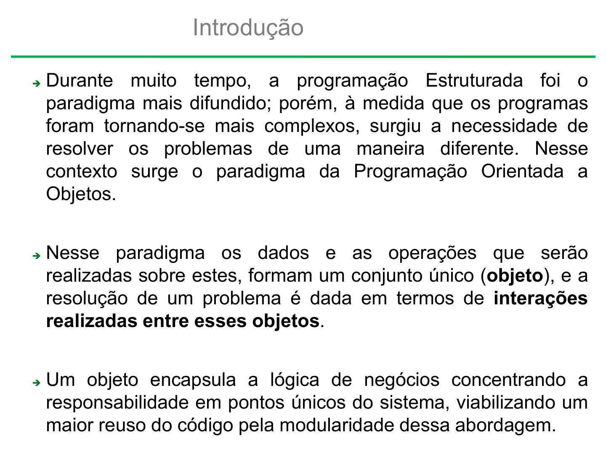

Introdução

➔Durante  muito  tempo,  a  programação  Estruturada   foi  o
 paradigma mais difundido; porém, à medida que os programas
 foram tornando-se mais complexos, surgiu a necessidade de
  resolver  os  problemas de uma  maneira  diferente. Nesse
  contexto surge o paradigma da Programação Orientada a
  Objetos.

➔Nesse  paradigma  os  dados  e  as  operações  que  serão
  realizadas sobre estes, formam um conjunto único (objeto), e a
  resolução de um problema é dada em termos de interações
 realizadas entre esses objetos.

➔Um objeto encapsula a lógica de negócios concentrando a
  responsabilidade em pontos únicos do sistema, viabilizando um
 maior reuso do código pela modularidade dessa abordagem.

## Página 4

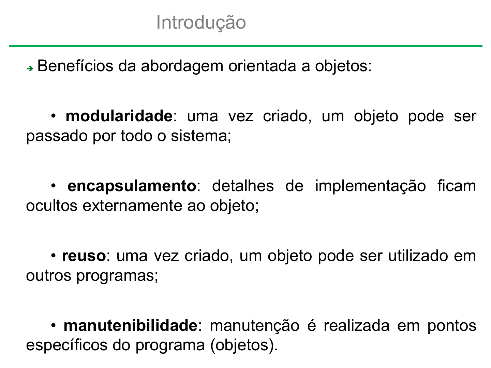

Introdução

➔Benefícios da abordagem orientada a objetos:

    • modularidade: uma vez criado, um objeto pode ser
passado por todo o sistema;

    • encapsulamento: detalhes de implementação ficam
ocultos externamente ao objeto;

    • reuso: uma vez criado, um objeto pode ser utilizado em
outros programas;

    • manutenibilidade: manutenção é realizada em pontos
específicos do programa (objetos).

## Página 5

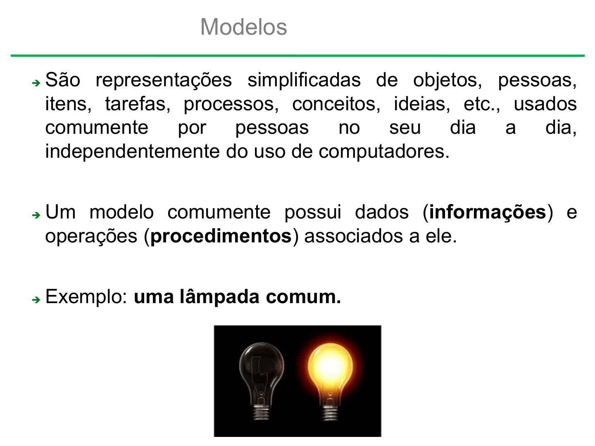

Modelos

➔São  representações  simplificadas de  objetos,  pessoas,
  itens,  tarefas, processos, conceitos,  ideias,  etc., usados
 comumente   por   pessoas   no   seu   dia   a    dia,
 independentemente do uso de computadores.

➔Um modelo comumente possui dados (informações) e
 operações (procedimentos) associados a ele.

➔Exemplo: uma lâmpada comum.

## Página 6

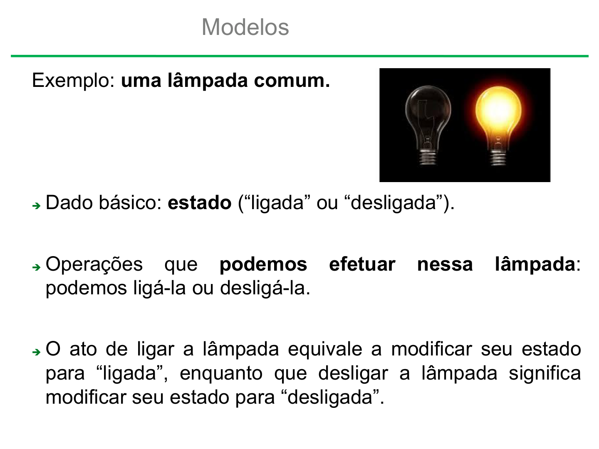

Modelos

Exemplo: uma lâmpada comum.

➔Dado básico: estado (“ligada” ou “desligada”).

➔Operações  que  podemos  efetuar  nessa  lâmpada:
 podemos ligá-la ou desligá-la.

➔O ato de ligar a lâmpada equivale a modificar seu estado
 para “ligada”, enquanto que desligar a lâmpada significa
  modificar seu estado para “desligada”.

## Página 7

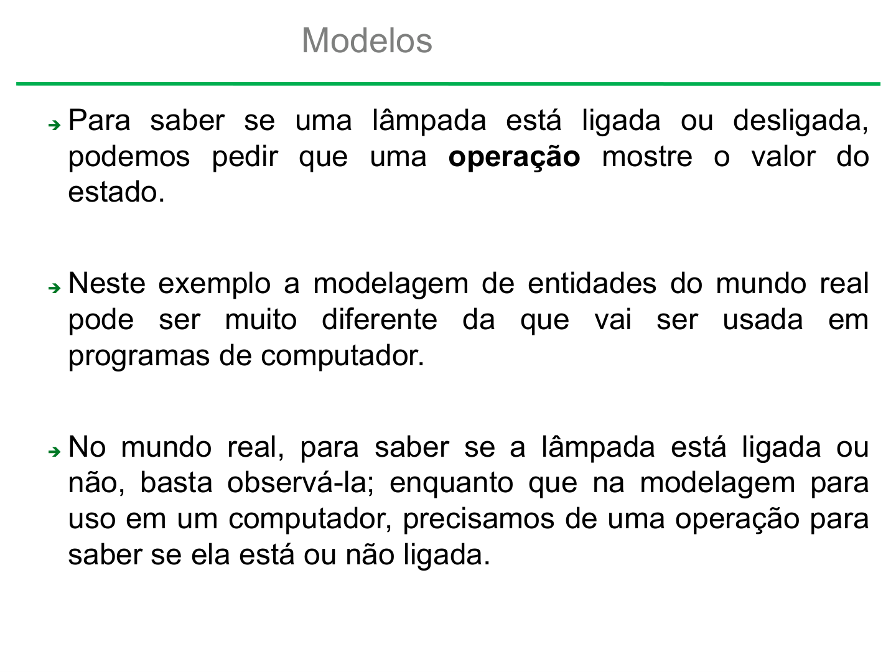

Modelos

➔Para saber se uma lâmpada está ligada ou desligada,
 podemos  pedir que uma operação mostre o  valor do
 estado.

➔Neste exemplo a modelagem de entidades do mundo real
 pode  ser  muito  diferente da que  vai  ser usada em
 programas de computador.

➔No mundo real, para saber se a lâmpada está ligada ou
 não, basta observá-la; enquanto que na modelagem para
 uso em um computador, precisamos de uma operação para
 saber se ela está ou não ligada.

## Página 8

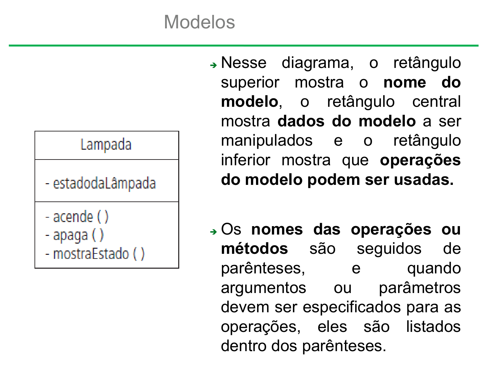

Modelos

     ➔Nesse  diagrama,  o  retângulo
        superior  mostra  o nome  do
      modelo,  o  retângulo   central
       mostra dados do modelo a ser
       manipulados  e  o   retângulo
         inferior mostra que operações
      do modelo podem ser usadas.

    ➔Os nomes das operações ou
      métodos  são   seguidos  de
       parênteses,     e     quando
       argumentos   ou   parâmetros
      devem ser especificados para as
       operações,  eles  são  listados
       dentro dos parênteses.

## Página 9

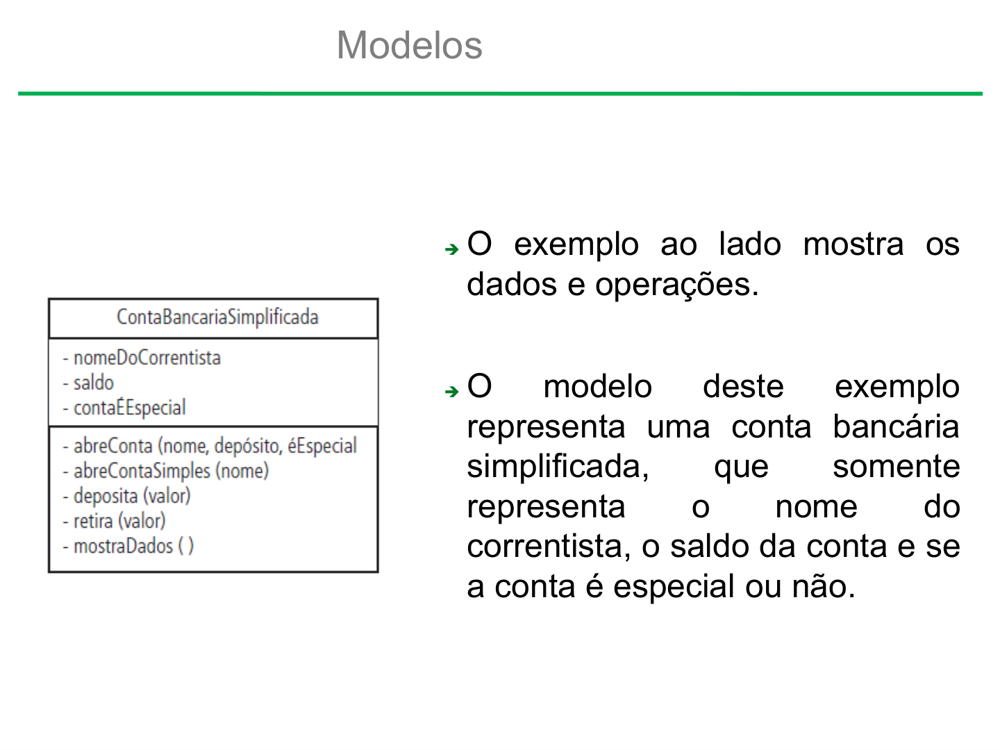

Modelos

    ➔O exemplo ao lado mostra os
       dados e operações.

    ➔O   modelo   deste   exemplo
        representa uma conta bancária
         simplificada,   que   somente
        representa    o   nome    do
          correntista, o saldo da conta e se
       a conta é especial ou não.

## Página 10

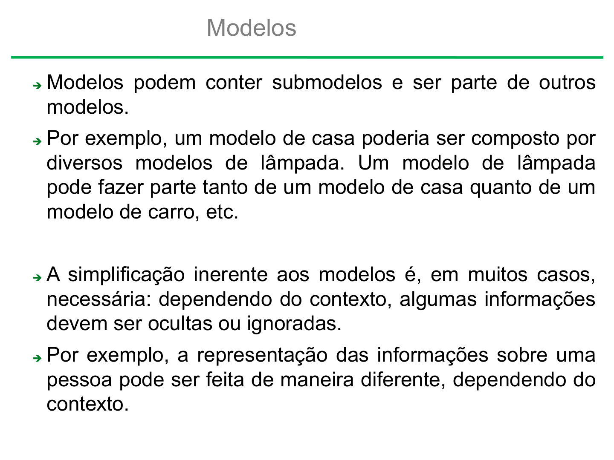

Modelos

➔Modelos podem conter submodelos e ser parte de outros
 modelos.
➔Por exemplo, um modelo de casa poderia ser composto por
 diversos modelos de lâmpada. Um modelo de lâmpada
 pode fazer parte tanto de um modelo de casa quanto de um
 modelo de carro, etc.

➔A simplificação inerente aos modelos é, em muitos casos,
 necessária: dependendo do contexto, algumas informações
 devem ser ocultas ou ignoradas.
➔Por exemplo, a representação das informações sobre uma
 pessoa pode ser feita de maneira diferente, dependendo do
  contexto.

## Página 11

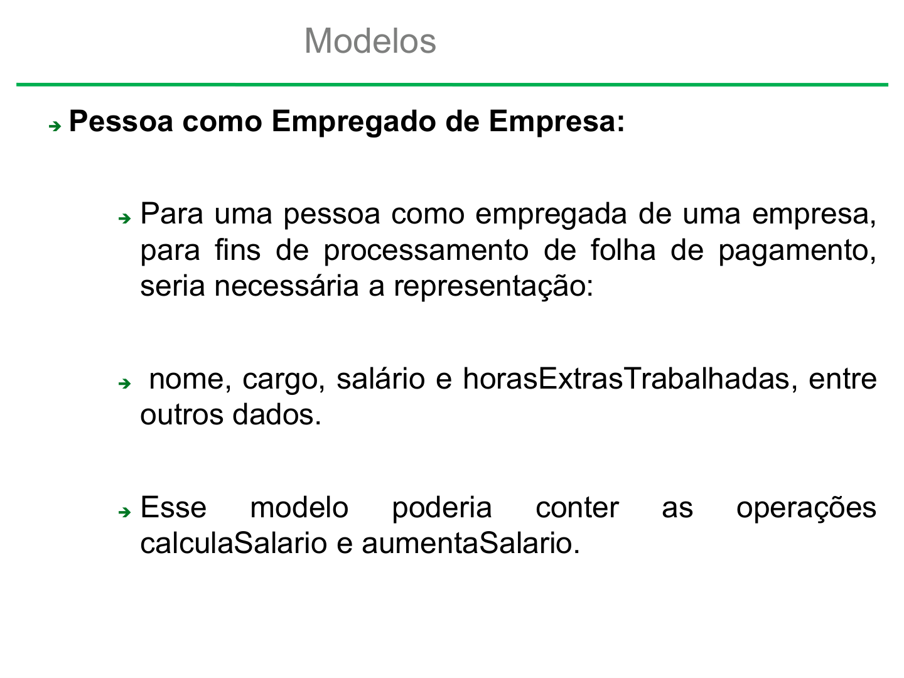

Modelos

➔Pessoa como Empregado de Empresa:

    ➔Para uma pessoa como empregada de uma empresa,
      para fins de processamento de folha de pagamento,
       seria necessária a representação:

    ➔nome, cargo, salário e horasExtrasTrabalhadas, entre
       outros dados.

    ➔Esse   modelo   poderia   conter   as   operações
       calculaSalario e aumentaSalario.

## Página 12

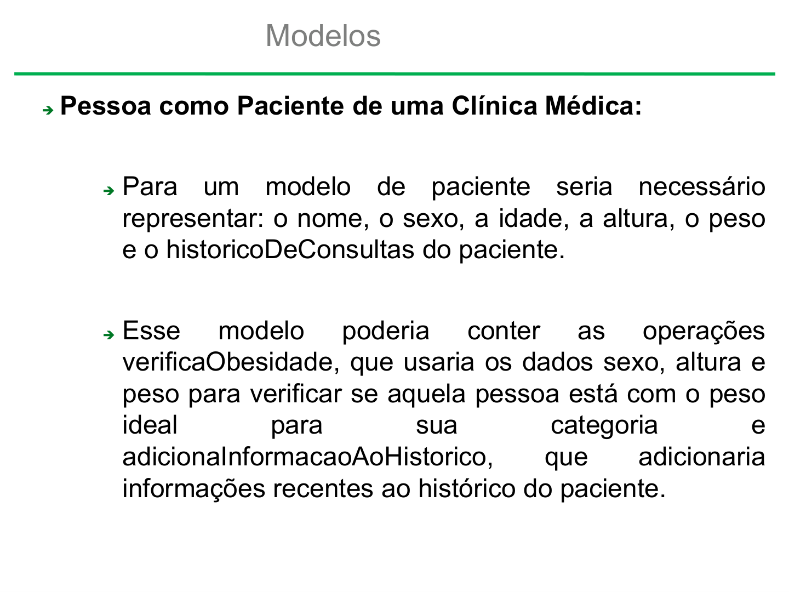

Modelos

➔Pessoa como Paciente de uma Clínica Médica:

    ➔Para um  modelo  de  paciente  seria  necessário
       representar: o nome, o sexo, a idade, a altura, o peso
      e o historicoDeConsultas do paciente.

    ➔Esse   modelo   poderia   conter   as   operações
       verificaObesidade, que usaria os dados sexo, altura e
      peso para verificar se aquela pessoa está com o peso
       ideal       para       sua        categoria      e
      adicionaInformacaoAoHistorico,   que    adicionaria
      informações recentes ao histórico do paciente.

## Página 13

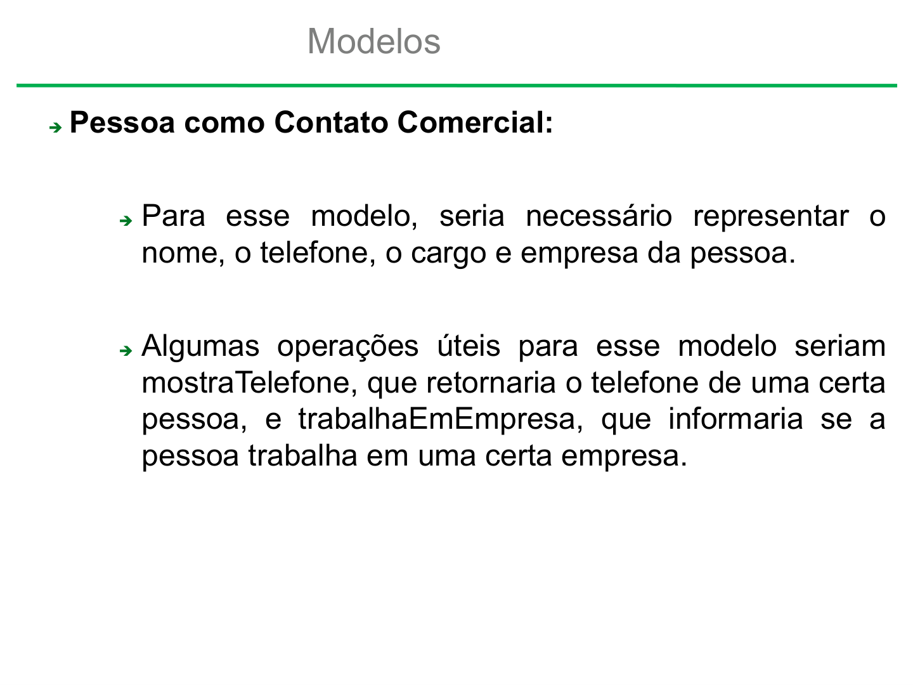

Modelos

➔Pessoa como Contato Comercial:

    ➔Para esse modelo,  seria necessário representar o
      nome, o telefone, o cargo e empresa da pessoa.

    ➔Algumas operações úteis para esse modelo seriam
      mostraTelefone, que retornaria o telefone de uma certa
      pessoa, e trabalhaEmEmpresa, que informaria se a
      pessoa trabalha em uma certa empresa.

## Página 14

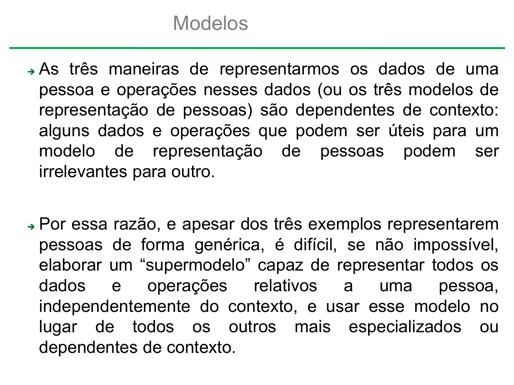

Modelos

➔As três maneiras de representarmos os dados de uma
 pessoa e operações nesses dados (ou os três modelos de
 representação de pessoas) são dependentes de contexto:
 alguns dados e operações que podem ser úteis para um
 modelo  de  representação  de  pessoas  podem  ser
  irrelevantes para outro.

➔Por essa razão, e apesar dos três exemplos representarem
 pessoas de forma genérica, é  difícil, se não impossível,
 elaborar um “supermodelo” capaz de representar todos os
 dados   e   operações    relativos   a  uma   pessoa,
 independentemente do contexto, e usar esse modelo no
  lugar  de  todos  os  outros  mais  especializados  ou
 dependentes de contexto.

## Página 15

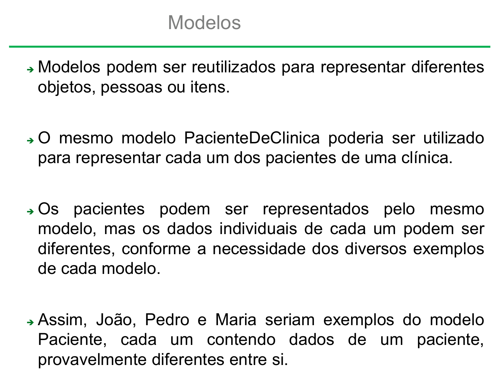

Modelos

➔Modelos podem ser reutilizados para representar diferentes
  objetos, pessoas ou itens.

➔O mesmo modelo PacienteDeClinica poderia ser utilizado
 para representar cada um dos pacientes de uma clínica.

➔Os  pacientes podem  ser  representados  pelo mesmo
 modelo, mas os dados individuais de cada um podem ser
  diferentes, conforme a necessidade dos diversos exemplos
 de cada modelo.

➔Assim, João, Pedro e Maria seriam exemplos do modelo
 Paciente,  cada um  contendo dados de um  paciente,
 provavelmente diferentes entre si.

## Página 16

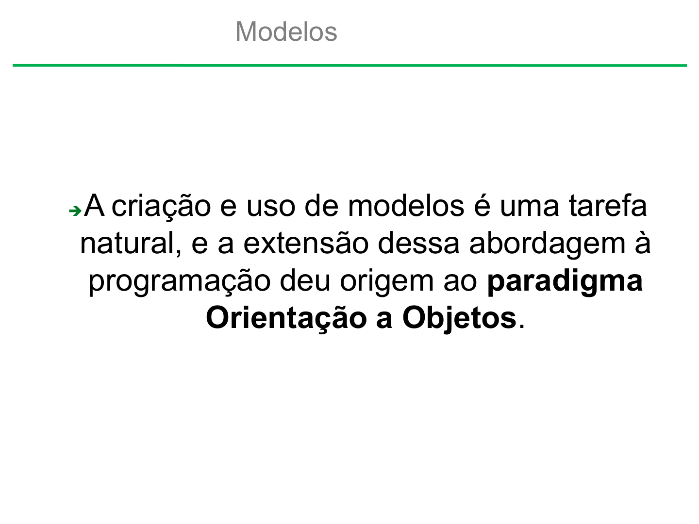

Modelos

➔A criação e uso de modelos é uma tarefa
 natural, e a extensão dessa abordagem à
 programação deu origem ao paradigma
        Orientação a Objetos.

## Página 17

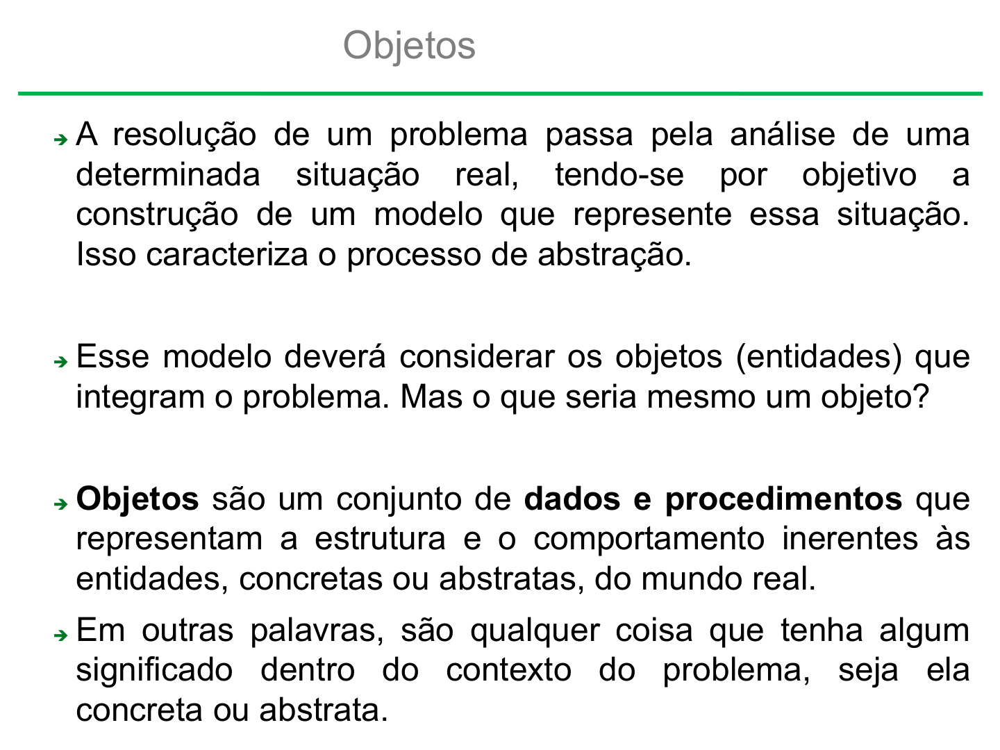

Objetos

➔A resolução de um problema passa pela análise de uma
 determinada  situação   real,  tendo-se  por  objetivo  a
 construção de um modelo que represente essa situação.
 Isso caracteriza o processo de abstração.

➔Esse modelo deverá considerar os objetos (entidades) que
 integram o problema. Mas o que seria mesmo um objeto?

➔Objetos são um conjunto de dados e procedimentos que
 representam a estrutura e o comportamento inerentes às
 entidades, concretas ou abstratas, do mundo real.
➔Em outras palavras, são qualquer coisa que tenha algum
  significado  dentro do  contexto do  problema,  seja  ela
 concreta ou abstrata.

## Página 18

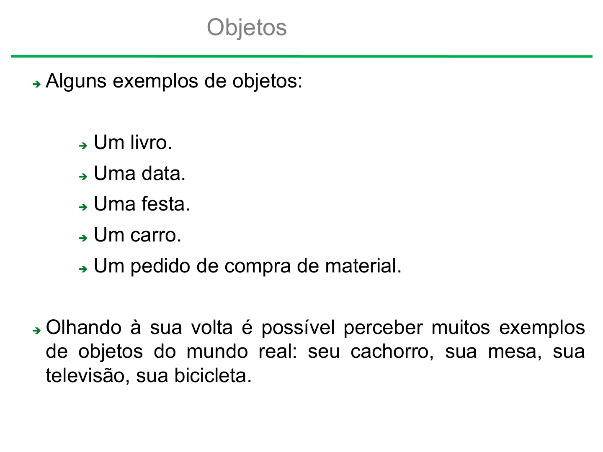

Objetos

➔Alguns exemplos de objetos:

   ➔Um livro.
   ➔Uma data.
   ➔Uma festa.
   ➔Um carro.
   ➔Um pedido de compra de material.

➔Olhando à sua volta é possível perceber muitos exemplos
 de objetos do mundo real: seu cachorro, sua mesa, sua
  televisão, sua bicicleta.

## Página 19

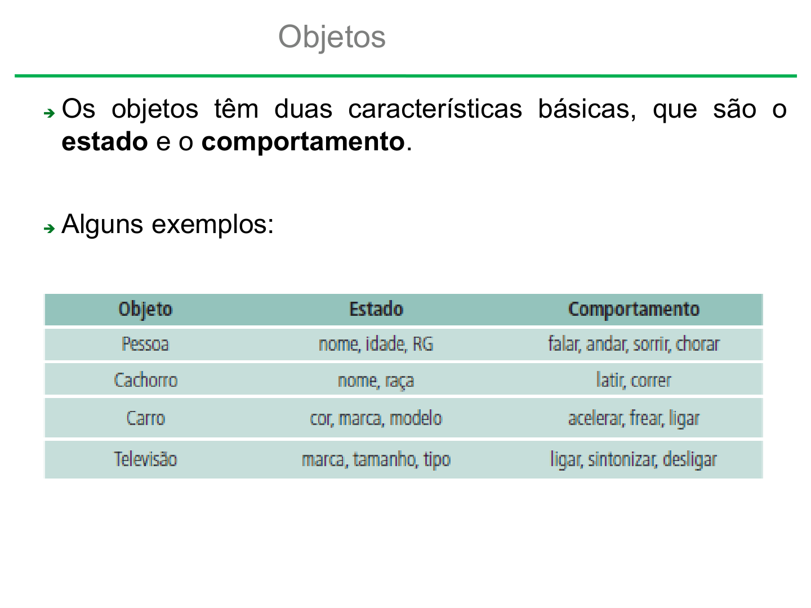

Objetos

➔Os objetos têm duas características básicas, que são o
 estado e o comportamento.

➔Alguns exemplos:

## Página 20

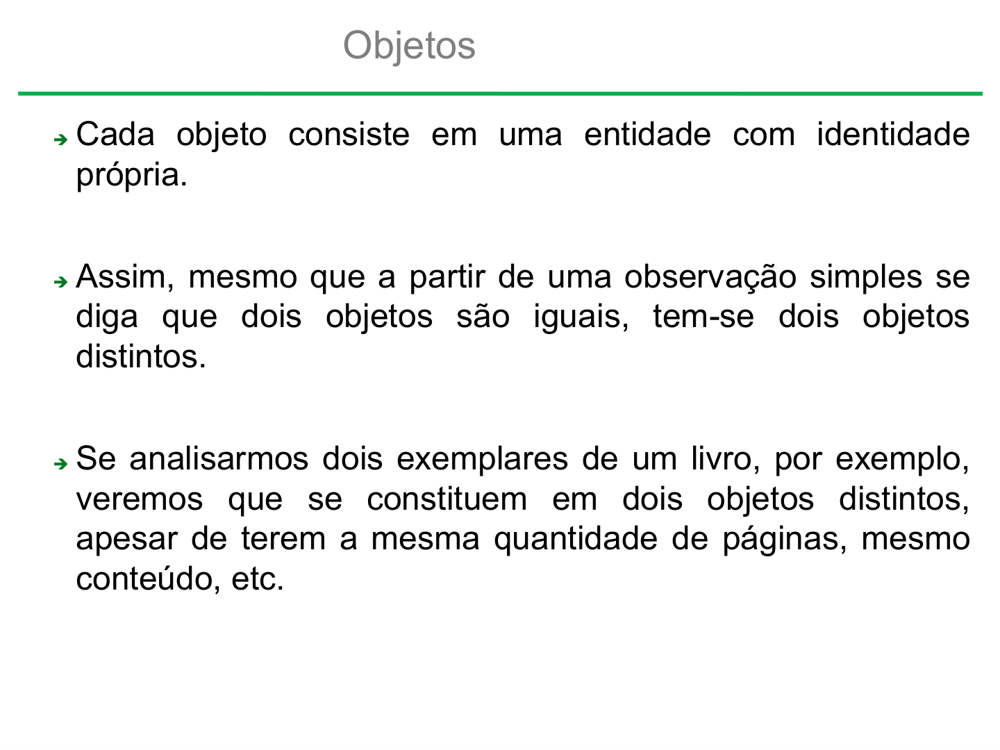

Objetos

➔Cada objeto consiste em uma entidade com identidade
  própria.

➔Assim, mesmo que a partir de uma observação simples se
 diga que  dois  objetos são  iguais, tem-se  dois  objetos
  distintos.

➔Se analisarmos dois exemplares de um livro, por exemplo,
 veremos que se constituem em  dois  objetos  distintos,
 apesar de terem a mesma quantidade de páginas, mesmo
 conteúdo, etc.

## Página 21

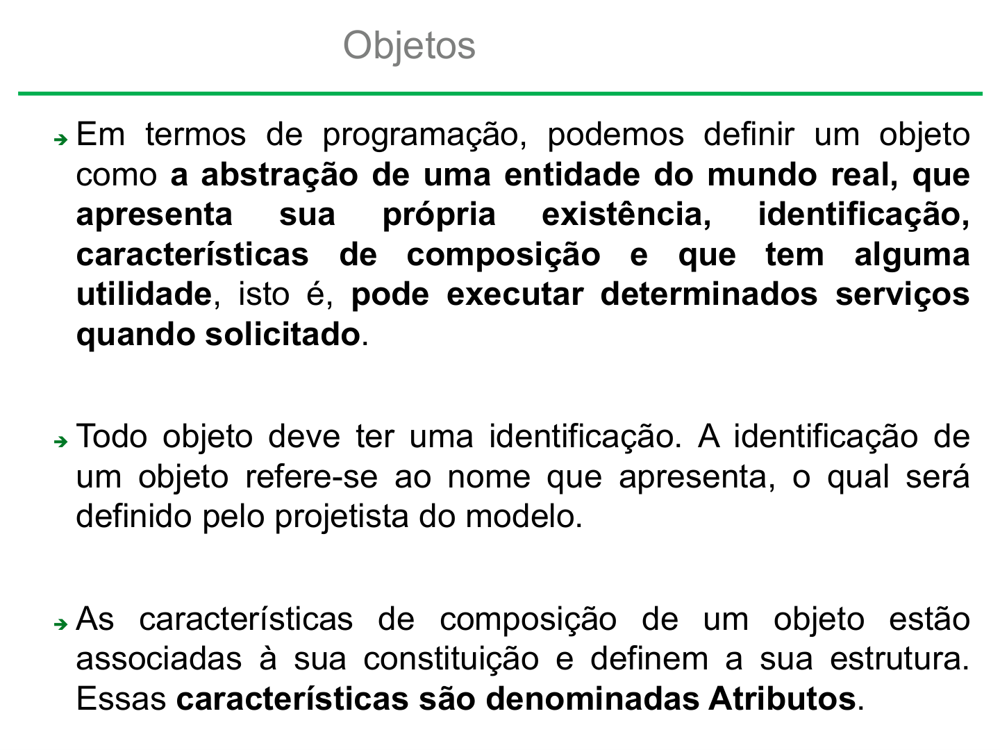

Objetos

➔Em termos de programação, podemos definir um objeto
 como a abstração de uma entidade do mundo real, que
 apresenta  sua   própria   existência,   identificação,
 características de composição  e que tem alguma
  utilidade, isto é, pode executar determinados serviços
 quando solicitado.

➔Todo objeto deve ter uma identificação. A identificação de
 um objeto refere-se ao nome que apresenta, o qual será
  definido pelo projetista do modelo.

➔As  características de composição de um  objeto estão
 associadas à sua constituição e definem a sua estrutura.
 Essas características são denominadas Atributos.

## Página 22

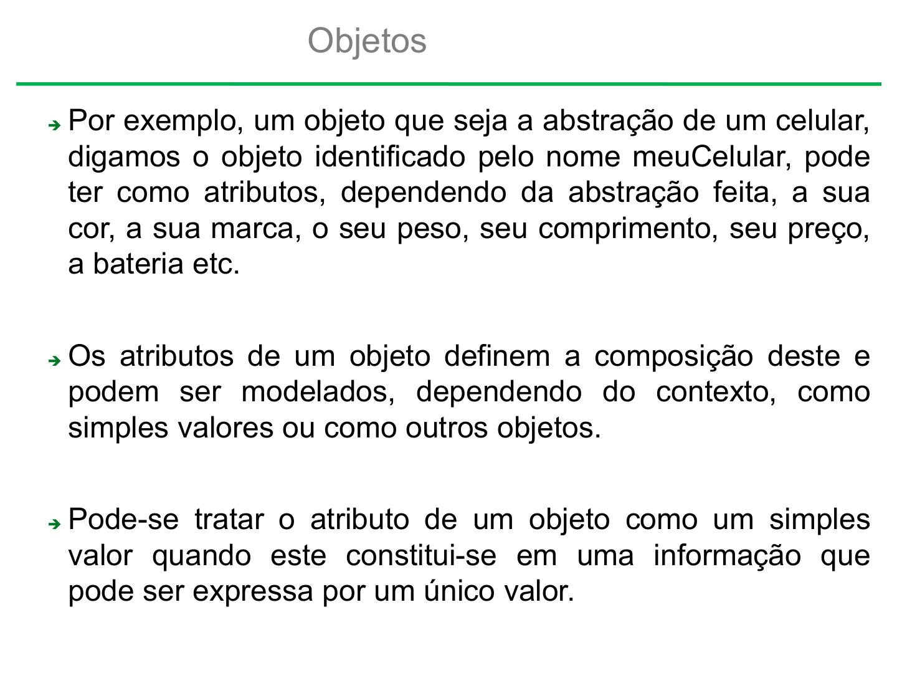

Objetos

➔Por exemplo, um objeto que seja a abstração de um celular,
 digamos o objeto identificado pelo nome meuCelular, pode
  ter como atributos, dependendo da abstração feita, a sua
  cor, a sua marca, o seu peso, seu comprimento, seu preço,
 a bateria etc.

➔Os atributos de um objeto definem a composição deste e
 podem ser modelados, dependendo do  contexto, como
 simples valores ou como outros objetos.

➔Pode-se tratar o atributo de um objeto como um simples
  valor quando este  constitui-se em uma informação que
 pode ser expressa por um único valor.

## Página 23

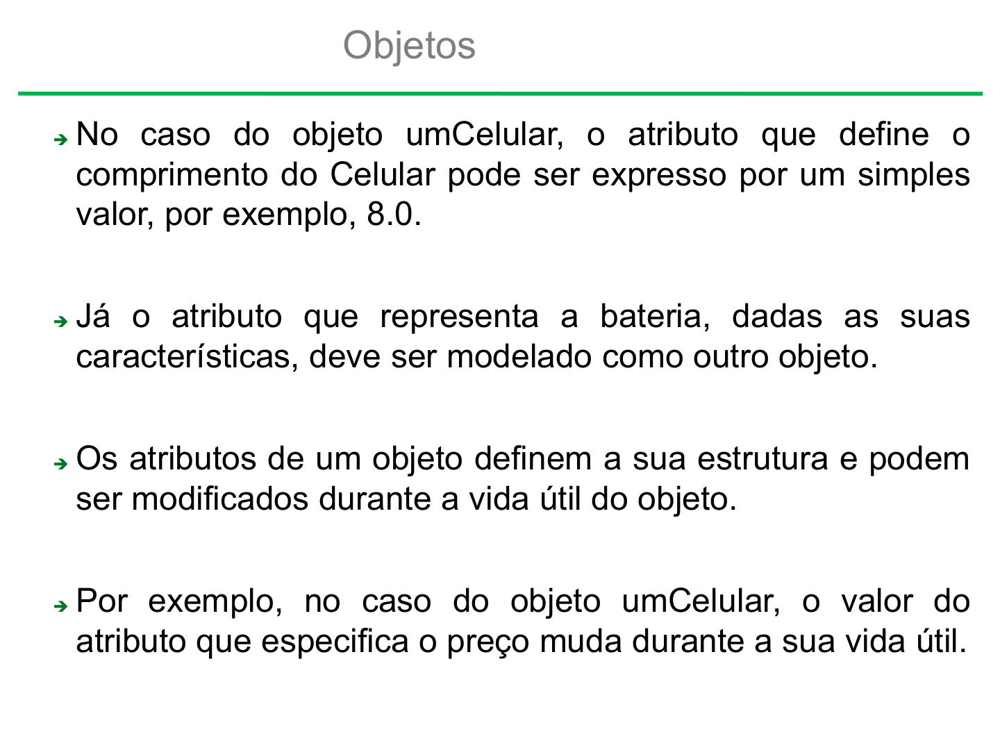

Objetos

➔No caso do objeto umCelular, o  atributo que define o
 comprimento do Celular pode ser expresso por um simples
  valor, por exemplo, 8.0.

➔Já o  atributo que representa a  bateria, dadas as suas
  características, deve ser modelado como outro objeto.

➔Os atributos de um objeto definem a sua estrutura e podem
 ser modificados durante a vida útil do objeto.

➔Por exemplo, no caso do objeto umCelular, o valor do
  atributo que especifica o preço muda durante a sua vida útil.

## Página 24

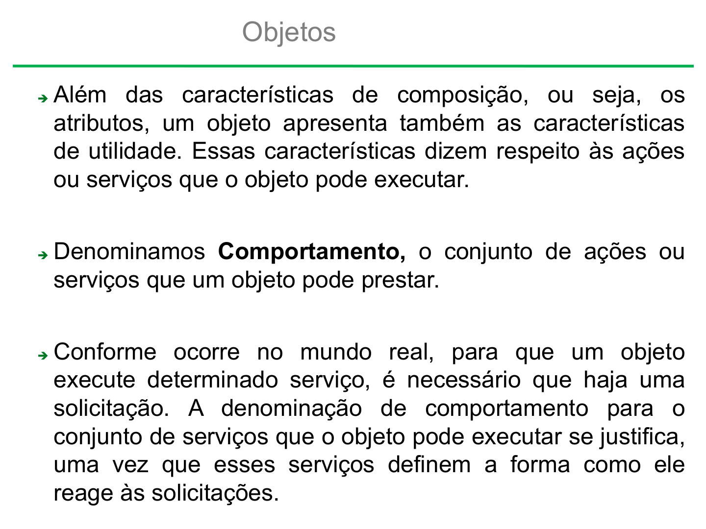

Objetos

➔Além das  características de  composição, ou  seja, os
  atributos, um objeto apresenta também as características
 de utilidade. Essas características dizem respeito às ações
 ou serviços que o objeto pode executar.

➔Denominamos Comportamento, o conjunto de ações ou
 serviços que um objeto pode prestar.

➔Conforme  ocorre no mundo  real, para que um  objeto
 execute determinado serviço, é necessário que haja uma
  solicitação. A denominação de comportamento  para o
 conjunto de serviços que o objeto pode executar se justifica,
 uma vez que esses serviços definem a forma como ele
 reage às solicitações.

## Página 25

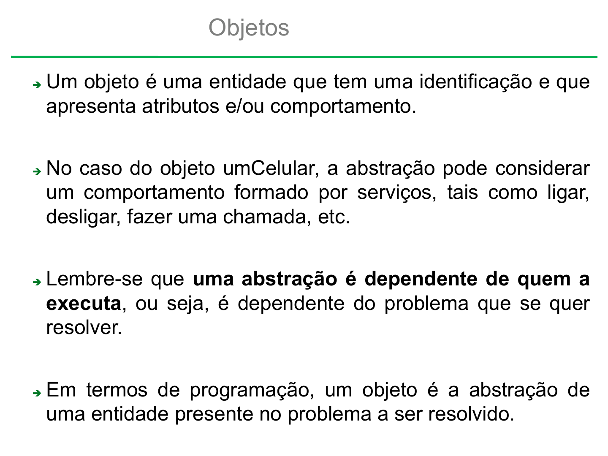

Objetos

➔Um objeto é uma entidade que tem uma identificação e que
 apresenta atributos e/ou comportamento.

➔No caso do objeto umCelular, a abstração pode considerar
 um comportamento formado por serviços, tais como ligar,
  desligar, fazer uma chamada, etc.

➔Lembre-se que uma abstração é dependente de quem a
 executa, ou seja, é dependente do problema que se quer
  resolver.

➔Em termos de programação, um objeto é a abstração de
 uma entidade presente no problema a ser resolvido.

## Página 26

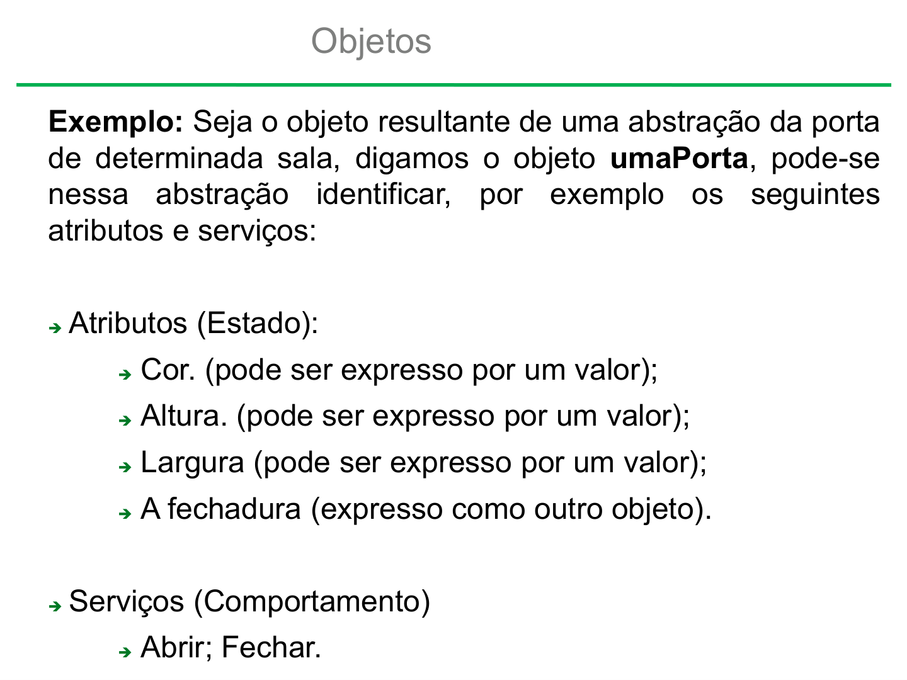

Objetos

Exemplo: Seja o objeto resultante de uma abstração da porta
de determinada sala, digamos o objeto umaPorta, pode-se
nessa  abstração  identificar,  por  exemplo  os  seguintes
atributos e serviços:

➔Atributos (Estado):
    ➔Cor. (pode ser expresso por um valor);
     ➔Altura. (pode ser expresso por um valor);
    ➔Largura (pode ser expresso por um valor);
   ➔A fechadura (expresso como outro objeto).

➔Serviços (Comportamento)
     ➔Abrir; Fechar.

## Página 27

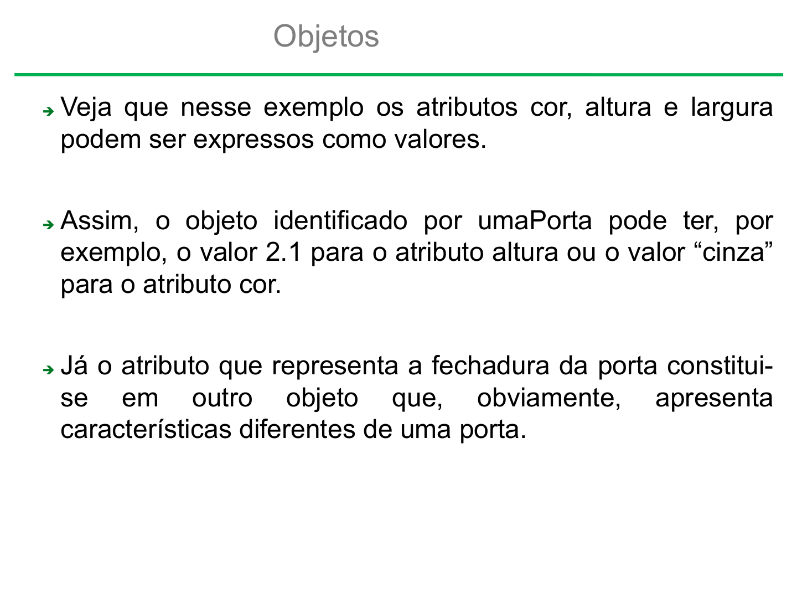

Objetos

➔Veja que nesse exemplo os atributos cor, altura e largura
 podem ser expressos como valores.

➔Assim, o objeto identificado por umaPorta pode  ter, por
 exemplo, o valor 2.1 para o atributo altura ou o valor “cinza”
 para o atributo cor.

➔Já o atributo que representa a fechadura da porta constitui-
 se  em   outro   objeto   que,   obviamente,   apresenta
  características diferentes de uma porta.

## Página 28

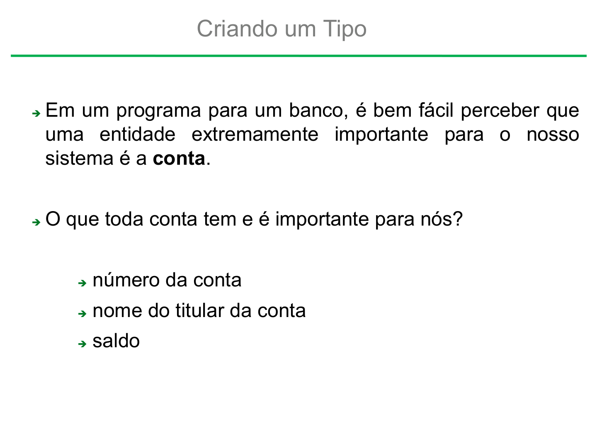

Criando um Tipo

➔Em um programa para um banco, é bem fácil perceber que
 uma  entidade extremamente  importante  para o nosso
 sistema é a conta.

➔O que toda conta tem e é importante para nós?

    ➔número da conta
    ➔nome do titular da conta
    ➔saldo

## Página 29

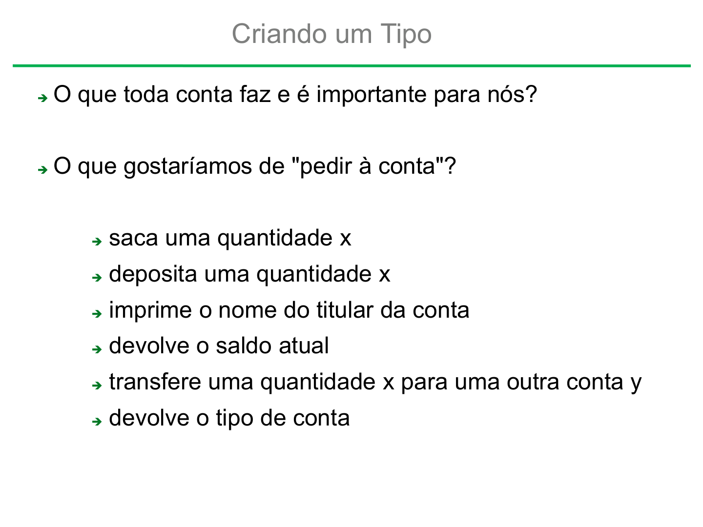

Criando um Tipo

➔O que toda conta faz e é importante para nós?

➔O que gostaríamos de "pedir à conta"?

    ➔saca uma quantidade x
     ➔deposita uma quantidade x
    ➔imprime o nome do titular da conta
    ➔devolve o saldo atual
     ➔transfere uma quantidade x para uma outra conta y
    ➔devolve o tipo de conta

## Página 30

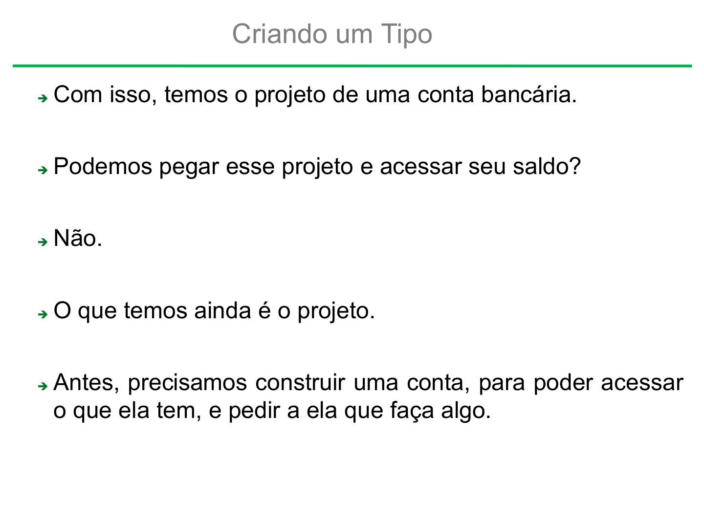

Criando um Tipo

➔Com isso, temos o projeto de uma conta bancária.

➔Podemos pegar esse projeto e acessar seu saldo?

➔Não.

➔O que temos ainda é o projeto.

➔Antes, precisamos construir uma conta, para poder acessar
 o que ela tem, e pedir a ela que faça algo.

## Página 31

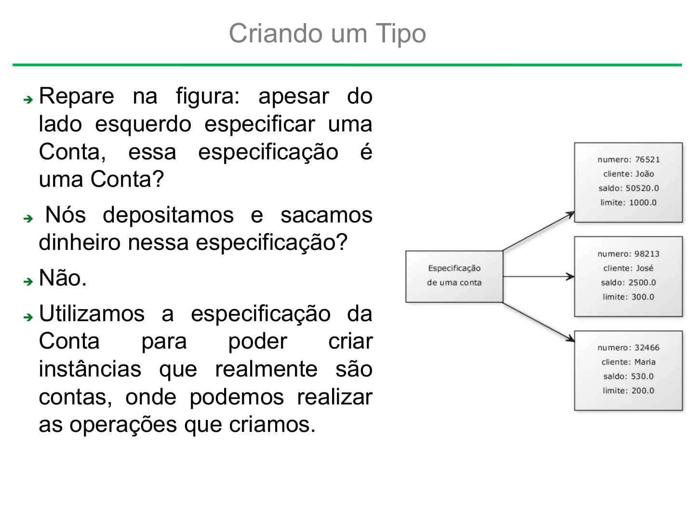

Criando um Tipo

➔Repare na  figura:  apesar do
 lado esquerdo especificar uma
 Conta,  essa  especificação  é
 uma Conta?
➔Nós depositamos e sacamos
  dinheiro nessa especificação?
➔Não.
➔Utilizamos a  especificação da
 Conta    para   poder     criar
  instâncias que  realmente são
 contas, onde podemos realizar
 as operações que criamos.

## Página 32

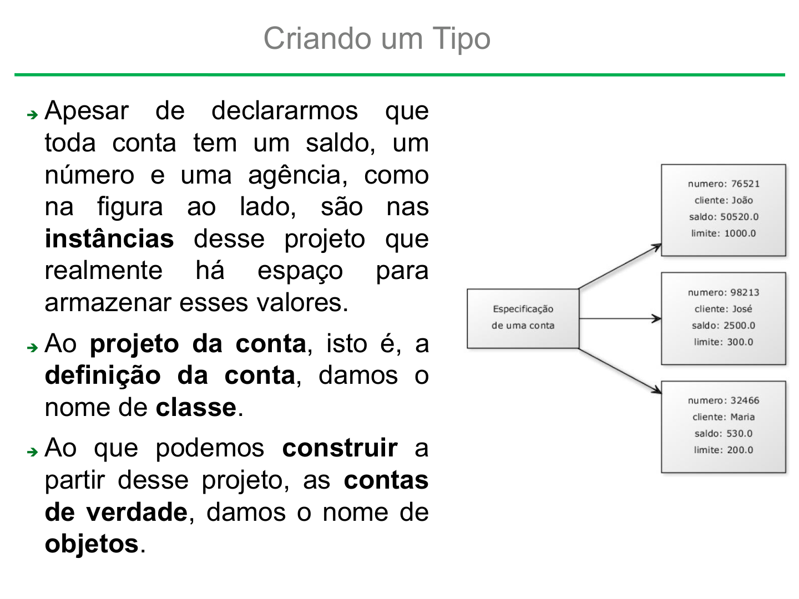

Criando um Tipo

➔Apesar  de  declararmos  que
 toda conta tem um saldo, um
 número e uma agência, como
 na  figura  ao  lado,  são  nas
 instâncias desse  projeto que
 realmente  há  espaço  para
 armazenar esses valores.
➔Ao projeto da conta, isto é, a
 definição da conta, damos o
 nome de classe.
➔Ao que podemos construir a
  partir desse projeto, as contas
 de verdade, damos o nome de
 objetos.

## Página 33

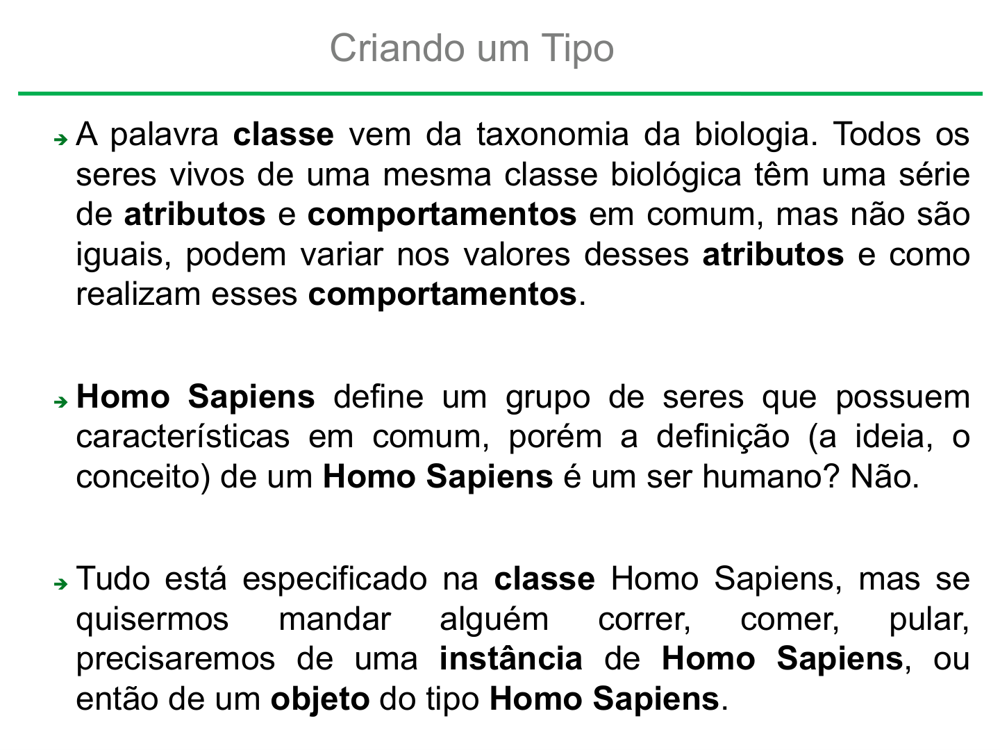

Criando um Tipo

➔A palavra classe vem da taxonomia da biologia. Todos os
 seres vivos de uma mesma classe biológica têm uma série
 de atributos e comportamentos em comum, mas não são
  iguais, podem variar nos valores desses atributos e como
 realizam esses comportamentos.

➔Homo Sapiens define um grupo de seres que possuem
  características em comum, porém a definição (a ideia, o
  conceito) de um Homo Sapiens é um ser humano? Não.

➔Tudo está especificado na classe Homo Sapiens, mas se
 quisermos   mandar   alguém    correr,   comer,    pular,
 precisaremos de uma instância de Homo Sapiens, ou
 então de um objeto do tipo Homo Sapiens.

## Página 34

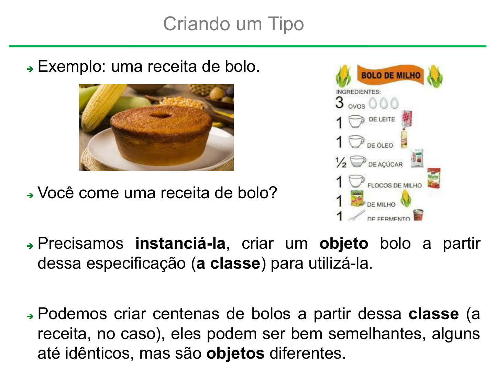

Criando um Tipo

➔Exemplo: uma receita de bolo.

➔Você come uma receita de bolo?

➔Precisamos  instanciá-la,  criar um objeto bolo a  partir
 dessa especificação (a classe) para utilizá-la.

➔Podemos criar centenas de bolos a partir dessa classe (a
  receita, no caso), eles podem ser bem semelhantes, alguns
 até idênticos, mas são objetos diferentes.

## Página 35

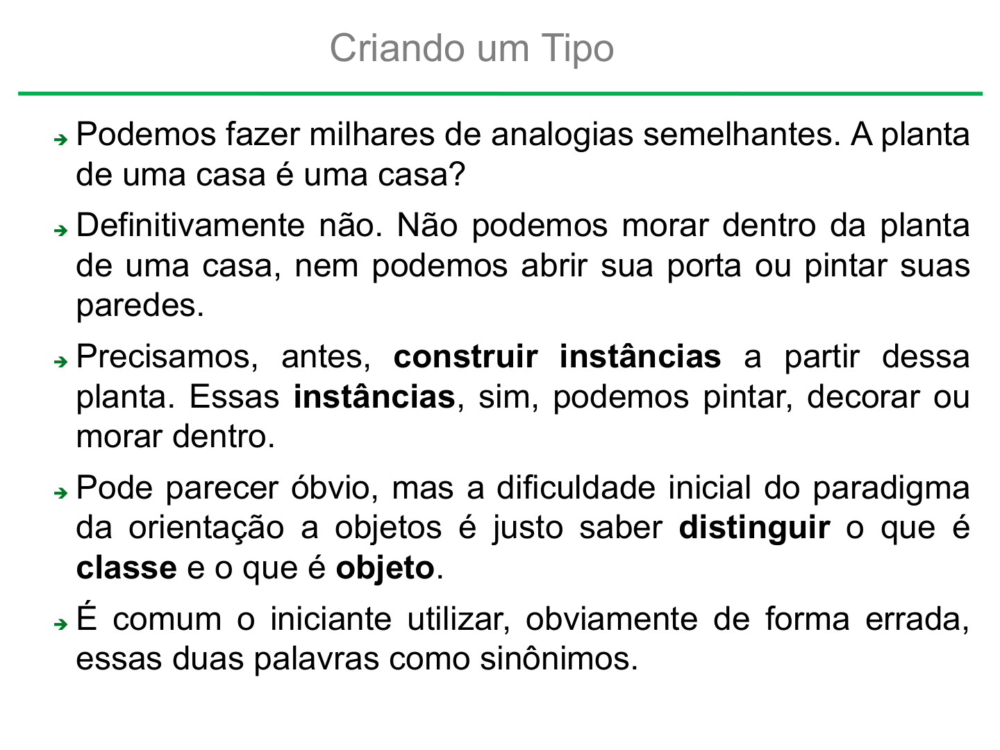

Criando um Tipo

➔Podemos fazer milhares de analogias semelhantes. A planta
 de uma casa é uma casa?
➔Definitivamente não. Não podemos morar dentro da planta
 de uma casa, nem podemos abrir sua porta ou pintar suas
 paredes.
➔Precisamos, antes, construir instâncias a  partir dessa
  planta. Essas instâncias, sim, podemos pintar, decorar ou
 morar dentro.
➔Pode parecer óbvio, mas a dificuldade inicial do paradigma
 da orientação a objetos é justo saber distinguir o que é
 classe e o que é objeto.
➔É comum o iniciante utilizar, obviamente de forma errada,
 essas duas palavras como sinônimos.

## Página 36

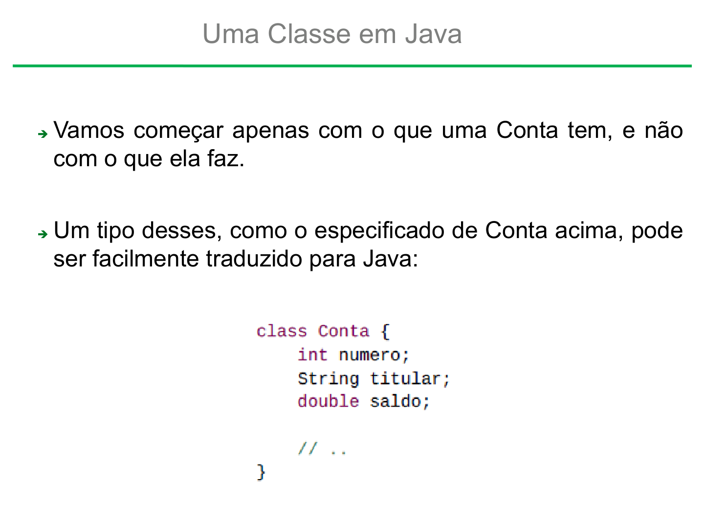

Uma Classe em Java

➔Vamos começar apenas com o que uma Conta tem, e não
 com o que ela faz.

➔Um tipo desses, como o especificado de Conta acima, pode
 ser facilmente traduzido para Java:

## Página 37

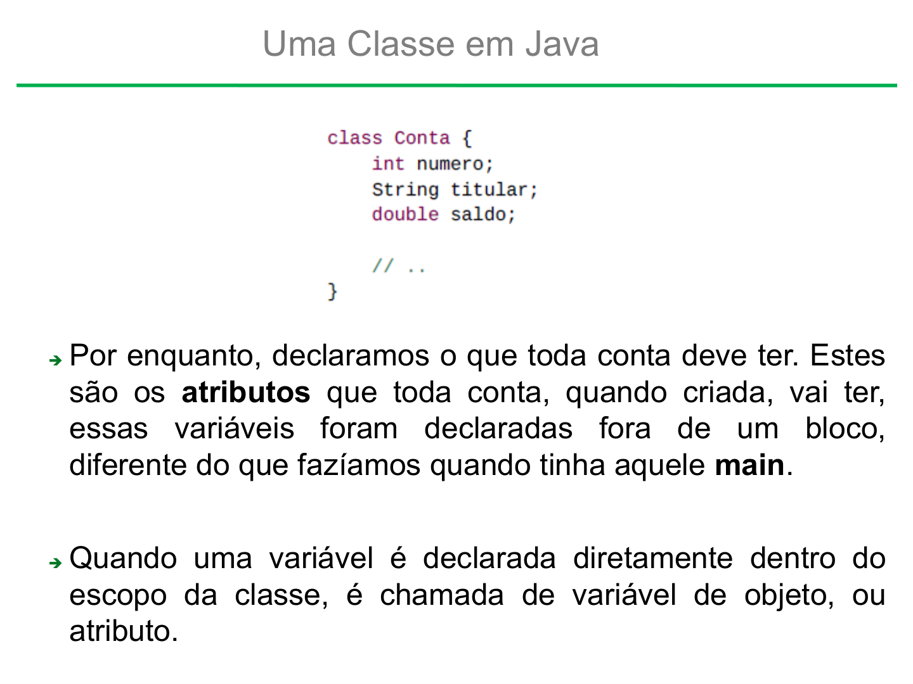

Uma Classe em Java

➔Por enquanto, declaramos o que toda conta deve ter. Estes
 são os atributos que toda conta, quando criada, vai ter,
 essas  variáveis  foram  declaradas  fora  de um  bloco,
  diferente do que fazíamos quando tinha aquele main.

➔Quando uma variável é declarada diretamente dentro do
 escopo da classe, é chamada de variável de objeto, ou
  atributo.

## Página 38

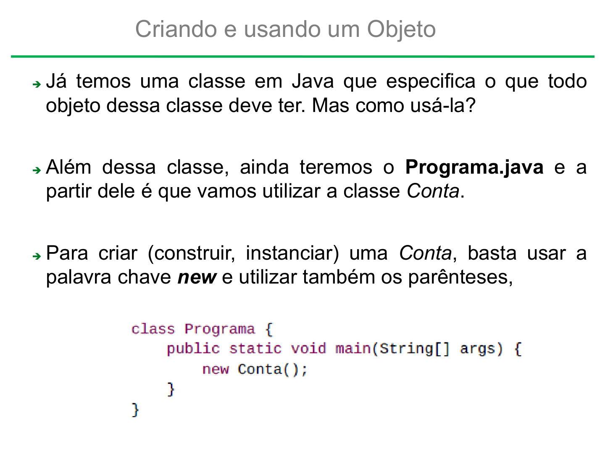

Criando e usando um Objeto

➔Já temos uma classe em Java que especifica o que todo
 objeto dessa classe deve ter. Mas como usá-la?

➔Além dessa classe, ainda teremos o Programa.java e a
  partir dele é que vamos utilizar a classe Conta.

➔Para criar (construir, instanciar) uma Conta, basta usar a
 palavra chave new e utilizar também os parênteses,

## Página 39

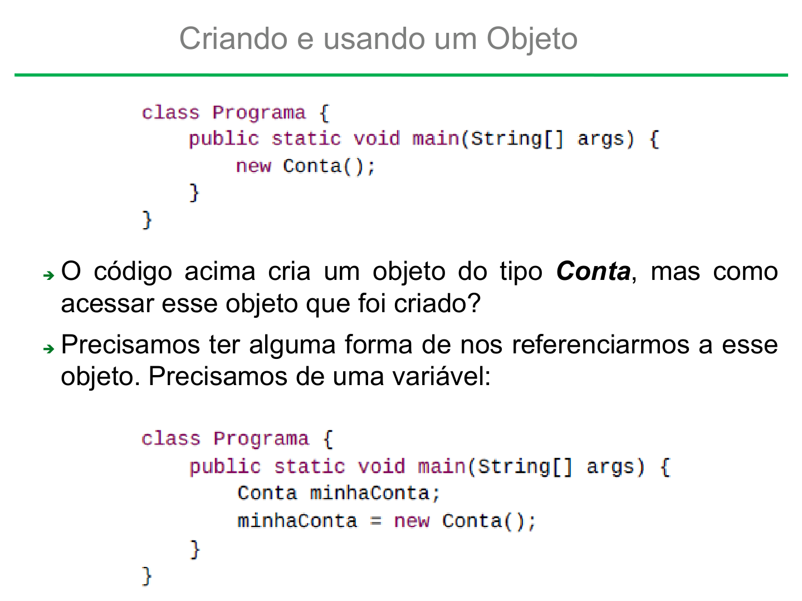

Criando e usando um Objeto

➔O código acima cria um objeto do tipo Conta, mas como
 acessar esse objeto que foi criado?
➔Precisamos ter alguma forma de nos referenciarmos a esse
  objeto. Precisamos de uma variável:

## Página 40

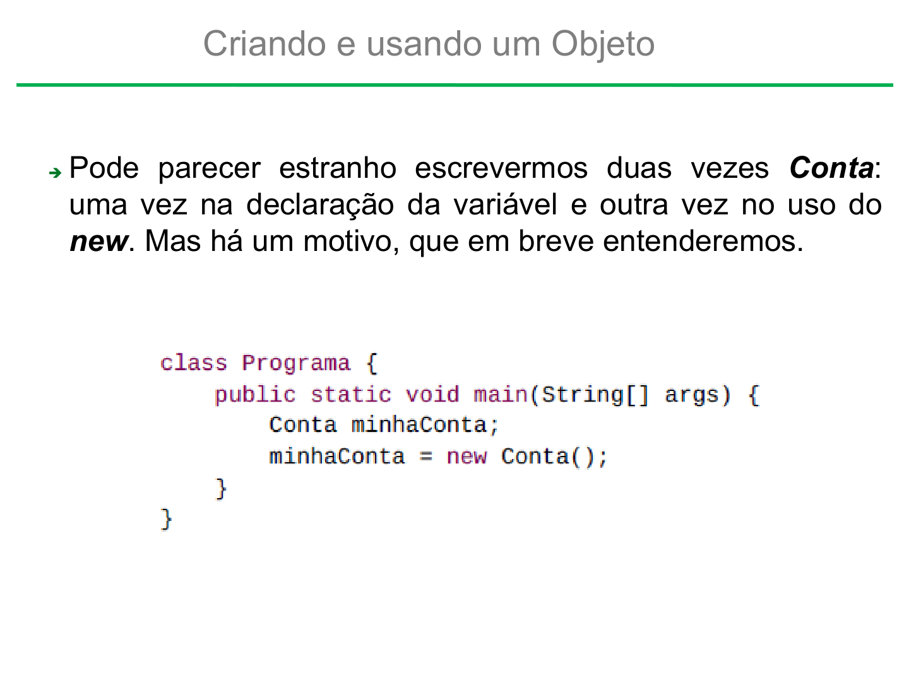

Criando e usando um Objeto

➔Pode parecer estranho escrevermos duas vezes Conta:
 uma vez na declaração da variável e outra vez no uso do
 new. Mas há um motivo, que em breve entenderemos.

## Página 41

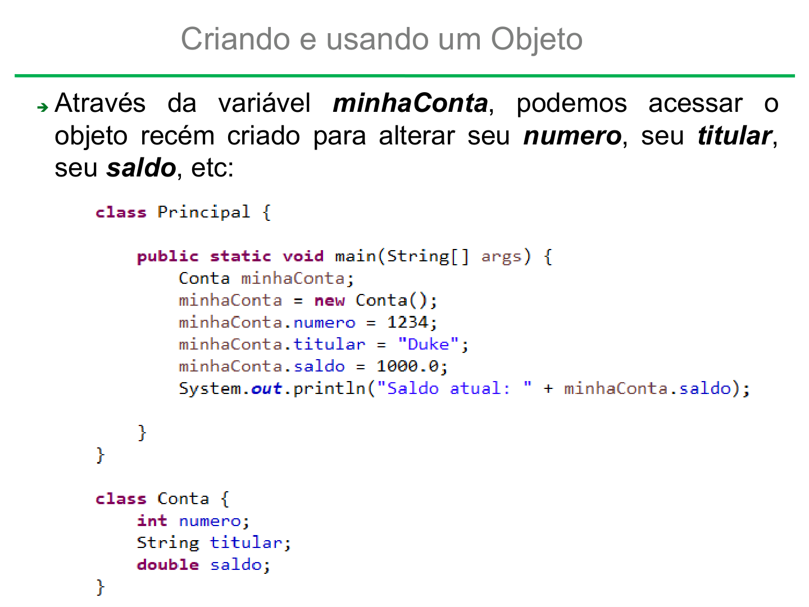

Criando e usando um Objeto

➔Através da  variável minhaConta, podemos  acessar o
 objeto recém criado para alterar seu numero, seu titular,
 seu saldo, etc:

## Página 42

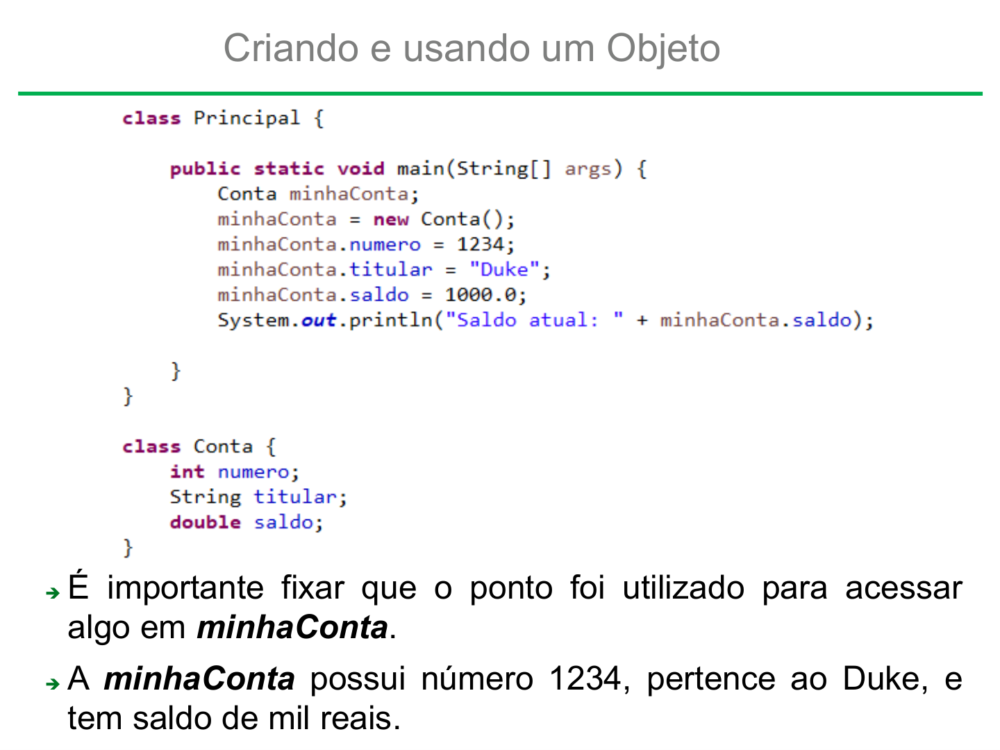

Criando e usando um Objeto

➔É importante fixar que o ponto foi utilizado para acessar
 algo em minhaConta.
➔A minhaConta possui número 1234, pertence ao Duke, e
 tem saldo de mil reais.

## Página 43

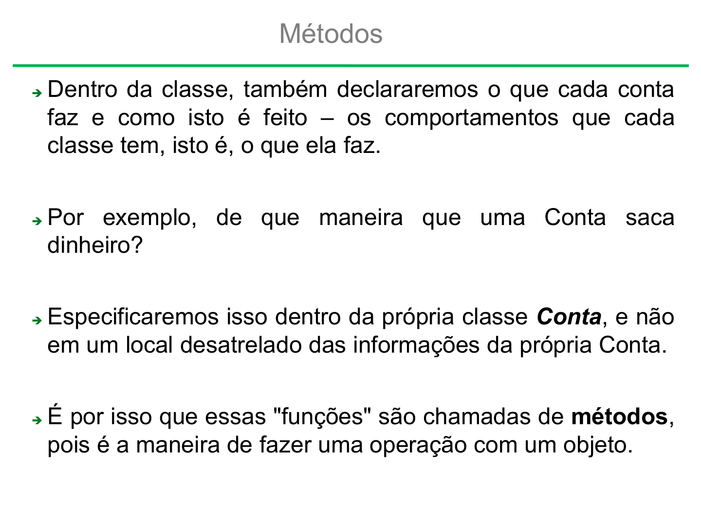

Métodos

➔Dentro da classe, também declararemos o que cada conta
  faz e como isto é feito – os comportamentos que cada
 classe tem, isto é, o que ela faz.

➔Por  exemplo, de que  maneira que uma  Conta  saca
 dinheiro?

➔Especificaremos isso dentro da própria classe Conta, e não
 em um local desatrelado das informações da própria Conta.

➔É por isso que essas "funções" são chamadas de métodos,
 pois é a maneira de fazer uma operação com um objeto.

## Página 44

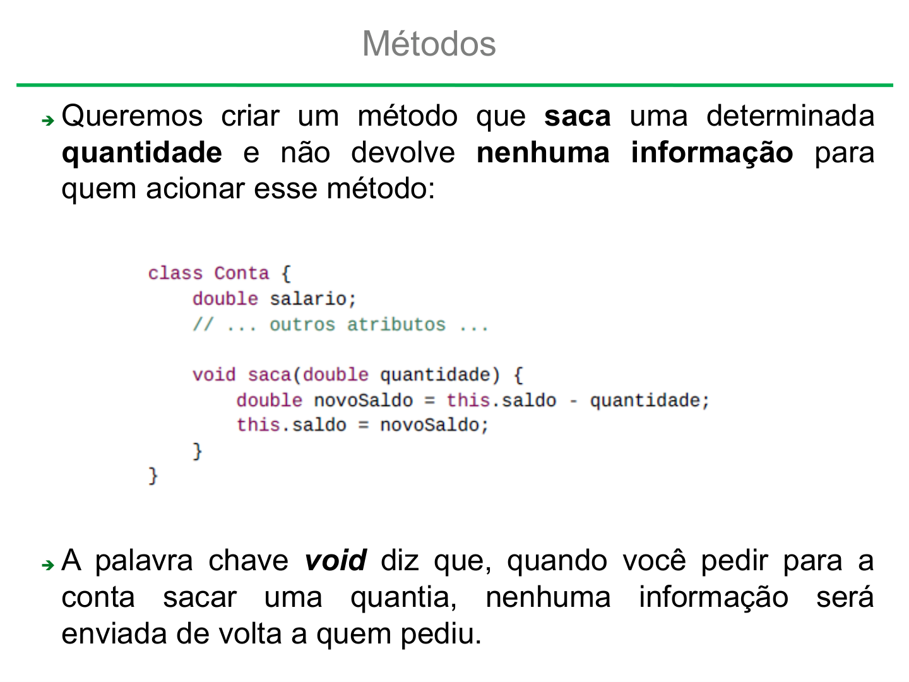

Métodos

➔Queremos criar um método que saca uma determinada
 quantidade e não devolve nenhuma informação para
 quem acionar esse método:

➔A palavra chave void diz que, quando você pedir para a
 conta  sacar uma  quantia,  nenhuma  informação  será
 enviada de volta a quem pediu.

## Página 45

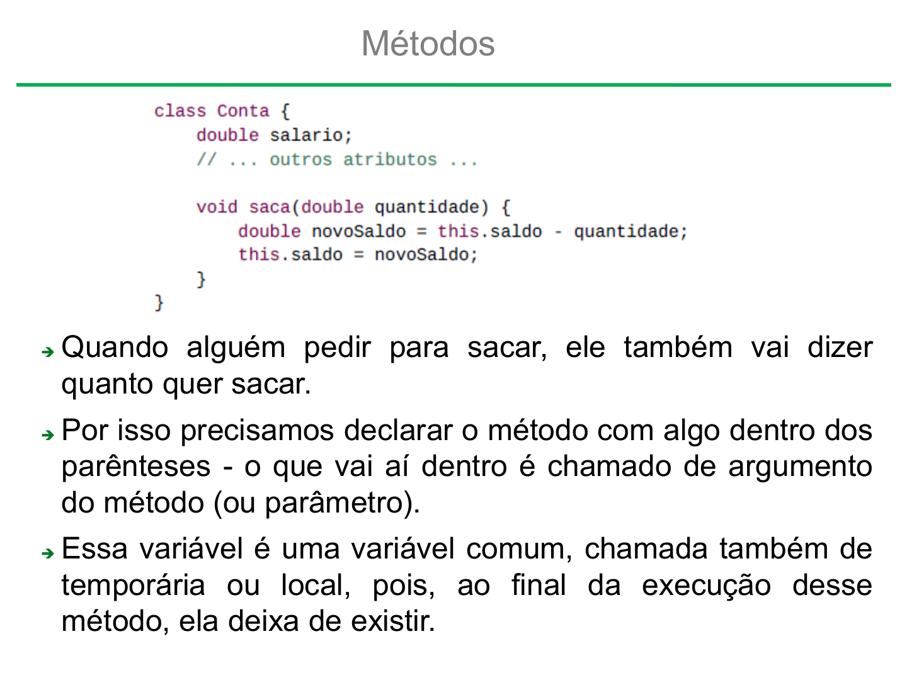

Métodos

➔Quando alguém pedir para sacar, ele também vai dizer
 quanto quer sacar.
➔Por isso precisamos declarar o método com algo dentro dos
 parênteses - o que vai aí dentro é chamado de argumento
 do método (ou parâmetro).
➔Essa variável é uma variável comum, chamada também de
 temporária ou  local,  pois, ao  final da execução desse
 método, ela deixa de existir.

## Página 46

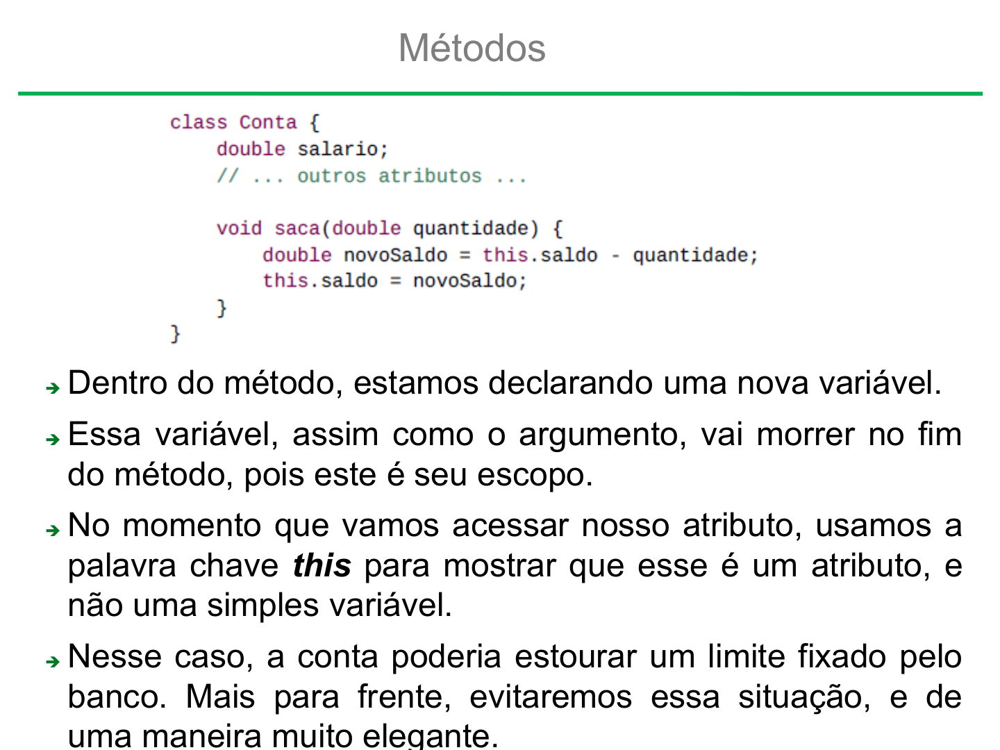

Métodos

➔Dentro do método, estamos declarando uma nova variável.
➔Essa variável, assim como o argumento, vai morrer no fim
 do método, pois este é seu escopo.
➔No momento que vamos acessar nosso atributo, usamos a
 palavra chave this para mostrar que esse é um atributo, e
 não uma simples variável.
➔Nesse caso, a conta poderia estourar um limite fixado pelo
 banco. Mais para frente, evitaremos essa situação, e de
 uma maneira muito elegante.

## Página 47

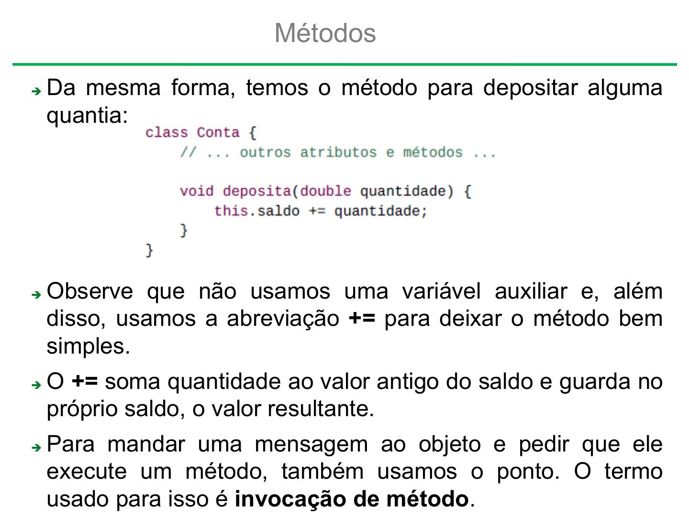

Métodos

➔Da mesma forma, temos o método para depositar alguma
  quantia:

➔Observe que não usamos uma variável auxiliar e, além
  disso, usamos a abreviação += para deixar o método bem
 simples.
➔O += soma quantidade ao valor antigo do saldo e guarda no
  próprio saldo, o valor resultante.
➔Para mandar uma mensagem ao objeto e pedir que ele
 execute um método, também usamos o ponto. O termo
 usado para isso é invocação de método.

## Página 48

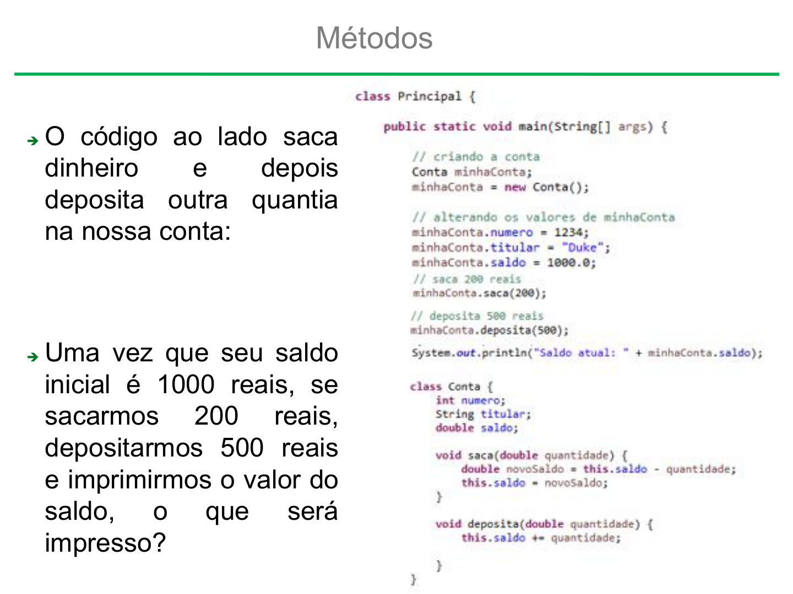

Métodos

➔O código ao lado saca
  dinheiro    e    depois
 deposita  outra  quantia
 na nossa conta:

➔Uma vez que seu saldo
  inicial é 1000 reais, se
 sacarmos  200   reais,
 depositarmos 500 reais
 e imprimirmos o valor do
  saldo,   o   que   será
 impresso?

## Página 49

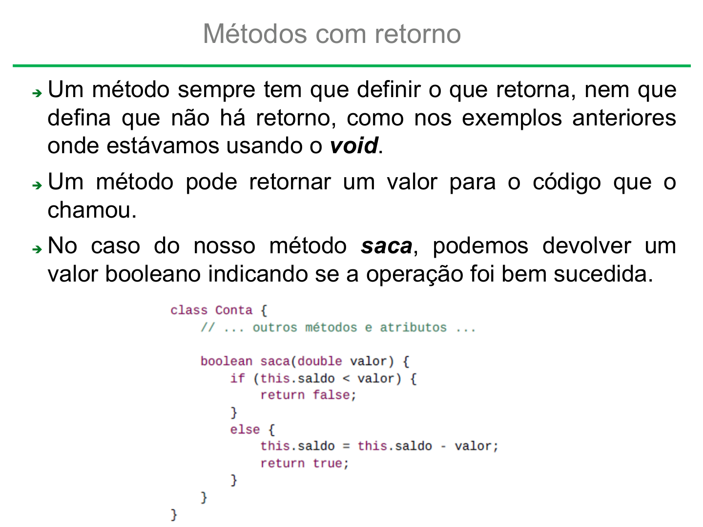

Métodos com retorno

➔Um método sempre tem que definir o que retorna, nem que
 defina que não há retorno, como nos exemplos anteriores
 onde estávamos usando o void.
➔Um método pode retornar um valor para o código que o
 chamou.
➔No caso do nosso método saca, podemos devolver um
  valor booleano indicando se a operação foi bem sucedida.

## Página 50

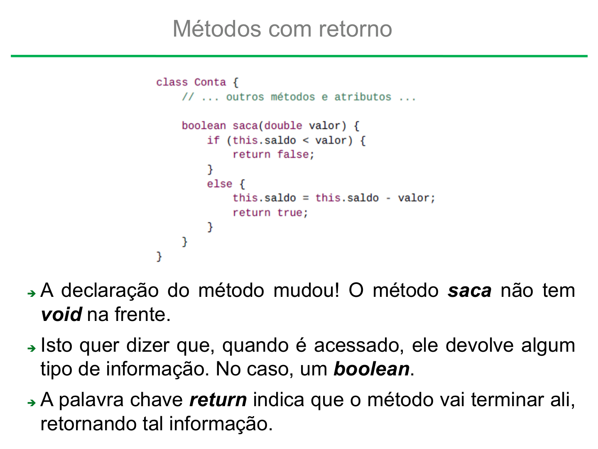

Métodos com retorno

➔A declaração do método mudou! O método saca não tem
 void na frente.
➔Isto quer dizer que, quando é acessado, ele devolve algum
  tipo de informação. No caso, um boolean.
➔A palavra chave return indica que o método vai terminar ali,
 retornando tal informação.

## Página 51

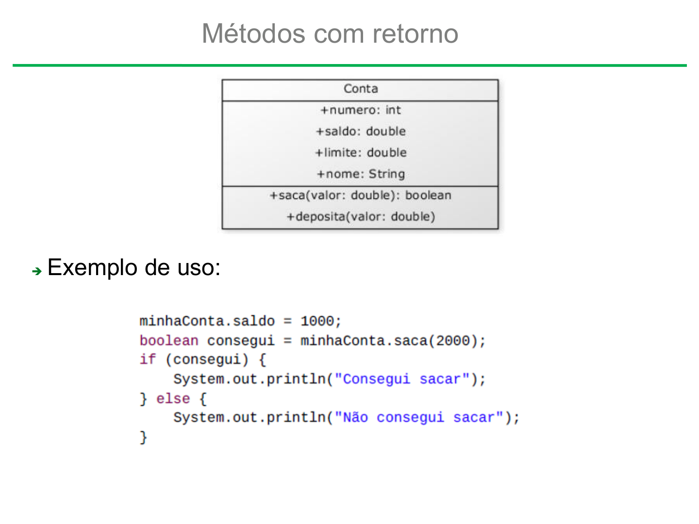

Métodos com retorno

➔Exemplo de uso:

## Página 52

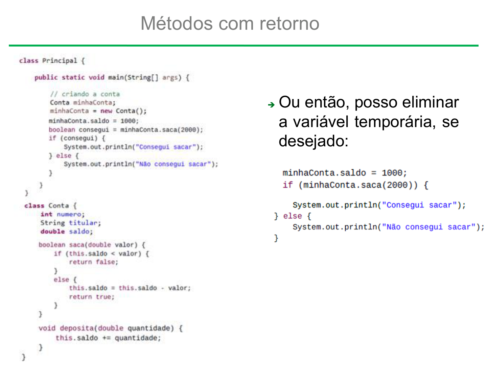

Métodos com retorno

            ➔Ou então, posso eliminar
               a variável temporária, se
                  desejado:

## Página 53

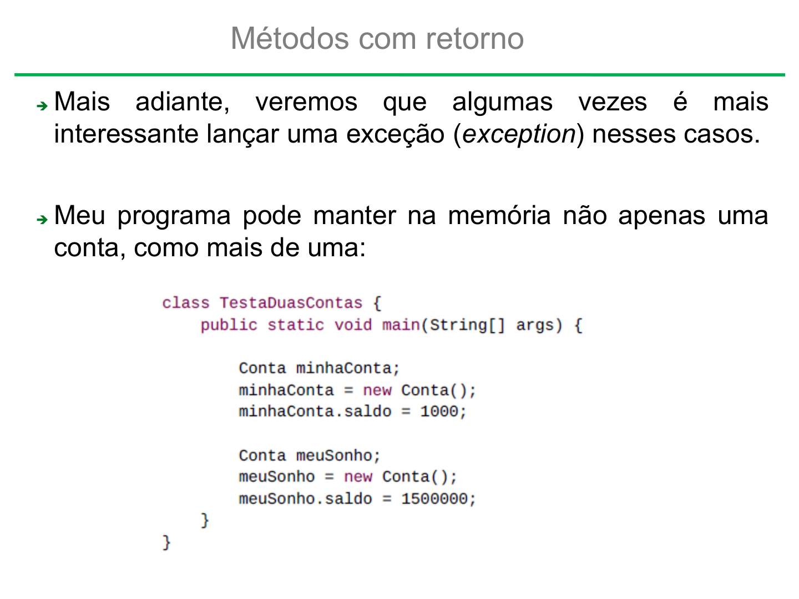

Métodos com retorno

➔Mais  adiante,  veremos  que  algumas  vezes  é  mais
 interessante lançar uma exceção (exception) nesses casos.

➔Meu programa pode manter na memória não apenas uma
 conta, como mais de uma:

## Página 54

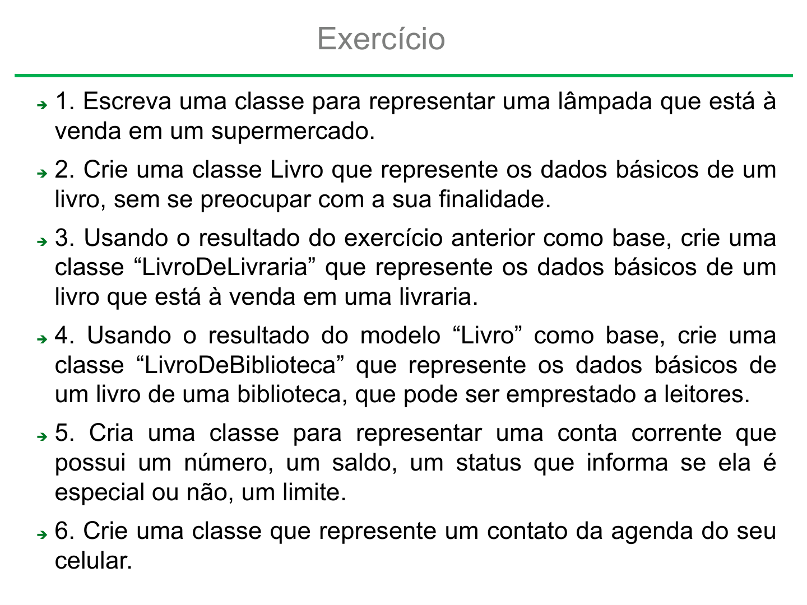

Exercício

➔1. Escreva uma classe para representar uma lâmpada que está à
 venda em um supermercado.
➔2. Crie uma classe Livro que represente os dados básicos de um
  livro, sem se preocupar com a sua finalidade.
➔3. Usando o resultado do exercício anterior como base, crie uma
  classe “LivroDeLivraria” que represente os dados básicos de um
  livro que está à venda em uma livraria.
➔4. Usando o resultado do modelo “Livro” como base, crie uma
  classe “LivroDeBiblioteca” que represente os dados básicos de
 um livro de uma biblioteca, que pode ser emprestado a leitores.
➔5. Cria uma classe para representar uma conta corrente que
  possui um número, um saldo, um status que informa se ela é
  especial ou não, um limite.
➔6. Crie uma classe que represente um contato da agenda do seu
  celular.

## Página 55

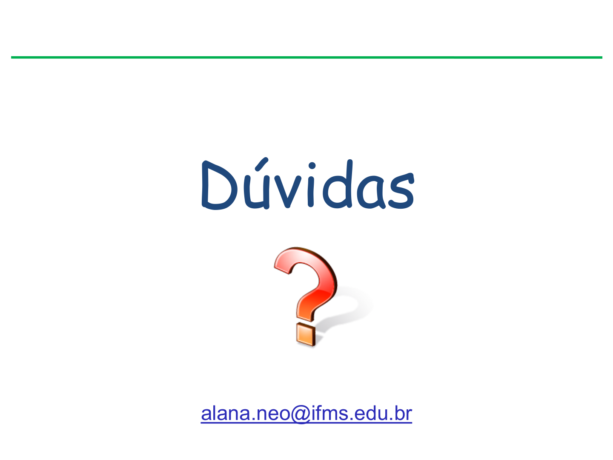

Dúvidas

alana.neo@ifms.edu.br
