# Aula10 Polimorfismo

Arquivo original: `Aula10 Polimorfismo.pdf`

## Página 1

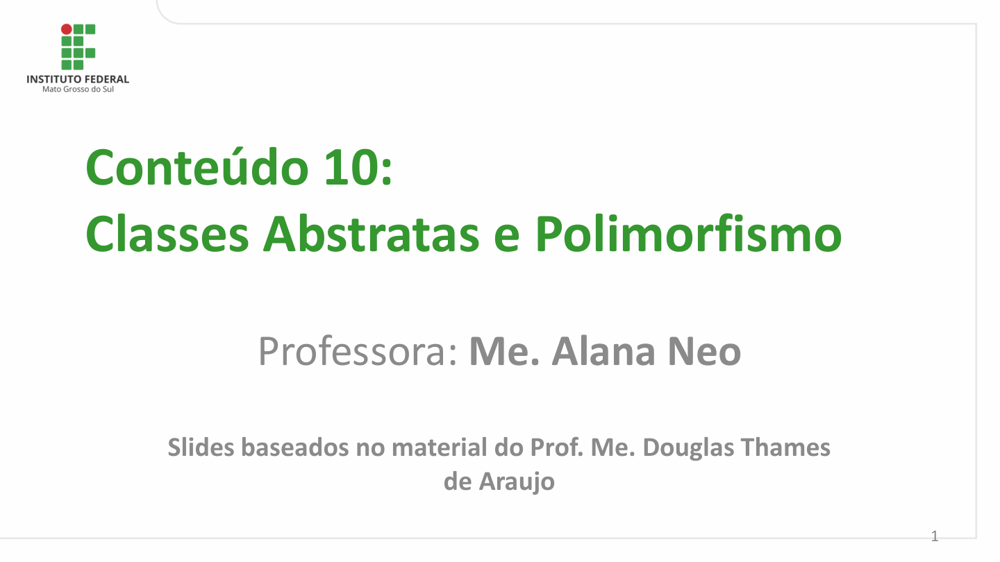

Conteúdo 10:
Classes Abstratas e Polimorfismo

         Professora: Me. Alana Neo

       Slides baseados no material do Prof. Me. Douglas Thames
                         de Araujo

                                                                                                    1

## Página 2

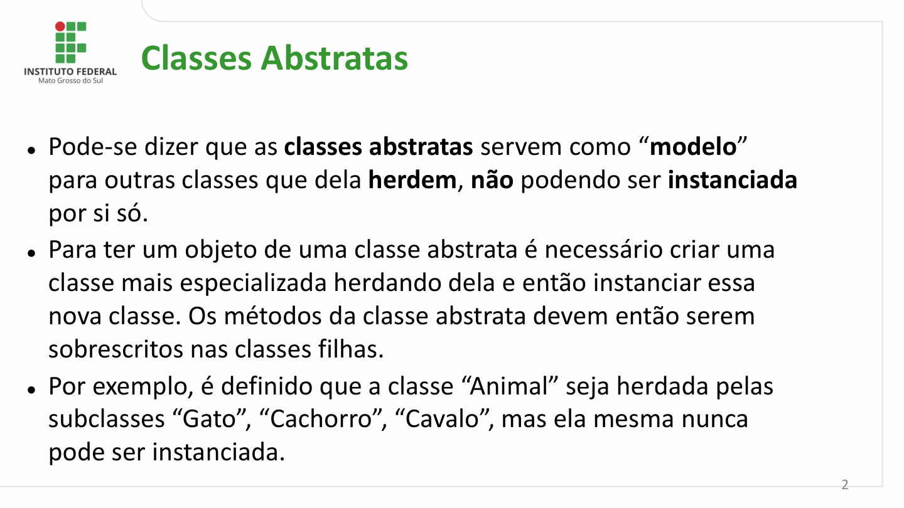

Classes Abstratas

⚫Pode-se dizer que as classes abstratas servem como “modelo”
  para outras classes que dela herdem, não podendo ser instanciada
  por si só.
⚫Para ter um objeto de uma classe abstrata é necessário criar uma
  classe mais especializada herdando dela e então instanciar essa
  nova classe. Os métodos da classe abstrata devem então serem
  sobrescritos nas classes filhas.
⚫Por exemplo, é definido que a classe “Animal” seja herdada pelas
  subclasses “Gato”, “Cachorro”, “Cavalo”, mas ela mesma nunca
 pode ser instanciada.

                                                                                                           2

## Página 3

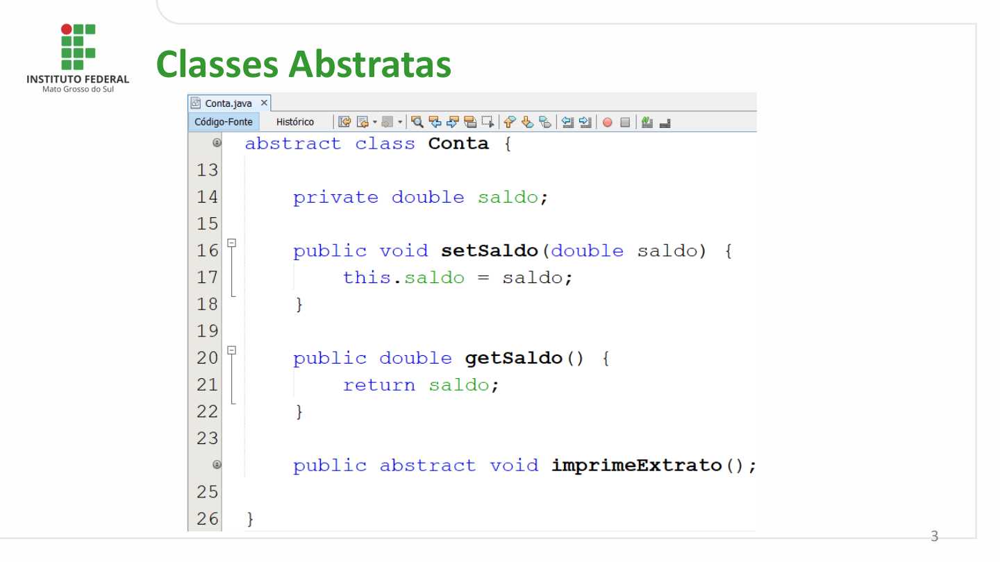

Classes Abstratas

                                                                                            3

## Página 4

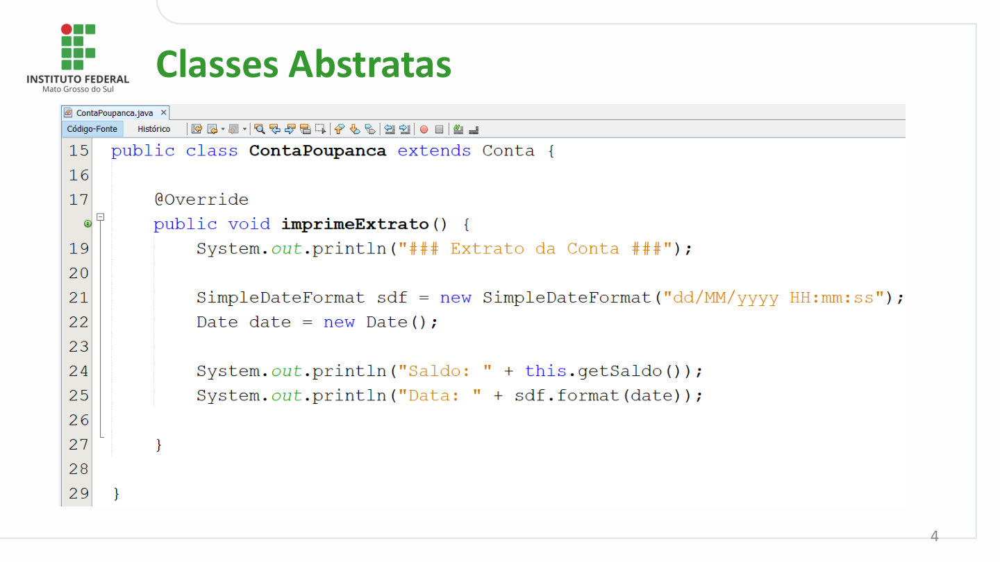

Classes Abstratas

                                                                                            4

## Página 5

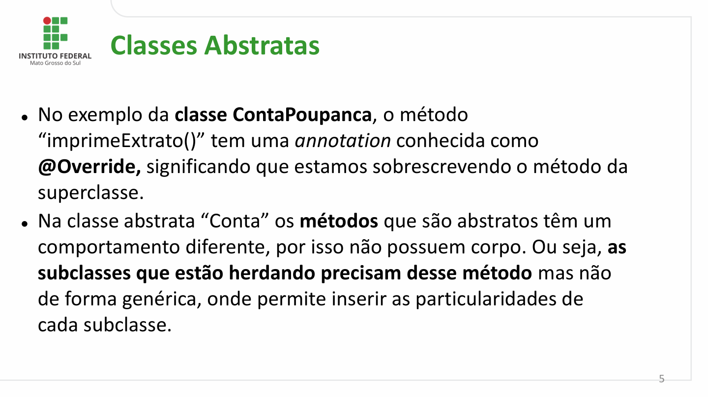

Classes Abstratas

⚫No exemplo da classe ContaPoupanca, o método
  “imprimeExtrato()” tem uma annotation conhecida como
  @Override, significando que estamos sobrescrevendo o método da
  superclasse.
⚫Na classe abstrata “Conta” os métodos que são abstratos têm um
  comportamento diferente, por isso não possuem corpo. Ou seja, as
  subclasses que estão herdando precisam desse método mas não
  de forma genérica, onde permite inserir as particularidades de
  cada subclasse.

                                                                                                           5

## Página 6

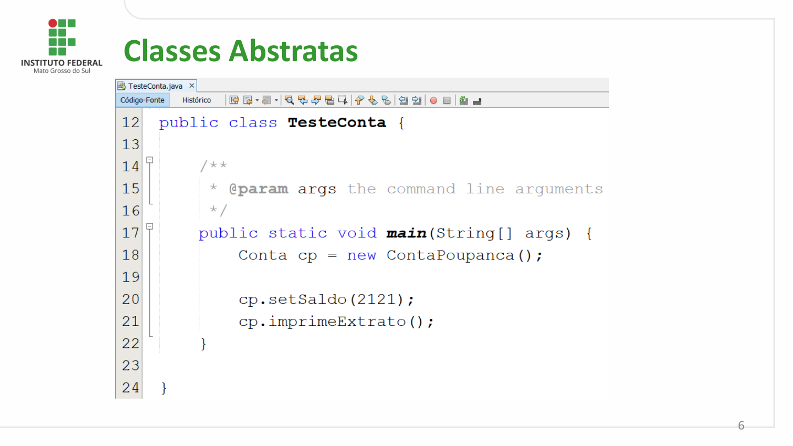

Classes Abstratas

                                                                                            6

## Página 7

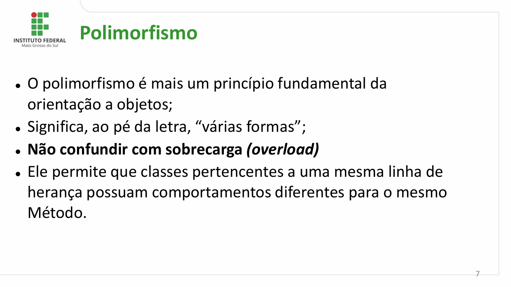

Polimorfismo

⚫O polimorfismo é mais um princípio fundamental da
  orientação a objetos;
⚫Significa, ao pé da letra, “várias formas”;
⚫Não confundir com sobrecarga (overload)
⚫Ele permite que classes pertencentes a uma mesma linha de
  herança possuam comportamentos diferentes para o mesmo
 Método.

                                                                                                           7

## Página 8

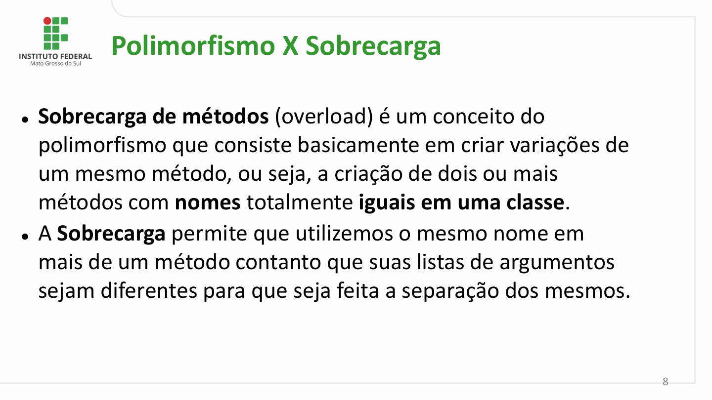

Polimorfismo X Sobrecarga

⚫Sobrecarga de métodos (overload) é um conceito do
  polimorfismo que consiste basicamente em criar variações de
 um mesmo método, ou seja, a criação de dois ou mais
 métodos com nomes totalmente iguais em uma classe.
⚫A Sobrecarga permite que utilizemos o mesmo nome em
 mais de um método contanto que suas listas de argumentos
 sejam diferentes para que seja feita a separação dos mesmos.

                                                                                                           8

## Página 9

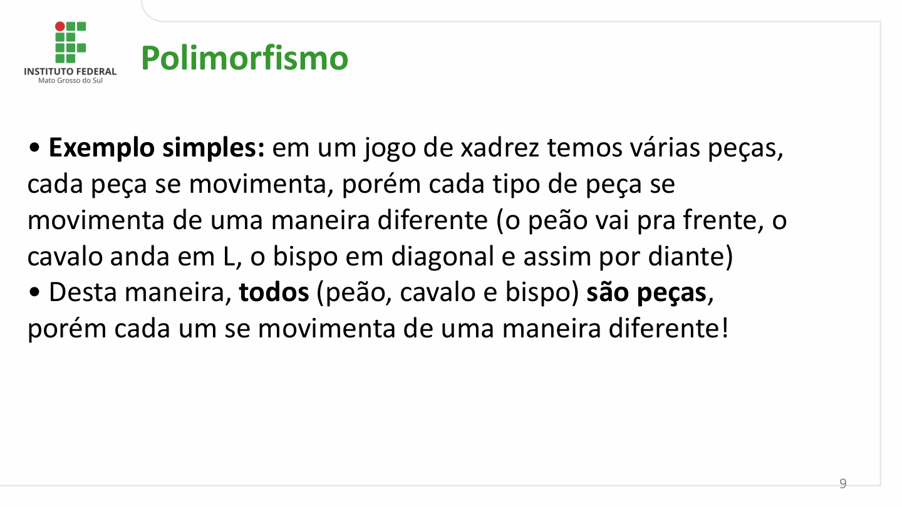

Polimorfismo

• Exemplo simples: em um jogo de xadrez temos várias peças,
cada peça se movimenta, porém cada tipo de peça se
movimenta de uma maneira diferente (o peão vai pra frente, o
cavalo anda em L, o bispo em diagonal e assim por diante)
• Desta maneira, todos (peão, cavalo e bispo) são peças,
porém cada um se movimenta de uma maneira diferente!

                                                                                                           9

## Página 10

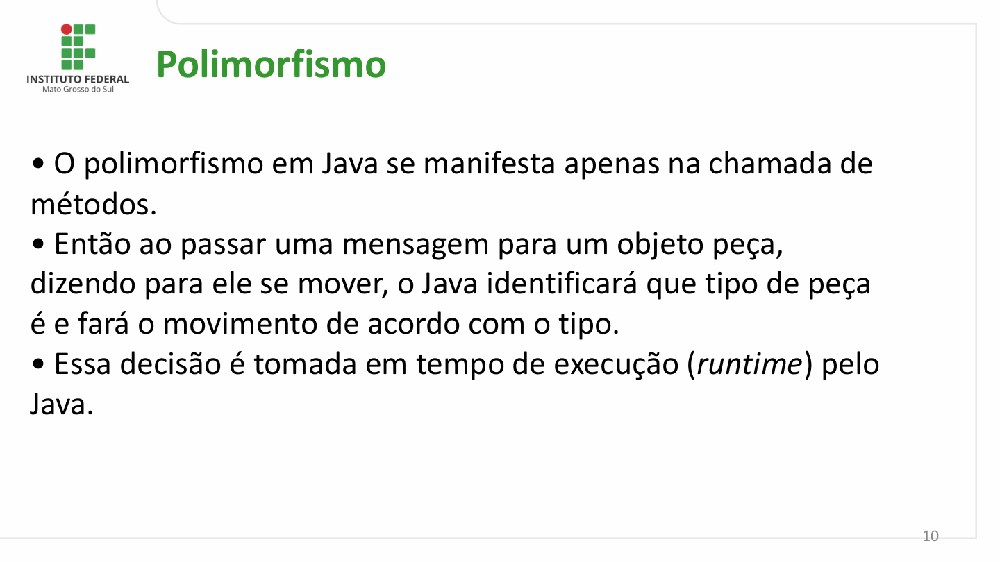

Polimorfismo

• O polimorfismo em Java se manifesta apenas na chamada de
métodos.
• Então ao passar uma mensagem para um objeto peça,
dizendo para ele se mover, o Java identificará que tipo de peça
é e fará o movimento de acordo com o tipo.
• Essa decisão é tomada em tempo de execução (runtime) pelo
Java.

                                                                                                         10

## Página 11

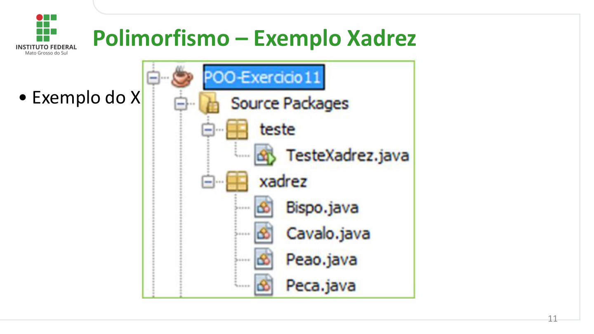

Polimorfismo – Exemplo Xadrez

• Exemplo do Xadrez:

                                                                                                         11

## Página 12

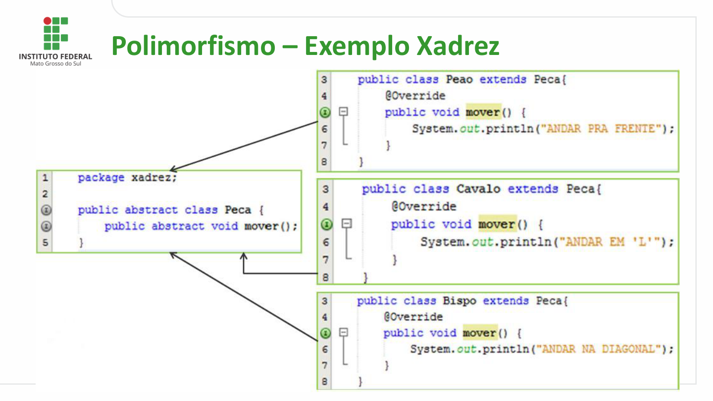

Polimorfismo – Exemplo Xadrez

                                                                                          12

## Página 13

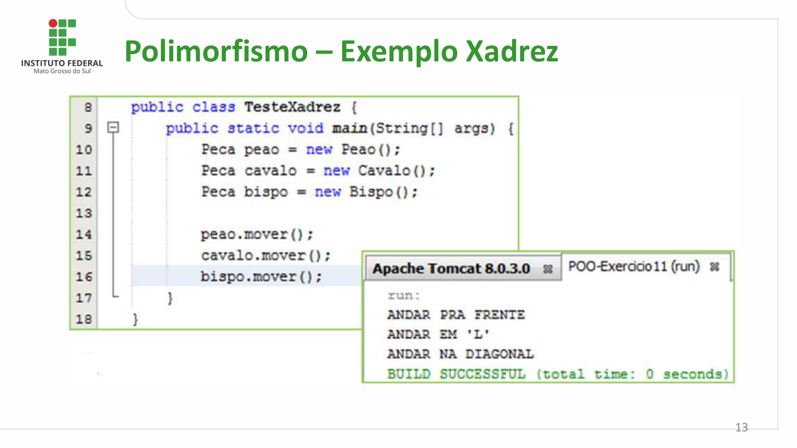

Polimorfismo – Exemplo Xadrez

                                                                                          13

## Página 14

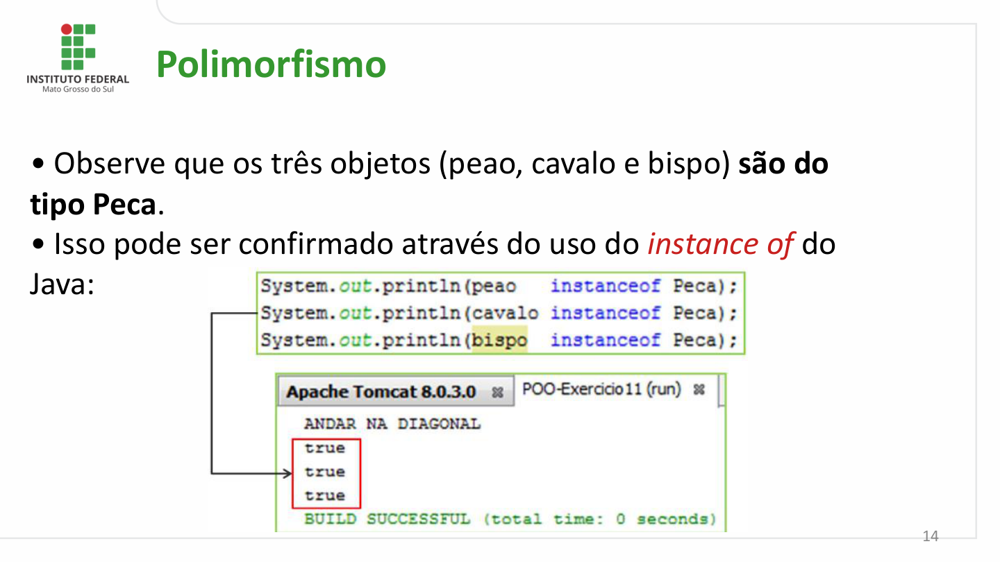

Polimorfismo

• Observe que os três objetos (peao, cavalo e bispo) são do
tipo Peca.
• Isso pode ser confirmado através do uso do instance of do
Java:

                                                                                                         14

## Página 15

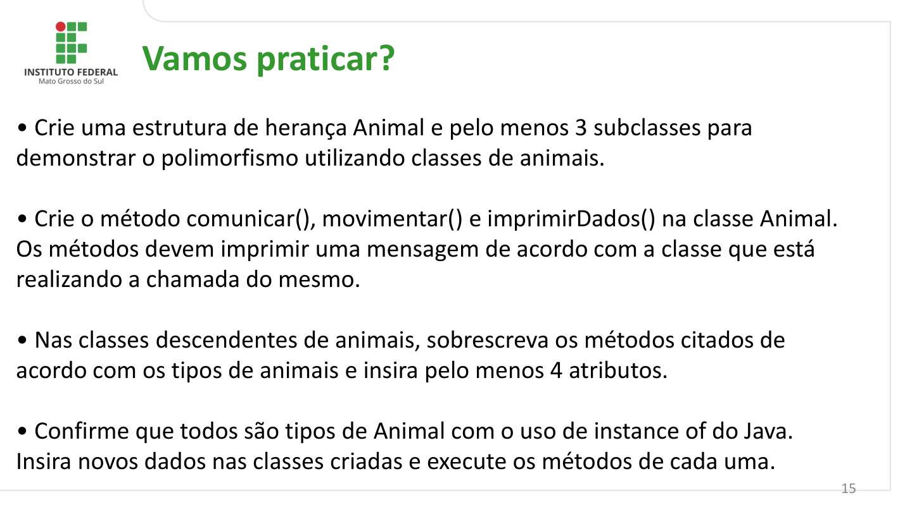

Vamos praticar?

• Crie uma estrutura de herança Animal e pelo menos 3 subclasses para
demonstrar o polimorfismo utilizando classes de animais.

• Crie o método comunicar(), movimentar() e imprimirDados() na classe Animal.
Os métodos devem imprimir uma mensagem de acordo com a classe que está
realizando a chamada do mesmo.

• Nas classes descendentes de animais, sobrescreva os métodos citados de
acordo com os tipos de animais e insira pelo menos 4 atributos.

• Confirme que todos são tipos de Animal com o uso de instance of do Java.
Insira novos dados nas classes criadas e execute os métodos de cada uma.
                                                                                                           15

## Página 16

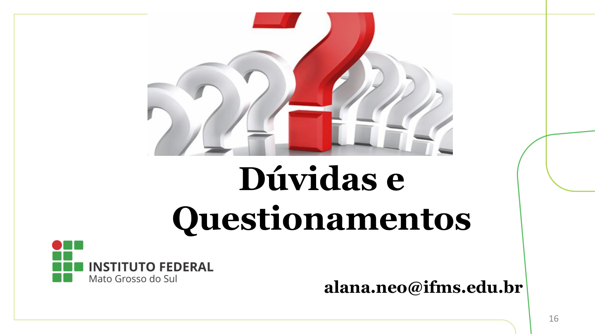

Dúvidas e
Questionamentos

                alana.neo@ifms.edu.br

                                                                           16
