## Página 1

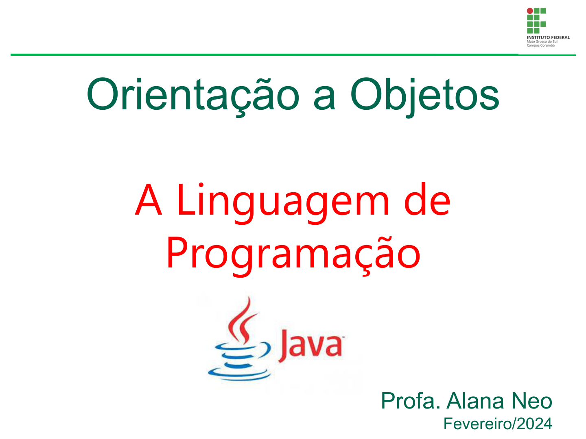

Orientação a Objetos

  A Linguagem de
   Programação

                             Profa. Alana Neo
                                              Fevereiro/2024

## Página 2

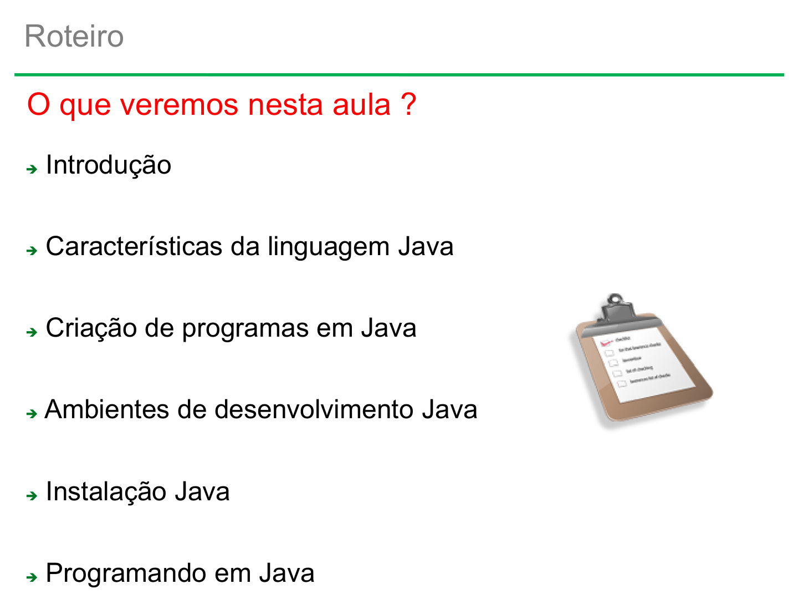

Roteiro

O que veremos nesta aula ?

- Introdução

- Características da linguagem Java

- Criação de programas em Java

- Ambientes de desenvolvimento Java

- Instalação Java

- Programando em Java

## Página 3

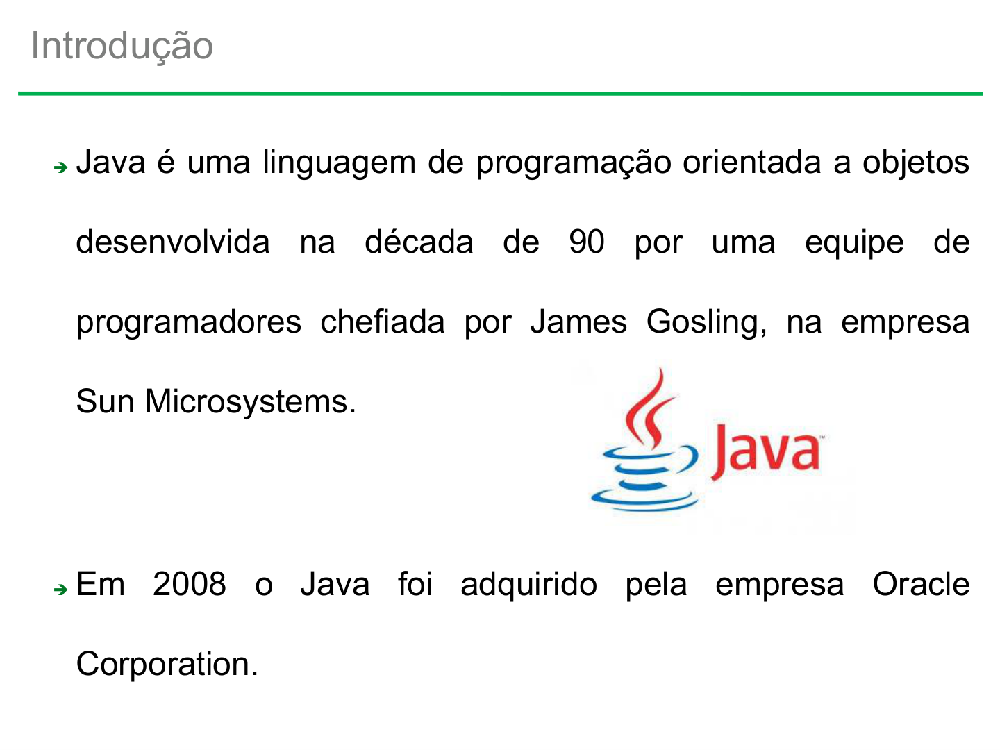

Introdução

 - Java é uma linguagem de programação orientada a objetos

   desenvolvida  na  década  de  90  por uma  equipe  de

   programadores chefiada por James Gosling, na empresa

  Sun Microsystems.

 - Em 2008 o  Java  foi  adquirido  pela empresa  Oracle

   Corporation.

## Página 4

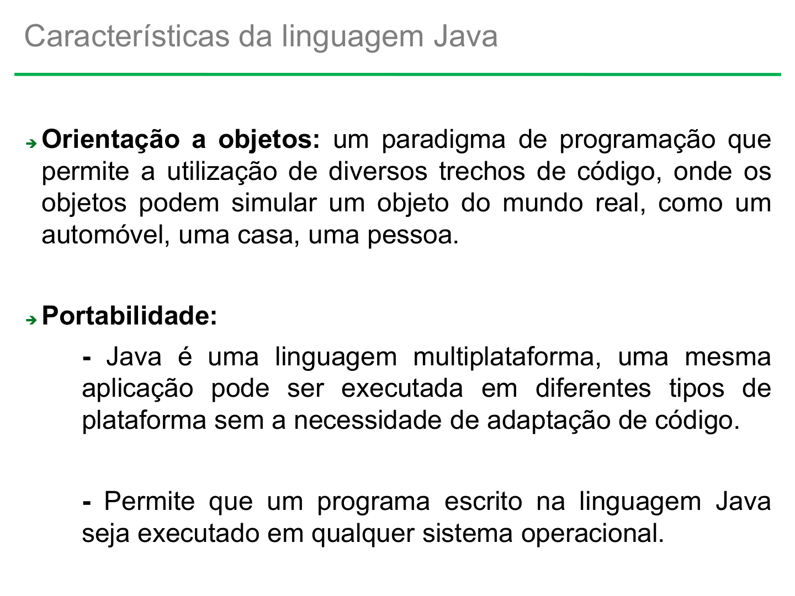

Características da linguagem Java

- Orientação a objetos: um paradigma de programação que
 permite a utilização de diversos trechos de código, onde os
 objetos podem simular um objeto do mundo real, como um
 automóvel, uma casa, uma pessoa.

- Portabilidade:
       - Java é uma linguagem multiplataforma, uma mesma
     aplicação pode ser executada em diferentes  tipos de
     plataforma sem a necessidade de adaptação de código.

       - Permite que um programa escrito na linguagem Java
     seja executado em qualquer sistema operacional.

## Página 5

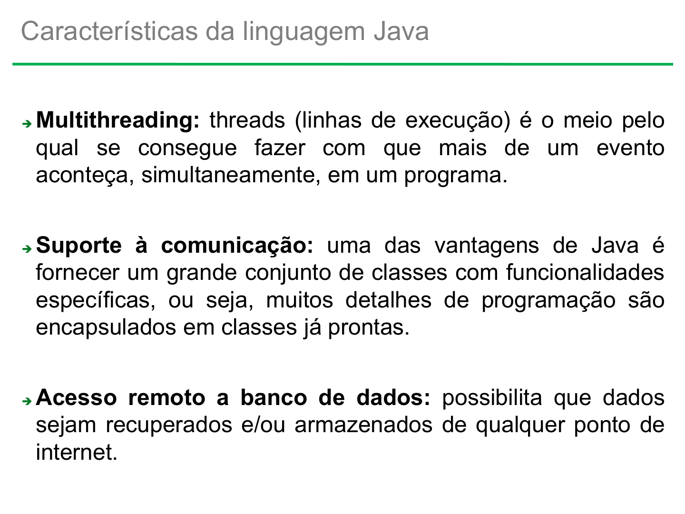

Características da linguagem Java

- Multithreading: threads (linhas de execução) é o meio pelo
 qual se consegue  fazer com que mais de um  evento
 aconteça, simultaneamente, em um programa.

- Suporte à comunicação: uma das vantagens de Java é
 fornecer um grande conjunto de classes com funcionalidades
  específicas, ou seja, muitos detalhes de programação são
 encapsulados em classes já prontas.

- Acesso remoto a banco de dados: possibilita que dados
 sejam recuperados e/ou armazenados de qualquer ponto de
  internet.

## Página 6

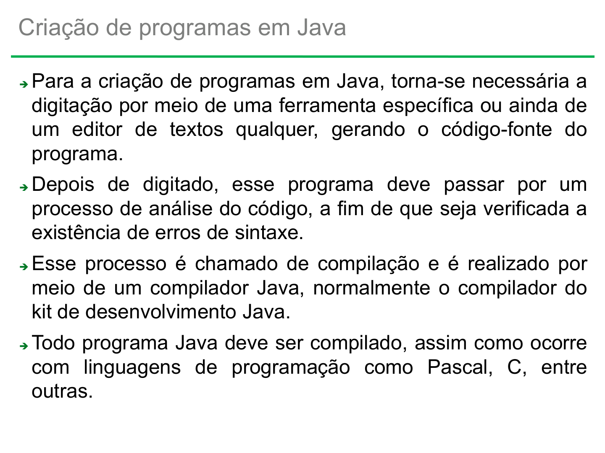

Criação de programas em Java

- Para a criação de programas em Java, torna-se necessária a
 digitação por meio de uma ferramenta específica ou ainda de
 um editor de textos qualquer, gerando o código-fonte do
 programa.
- Depois de  digitado, esse programa deve passar por um
 processo de análise do código, a fim de que seja verificada a
 existência de erros de sintaxe.
- Esse processo é chamado de compilação e é realizado por
 meio de um compilador Java, normalmente o compilador do
  kit de desenvolvimento Java.
- Todo programa Java deve ser compilado, assim como ocorre
 com linguagens de programação como Pascal, C,  entre
  outras.

## Página 7

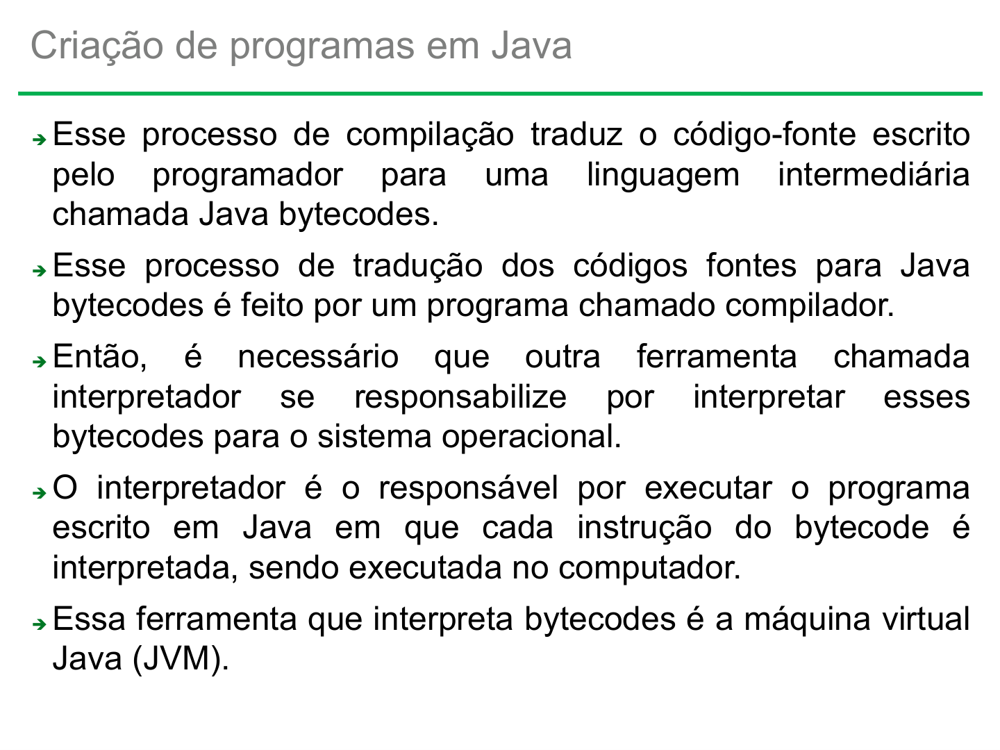

Criação de programas em Java

- Esse processo de compilação traduz o código-fonte escrito
 pelo  programador  para  uma  linguagem   intermediária
 chamada Java bytecodes.
- Esse processo de tradução dos códigos fontes para Java
 bytecodes é feito por um programa chamado compilador.
- Então,  é  necessário  que  outra  ferramenta  chamada
  interpretador  se   responsabilize  por   interpretar  esses
 bytecodes para o sistema operacional.
- O interpretador é o responsável por executar o programa
  escrito em Java em que cada  instrução do bytecode é
  interpretada, sendo executada no computador.
- Essa ferramenta que interpreta bytecodes é a máquina virtual
 Java (JVM).

## Página 8

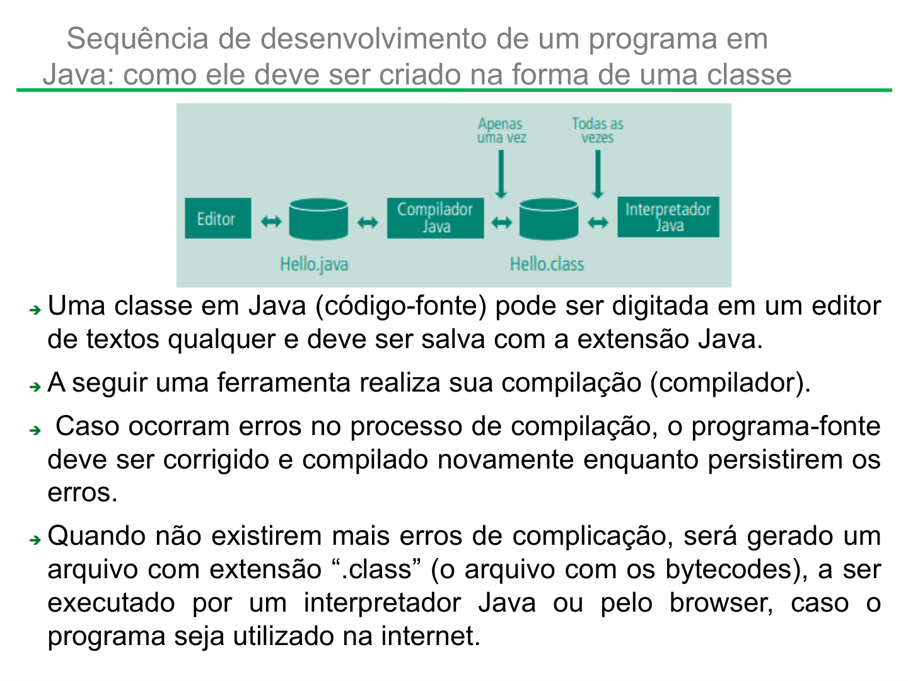

Sequência de desenvolvimento de um programa em
 Java: como ele deve ser criado na forma de uma classe

- Uma classe em Java (código-fonte) pode ser digitada em um editor
 de textos qualquer e deve ser salva com a extensão Java.
- A seguir uma ferramenta realiza sua compilação (compilador).
- Caso ocorram erros no processo de compilação, o programa-fonte
 deve ser corrigido e compilado novamente enquanto persistirem os
  erros.
- Quando não existirem mais erros de complicação, será gerado um
 arquivo com extensão “.class” (o arquivo com os bytecodes), a ser
 executado por um interpretador Java ou pelo browser, caso o
 programa seja utilizado na internet.

## Página 9

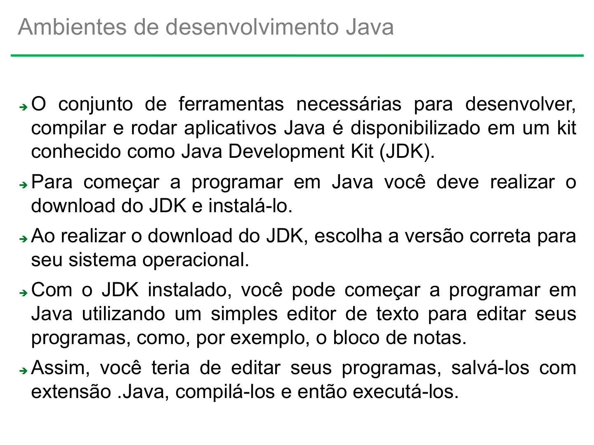

Ambientes de desenvolvimento Java

- O conjunto de ferramentas necessárias para desenvolver,
 compilar e rodar aplicativos Java é disponibilizado em um kit
 conhecido como Java Development Kit (JDK).
- Para começar a programar em Java você deve realizar o
 download do JDK e instalá-lo.
- Ao realizar o download do JDK, escolha a versão correta para
 seu sistema operacional.
- Com o JDK instalado, você pode começar a programar em
 Java utilizando um simples editor de texto para editar seus
 programas, como, por exemplo, o bloco de notas.
- Assim, você teria de editar seus programas, salvá-los com
 extensão .Java, compilá-los e então executá-los.

## Página 10

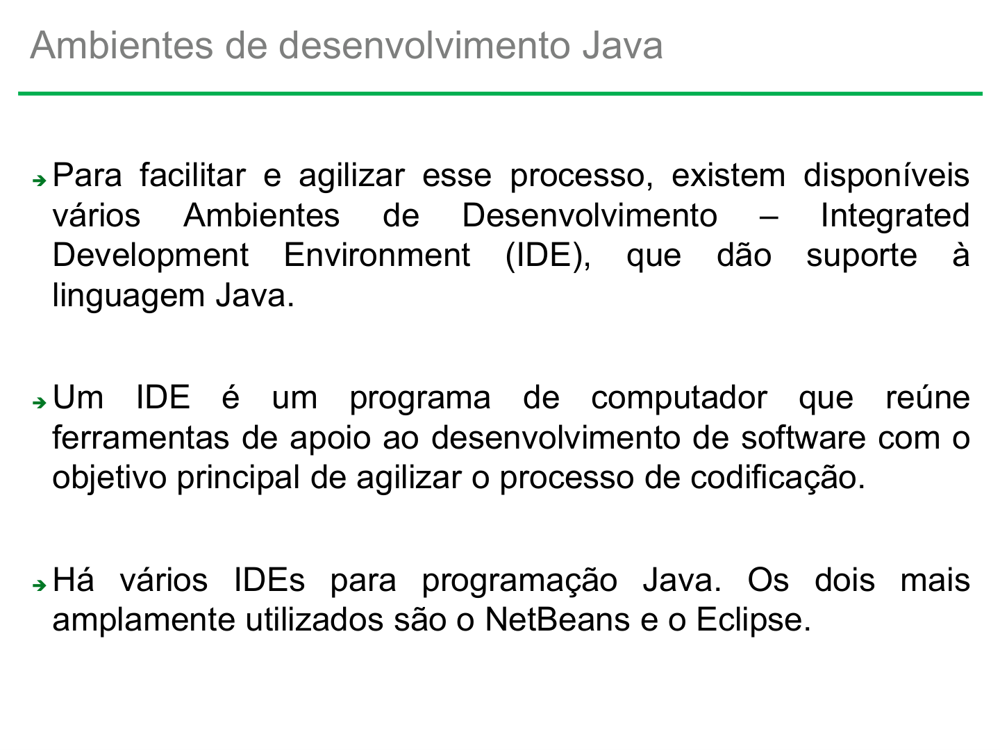

Ambientes de desenvolvimento Java

- Para facilitar e agilizar esse processo, existem disponíveis
 vários  Ambientes  de  Desenvolvimento  –   Integrated
 Development  Environment  (IDE),  que  dão  suporte  à
 linguagem Java.

- Um  IDE  é um  programa  de  computador  que  reúne
 ferramentas de apoio ao desenvolvimento de software com o
  objetivo principal de agilizar o processo de codificação.

- Há  vários IDEs para programação  Java. Os  dois mais
 amplamente utilizados são o NetBeans e o Eclipse.

## Página 11

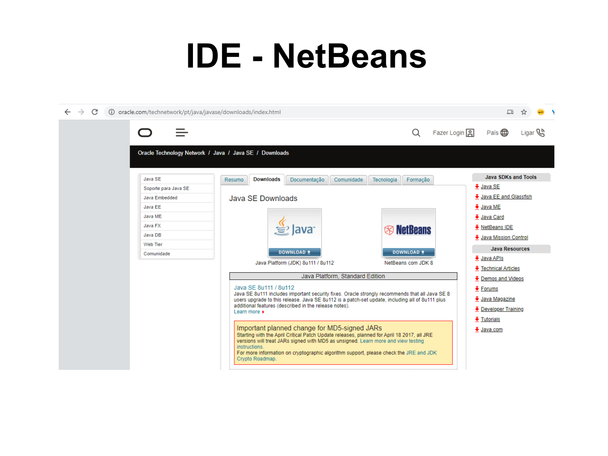

IDE - NetBeans

## Página 12

IDE - Eclipse

## Página 13

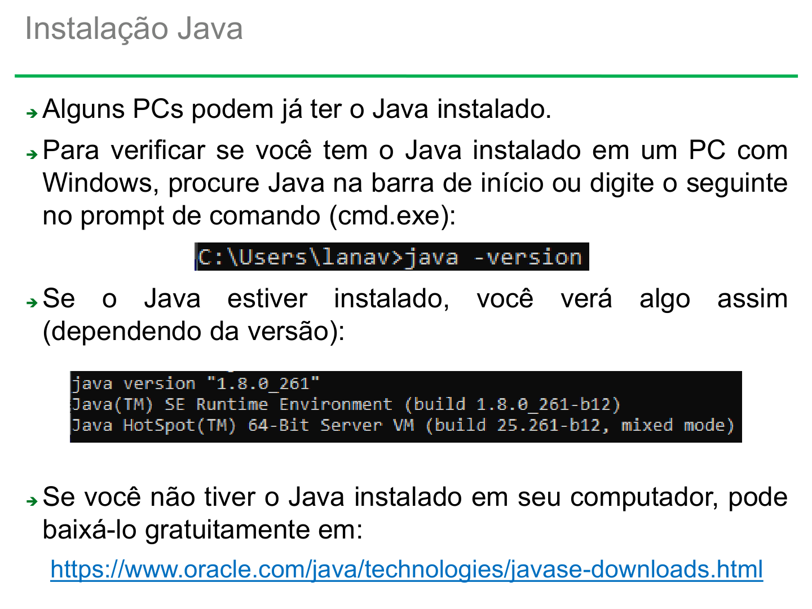

Instalação Java

- Alguns PCs podem já ter o Java instalado.
- Para verificar se você tem o Java instalado em um PC com
 Windows, procure Java na barra de início ou digite o seguinte
 no prompt de comando (cmd.exe):

- Se  o  Java  estiver  instalado,  você  verá  algo  assim
 (dependendo da versão):

- Se você não tiver o Java instalado em seu computador, pode
  baixá-lo gratuitamente em:
  https://www.oracle.com/java/technologies/javase-downloads.html

## Página 14

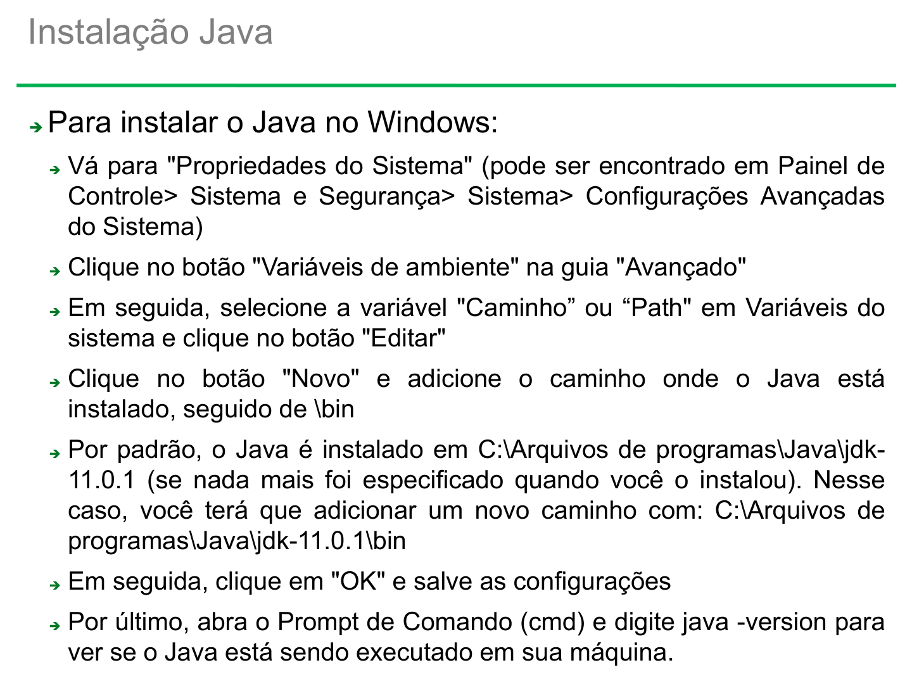

Instalação Java

- Para instalar o Java no Windows:
 - Vá para "Propriedades do Sistema" (pode ser encontrado em Painel de
   Controle> Sistema e Segurança> Sistema> Configurações Avançadas
   do Sistema)
  - Clique no botão "Variáveis ​de ambiente" na guia "Avançado"
 - Em seguida, selecione a variável "Caminho” ou “Path" em Variáveis ​do
   sistema e clique no botão "Editar"
  - Clique no botão "Novo" e adicione o caminho onde o Java está
    instalado, seguido de \bin
 - Por padrão, o Java é instalado em C:\Arquivos de programas\Java\jdk-
    11.0.1 (se nada mais foi especificado quando você o instalou). Nesse
   caso, você terá que adicionar um novo caminho com: C:\Arquivos de
   programas\Java\jdk-11.0.1\bin
 - Em seguida, clique em "OK" e salve as configurações
 - Por último, abra o Prompt de Comando (cmd) e digite java -version para
   ver se o Java está sendo executado em sua máquina.

## Página 15

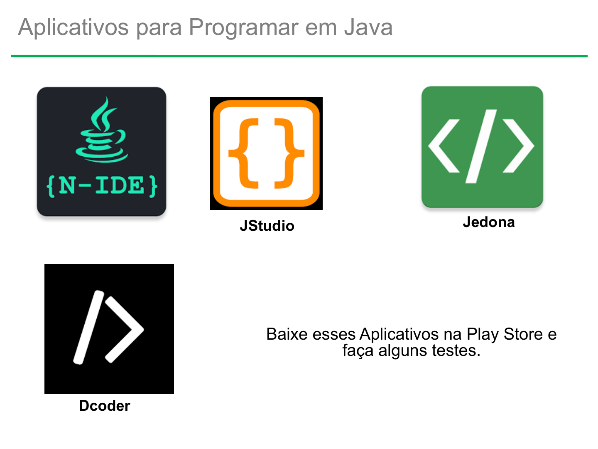

Aplicativos para Programar em Java

                                                   Jedona                            JStudio

                              Baixe esses Aplicativos na Play Store e
                                         faça alguns testes.

       Dcoder

## Página 16

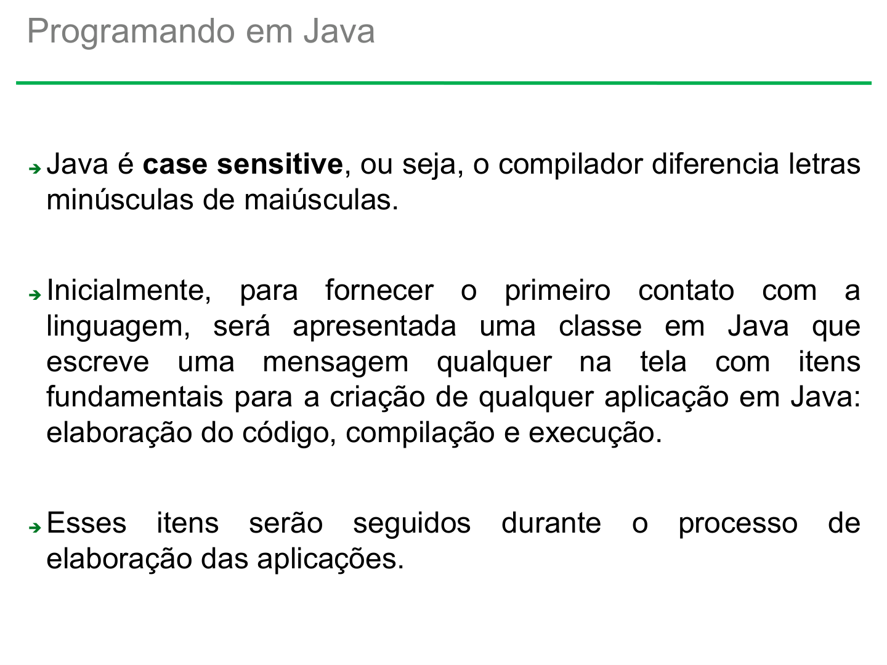

Programando em Java

- Java é case sensitive, ou seja, o compilador diferencia letras
 minúsculas de maiúsculas.

- Inicialmente,  para  fornecer  o  primeiro  contato com  a
 linguagem,  será apresentada uma  classe em Java que
 escreve uma  mensagem  qualquer  na  tela com  itens
 fundamentais para a criação de qualquer aplicação em Java:
 elaboração do código, compilação e execução.

- Esses  itens  serão  seguidos  durante  o  processo  de
 elaboração das aplicações.

## Página 17

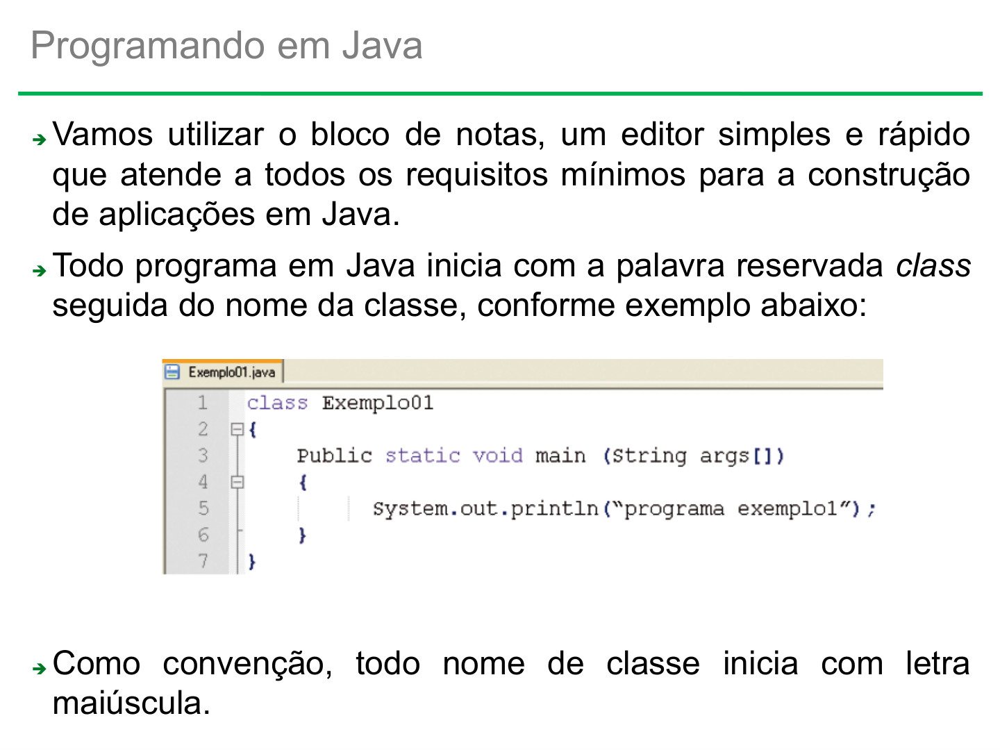

Programando em Java

- Vamos utilizar o bloco de notas, um editor simples e rápido
 que atende a todos os requisitos mínimos para a construção
 de aplicações em Java.
- Todo programa em Java inicia com a palavra reservada class
 seguida do nome da classe, conforme exemplo abaixo:

- Como convenção, todo nome de classe  inicia com  letra
 maiúscula.

## Página 18

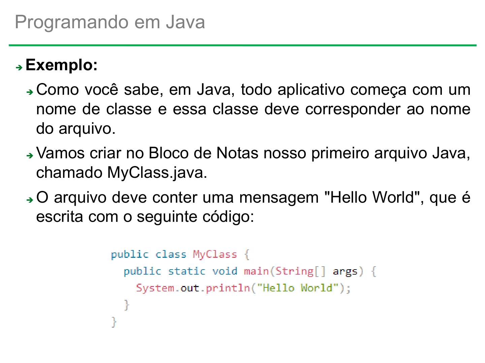

Programando em Java

- Exemplo:
 - Como você sabe, em Java, todo aplicativo começa com um
  nome de classe e essa classe deve corresponder ao nome
  do arquivo.
 - Vamos criar no Bloco de Notas nosso primeiro arquivo Java,
  chamado MyClass.java.
 - O arquivo deve conter uma mensagem "Hello World", que é
   escrita com o seguinte código:

## Página 19

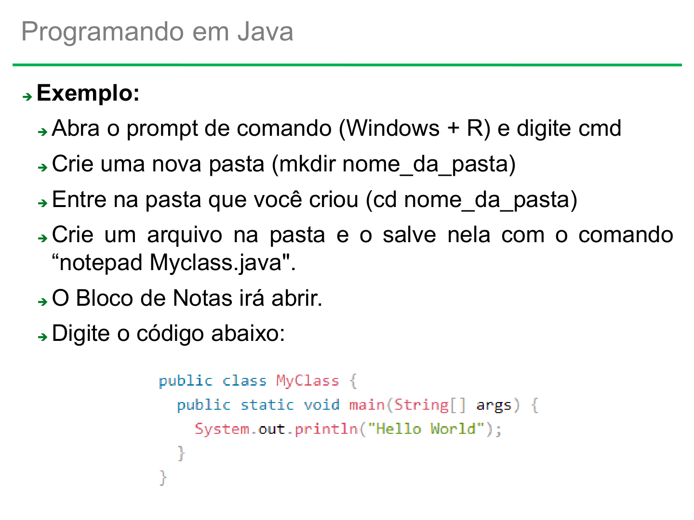

Programando em Java

- Exemplo:
 - Abra o prompt de comando (Windows + R) e digite cmd
 - Crie uma nova pasta (mkdir nome_da_pasta)
 - Entre na pasta que você criou (cd nome_da_pasta)
 - Crie um arquivo na pasta e o salve nela com o comando
   “notepad Myclass.java".
 - O Bloco de Notas irá abrir.
  - Digite o código abaixo:

## Página 20

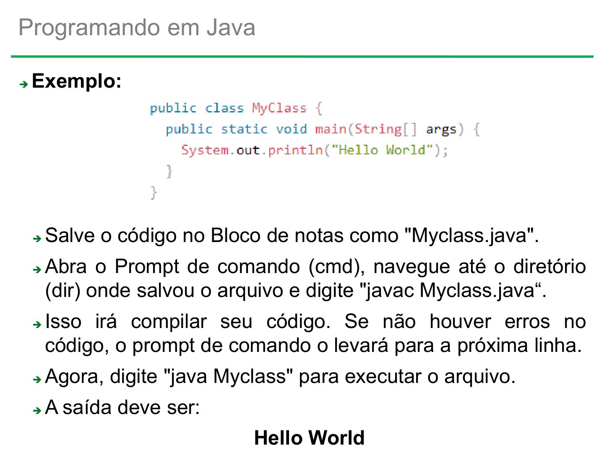

Programando em Java

- Exemplo:

 - Salve o código no Bloco de notas como "Myclass.java".
 - Abra o Prompt de comando (cmd), navegue até o diretório
    (dir) onde salvou o arquivo e digite "javac Myclass.java“.
 - Isso  irá compilar seu código. Se não houver erros no
   código, o prompt de comando o levará para a próxima linha.
 - Agora, digite "java Myclass" para executar o arquivo.
 - A saída deve ser:
                        Hello World

## Página 21

Dúvidas

   alana.neo@ifms.edu.br
