Arquivo original: `Aula 05 Casting e Promoção.pdf`

## Página 1

Orientação a Objetos

    Variáveis Primitivas
  (Casting e Promoção)

## Página 2

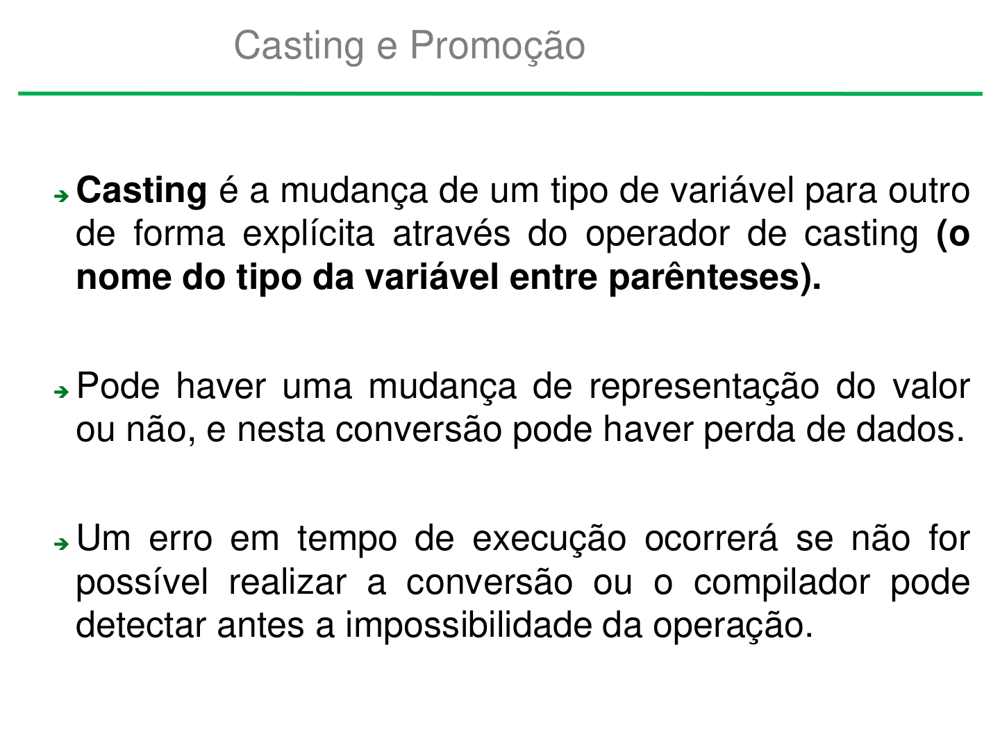

Casting e Promoção

➔Casting é a mudança de um tipo de variável para outro
 de forma explícita através do operador de casting (o
 nome do tipo da variável entre parênteses).

➔Pode haver uma mudança de representação do valor
 ou não, e nesta conversão pode haver perda de dados.

➔Um erro em tempo de execução ocorrerá se não for
 possível realizar a conversão ou o compilador pode
 detectar antes a impossibilidade da operação.

## Página 3

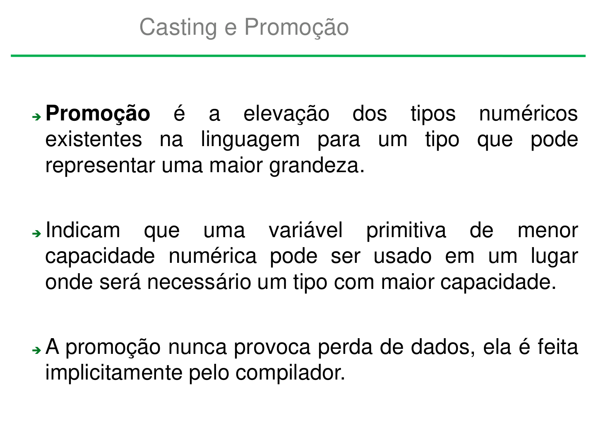

Casting e Promoção

➔Promoção  é  a  elevação  dos   tipos  numéricos
 existentes na  linguagem  para um  tipo que pode
 representar uma maior grandeza.

➔Indicam  que  uma   variável   primitiva  de  menor
 capacidade numérica pode ser usado em um lugar
 onde será necessário um tipo com maior capacidade.

➔A promoção nunca provoca perda de dados, ela é feita
 implicitamente pelo compilador.

## Página 4

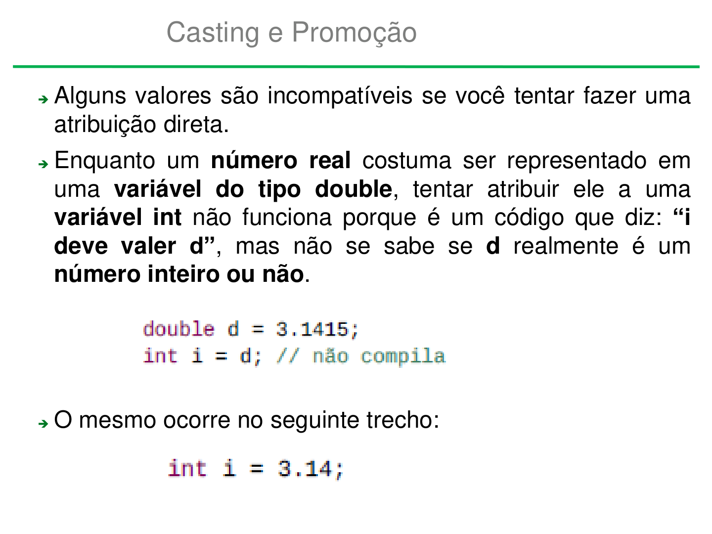

Casting e Promoção

➔Alguns valores são incompatíveis se você tentar fazer uma
  atribuição direta.
➔Enquanto um número real costuma ser representado em
 uma variável do tipo double, tentar atribuir ele a uma
 variável int não funciona porque é um código que diz: “i
 deve valer d”, mas não se sabe se d realmente é um
 número inteiro ou não.

➔O mesmo ocorre no seguinte trecho:

## Página 5

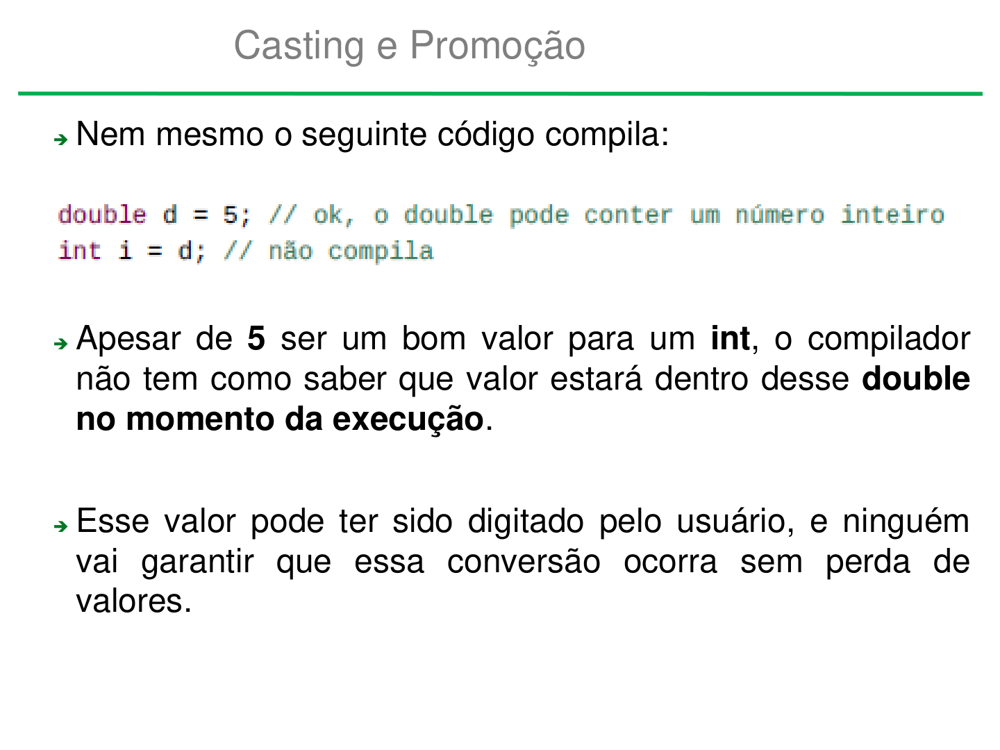

Casting e Promoção

➔Nem mesmo o seguinte código compila:

➔Apesar de 5 ser um bom valor para um int, o compilador
 não tem como saber que valor estará dentro desse double
 no momento da execução.

➔Esse valor pode ter sido digitado pelo usuário, e ninguém
  vai  garantir que essa conversão ocorra sem perda de
  valores.

## Página 6

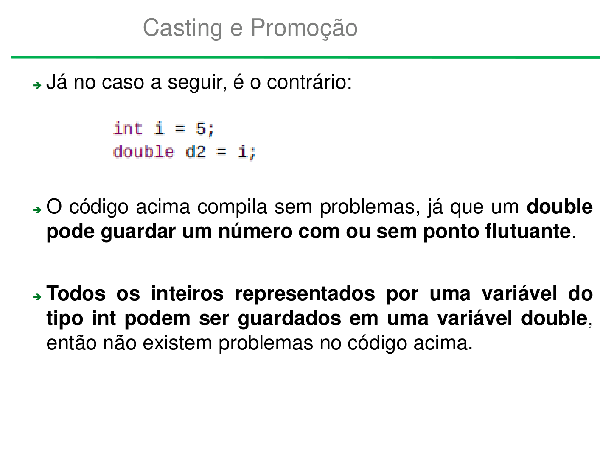

Casting e Promoção

➔Já no caso a seguir, é o contrário:

➔O código acima compila sem problemas, já que um double
 pode guardar um número com ou sem ponto flutuante.

➔Todos os inteiros representados por uma variável do
 tipo int podem ser guardados em uma variável double,
 então não existem problemas no código acima.

## Página 7

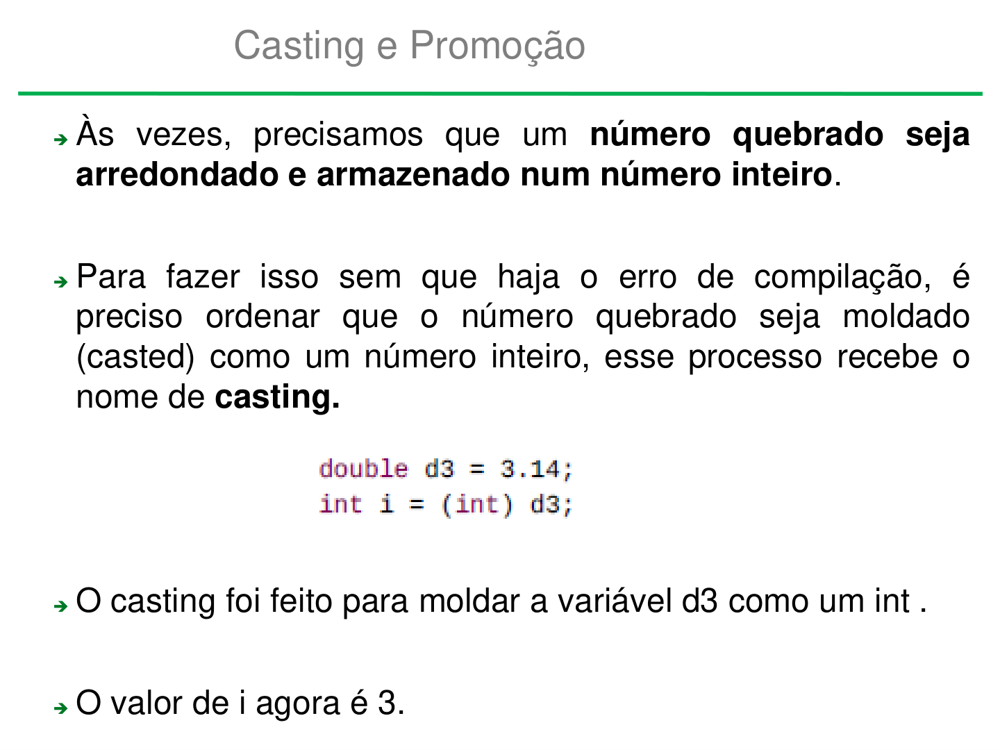

Casting e Promoção

➔Às vezes, precisamos que um número quebrado seja
 arredondado e armazenado num número inteiro.

➔Para fazer isso sem que haja o erro de compilação, é
 preciso ordenar que o número quebrado seja moldado
  (casted) como um número inteiro, esse processo recebe o
 nome de casting.

➔O casting foi feito para moldar a variável d3 como um int .

➔O valor de i agora é 3.

## Página 8

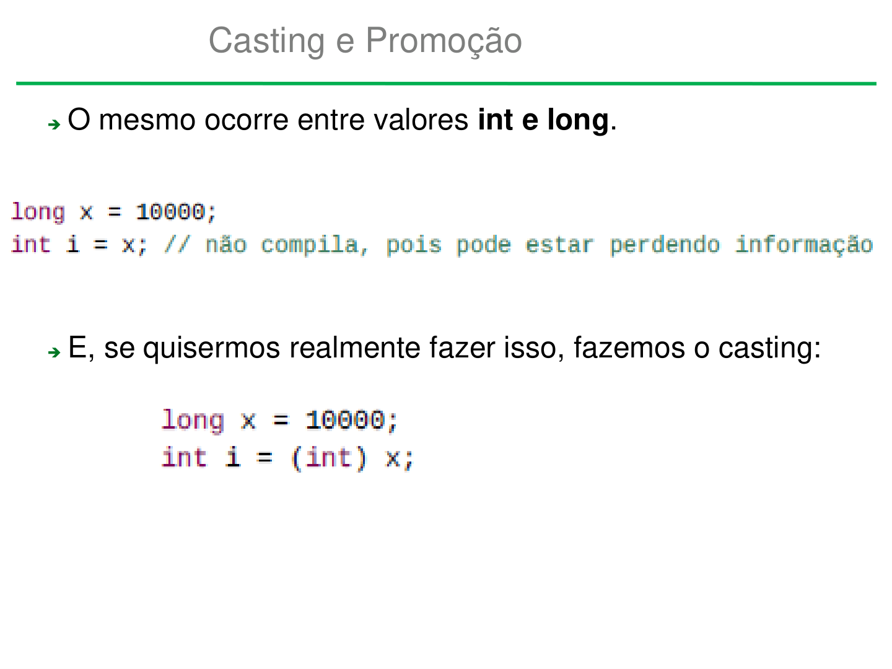

Casting e Promoção

➔O mesmo ocorre entre valores int e long.

➔E, se quisermos realmente fazer isso, fazemos o casting:

## Página 9

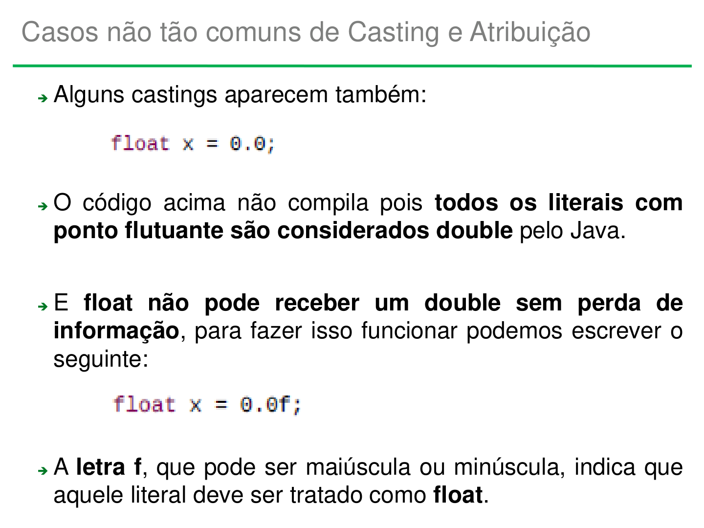

Casos não tão comuns de Casting e Atribuição

- Alguns castings aparecem também:

- O código acima não compila pois todos os literais com
  ponto flutuante são considerados double pelo Java.

- E float não pode receber um double sem perda de
   informação, para fazer isso funcionar podemos escrever o
   seguinte:

- A letra f, que pode ser maiúscula ou minúscula, indica que
   aquele literal deve ser tratado como float.

## Página 10

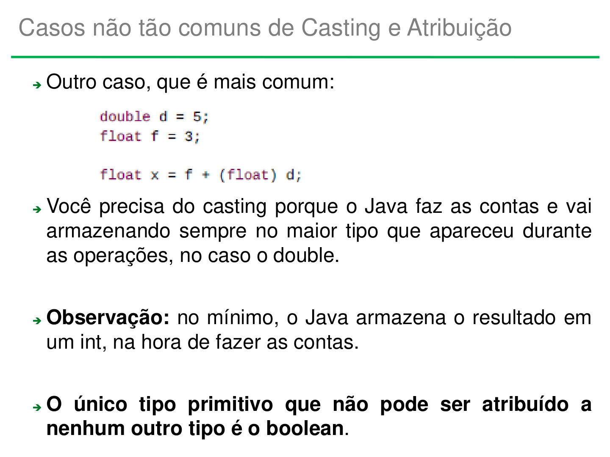

Casos não tão comuns de Casting e Atribuição

- Outro caso, que é mais comum:

- Você precisa do casting porque o Java faz as contas e vai
  armazenando sempre no maior tipo que apareceu durante
   as operações, no caso o double.

- Observação: no mínimo, o Java armazena o resultado em
  um int, na hora de fazer as contas.

- O único tipo primitivo que não pode ser atribuído a
  nenhum outro tipo é o boolean.

## Página 11

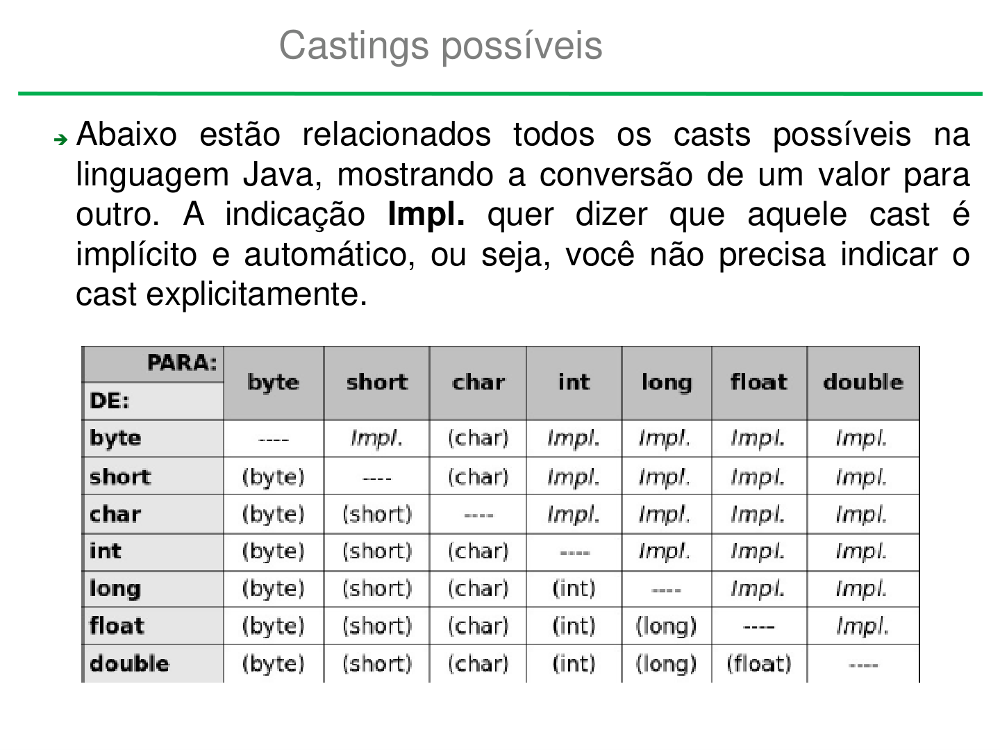

Castings possíveis

➔Abaixo estão relacionados todos os casts possíveis na
 linguagem Java, mostrando a conversão de um valor para
  outro. A indicação Impl. quer  dizer que aquele cast é
  implícito e automático, ou seja, você não precisa indicar o
 cast explicitamente.

## Página 12

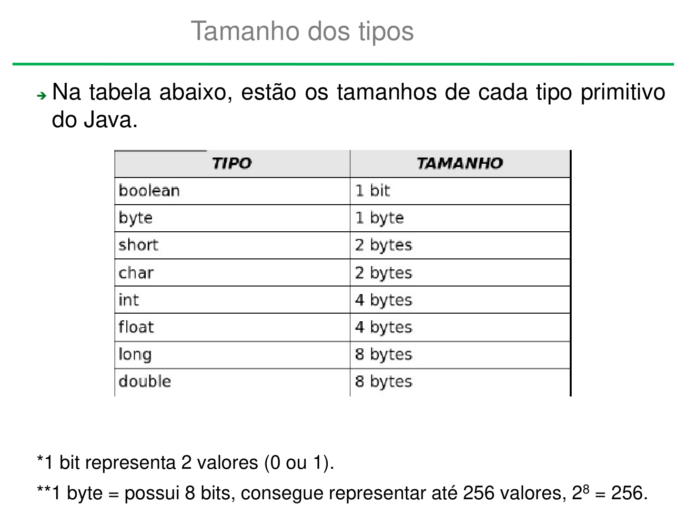

Tamanho dos tipos

➔Na tabela abaixo, estão os tamanhos de cada tipo primitivo
 do Java.

*1 bit representa 2 valores (0 ou 1).
**1 byte = possui 8 bits, consegue representar até 256 valores, 28 = 256.

## Página 13

Dúvidas

 alana.neo@ifms.edu.br
