Arquivo original: `Modificadores de Classe, Encapsulamento e Atributos de Classe.pdf`

## Página 1

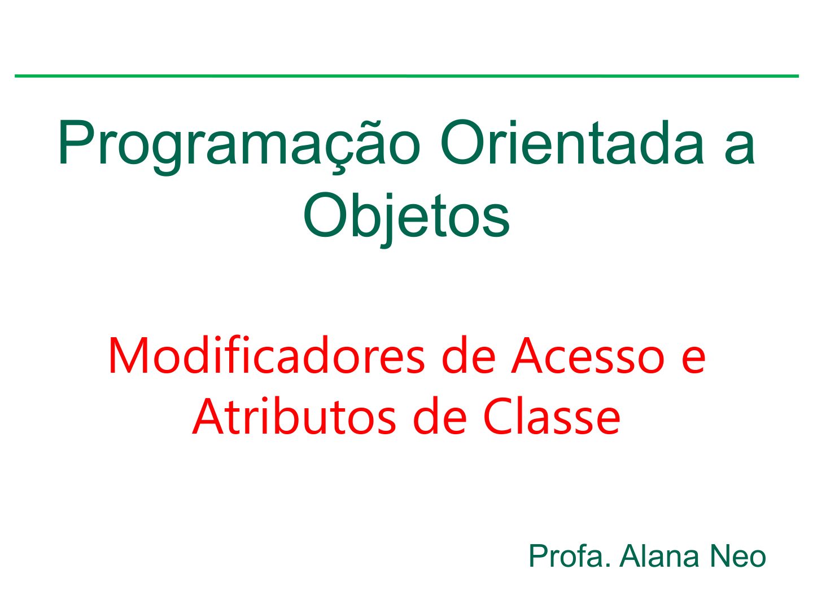

Programação Orientada a
        Objetos

  Modificadores de Acesso e
      Atributos de Classe

                                  Profa. Alana Neo

## Página 2

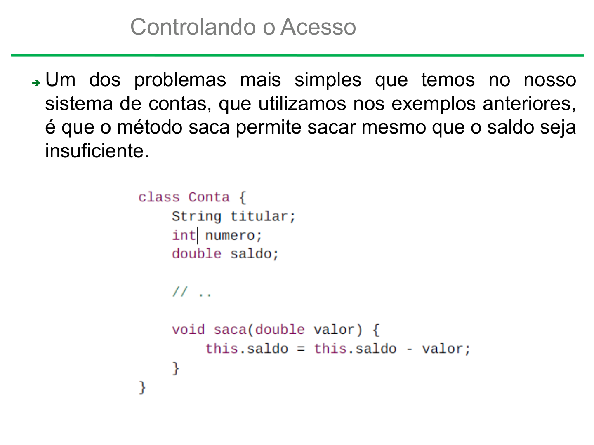

Controlando o Acesso

- Um dos problemas mais simples que temos no nosso
 sistema de contas, que utilizamos nos exemplos anteriores,
 é que o método saca permite sacar mesmo que o saldo seja
  insuficiente.

## Página 3

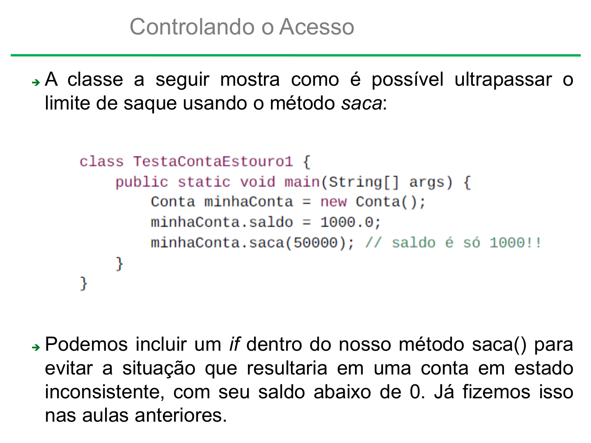

Controlando o Acesso

- A classe a seguir mostra como é possível ultrapassar o
  limite de saque usando o método saca:

- Podemos incluir um  if dentro do nosso método saca() para
  evitar a situação que resultaria em uma conta em estado
  inconsistente, com seu saldo abaixo de 0. Já fizemos isso
 nas aulas anteriores.

## Página 4

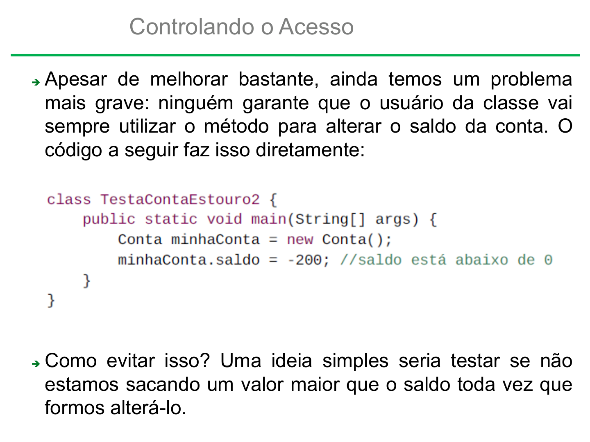

Controlando o Acesso

- Apesar de melhorar bastante, ainda temos um problema
 mais grave: ninguém garante que o usuário da classe vai
 sempre utilizar o método para alterar o saldo da conta. O
 código a seguir faz isso diretamente:

- Como evitar isso? Uma ideia simples seria testar se não
 estamos sacando um valor maior que o saldo toda vez que
 formos alterá-lo.

## Página 5

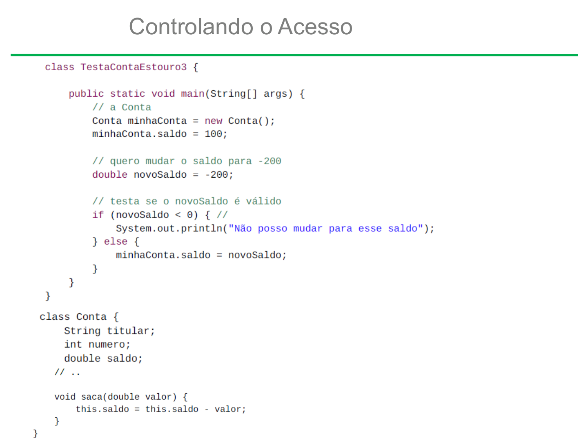

Controlando o Acesso

## Página 6

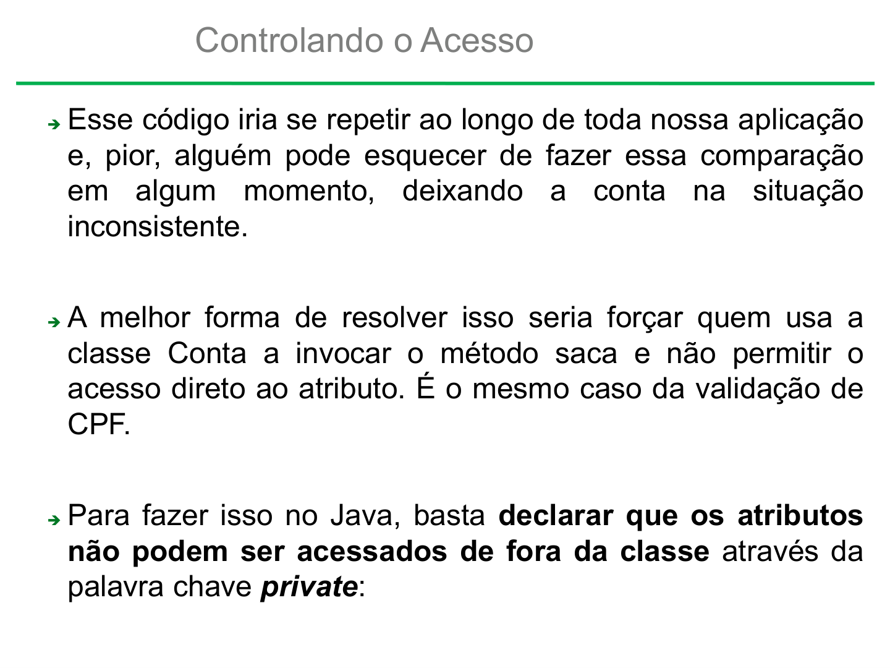

Controlando o Acesso

- Esse código iria se repetir ao longo de toda nossa aplicação
  e, pior, alguém pode esquecer de fazer essa comparação
 em  algum  momento,  deixando  a  conta  na  situação
  inconsistente.

- A melhor forma de resolver isso seria forçar quem usa a
 classe Conta a invocar o método saca e não permitir o
 acesso direto ao atributo. É o mesmo caso da validação de
 CPF.

- Para fazer isso no Java, basta declarar que os atributos
 não podem ser acessados de fora da classe através da
 palavra chave private:

## Página 7

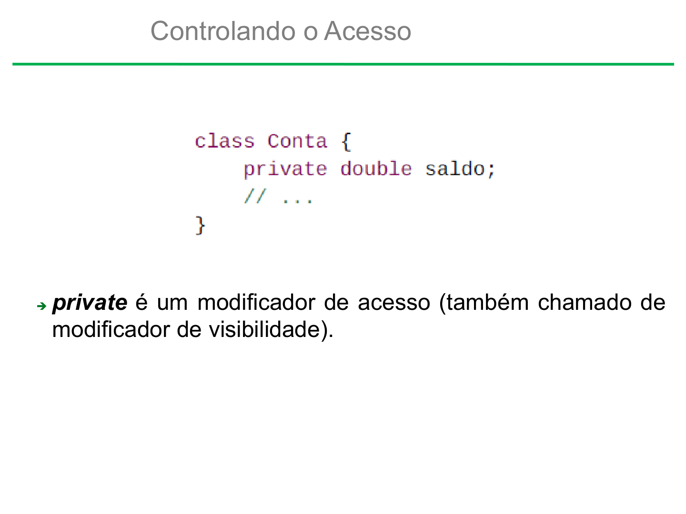

Controlando o Acesso

- private é um modificador de acesso (também chamado de
 modificador de visibilidade).

## Página 8

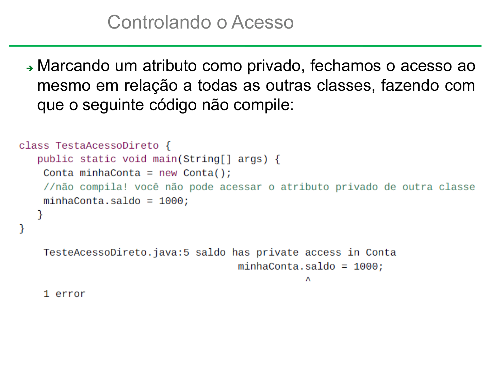

Controlando o Acesso

- Marcando um atributo como privado, fechamos o acesso ao
 mesmo em relação a todas as outras classes, fazendo com
 que o seguinte código não compile:

## Página 9

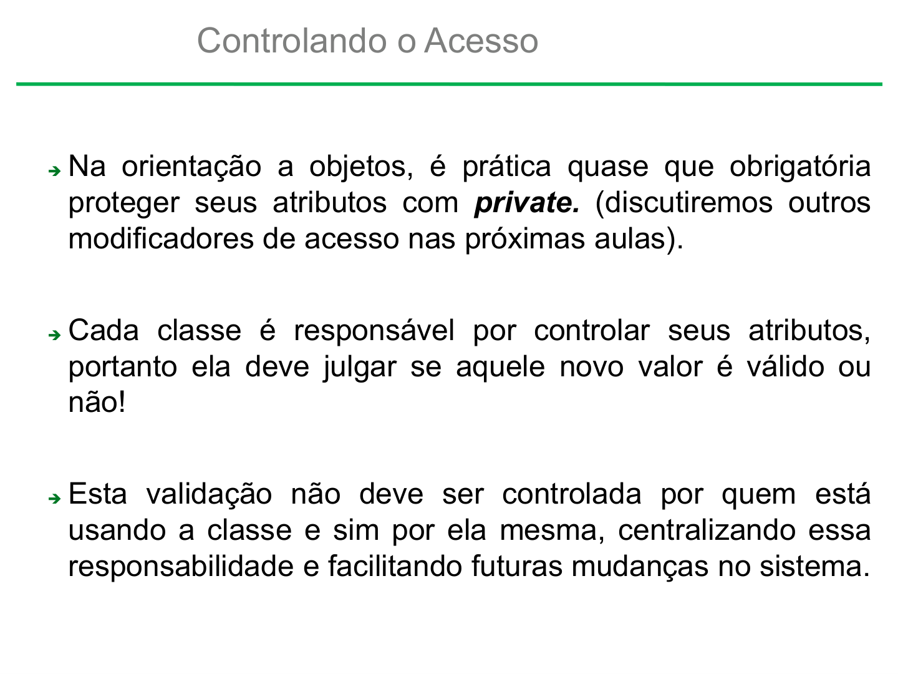

Controlando o Acesso

- Na orientação a objetos, é prática quase que obrigatória
 proteger seus atributos com private. (discutiremos outros
 modificadores de acesso nas próximas aulas).

- Cada classe é responsável por controlar seus atributos,
 portanto ela deve julgar se aquele novo valor é válido ou
 não!

- Esta validação não deve ser controlada por quem está
 usando a classe e sim por ela mesma, centralizando essa
 responsabilidade e facilitando futuras mudanças no sistema.

## Página 10

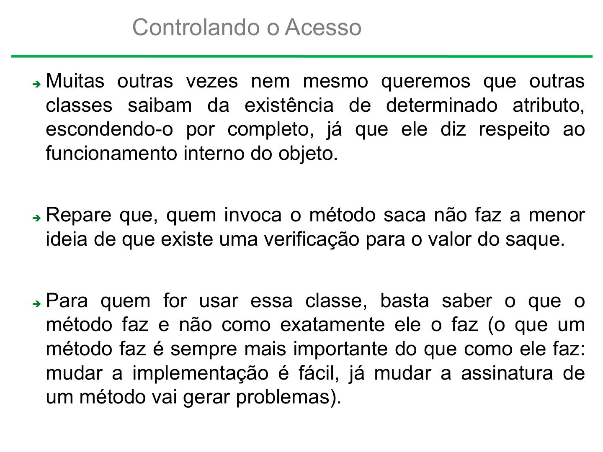

Controlando o Acesso

- Muitas outras vezes nem mesmo queremos que outras
 classes saibam da  existência de determinado  atributo,
 escondendo-o por completo,  já que ele diz respeito ao
 funcionamento interno do objeto.

- Repare que, quem invoca o método saca não faz a menor
  ideia de que existe uma verificação para o valor do saque.

- Para quem  for usar essa classe, basta saber o que o
 método faz e não como exatamente ele o faz (o que um
 método faz é sempre mais importante do que como ele faz:
 mudar a implementação é fácil, já mudar a assinatura de
 um método vai gerar problemas).

## Página 11

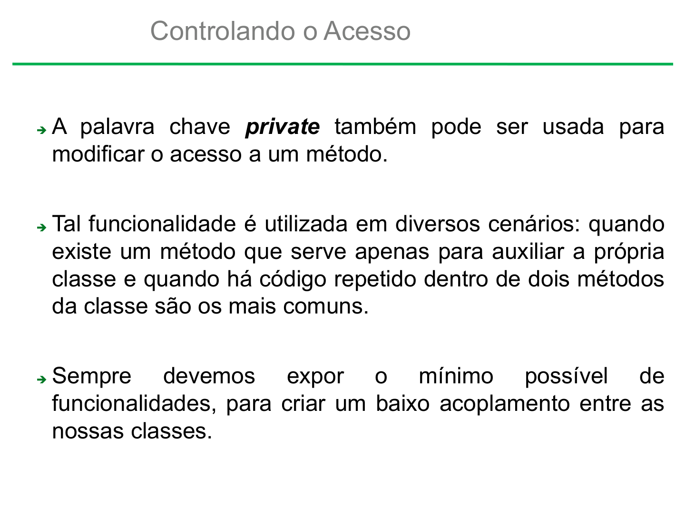

Controlando o Acesso

- A palavra chave private também pode ser usada para
  modificar o acesso a um método.

- Tal funcionalidade é utilizada em diversos cenários: quando
  existe um método que serve apenas para auxiliar a própria
 classe e quando há código repetido dentro de dois métodos
 da classe são os mais comuns.

- Sempre  devemos   expor  o  mínimo   possível  de
  funcionalidades, para criar um baixo acoplamento entre as
 nossas classes.

## Página 12

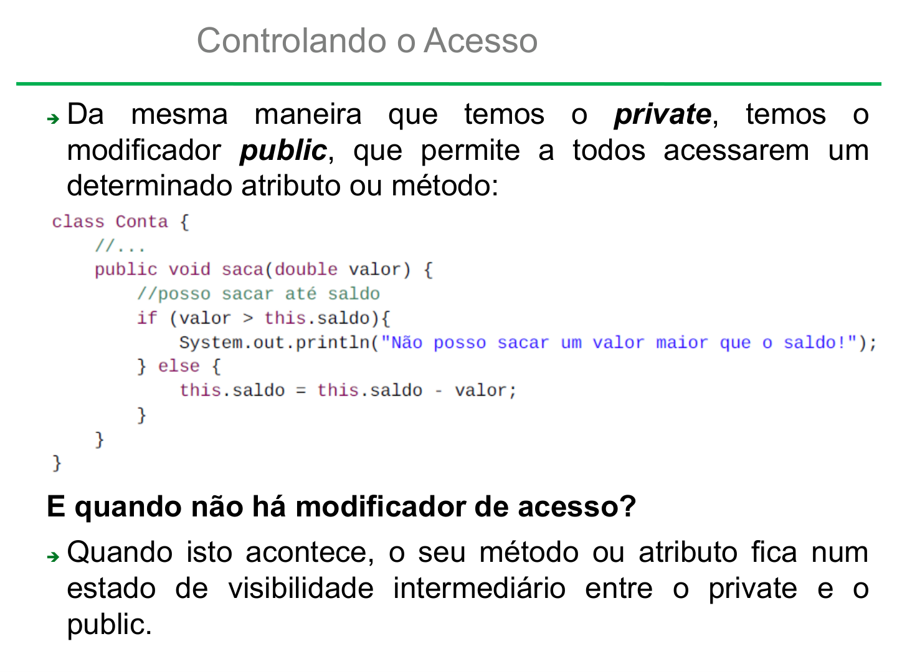

Controlando o Acesso

- Da mesma  maneira  que  temos  o  private,  temos  o
 modificador public, que permite a todos acessarem um
 determinado atributo ou método:

E quando não há modificador de acesso?
- Quando isto acontece, o seu método ou atributo fica num
 estado de  visibilidade intermediário entre o private e o
  public.

## Página 13

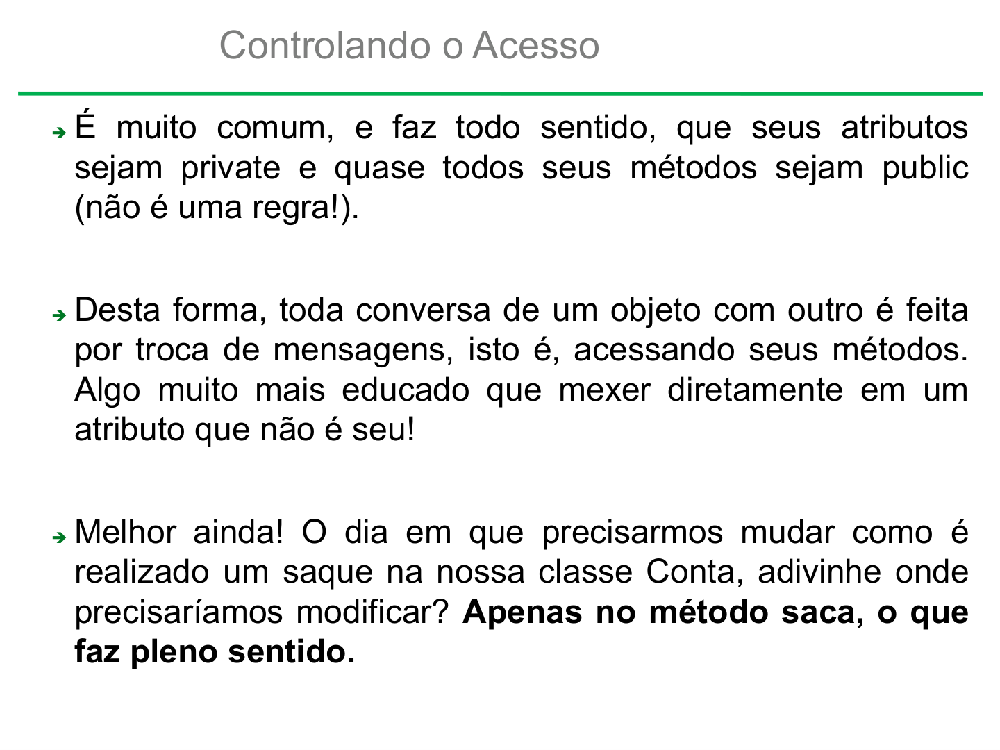

Controlando o Acesso

- É muito comum, e faz todo sentido, que seus atributos
 sejam private e quase todos seus métodos sejam public
 (não é uma regra!).

- Desta forma, toda conversa de um objeto com outro é feita
 por troca de mensagens, isto é, acessando seus métodos.
 Algo muito mais educado que mexer diretamente em um
  atributo que não é seu!

- Melhor ainda! O dia em que precisarmos mudar como é
  realizado um saque na nossa classe Conta, adivinhe onde
 precisaríamos modificar? Apenas no método saca, o que
 faz pleno sentido.

## Página 14

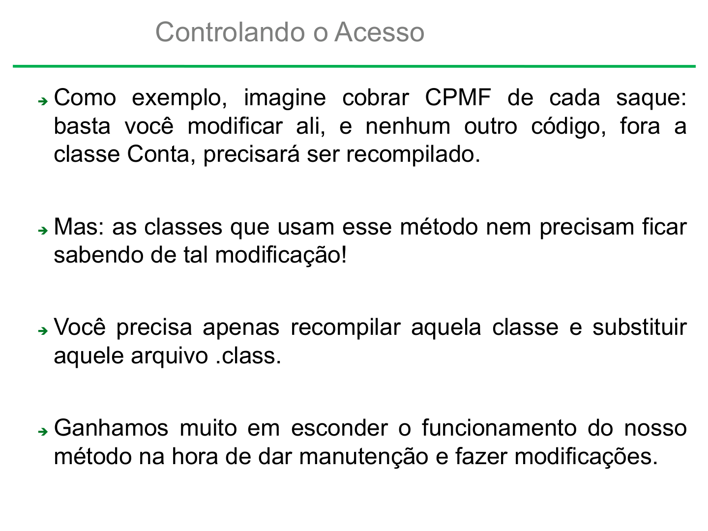

Controlando o Acesso

- Como exemplo, imagine cobrar CPMF de cada saque:
 basta você modificar  ali, e nenhum outro código, fora a
 classe Conta, precisará ser recompilado.

- Mas: as classes que usam esse método nem precisam ficar
 sabendo de tal modificação!

- Você precisa apenas recompilar aquela classe e substituir
 aquele arquivo .class.

- Ganhamos muito em esconder o funcionamento do nosso
 método na hora de dar manutenção e fazer modificações.

## Página 15

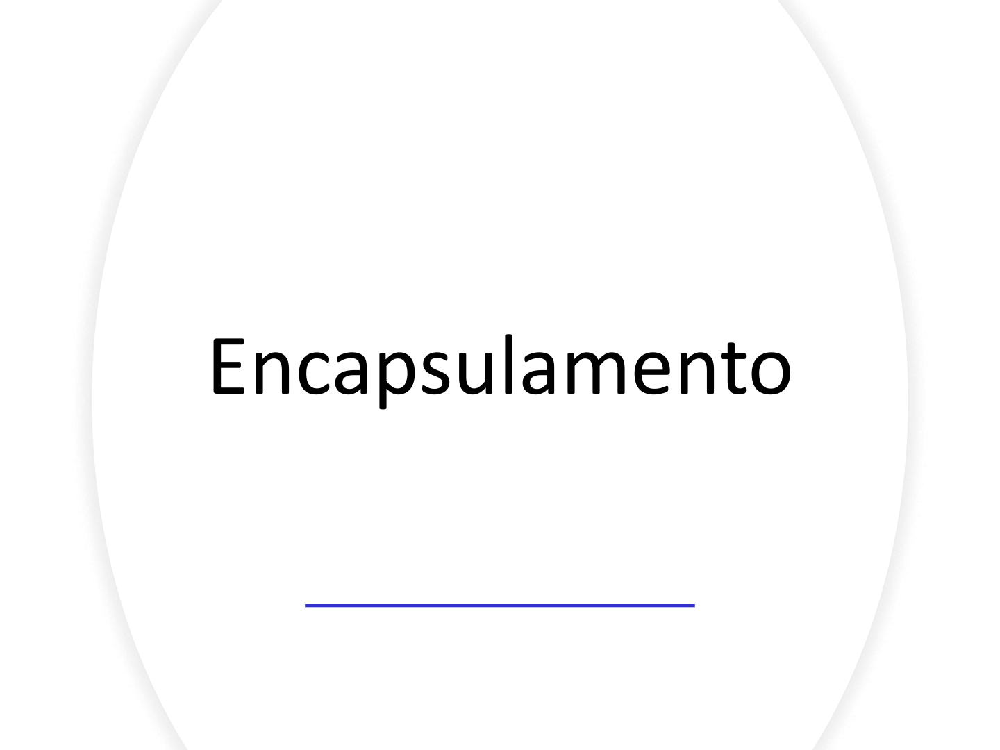

Encapsulamento

## Página 16

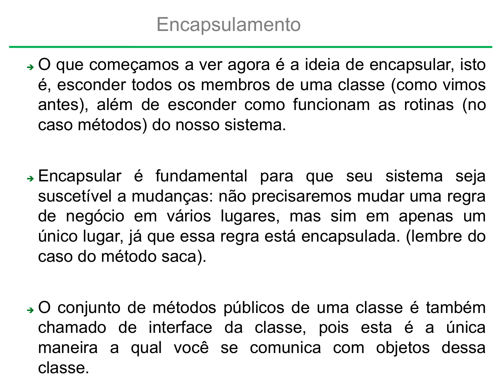

Encapsulamento

- O que começamos a ver agora é a ideia de encapsular, isto
  é, esconder todos os membros de uma classe (como vimos
  antes), além de esconder como funcionam as rotinas (no
 caso métodos) do nosso sistema.

- Encapsular é fundamental para que seu  sistema  seja
  suscetível a mudanças: não precisaremos mudar uma regra
 de negócio em vários lugares, mas sim em apenas um
 único lugar, já que essa regra está encapsulada. (lembre do
 caso do método saca).

- O conjunto de métodos públicos de uma classe é também
 chamado de  interface da  classe,  pois esta é a única
 maneira a qual você se comunica com  objetos dessa
  classe.

## Página 17

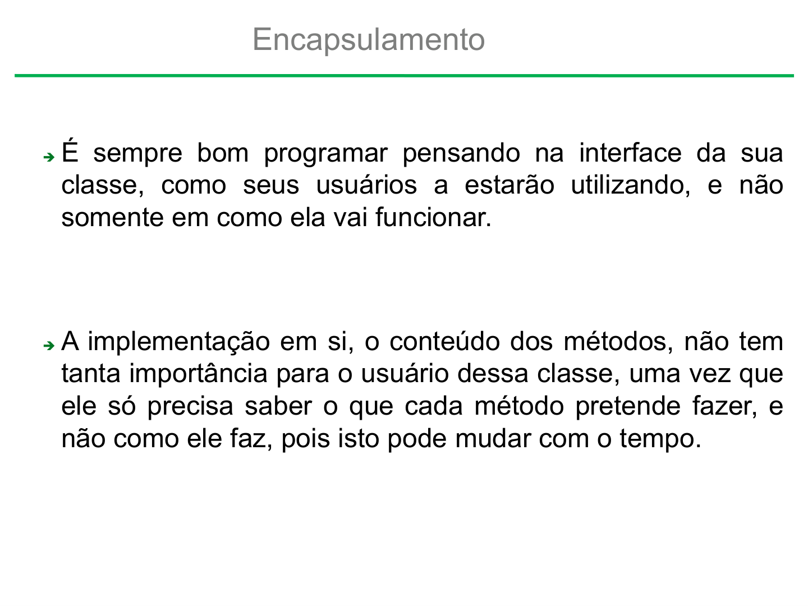

Encapsulamento

- É sempre bom programar pensando na interface da sua
  classe, como seus usuários a estarão utilizando, e não
 somente em como ela vai funcionar.

- A implementação em si, o conteúdo dos métodos, não tem
  tanta importância para o usuário dessa classe, uma vez que
  ele só precisa saber o que cada método pretende fazer, e
 não como ele faz, pois isto pode mudar com o tempo.

## Página 18

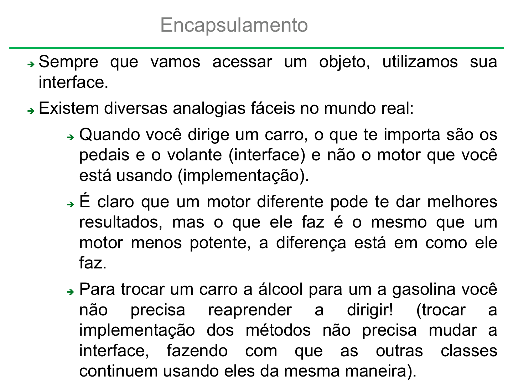

Encapsulamento

- Sempre que vamos acessar um  objeto,  utilizamos sua
  interface.
- Existem diversas analogias fáceis no mundo real:
    - Quando você dirige um carro, o que te importa são os
      pedais e o volante (interface) e não o motor que você
      está usando (implementação).
   - É claro que um motor diferente pode te dar melhores
       resultados, mas o que ele faz é o mesmo que um
      motor menos potente, a diferença está em como ele
        faz.
    - Para trocar um carro a álcool para um a gasolina você
      não   precisa   reaprender  a    dirigir!   (trocar  a
      implementação dos métodos não precisa mudar a
       interface,  fazendo  com  que  as  outras  classes
      continuem usando eles da mesma maneira).

## Página 19

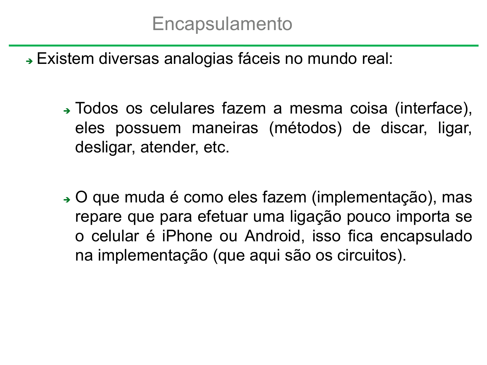

Encapsulamento

- Existem diversas analogias fáceis no mundo real:

    - Todos os celulares fazem a mesma coisa (interface),
       eles possuem maneiras (métodos) de  discar,  ligar,
       desligar, atender, etc.

   - O que muda é como eles fazem (implementação), mas
      repare que para efetuar uma ligação pouco importa se
      o celular é iPhone ou Android, isso fica encapsulado
      na implementação (que aqui são os circuitos).

## Página 20

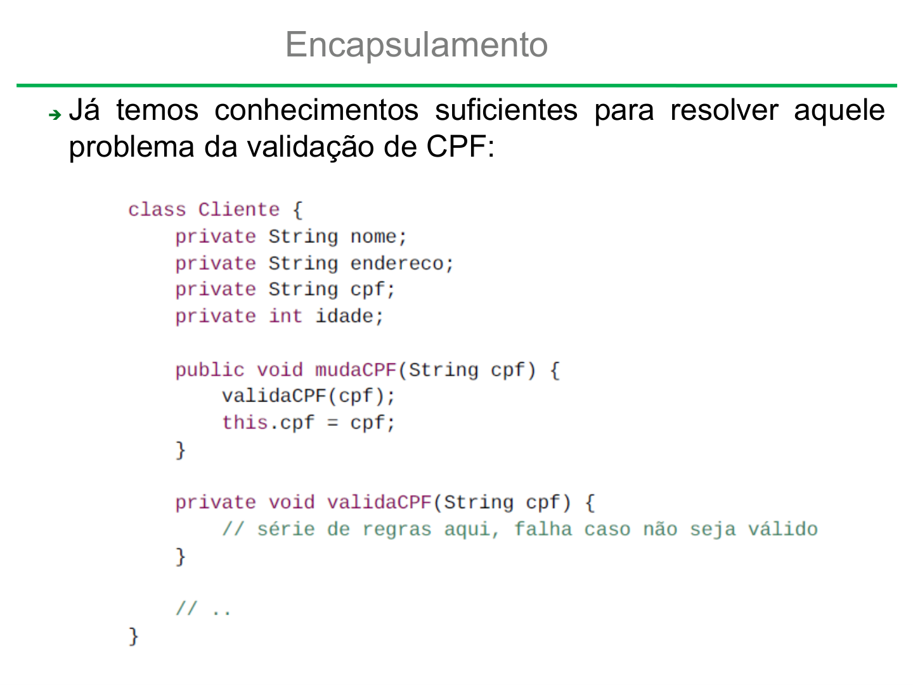

Encapsulamento

- Já temos conhecimentos suficientes para resolver aquele
 problema da validação de CPF:

## Página 21

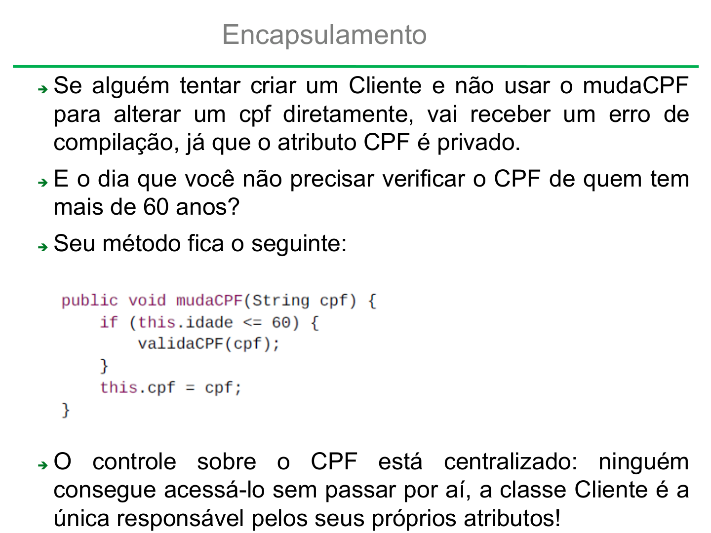

Encapsulamento

- Se alguém tentar criar um Cliente e não usar o mudaCPF
 para alterar um cpf diretamente, vai receber um erro de
 compilação, já que o atributo CPF é privado.
- E o dia que você não precisar verificar o CPF de quem tem
 mais de 60 anos?
- Seu método fica o seguinte:

- O  controle  sobre  o CPF  está  centralizado:  ninguém
 consegue acessá-lo sem passar por aí, a classe Cliente é a
 única responsável pelos seus próprios atributos!

## Página 22

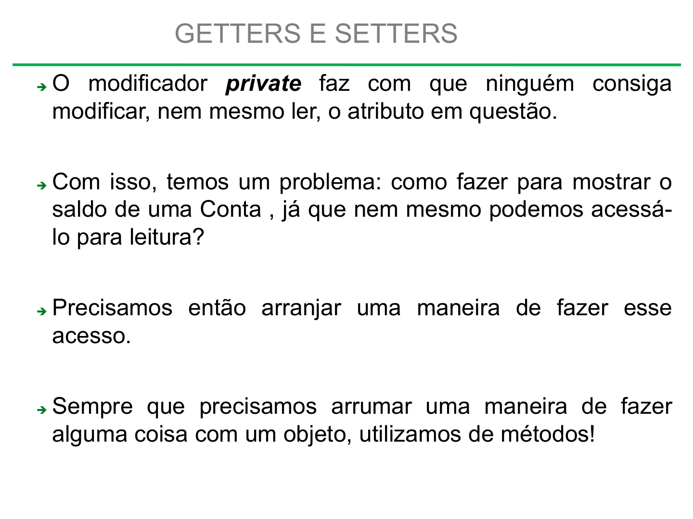

GETTERS E SETTERS

- O  modificador  private  faz com que ninguém  consiga
  modificar, nem mesmo ler, o atributo em questão.

- Com isso, temos um problema: como fazer para mostrar o
 saldo de uma Conta , já que nem mesmo podemos acessá-
  lo para leitura?

- Precisamos então  arranjar uma maneira de fazer esse
 acesso.

- Sempre que precisamos arrumar uma maneira de fazer
 alguma coisa com um objeto, utilizamos de métodos!

## Página 23

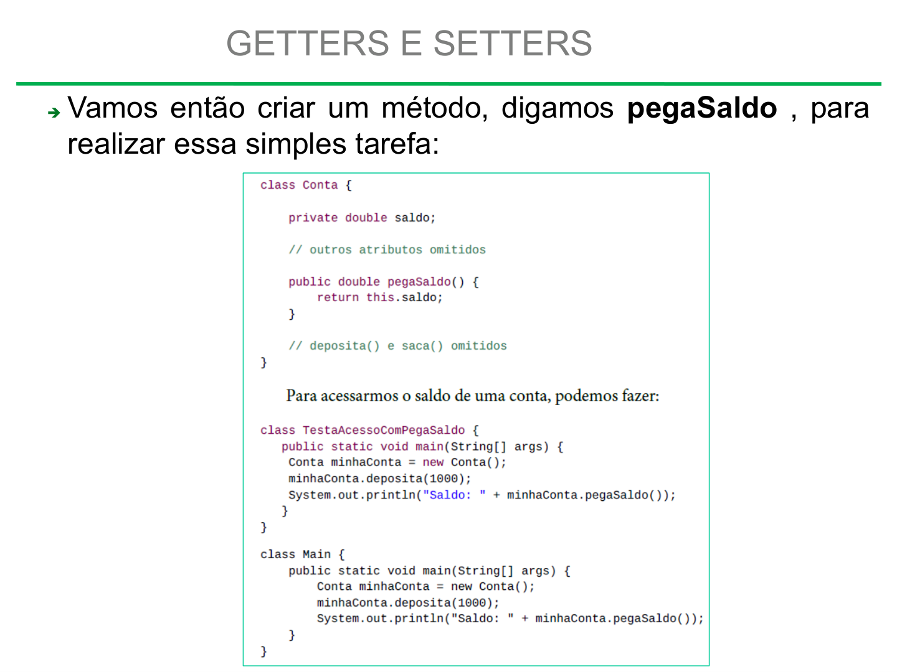

GETTERS E SETTERS

- Vamos então criar um método, digamos pegaSaldo , para
  realizar essa simples tarefa:

## Página 24

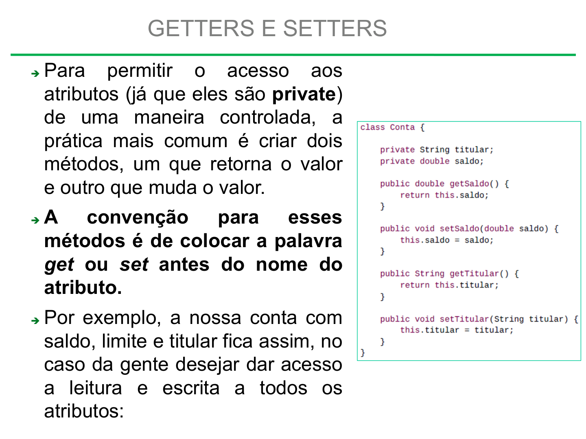

GETTERS E SETTERS

- Para   permitir  o  acesso  aos
  atributos (já que eles são private)
 de uma  maneira  controlada, a
  prática mais comum é criar dois
 métodos, um que retorna o valor
 e outro que muda o valor.
- A   convenção   para   esses
 métodos é de colocar a palavra
 get ou set antes do nome do
  atributo.
- Por exemplo, a nossa conta com
  saldo, limite e titular fica assim, no
 caso da gente desejar dar acesso
 a  leitura e  escrita a  todos os
  atributos:

## Página 25

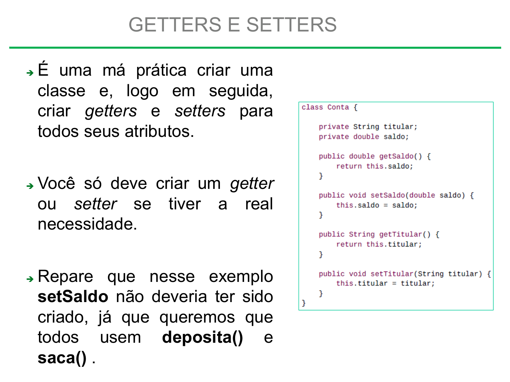

GETTERS E SETTERS

- É uma má prática  criar uma
 classe  e,  logo em  seguida,
  criar  getters e  setters  para
 todos seus atributos.

- Você só deve criar um getter
 ou  setter  se   tiver  a  real
 necessidade.

- Repare que  nesse  exemplo
 setSaldo não deveria ter sido
  criado, já que queremos que
 todos  usem   deposita()  e
 saca() .

## Página 26

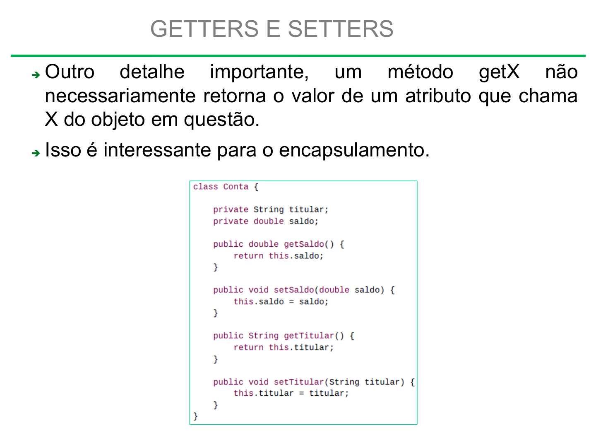

GETTERS E SETTERS

- Outro   detalhe   importante,  um  método  getX  não
 necessariamente retorna o valor de um atributo que chama
 X do objeto em questão.
- Isso é interessante para o encapsulamento.

## Página 27

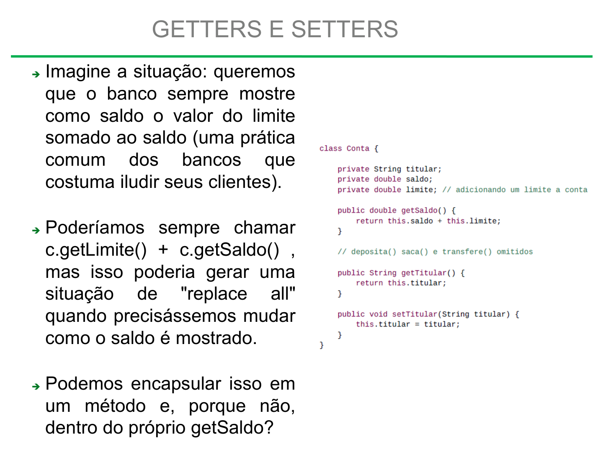

GETTERS E SETTERS

- Imagine a situação: queremos
 que o banco sempre mostre
 como saldo o valor do limite
 somado ao saldo (uma prática
 comum  dos  bancos  que
 costuma iludir seus clientes).

- Poderíamos sempre chamar
  c.getLimite() + c.getSaldo()  ,
 mas isso poderia gerar uma
  situação  de   "replace    all"
 quando precisássemos mudar
 como o saldo é mostrado.

- Podemos encapsular isso em
 um método  e, porque  não,
  dentro do próprio getSaldo?

## Página 28

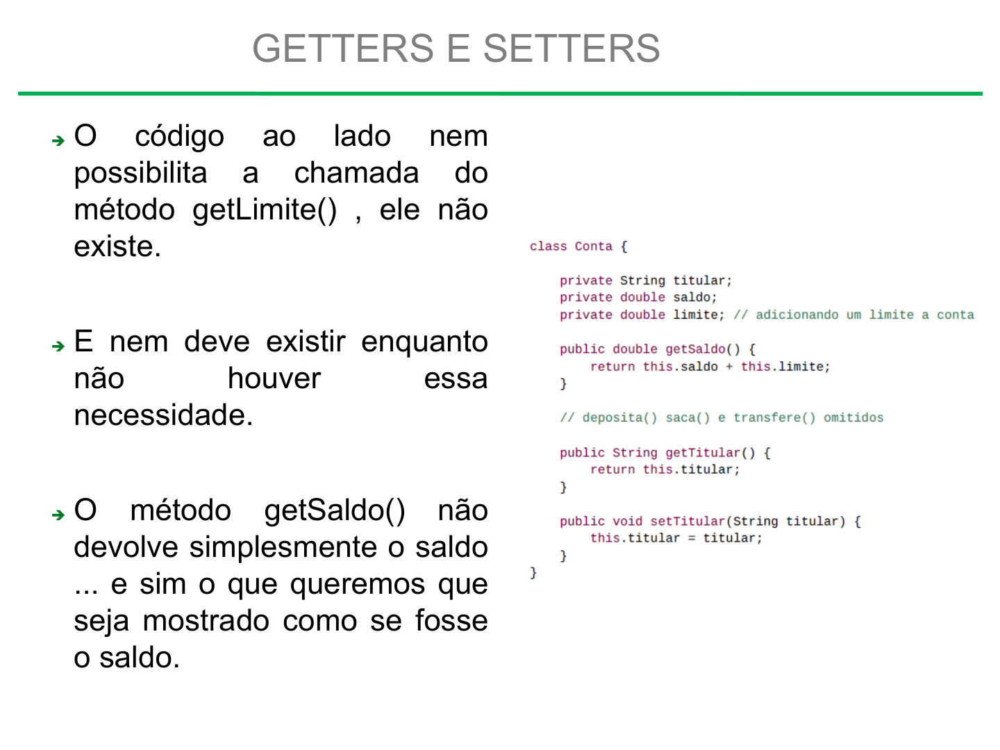

GETTERS E SETTERS

- O  código  ao   lado  nem
  possibilita  a  chamada  do
 método getLimite()  , ele não
  existe.

- E nem deve existir enquanto
 não       houver      essa
  necessidade.

- O  método  getSaldo()  não
  devolve simplesmente o saldo
   ... e sim o que queremos que
  seja mostrado como se fosse
 o saldo.

## Página 29

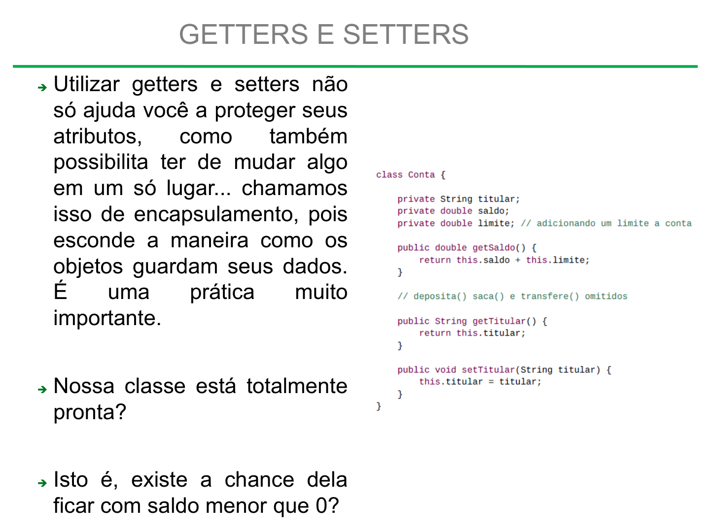

GETTERS E SETTERS

- Utilizar getters e setters não
 só ajuda você a proteger seus
  atributos,   como   também
  possibilita ter de mudar algo
 em um só lugar... chamamos
  isso de encapsulamento, pois
 esconde a maneira como os
  objetos guardam seus dados.
 É   uma    prática    muito
  importante.

- Nossa classe está totalmente
  pronta?

- Isto é, existe a chance dela
  ficar com saldo menor que 0?

## Página 30

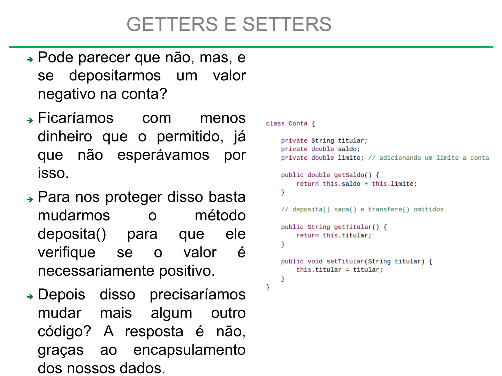

GETTERS E SETTERS

- Pode parecer que não, mas, e
 se  depositarmos um  valor
  negativo na conta?
- Ficaríamos   com   menos
  dinheiro que o permitido,  já
 que  não  esperávamos  por
  isso.
- Para nos proteger disso basta
 mudarmos    o    método
  deposita()   para  que   ele
  verifique   se  o   valor  é
 necessariamente positivo.
- Depois  disso  precisaríamos
 mudar  mais  algum   outro
 código? A resposta é  não,
 graças  ao  encapsulamento
 dos nossos dados.

## Página 31

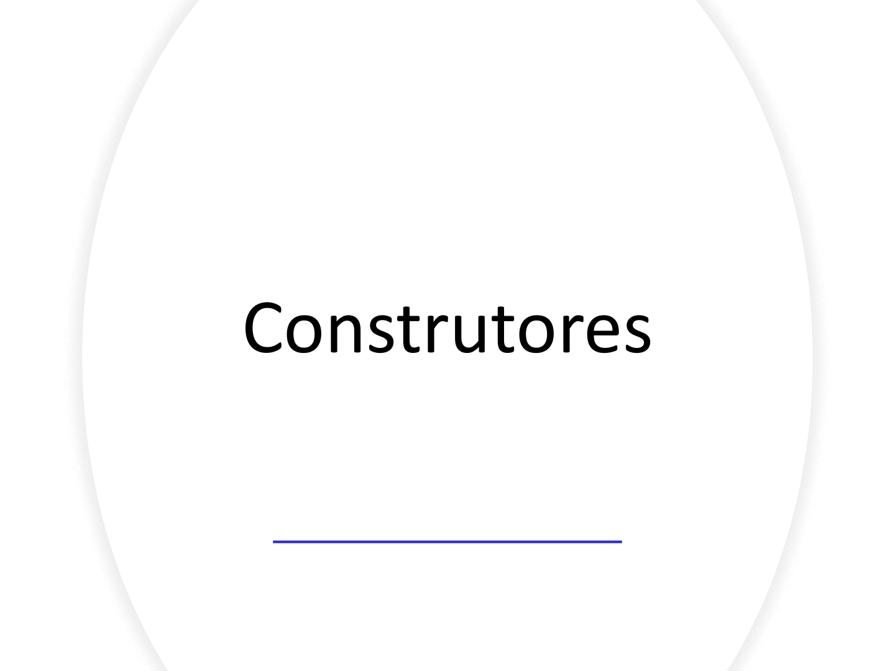

Construtores

## Página 32

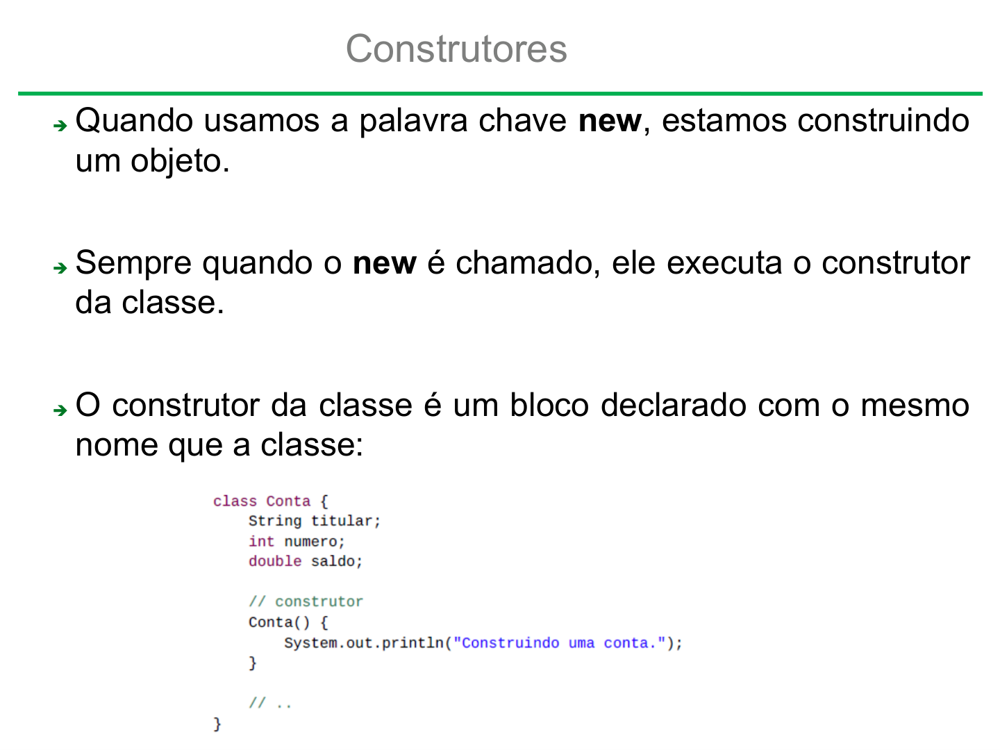

Construtores

- Quando usamos a palavra chave new, estamos construindo
 um objeto.

- Sempre quando o new é chamado, ele executa o construtor
 da classe.

- O construtor da classe é um bloco declarado com o mesmo
 nome que a classe:

## Página 33

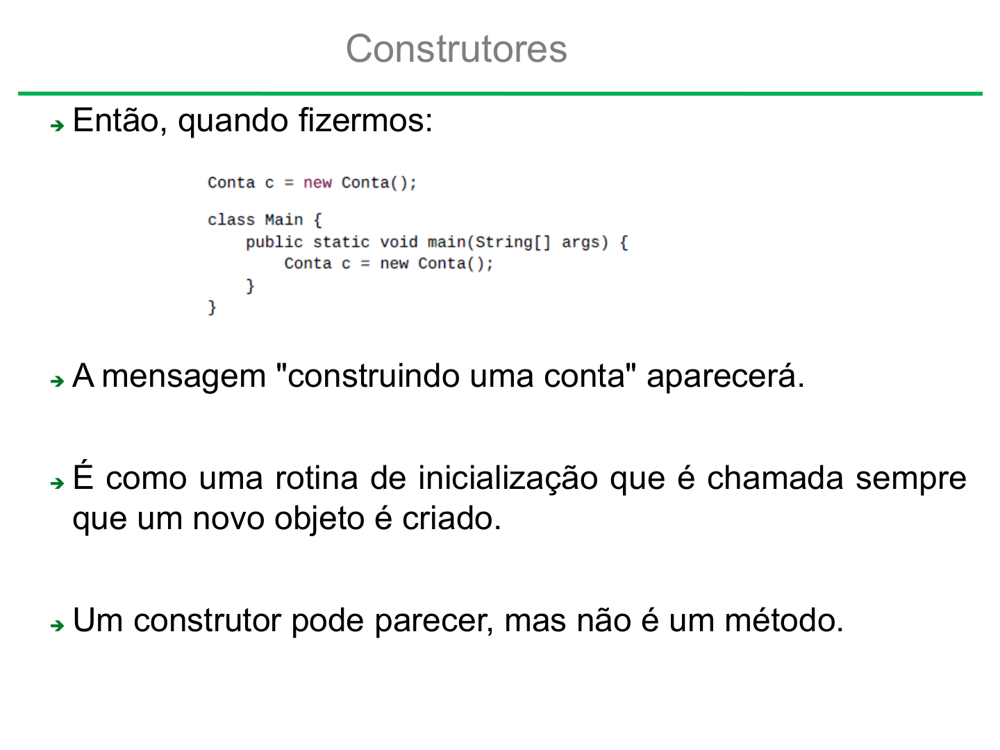

Construtores

- Então, quando fizermos:

- A mensagem "construindo uma conta" aparecerá.

- É como uma rotina de inicialização que é chamada sempre
 que um novo objeto é criado.

- Um construtor pode parecer, mas não é um método.

## Página 34

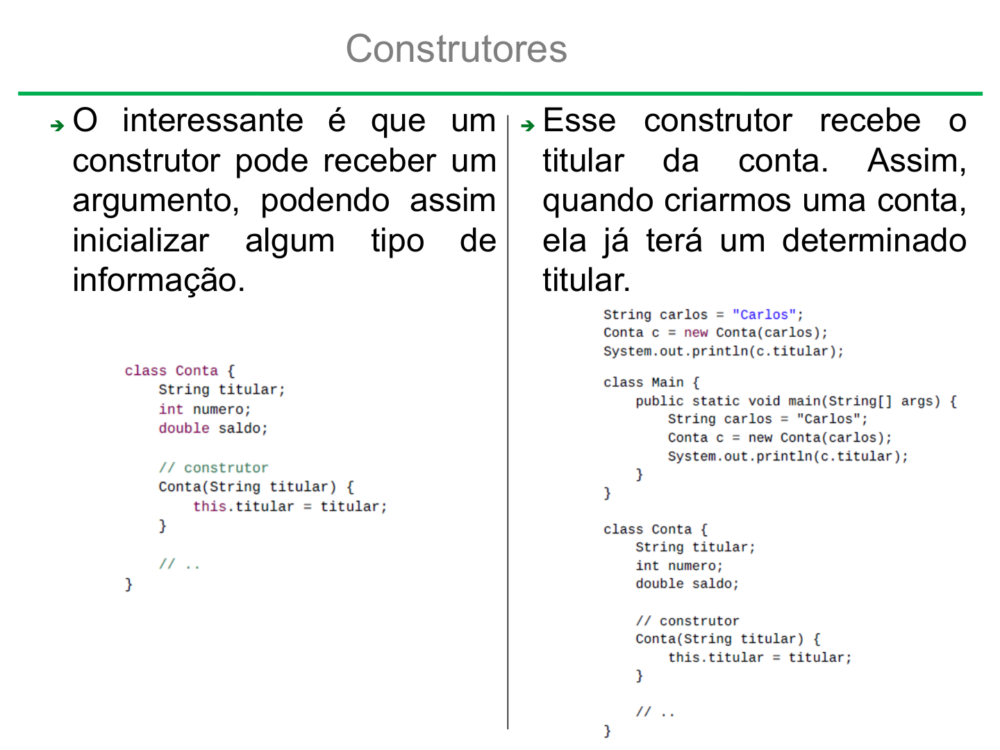

Construtores

- O  interessante é que um - Esse  construtor  recebe o
  construtor pode receber um    titular  da   conta.  Assim,
 argumento, podendo assim  quando criarmos uma conta,
  inicializar  algum   tipo  de   ela já terá um determinado
 informação.                           titular.

## Página 35

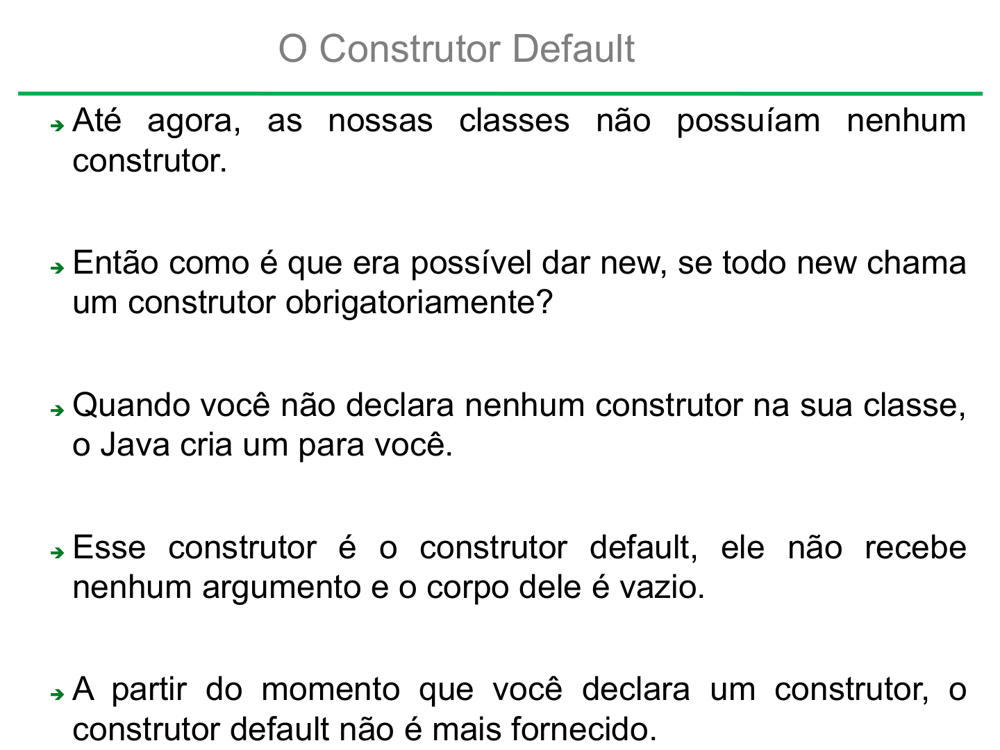

O Construtor Default

- Até  agora, as nossas  classes não possuíam nenhum
  construtor.

- Então como é que era possível dar new, se todo new chama
 um construtor obrigatoriamente?

- Quando você não declara nenhum construtor na sua classe,
 o Java cria um para você.

- Esse construtor é o construtor  default, ele não recebe
 nenhum argumento e o corpo dele é vazio.

- A partir do momento que você declara um construtor, o
  construtor default não é mais fornecido.

## Página 36

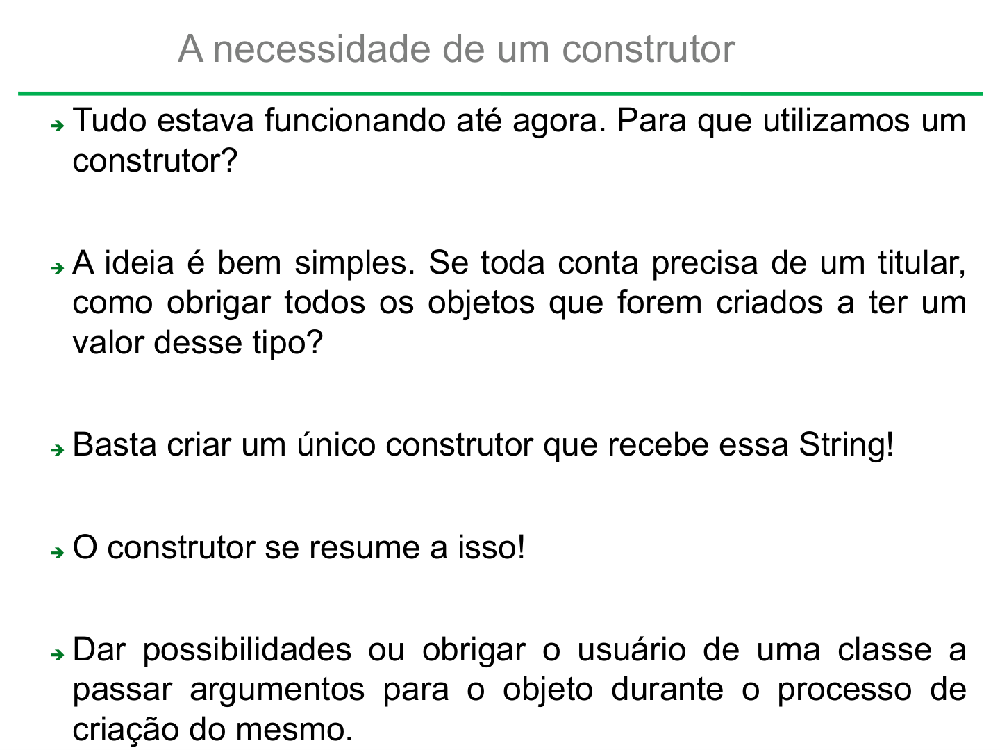

A necessidade de um construtor

- Tudo estava funcionando até agora. Para que utilizamos um
 construtor?

- A ideia é bem simples. Se toda conta precisa de um titular,
 como obrigar todos os objetos que forem criados a ter um
  valor desse tipo?

- Basta criar um único construtor que recebe essa String!

- O construtor se resume a isso!

- Dar possibilidades ou obrigar o usuário de uma classe a
 passar argumentos para o objeto durante o processo de
 criação do mesmo.

## Página 37

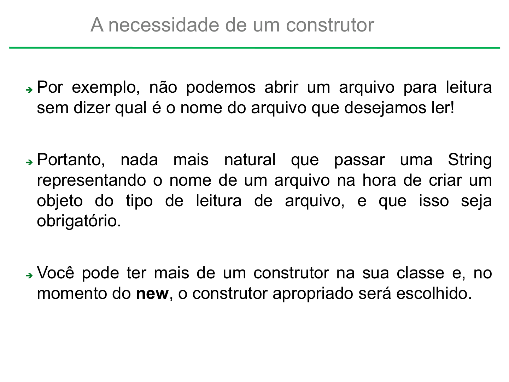

A necessidade de um construtor

- Por exemplo, não podemos abrir um arquivo para leitura
 sem dizer qual é o nome do arquivo que desejamos ler!

- Portanto,  nada  mais  natural  que  passar uma  String
 representando o nome de um arquivo na hora de criar um
 objeto do  tipo de  leitura de  arquivo, e que  isso  seja
  obrigatório.

- Você pode ter mais de um construtor na sua classe e, no
 momento do new, o construtor apropriado será escolhido.

## Página 38

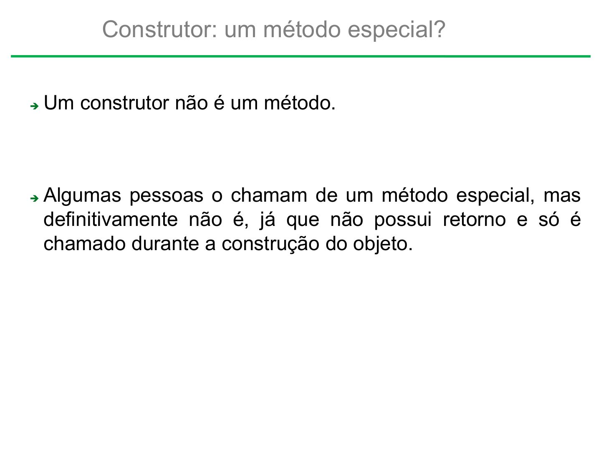

Construtor: um método especial?

- Um construtor não é um método.

- Algumas pessoas o chamam de um método especial, mas
  definitivamente não é, já que não possui retorno e só é
 chamado durante a construção do objeto.

## Página 39

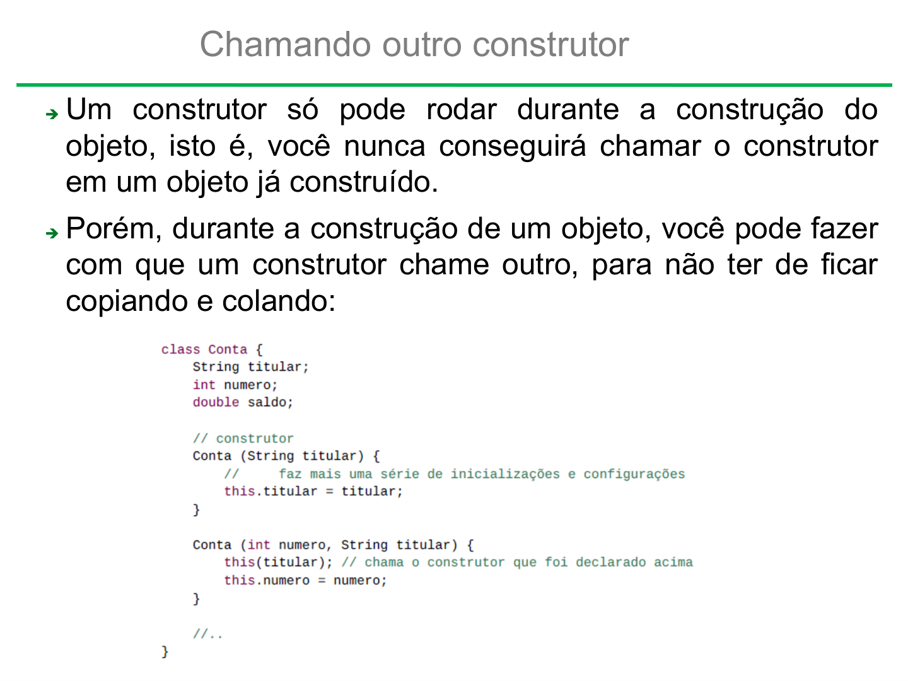

Chamando outro construtor

- Um construtor só pode rodar durante a construção do
  objeto, isto é, você nunca conseguirá chamar o construtor
 em um objeto já construído.
- Porém, durante a construção de um objeto, você pode fazer
 com que um construtor chame outro, para não ter de ficar
 copiando e colando:

## Página 40

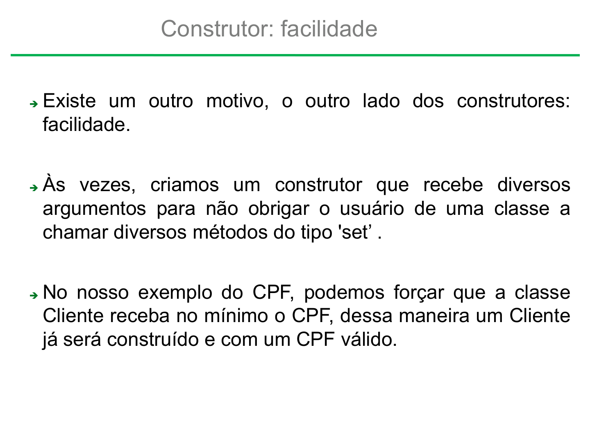

Construtor: facilidade

- Existe um outro motivo, o outro lado dos construtores:
  facilidade.

- Às vezes, criamos um  construtor que recebe  diversos
 argumentos para não obrigar o usuário de uma classe a
 chamar diversos métodos do tipo 'set’ .

- No nosso exemplo do CPF, podemos forçar que a classe
  Cliente receba no mínimo o CPF, dessa maneira um Cliente
  já será construído e com um CPF válido.

## Página 41

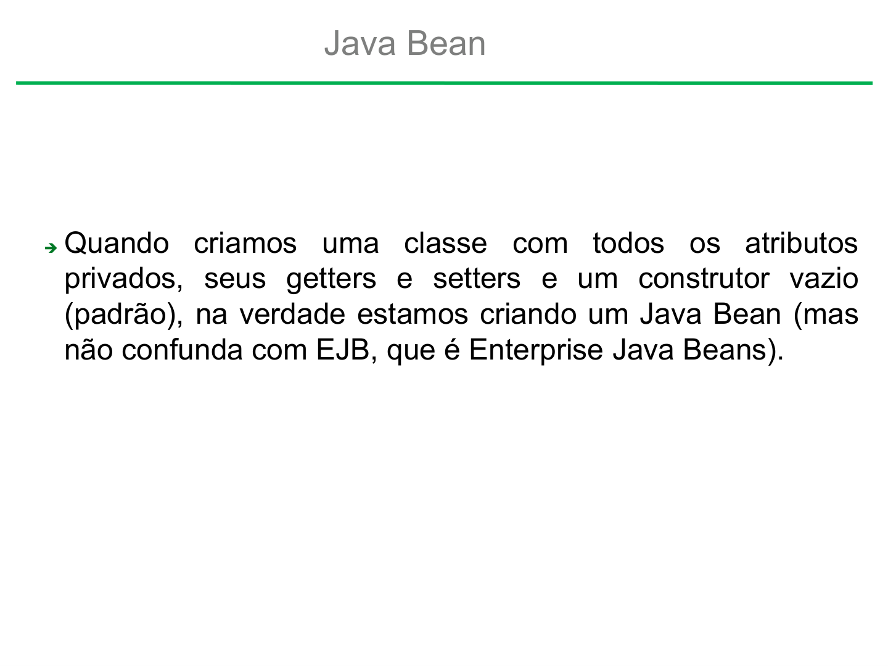

Java Bean

- Quando  criamos uma  classe com  todos  os  atributos
  privados, seus  getters e  setters e um construtor vazio
  (padrão), na verdade estamos criando um Java Bean (mas
 não confunda com EJB, que é Enterprise Java Beans).

## Página 42

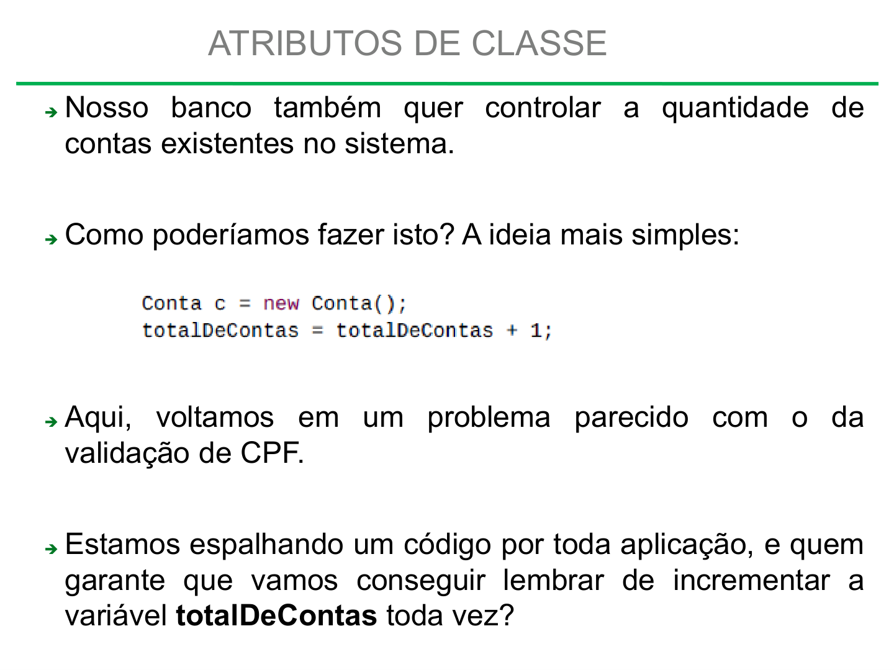

ATRIBUTOS DE CLASSE

- Nosso banco também quer  controlar a quantidade de
 contas existentes no sistema.

- Como poderíamos fazer isto? A ideia mais simples:

- Aqui,  voltamos em um problema  parecido com o da
 validação de CPF.

- Estamos espalhando um código por toda aplicação, e quem
 garante que vamos conseguir lembrar de incrementar a
  variável totalDeContas toda vez?

## Página 43

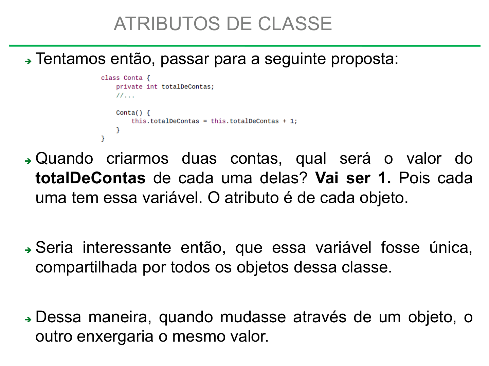

ATRIBUTOS DE CLASSE

- Tentamos então, passar para a seguinte proposta:

- Quando  criarmos duas  contas,  qual  será o  valor do
 totalDeContas de cada uma delas? Vai ser 1. Pois cada
 uma tem essa variável. O atributo é de cada objeto.

- Seria interessante então, que essa variável fosse única,
 compartilhada por todos os objetos dessa classe.

- Dessa maneira, quando mudasse através de um objeto, o
 outro enxergaria o mesmo valor.

## Página 44

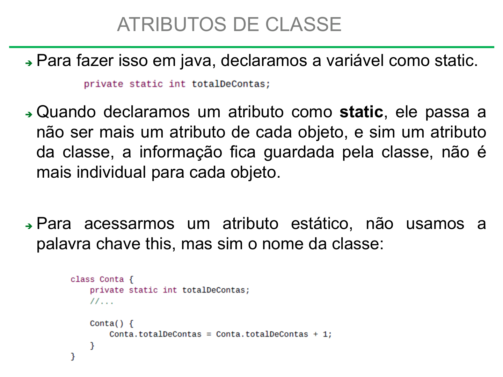

ATRIBUTOS DE CLASSE

- Para fazer isso em java, declaramos a variável como static.

- Quando declaramos um atributo como static, ele passa a
 não ser mais um atributo de cada objeto, e sim um atributo
 da classe, a informação fica guardada pela classe, não é
 mais individual para cada objeto.

- Para acessarmos um  atributo  estático, não usamos a
 palavra chave this, mas sim o nome da classe:

## Página 45

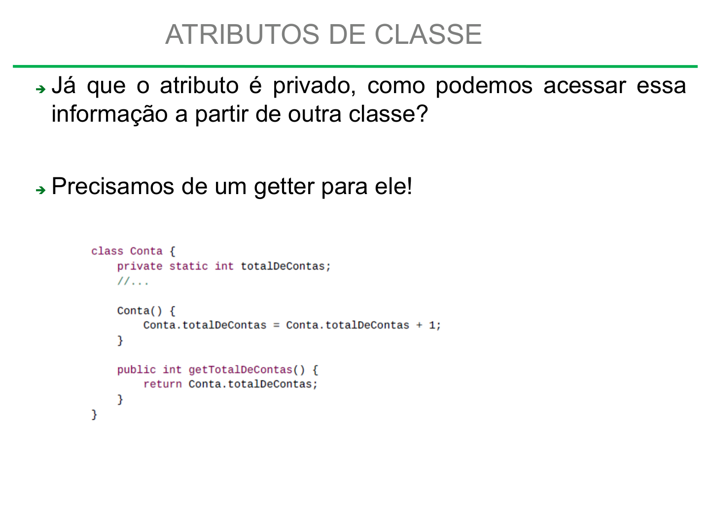

ATRIBUTOS DE CLASSE

- Já que o atributo é privado, como podemos acessar essa
 informação a partir de outra classe?

- Precisamos de um getter para ele!

## Página 46

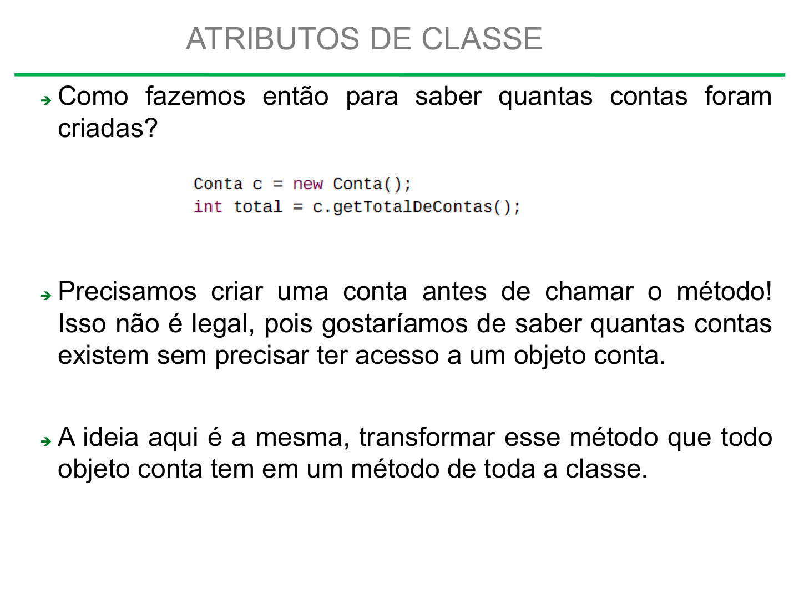

ATRIBUTOS DE CLASSE

- Como fazemos então para saber quantas contas foram
 criadas?

- Precisamos criar uma conta antes de chamar o método!
 Isso não é legal, pois gostaríamos de saber quantas contas
 existem sem precisar ter acesso a um objeto conta.

- A ideia aqui é a mesma, transformar esse método que todo
 objeto conta tem em um método de toda a classe.

## Página 47

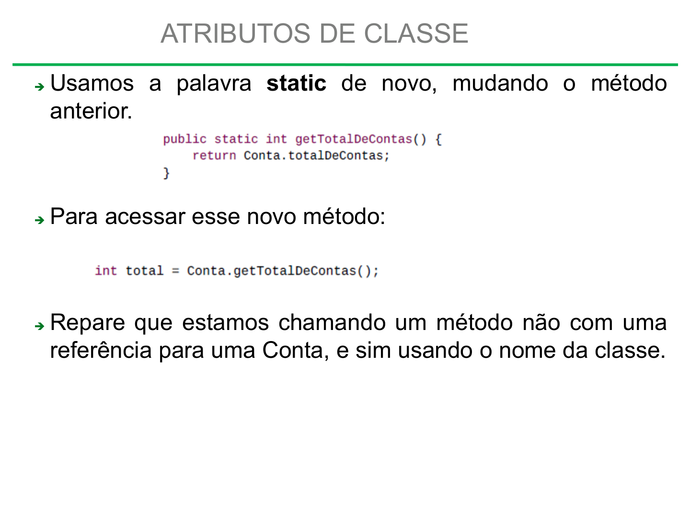

ATRIBUTOS DE CLASSE

- Usamos a palavra static de novo, mudando o método
  anterior.

- Para acessar esse novo método:

- Repare que estamos chamando um método não com uma
  referência para uma Conta, e sim usando o nome da classe.

## Página 48

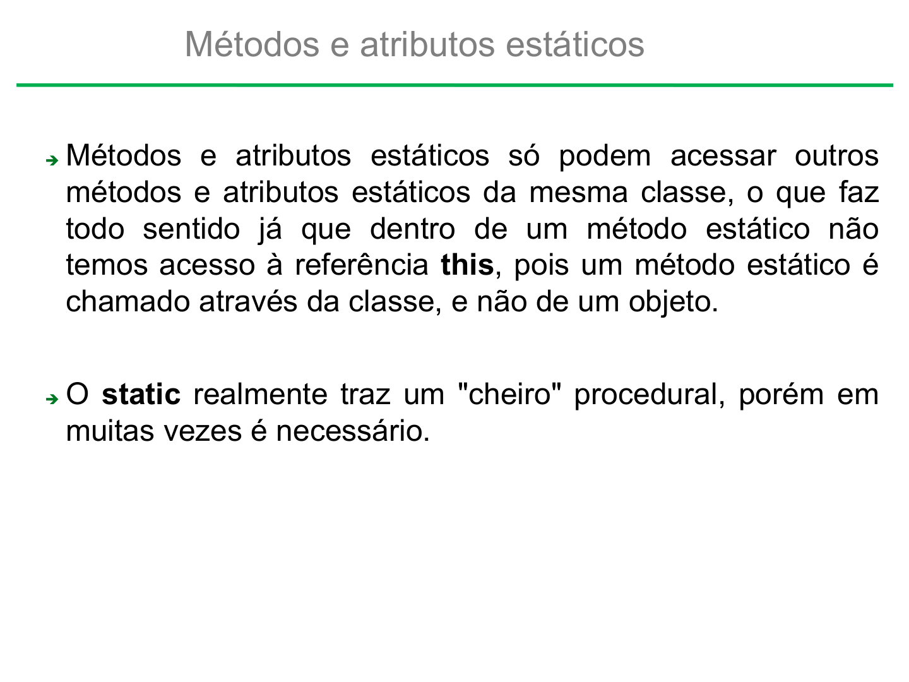

Métodos e atributos estáticos

- Métodos e atributos estáticos só podem acessar outros
 métodos e atributos estáticos da mesma classe, o que faz
 todo sentido  já que dentro de um método estático não
 temos acesso à referência this, pois um método estático é
 chamado através da classe, e não de um objeto.

- O static realmente traz um "cheiro" procedural, porém em
 muitas vezes é necessário.

## Página 49

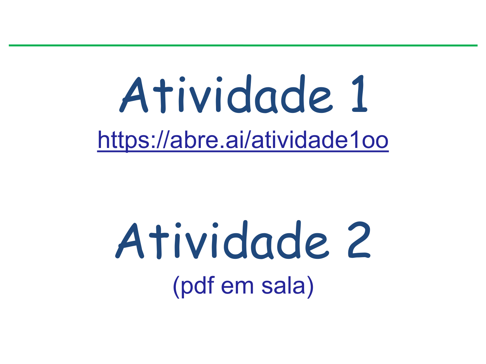

Atividade 1
https://abre.ai/atividade1oo

 Atividade 2
       (pdf em sala)

## Página 50

Dúvidas

alana.neo@ifms.edu.br
