Arquivo original: `Aula Herança.pdf`

## Página 1

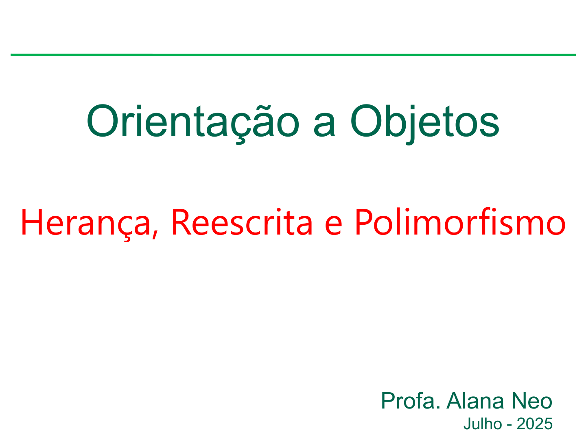

Orientação a Objetos

Herança, Reescrita e Polimorfismo

                                    Profa. Alana Neo
                                                         Julho - 2025

## Página 2

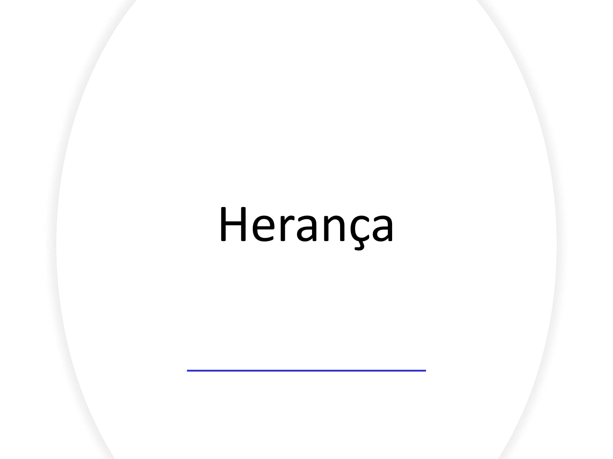

Herança

## Página 3

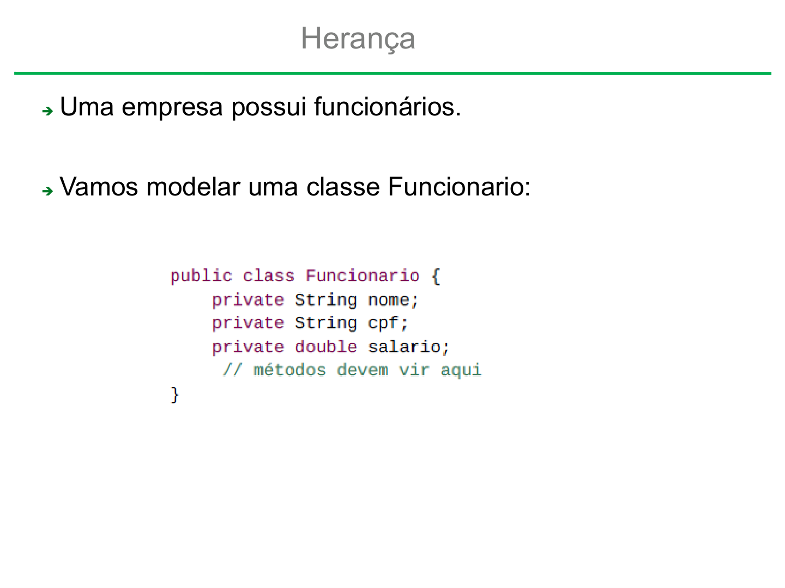

Herança

- Uma empresa possui funcionários.

- Vamos modelar uma classe Funcionario:

## Página 4

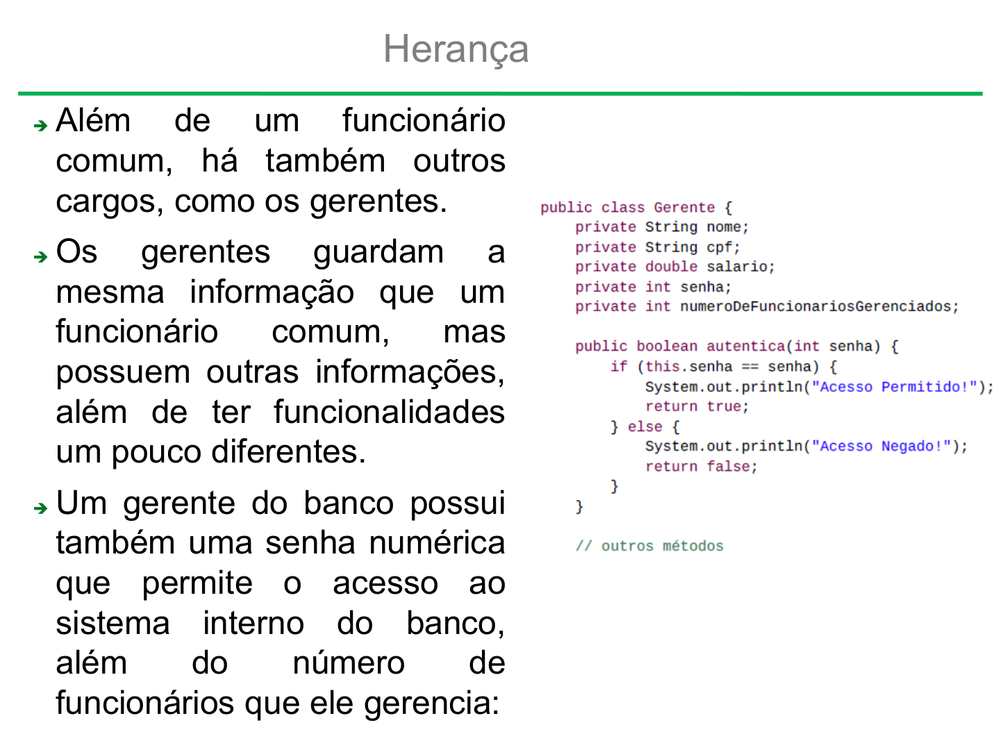

Herança

- Além  de  um   funcionário
 comum, há também  outros
 cargos, como os gerentes.
- Os   gerentes  guardam  a
 mesma informação que um
  funcionário   comum,   mas
 possuem outras informações,
 além de  ter  funcionalidades
 um pouco diferentes.
- Um gerente do banco possui
 também uma senha numérica
 que  permite  o  acesso  ao
 sistema  interno  do  banco,
 além   do   número   de
  funcionários que ele gerencia:

## Página 5

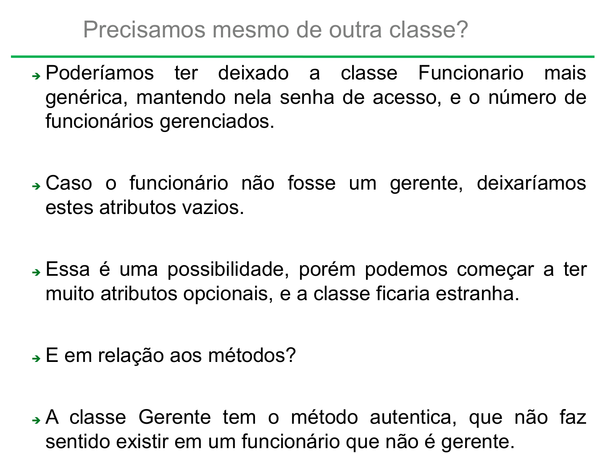

Precisamos mesmo de outra classe?

- Poderíamos   ter  deixado  a  classe  Funcionario  mais
 genérica, mantendo nela senha de acesso, e o número de
  funcionários gerenciados.

- Caso o funcionário não fosse um gerente, deixaríamos
 estes atributos vazios.

- Essa é uma possibilidade, porém podemos começar a ter
 muito atributos opcionais, e a classe ficaria estranha.

- E em relação aos métodos?

- A classe Gerente tem o método autentica, que não faz
 sentido existir em um funcionário que não é gerente.

## Página 6

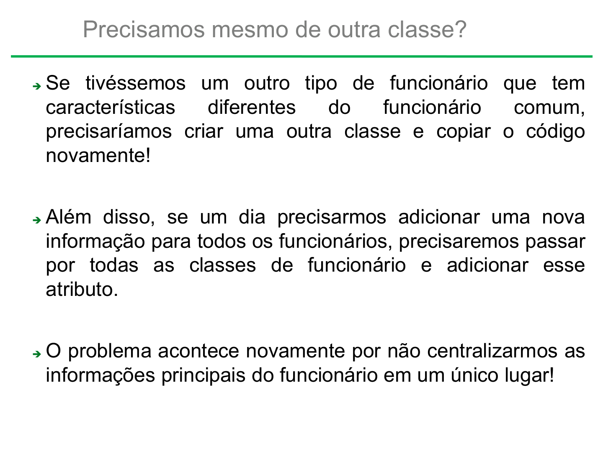

Precisamos mesmo de outra classe?

- Se tivéssemos um  outro  tipo de  funcionário que tem
  características    diferentes   do    funcionário   comum,
 precisaríamos  criar uma outra classe e copiar o código
 novamente!

- Além disso, se um dia precisarmos adicionar uma nova
 informação para todos os funcionários, precisaremos passar
 por todas as  classes de  funcionário e  adicionar esse
  atributo.

- O problema acontece novamente por não centralizarmos as
 informações principais do funcionário em um único lugar!

## Página 7

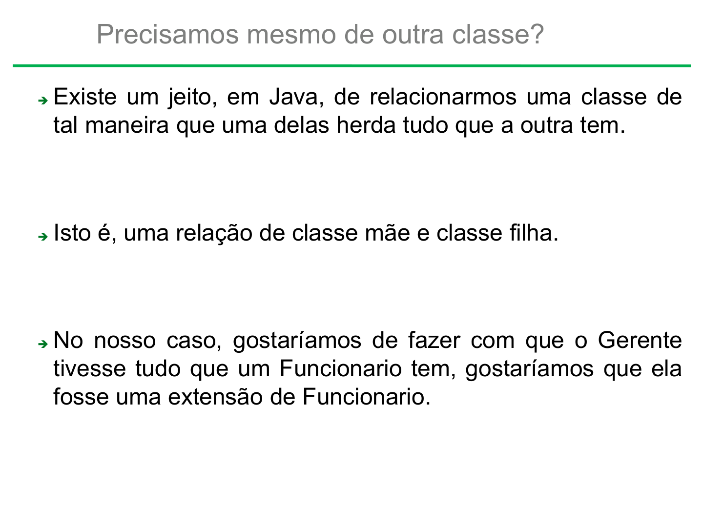

Precisamos mesmo de outra classe?

- Existe um jeito, em Java, de relacionarmos uma classe de
  tal maneira que uma delas herda tudo que a outra tem.

- Isto é, uma relação de classe mãe e classe filha.

- No nosso caso, gostaríamos de fazer com que o Gerente
  tivesse tudo que um Funcionario tem, gostaríamos que ela
 fosse uma extensão de Funcionario.

## Página 8

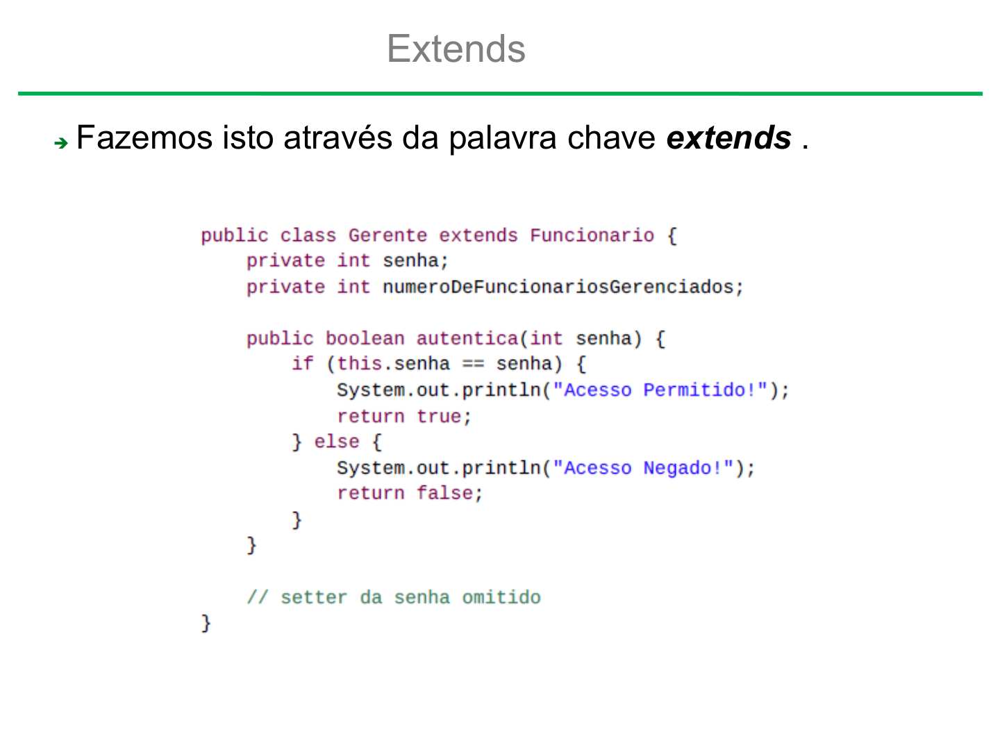

Extends

- Fazemos isto através da palavra chave extends .

## Página 9

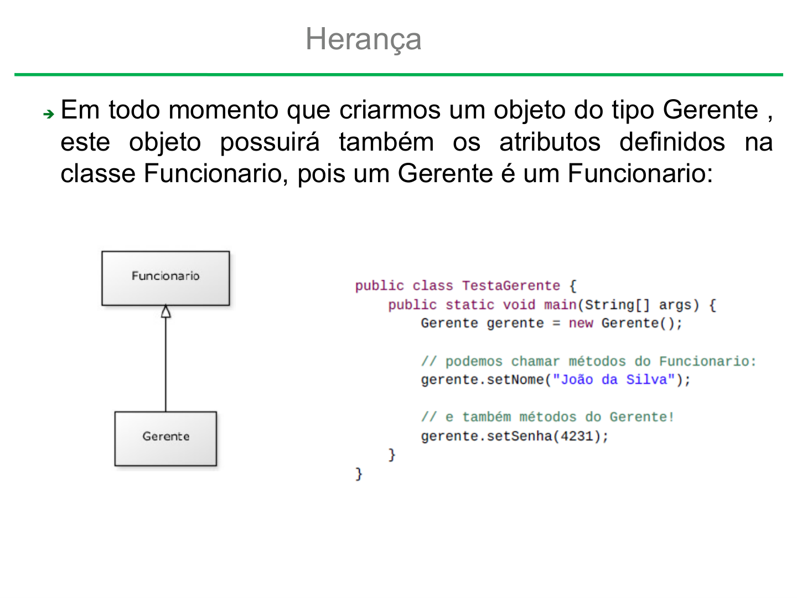

Herança

- Em todo momento que criarmos um objeto do tipo Gerente ,
 este  objeto possuirá também os  atributos  definidos na
 classe Funcionario, pois um Gerente é um Funcionario:

## Página 10

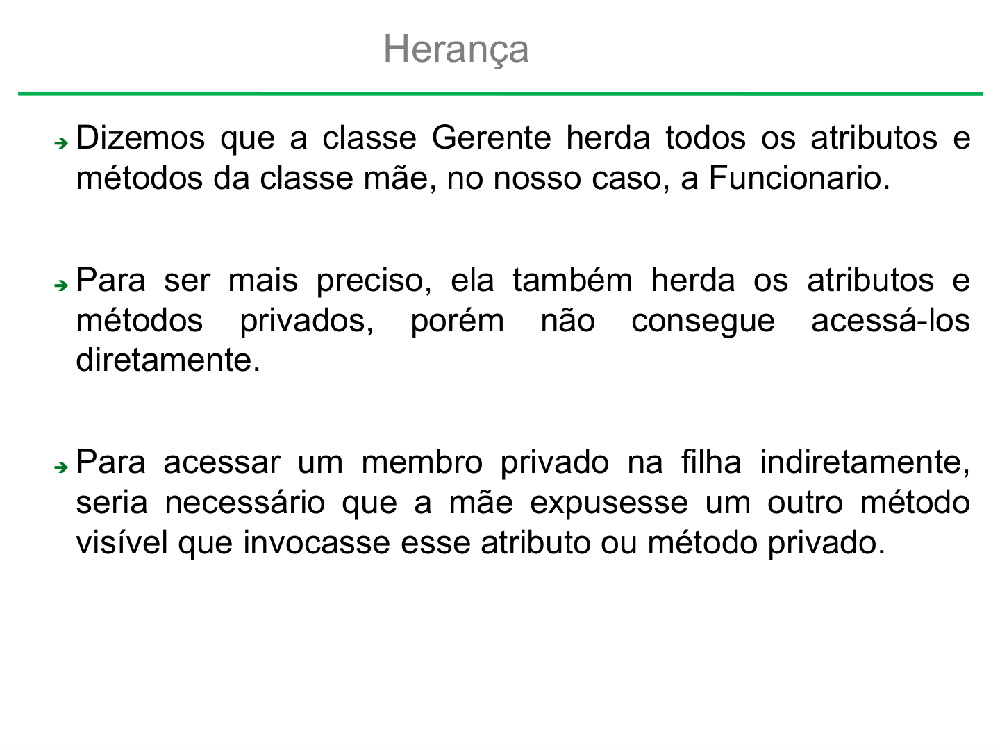

Herança

- Dizemos que a classe Gerente herda todos os atributos e
 métodos da classe mãe, no nosso caso, a Funcionario.

- Para ser mais preciso, ela também herda os atributos e
 métodos  privados,  porém  não  consegue  acessá-los
 diretamente.

- Para acessar um membro privado na filha indiretamente,
  seria necessário que a mãe expusesse um outro método
  visível que invocasse esse atributo ou método privado.

## Página 11

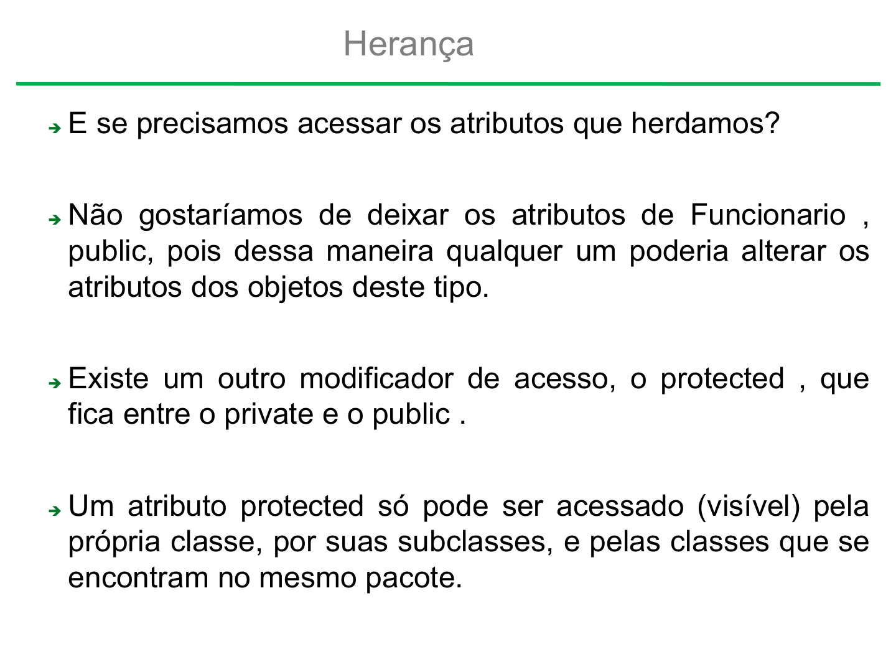

Herança

- E se precisamos acessar os atributos que herdamos?

- Não gostaríamos de deixar os atributos de Funcionario  ,
  public, pois dessa maneira qualquer um poderia alterar os
  atributos dos objetos deste tipo.

- Existe um outro modificador de acesso, o protected  , que
  fica entre o private e o public .

- Um atributo protected só pode ser acessado (visível) pela
  própria classe, por suas subclasses, e pelas classes que se
 encontram no mesmo pacote.

## Página 12

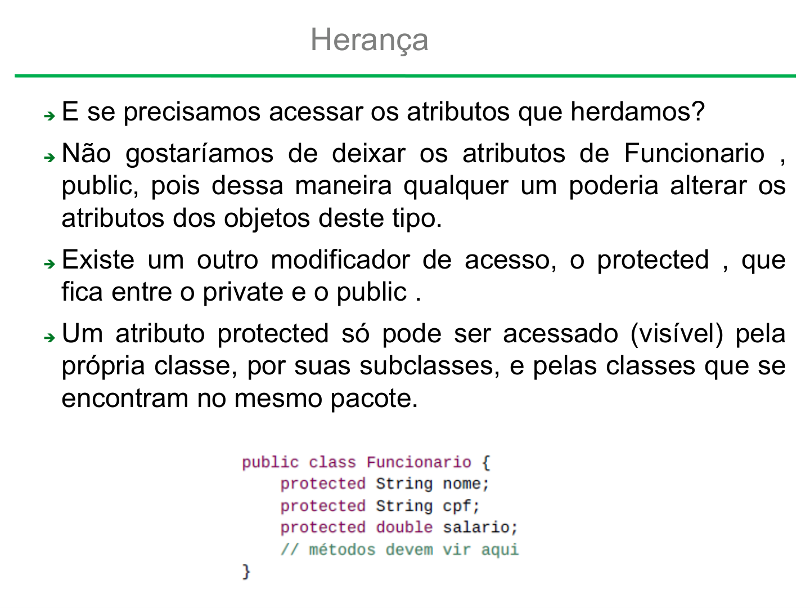

Herança

- E se precisamos acessar os atributos que herdamos?
- Não gostaríamos de deixar os atributos de Funcionario  ,
  public, pois dessa maneira qualquer um poderia alterar os
  atributos dos objetos deste tipo.
- Existe um outro modificador de acesso, o protected  , que
  fica entre o private e o public .
- Um atributo protected só pode ser acessado (visível) pela
  própria classe, por suas subclasses, e pelas classes que se
 encontram no mesmo pacote.

## Página 13

Herança

- E se precisamos acessar os atributos que herdamos?
- Não gostaríamos de deixar os atributos de Funcionario  ,
  public, pois dessa maneira qualquer um poderia alterar os
  atributos dos objetos deste tipo.
- Existe um outro modificador de acesso, o protected  , que
  fica entre o private e o public .
- Um atributo protected só pode ser acessado (visível) pela
  própria classe, por suas subclasses, e pelas classes que se
 encontram no mesmo pacote.

## Página 14

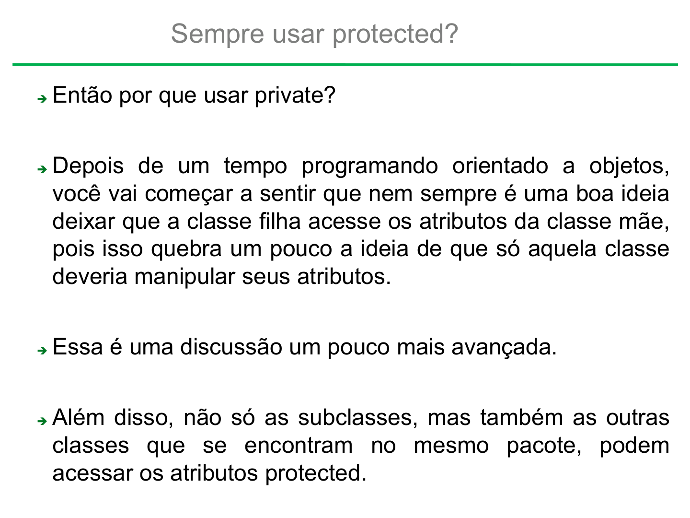

Sempre usar protected?

- Então por que usar private?

- Depois de um tempo programando orientado a objetos,
 você vai começar a sentir que nem sempre é uma boa ideia
 deixar que a classe filha acesse os atributos da classe mãe,
 pois isso quebra um pouco a ideia de que só aquela classe
 deveria manipular seus atributos.

- Essa é uma discussão um pouco mais avançada.

- Além disso, não só as subclasses, mas também as outras
 classes que se encontram no mesmo  pacote, podem
 acessar os atributos protected.

## Página 15

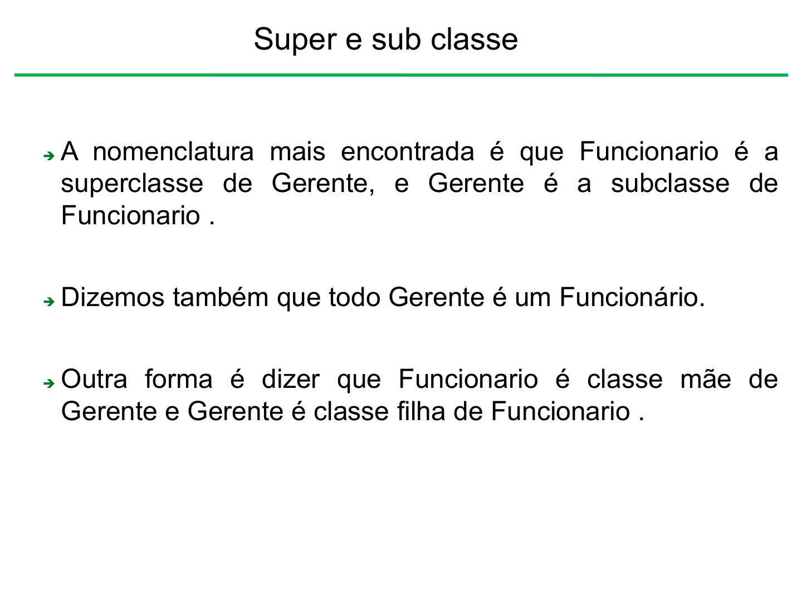

Super e sub classe

- A nomenclatura mais encontrada é que Funcionario é a
 superclasse de Gerente, e Gerente é a subclasse de
 Funcionario .

- Dizemos também que todo Gerente é um Funcionário.

- Outra forma é dizer que Funcionario é classe mãe de
 Gerente e Gerente é classe filha de Funcionario .

## Página 16

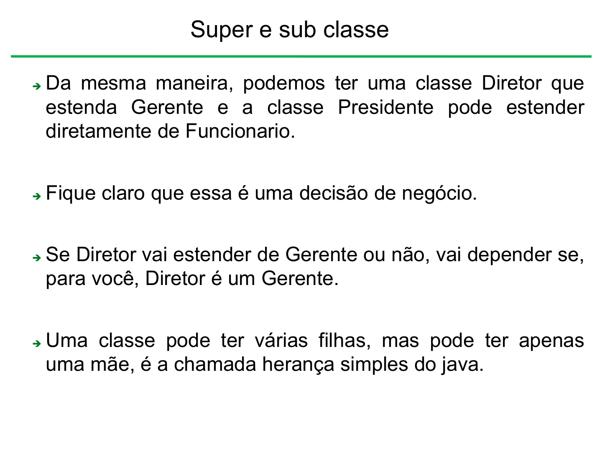

Super e sub classe

- Da mesma maneira, podemos ter uma classe Diretor que
 estenda Gerente e a classe Presidente pode estender
 diretamente de Funcionario.

- Fique claro que essa é uma decisão de negócio.

- Se Diretor vai estender de Gerente ou não, vai depender se,
 para você, Diretor é um Gerente.

- Uma classe pode ter várias filhas, mas pode ter apenas
 uma mãe, é a chamada herança simples do java.

## Página 17

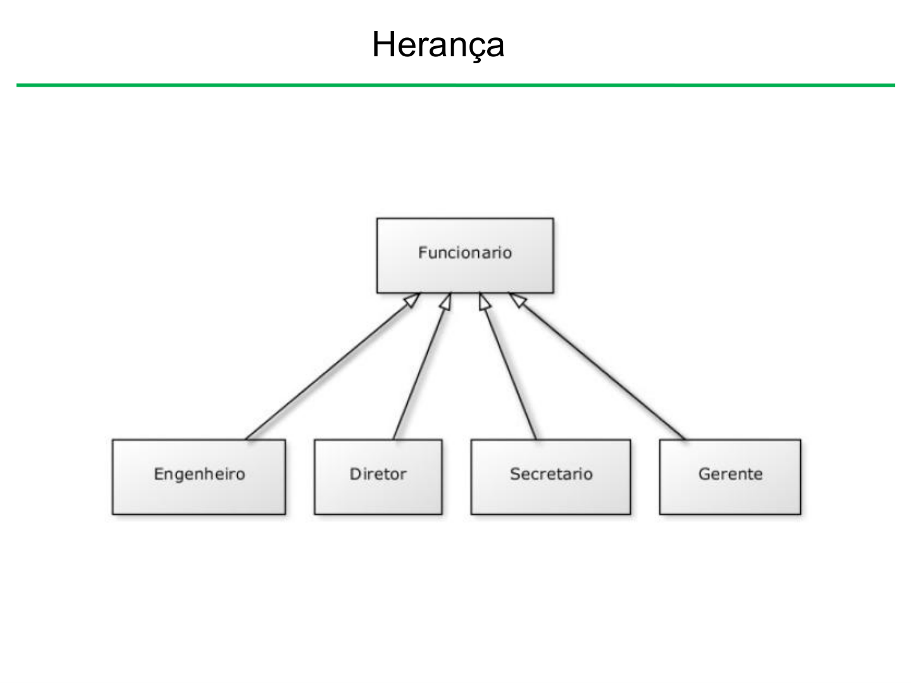

Herança

## Página 18

Reescrita
   de
método

## Página 19

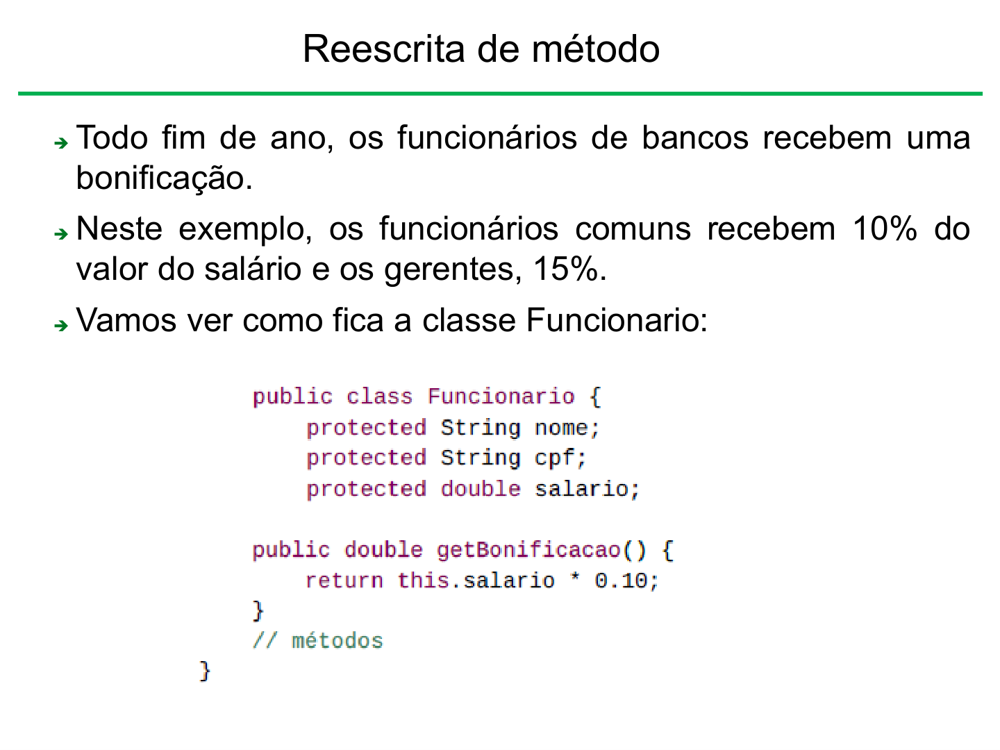

Reescrita de método

- Todo fim de ano, os funcionários de bancos recebem uma
  bonificação.
- Neste exemplo, os funcionários comuns recebem 10% do
  valor do salário e os gerentes, 15%.
- Vamos ver como fica a classe Funcionario:

## Página 20

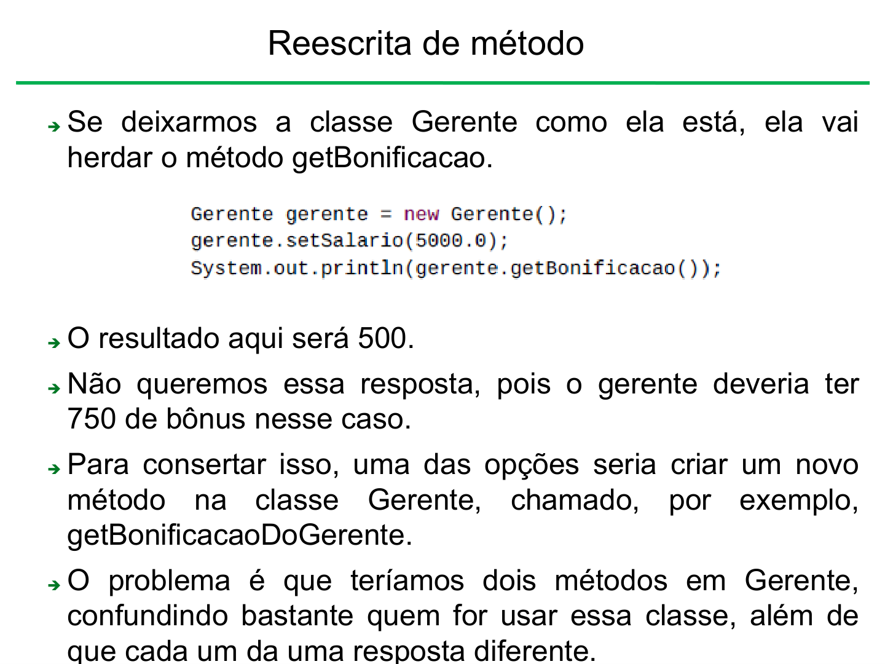

Reescrita de método

- Se deixarmos a classe Gerente como ela está, ela vai
 herdar o método getBonificacao.

- O resultado aqui será 500.
- Não queremos essa resposta, pois o gerente deveria ter
 750 de bônus nesse caso.
- Para consertar isso, uma das opções seria criar um novo
 método  na  classe  Gerente,  chamado,  por  exemplo,
 getBonificacaoDoGerente.
- O problema é que teríamos dois métodos em Gerente,
 confundindo bastante quem for usar essa classe, além de
 que cada um da uma resposta diferente.

## Página 21

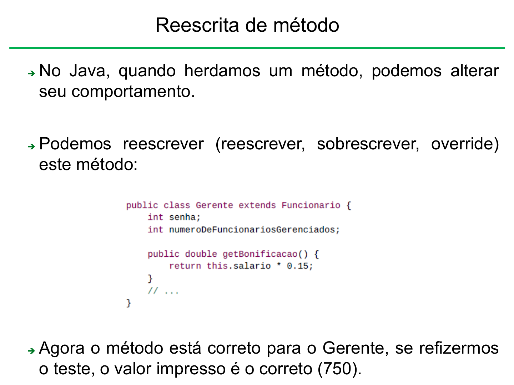

Reescrita de método

- No Java, quando herdamos um método, podemos alterar
 seu comportamento.

- Podemos reescrever  (reescrever, sobrescrever,  override)
 este método:

- Agora o método está correto para o Gerente, se refizermos
 o teste, o valor impresso é o correto (750).

## Página 22

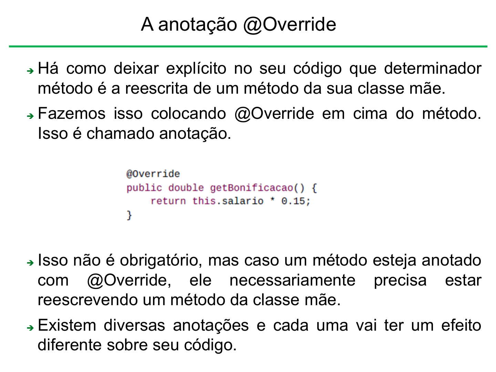

A anotação @Override

- Há como deixar explícito no seu código que determinador
 método é a reescrita de um método da sua classe mãe.
- Fazemos isso colocando @Override em cima do método.
 Isso é chamado anotação.

- Isso não é obrigatório, mas caso um método esteja anotado
 com  @Override,  ele  necessariamente  precisa  estar
 reescrevendo um método da classe mãe.
- Existem diversas anotações e cada uma vai ter um efeito
  diferente sobre seu código.

## Página 23

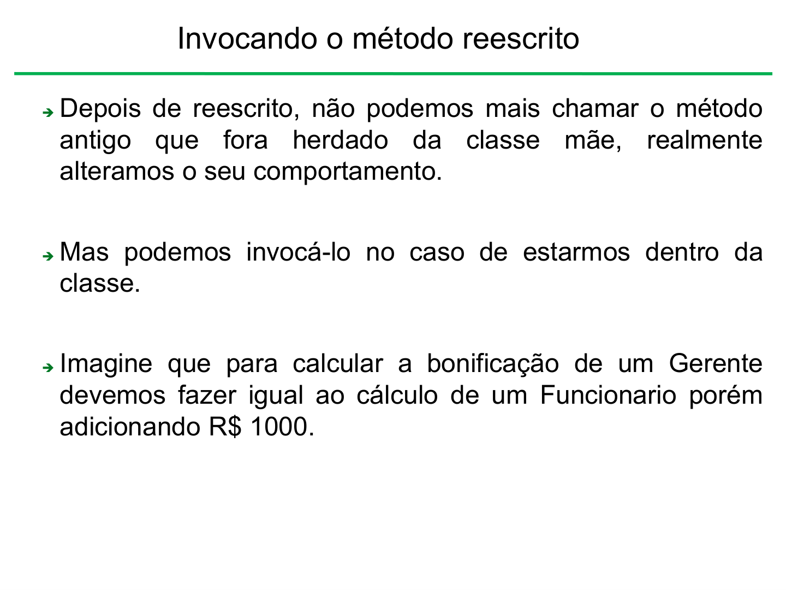

Invocando o método reescrito

- Depois de reescrito, não podemos mais chamar o método
 antigo  que  fora  herdado  da  classe  mãe,  realmente
 alteramos o seu comportamento.

- Mas podemos invocá-lo no caso de estarmos dentro da
  classe.

- Imagine que para calcular a bonificação de um Gerente
 devemos fazer igual ao cálculo de um Funcionario porém
 adicionando R$ 1000.

## Página 24

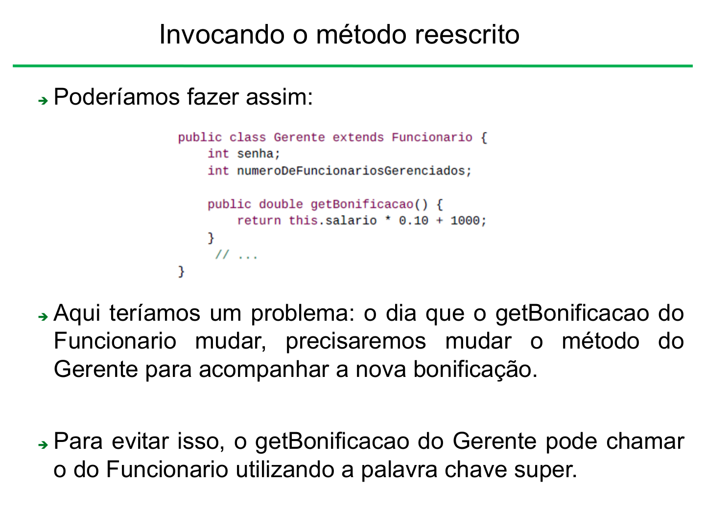

Invocando o método reescrito

- Poderíamos fazer assim:

- Aqui teríamos um problema: o dia que o getBonificacao do
 Funcionario  mudar,  precisaremos mudar o método do
 Gerente para acompanhar a nova bonificação.

- Para evitar isso, o getBonificacao do Gerente pode chamar
 o do Funcionario utilizando a palavra chave super.

## Página 25

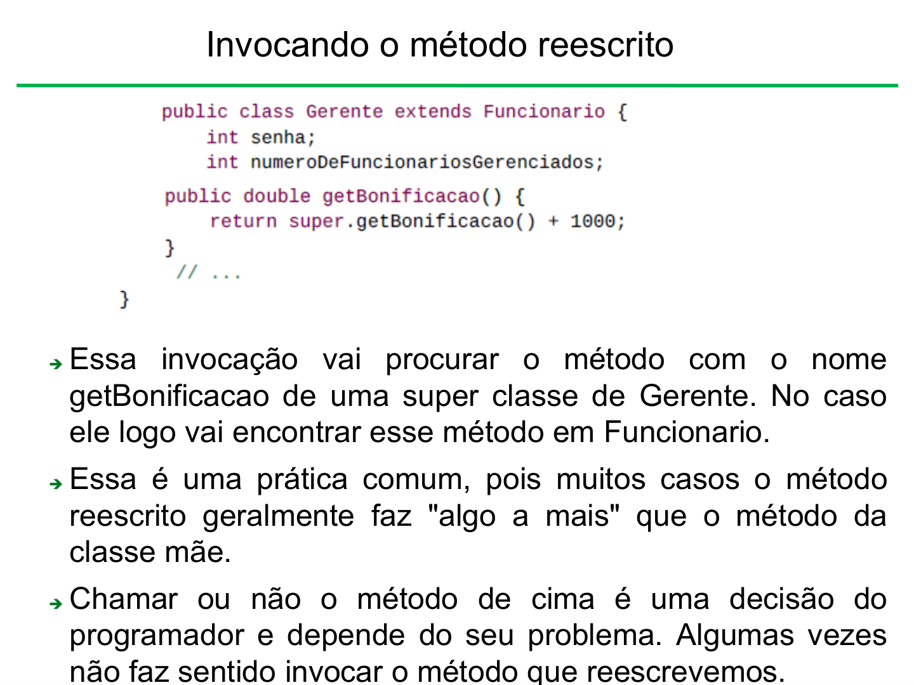

Invocando o método reescrito

- Essa  invocação  vai  procurar o método com o nome
 getBonificacao de uma super classe de Gerente. No caso
  ele logo vai encontrar esse método em Funcionario.
- Essa é uma prática comum, pois muitos casos o método
  reescrito geralmente faz "algo a mais" que o método da
 classe mãe.
- Chamar ou não o método de cima é uma decisão do
 programador e depende do seu problema. Algumas vezes
 não faz sentido invocar o método que reescrevemos.

## Página 26

Polimorfismo

## Página 27

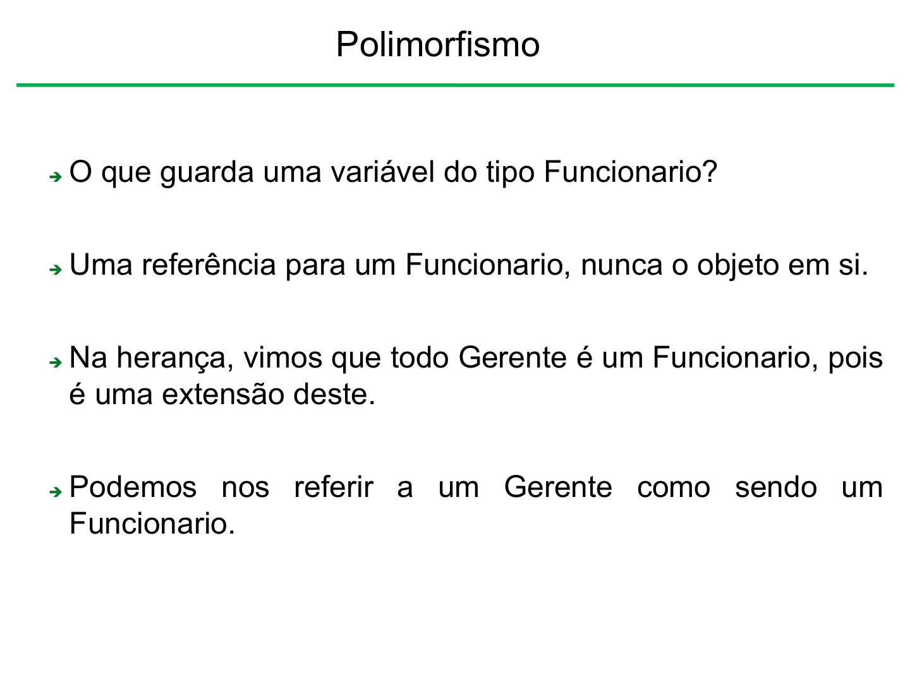

Polimorfismo

- O que guarda uma variável do tipo Funcionario?

- Uma referência para um Funcionario, nunca o objeto em si.

- Na herança, vimos que todo Gerente é um Funcionario, pois
 é uma extensão deste.

- Podemos nos  referir a um  Gerente como sendo um
 Funcionario.

## Página 28

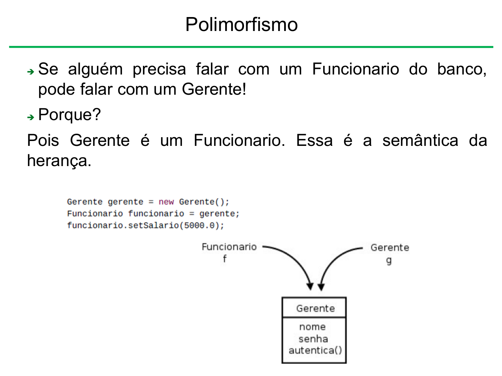

Polimorfismo

- Se alguém precisa falar com um Funcionario do banco,
 pode falar com um Gerente!
- Porque?
Pois Gerente é um Funcionario. Essa é a semântica da
herança.

## Página 29

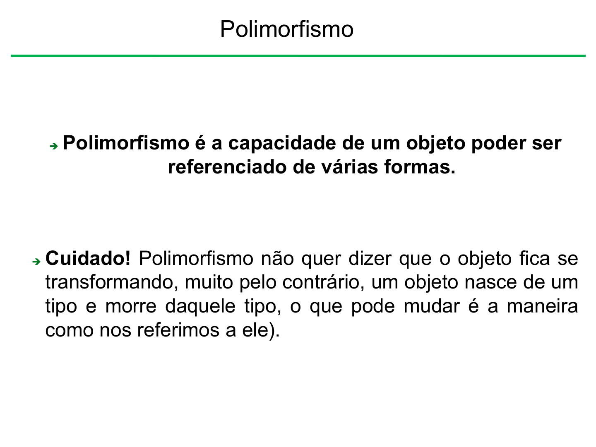

Polimorfismo

  - Polimorfismo é a capacidade de um objeto poder ser
              referenciado de várias formas.

- Cuidado! Polimorfismo não quer dizer que o objeto fica se
 transformando, muito pelo contrário, um objeto nasce de um
  tipo e morre daquele tipo, o que pode mudar é a maneira
 como nos referimos a ele).

## Página 30

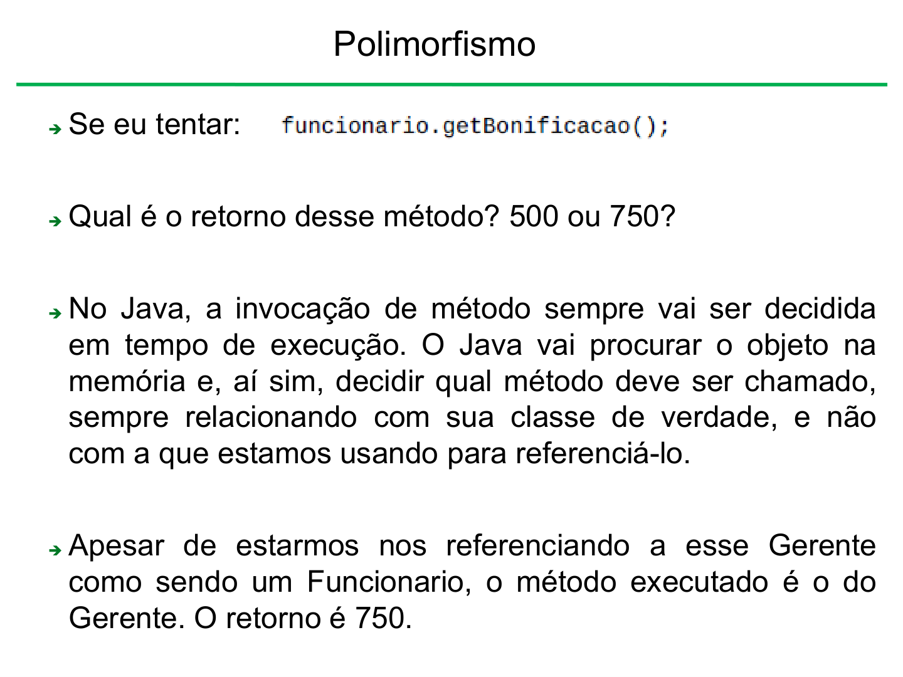

Polimorfismo

- Se eu tentar:

- Qual é o retorno desse método? 500 ou 750?

- No Java, a invocação de método sempre vai ser decidida
 em tempo de execução. O Java vai procurar o objeto na
 memória e, aí sim, decidir qual método deve ser chamado,
 sempre relacionando com sua classe de verdade, e não
 com a que estamos usando para referenciá-lo.

- Apesar de estarmos nos referenciando a esse Gerente
 como sendo um Funcionario, o método executado é o do
 Gerente. O retorno é 750.

## Página 31

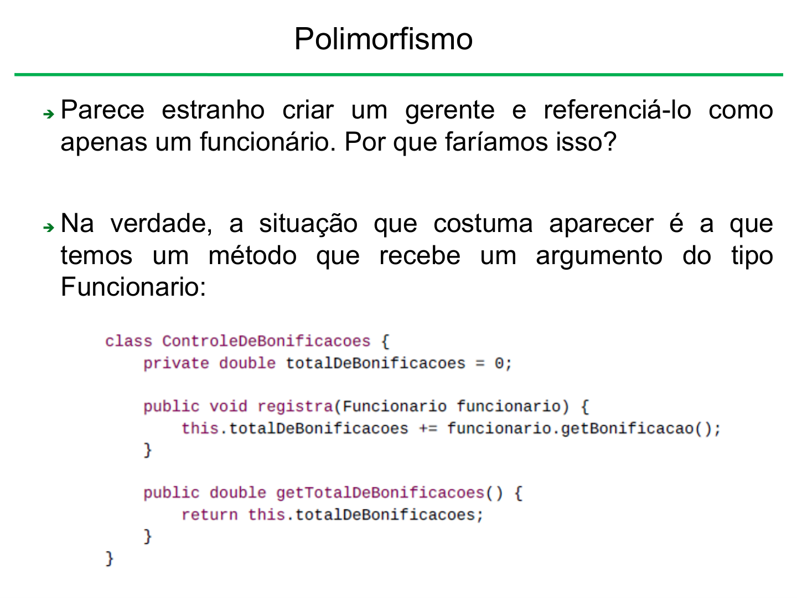

Polimorfismo

- Parece estranho  criar um gerente e referenciá-lo como
 apenas um funcionário. Por que faríamos isso?

- Na verdade, a situação que costuma aparecer é a que
 temos um método que recebe um argumento do  tipo
 Funcionario:

## Página 32

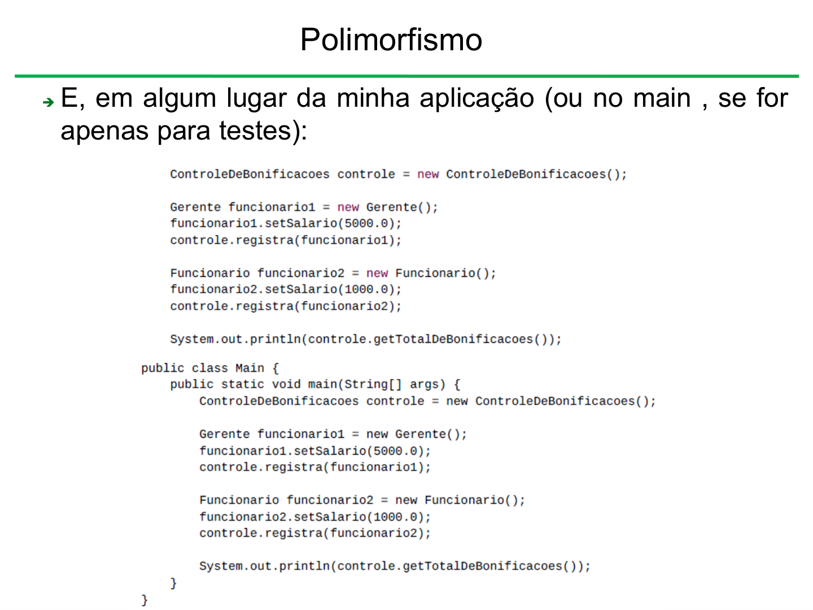

Polimorfismo

- E, em algum lugar da minha aplicação (ou no main , se for
 apenas para testes):

## Página 33

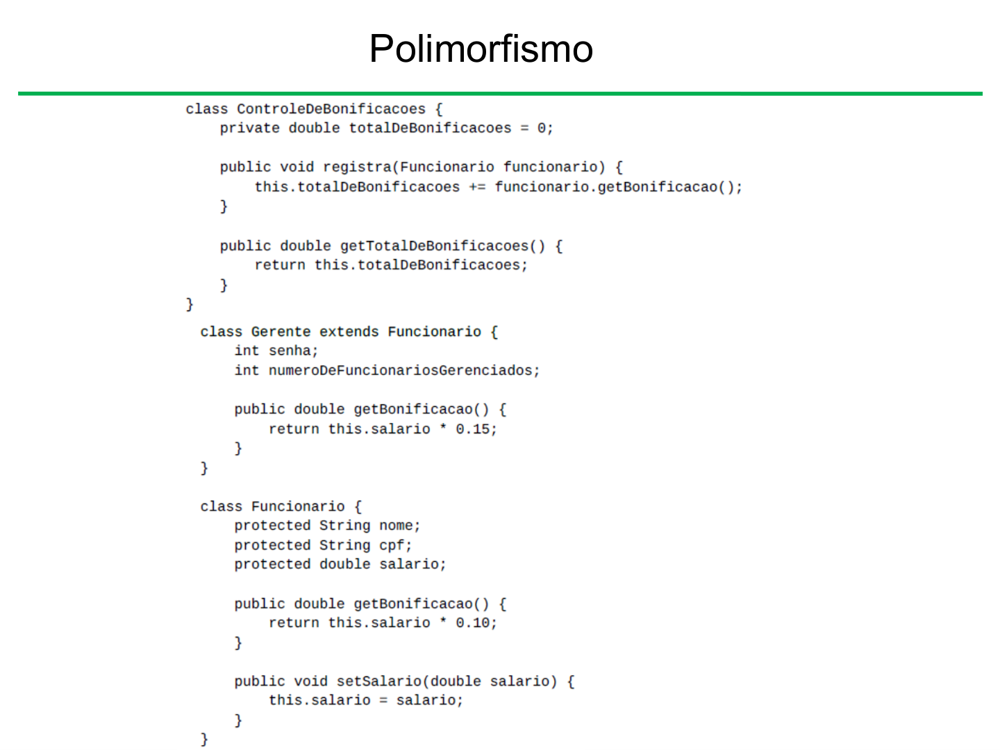

Polimorfismo

## Página 34

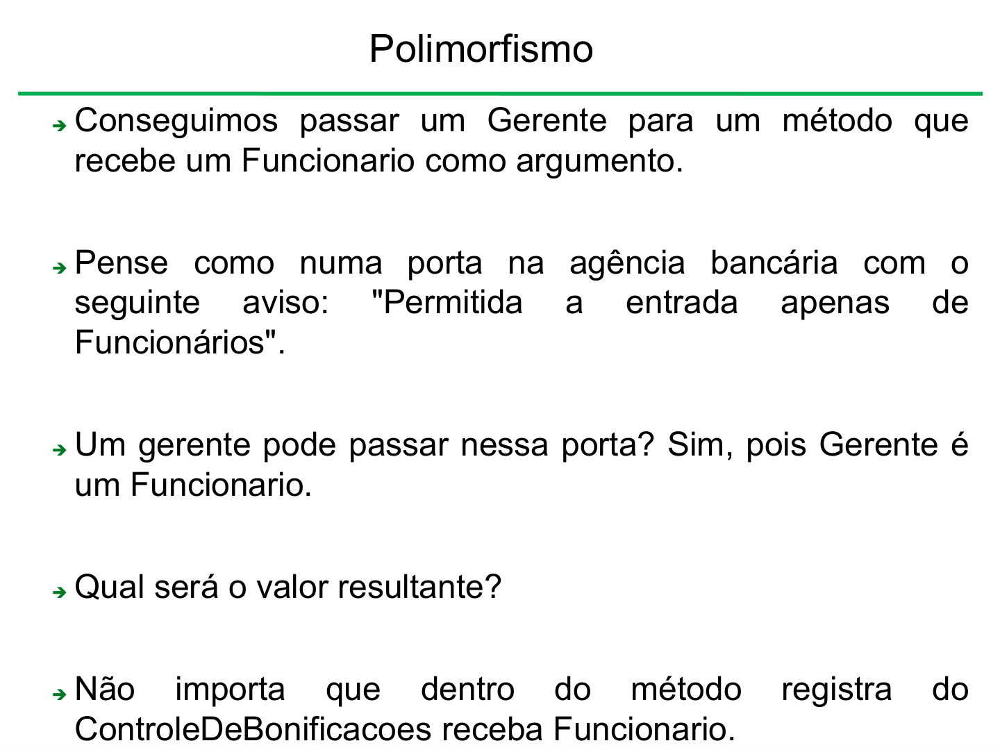

Polimorfismo

- Conseguimos passar um Gerente para um método que
 recebe um Funcionario como argumento.

- Pense como numa  porta na agência  bancária com o
 seguinte   aviso:   "Permitida  a   entrada  apenas  de
 Funcionários".

- Um gerente pode passar nessa porta? Sim, pois Gerente é
 um Funcionario.

- Qual será o valor resultante?

- Não  importa  que   dentro  do  método   registra  do
 ControleDeBonificacoes receba Funcionario.

## Página 35

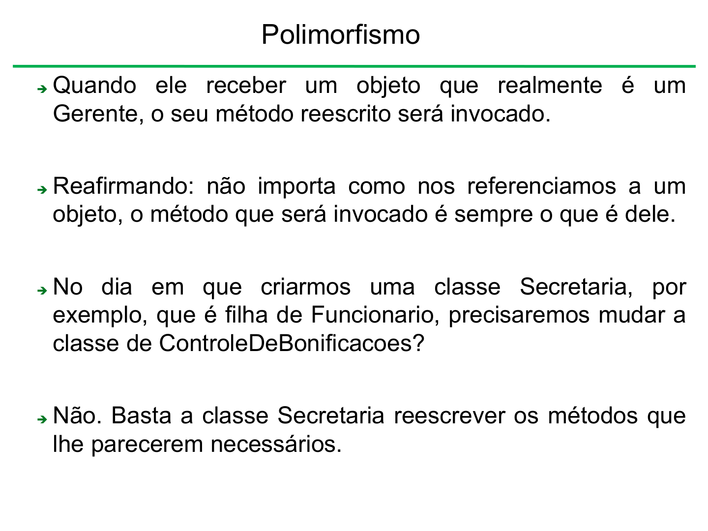

Polimorfismo

- Quando  ele  receber um  objeto que  realmente é um
 Gerente, o seu método reescrito será invocado.

- Reafirmando: não importa como nos referenciamos a um
  objeto, o método que será invocado é sempre o que é dele.

- No  dia em que  criarmos uma  classe  Secretaria,  por
 exemplo, que é filha de Funcionario, precisaremos mudar a
 classe de ControleDeBonificacoes?

- Não. Basta a classe Secretaria reescrever os métodos que
  lhe parecerem necessários.

## Página 36

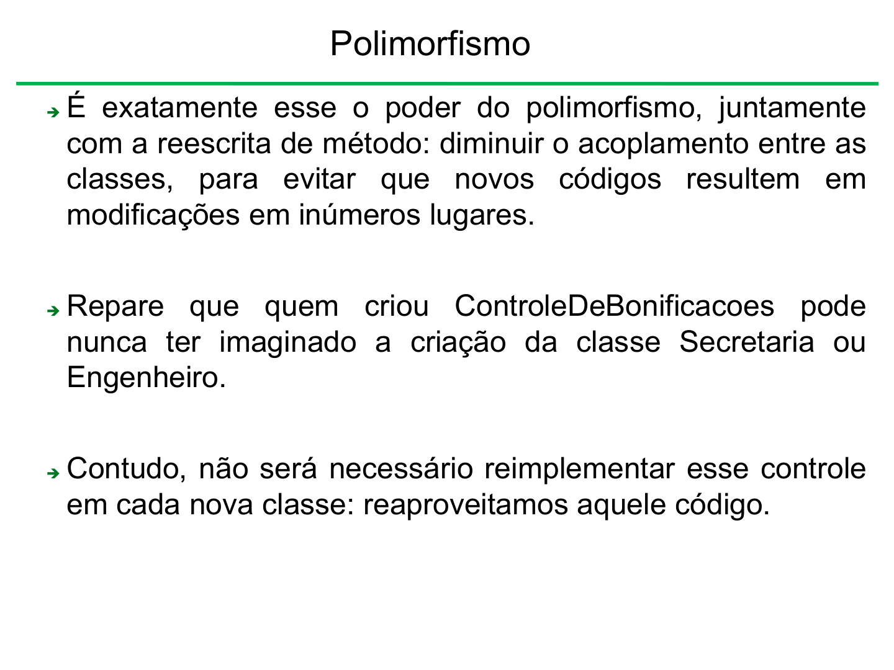

Polimorfismo

- É exatamente esse o poder do polimorfismo, juntamente
 com a reescrita de método: diminuir o acoplamento entre as
  classes,  para  evitar que  novos  códigos  resultem em
 modificações em inúmeros lugares.

- Repare  que quem  criou  ControleDeBonificacoes  pode
 nunca  ter imaginado a criação da classe Secretaria ou
 Engenheiro.

- Contudo, não será necessário reimplementar esse controle
 em cada nova classe: reaproveitamos aquele código.

## Página 37

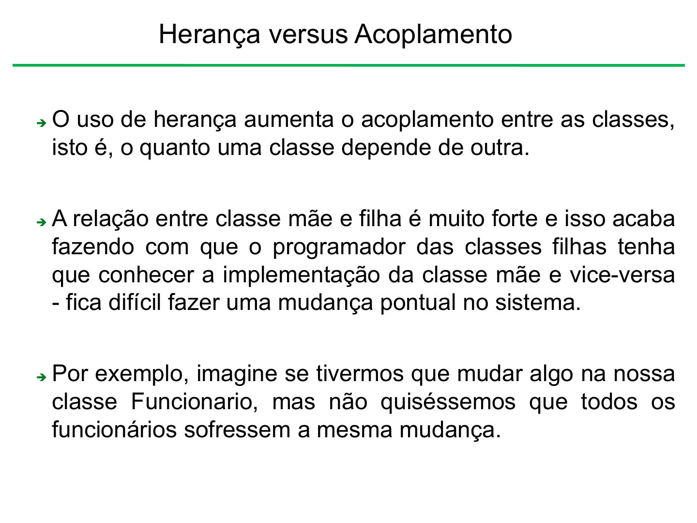

Herança versus Acoplamento

- O uso de herança aumenta o acoplamento entre as classes,
  isto é, o quanto uma classe depende de outra.

- A relação entre classe mãe e filha é muito forte e isso acaba
 fazendo com que o programador das classes filhas tenha
 que conhecer a implementação da classe mãe e vice-versa
  - fica difícil fazer uma mudança pontual no sistema.

- Por exemplo, imagine se tivermos que mudar algo na nossa
 classe Funcionario, mas não quiséssemos que todos os
  funcionários sofressem a mesma mudança.

## Página 38

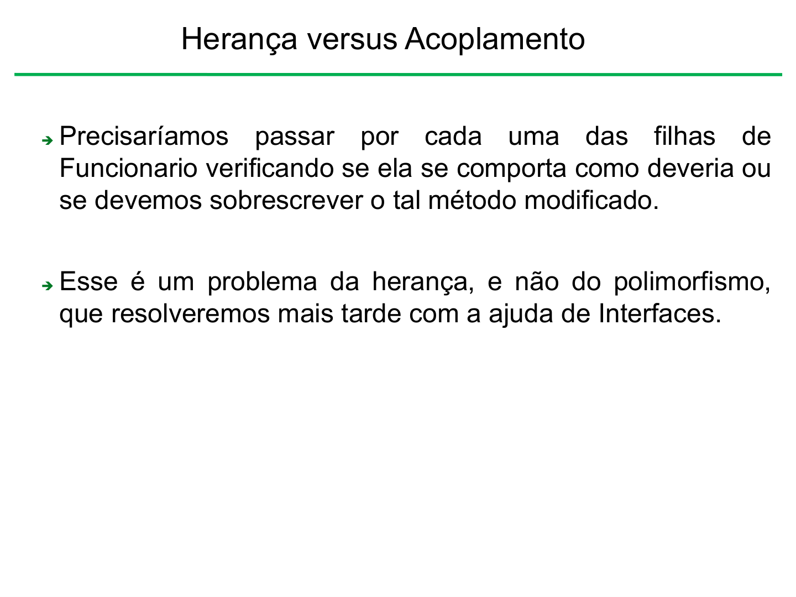

Herança versus Acoplamento

- Precisaríamos  passar  por  cada  uma  das   filhas  de
 Funcionario verificando se ela se comporta como deveria ou
 se devemos sobrescrever o tal método modificado.

- Esse é um problema da herança, e não do polimorfismo,
 que resolveremos mais tarde com a ajuda de Interfaces.

## Página 39

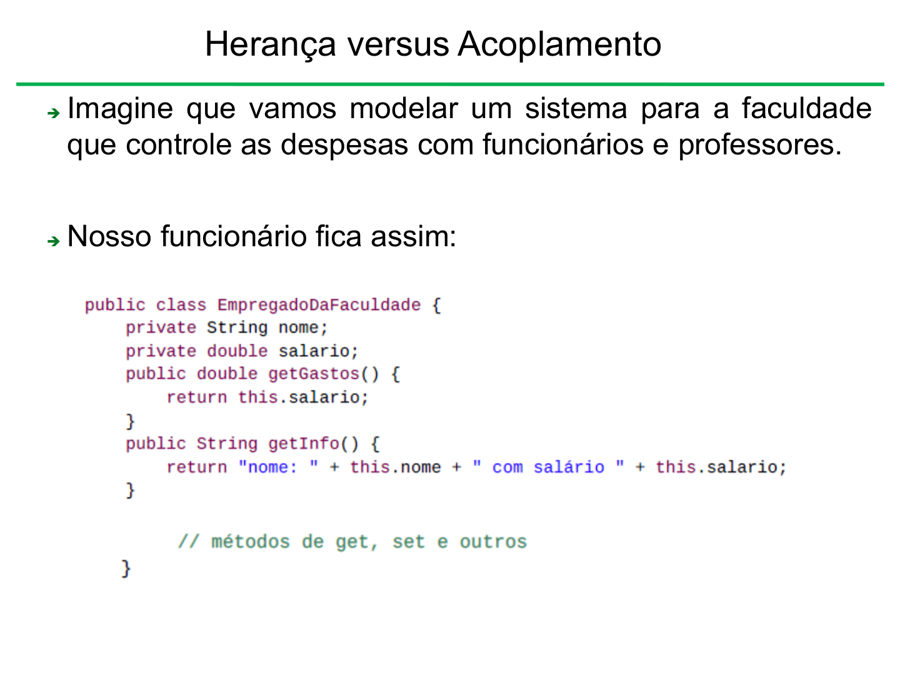

Herança versus Acoplamento

- Imagine que vamos modelar um sistema para a faculdade
 que controle as despesas com funcionários e professores.

- Nosso funcionário fica assim:

## Página 40

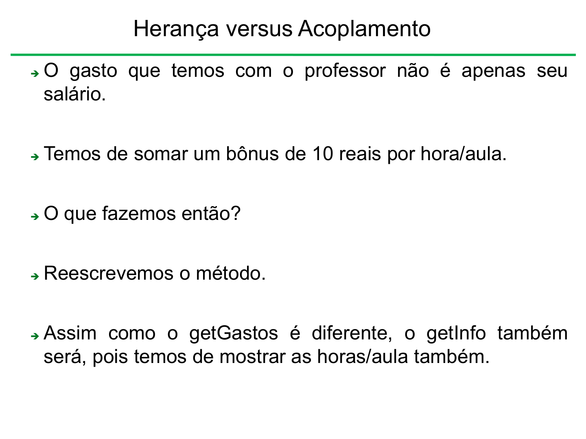

Herança versus Acoplamento

- O gasto que temos com o professor não é apenas seu
  salário.

- Temos de somar um bônus de 10 reais por hora/aula.

- O que fazemos então?

- Reescrevemos o método.

- Assim como o getGastos é diferente, o getInfo também
  será, pois temos de mostrar as horas/aula também.

## Página 41

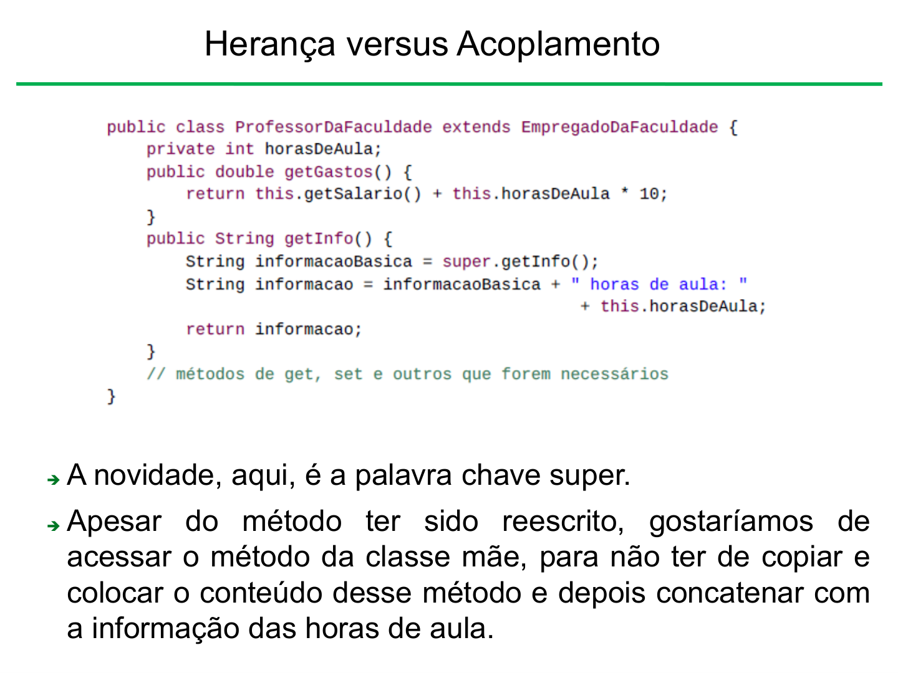

Herança versus Acoplamento

- A novidade, aqui, é a palavra chave super.
- Apesar do método  ter  sido  reescrito,  gostaríamos de
 acessar o método da classe mãe, para não ter de copiar e
 colocar o conteúdo desse método e depois concatenar com
 a informação das horas de aula.

## Página 42

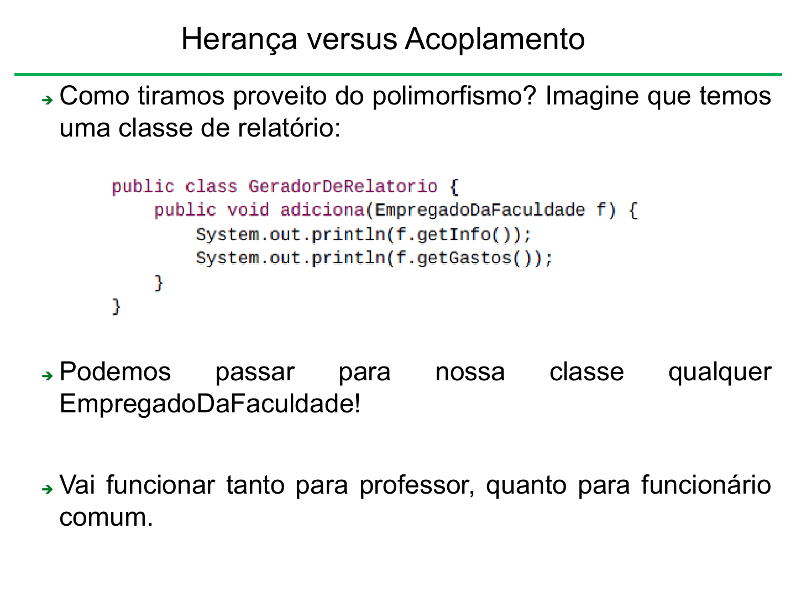

Herança versus Acoplamento

- Como tiramos proveito do polimorfismo? Imagine que temos
 uma classe de relatório:

- Podemos   passar   para   nossa   classe   qualquer
 EmpregadoDaFaculdade!

- Vai funcionar tanto para professor, quanto para funcionário
 comum.

## Página 43

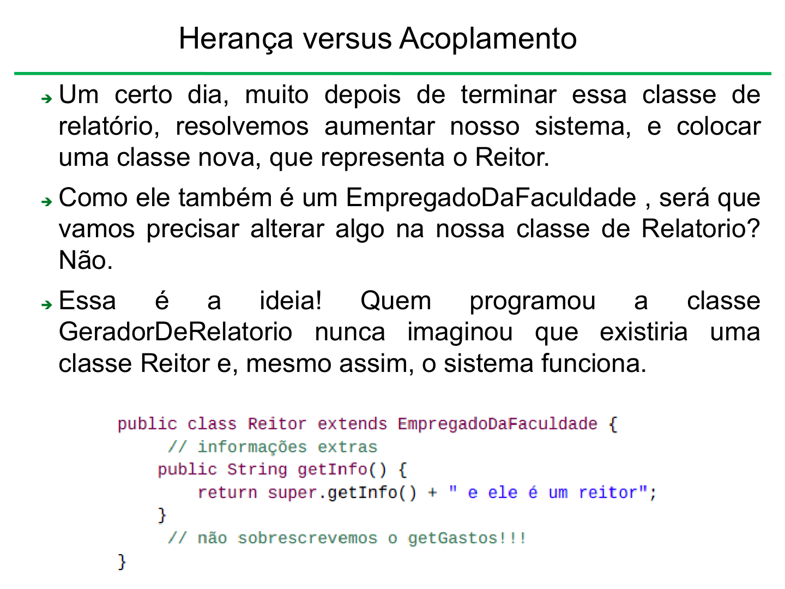

Herança versus Acoplamento

- Um certo dia, muito depois de terminar essa classe de
  relatório, resolvemos aumentar nosso sistema, e colocar
 uma classe nova, que representa o Reitor.
- Como ele também é um EmpregadoDaFaculdade , será que
 vamos precisar alterar algo na nossa classe de Relatorio?
 Não.
- Essa   é   a    ideia!  Quem   programou   a   classe
 GeradorDeRelatorio  nunca  imaginou que  existiria uma
 classe Reitor e, mesmo assim, o sistema funciona.

## Página 44

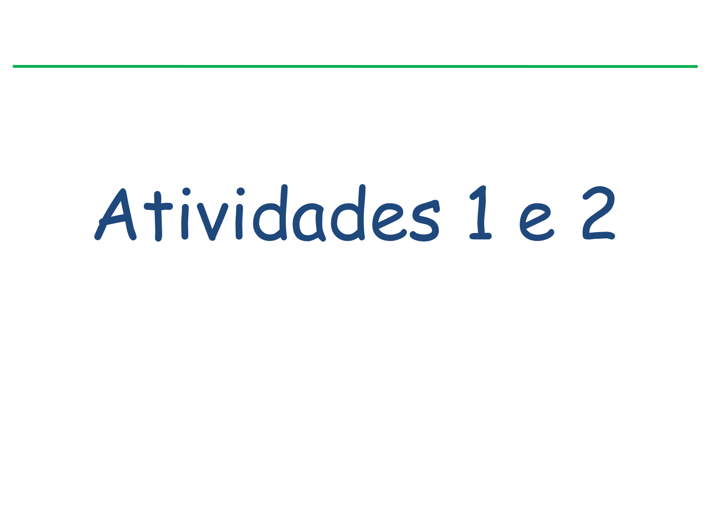

Atividades 1 e 2

## Página 45

Dúvidas
