Arquivo original: `Aula12 Strings.pdf`

## Página 1

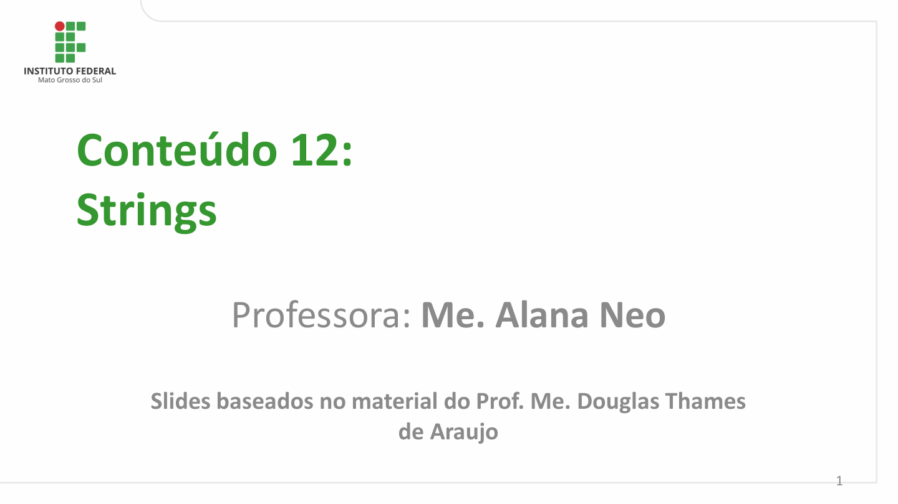

Conteúdo 12:
Strings

         Professora: Me. Alana Neo

       Slides baseados no material do Prof. Me. Douglas Thames
                         de Araujo

                                                                                                    1

## Página 2

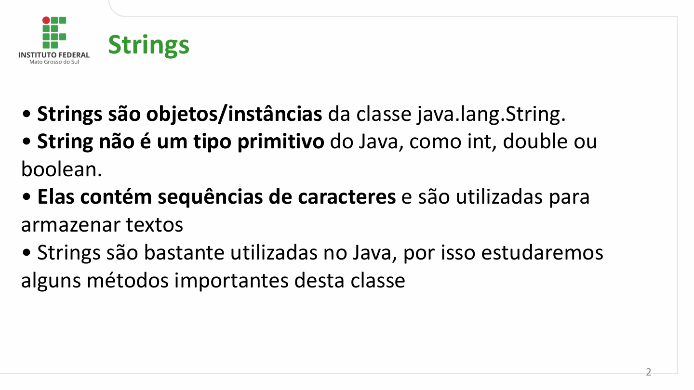

Strings

- Strings são objetos/instâncias da classe java.lang.String.
- String não é um tipo primitivo do Java, como int, double ou
boolean.
- Elas contém sequências de caracteres e são utilizadas para
armazenar textos
- Strings são bastante utilizadas no Java, por isso estudaremos
alguns métodos importantes desta classe

                                                                                                           2

## Página 3

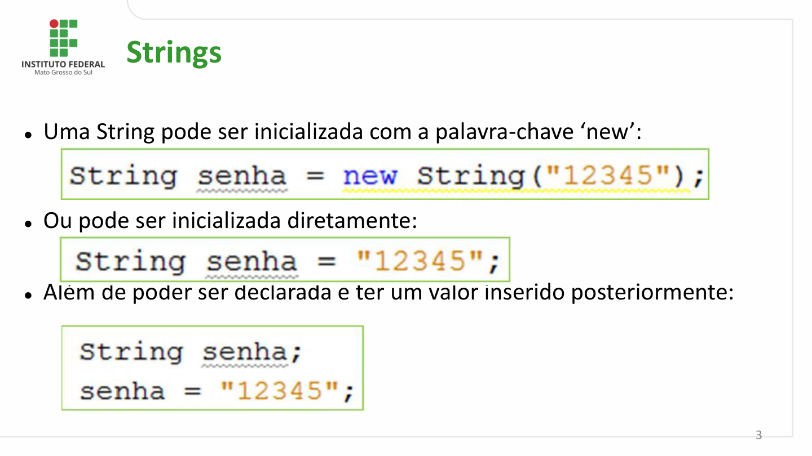

Strings

⚫Uma String pode ser inicializada com a palavra-chave ‘new’:

⚫Ou pode ser inicializada diretamente:

⚫Além de poder ser declarada e ter um valor inserido posteriormente:

                                                                                                           3

## Página 4

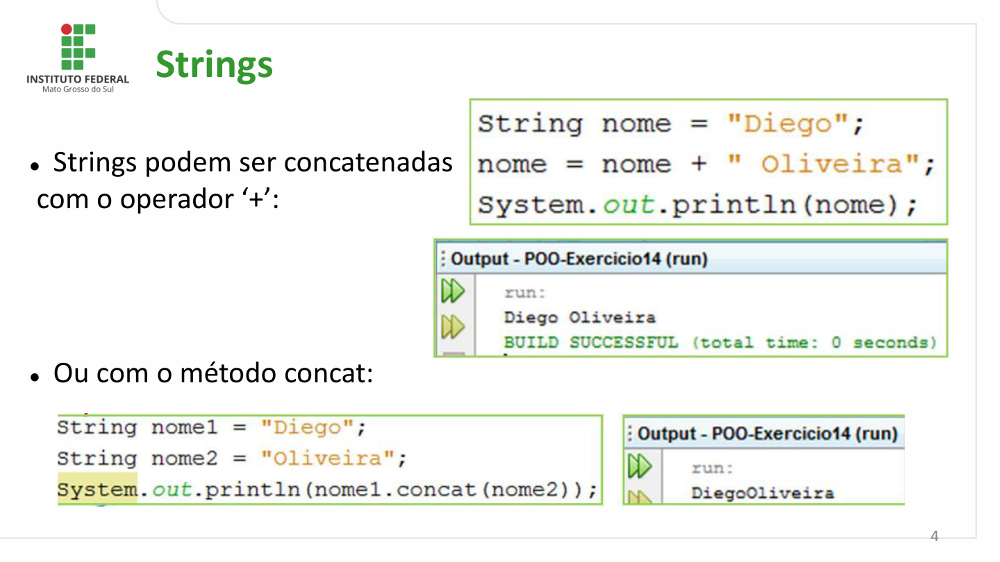

Strings

⚫Strings podem ser concatenadas
com o operador ‘+’:

⚫Ou com o método concat:

                                                                                                           4

## Página 5

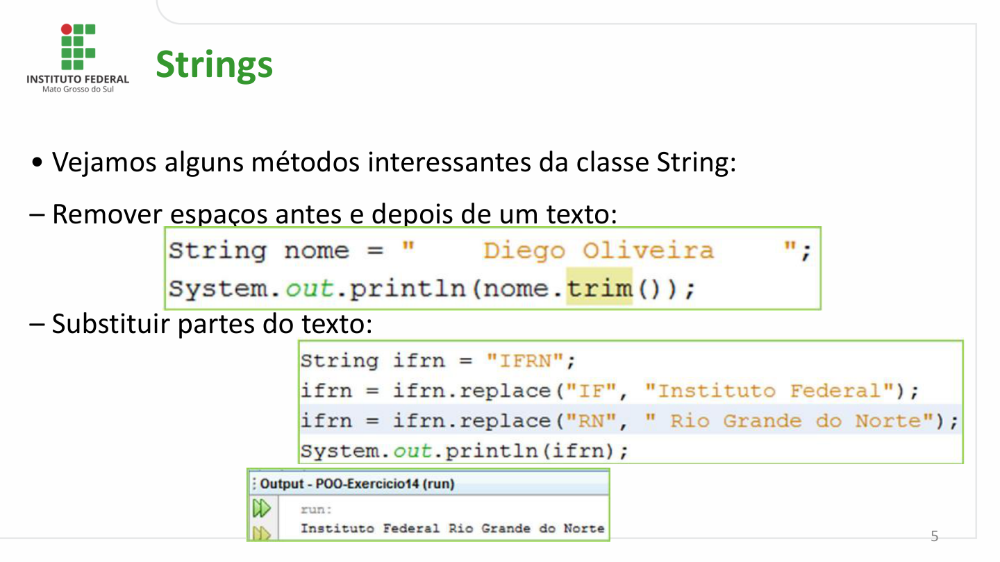

Strings

- Vejamos alguns métodos interessantes da classe String:

– Remover espaços antes e depois de um texto:

– Substituir partes do texto:

                                                                                                           5

## Página 6

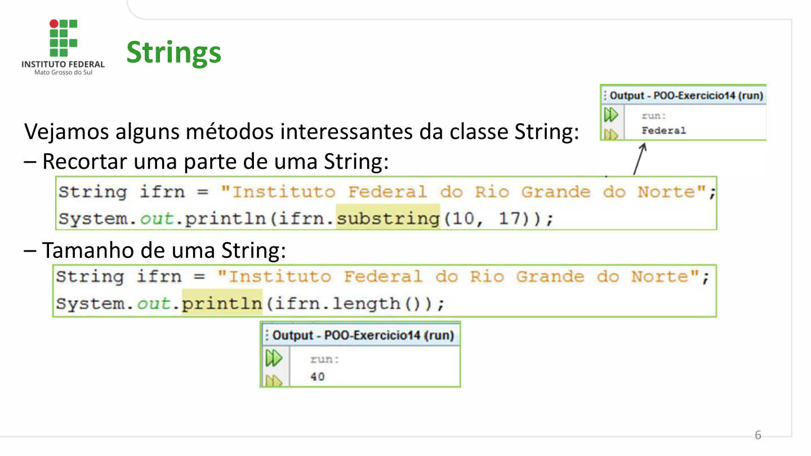

Strings

Vejamos alguns métodos interessantes da classe String:
– Recortar uma parte de uma String:

– Tamanho de uma String:

                                                                                                           6

## Página 7

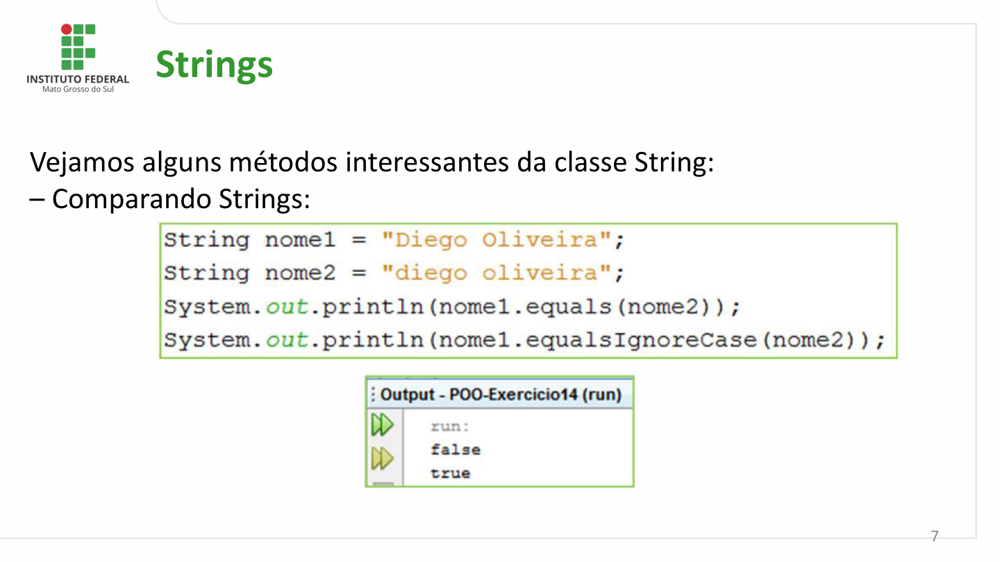

Strings

Vejamos alguns métodos interessantes da classe String:
– Comparando Strings:

                                                                                                           7

## Página 8

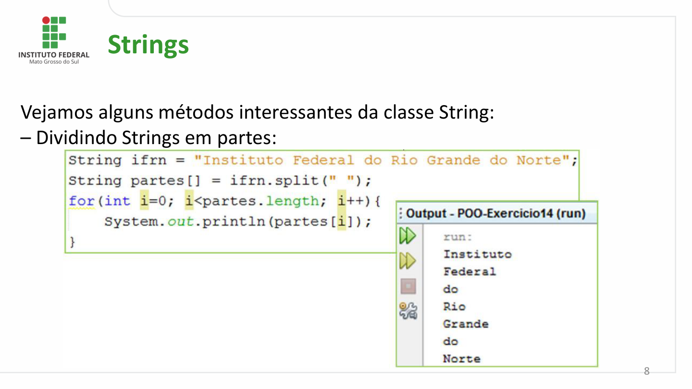

Strings

Vejamos alguns métodos interessantes da classe String:
– Dividindo Strings em partes:

                                                                                                           8

## Página 9

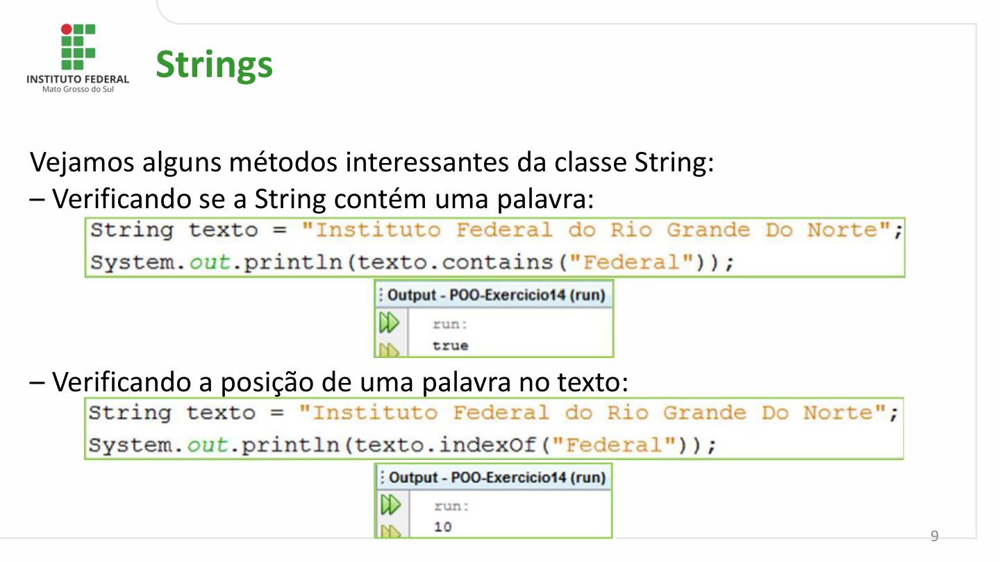

Strings

Vejamos alguns métodos interessantes da classe String:
– Verificando se a String contém uma palavra:

– Verificando a posição de uma palavra no texto:

                                                                                                           9

## Página 10

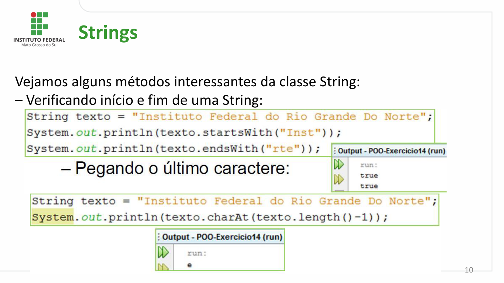

Strings

Vejamos alguns métodos interessantes da classe String:
– Verificando início e fim de uma String:

                                                                                                         10

## Página 11

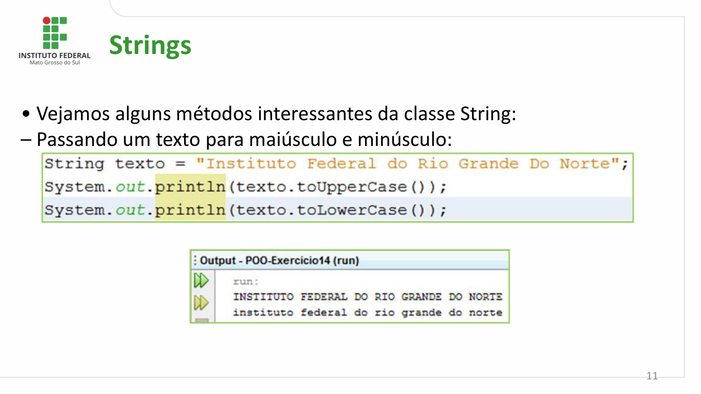

Strings

- Vejamos alguns métodos interessantes da classe String:
– Passando um texto para maiúsculo e minúsculo:

                                                                                                         11

## Página 12

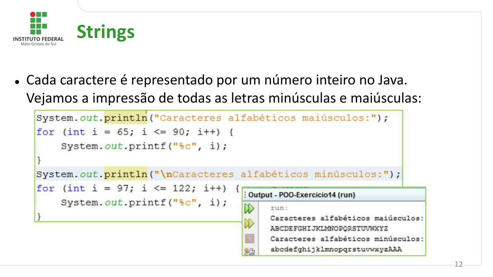

Strings

⚫Cada caractere é representado por um número inteiro no Java.
  Vejamos a impressão de todas as letras minúsculas e maiúsculas:

                                                                                                         12

## Página 13

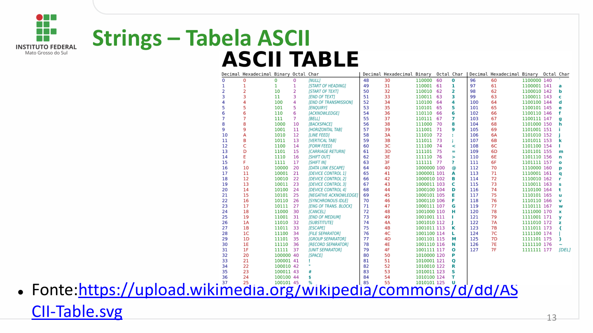

Strings – Tabela ASCII

⚫Fonte:https://upload.wikimedia.org/wikipedia/commons/d/dd/AS
  CII-Table.svg                                                                                    13

## Página 14

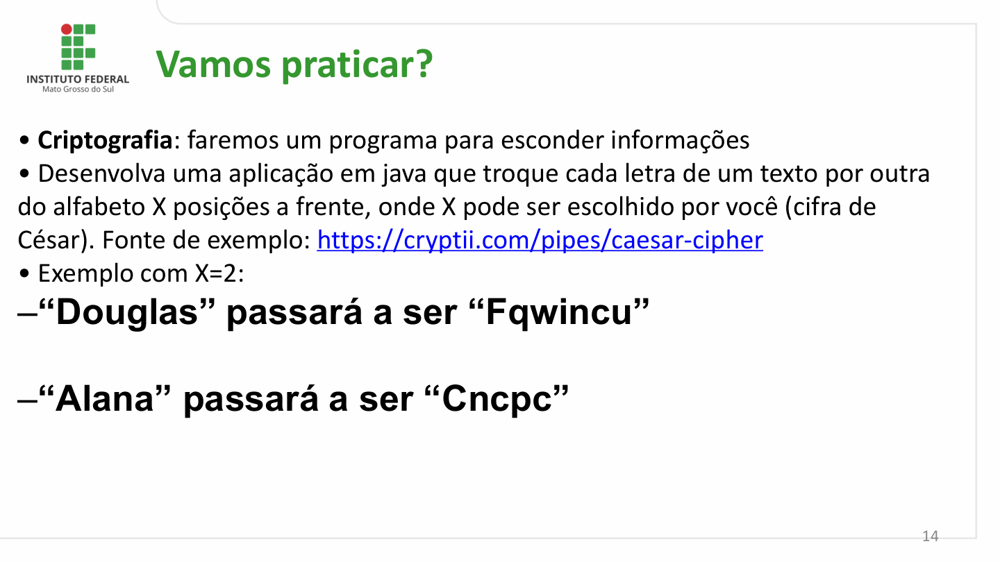

Vamos praticar?

- Criptografia: faremos um programa para esconder informações
- Desenvolva uma aplicação em java que troque cada letra de um texto por outra
do alfabeto X posições a frente, onde X pode ser escolhido por você (cifra de
César). Fonte de exemplo: https://cryptii.com/pipes/caesar-cipher
- Exemplo com X=2:
–“Douglas” passará a ser “Fqwincu”

–“Alana” passará a ser “Cncpc”

                                                                                                           14

## Página 15

Dúvidas e
Questionamentos

                alana.neo@ifms.edu.br

                                                                           15
