Arquivo original: `Arrays.pdf`

## Página 1

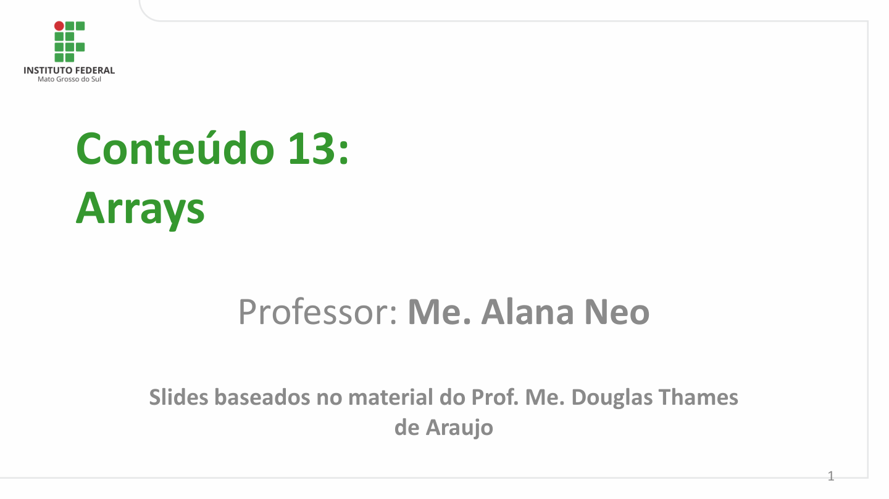

Conteúdo 13:
Arrays

          Professor: Me. Alana Neo

       Slides baseados no material do Prof. Me. Douglas Thames
                         de Araujo

                                                                                                    1

## Página 2

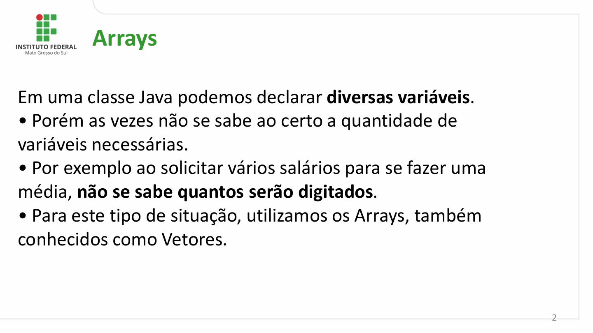

Arrays

Em uma classe Java podemos declarar diversas variáveis.
- Porém as vezes não se sabe ao certo a quantidade de
variáveis necessárias.
- Por exemplo ao solicitar vários salários para se fazer uma
média, não se sabe quantos serão digitados.
- Para este tipo de situação, utilizamos os Arrays, também
conhecidos como Vetores.

                                                                                                           2

## Página 3

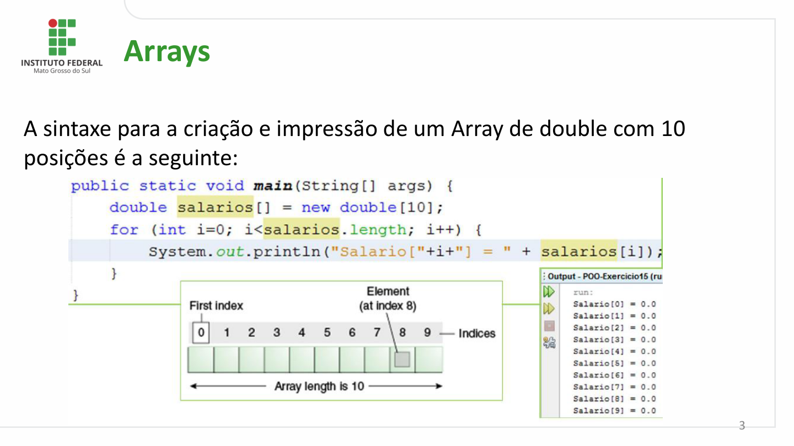

Arrays

A sintaxe para a criação e impressão de um Array de double com 10
posições é a seguinte:

                                                                                                           3

## Página 4

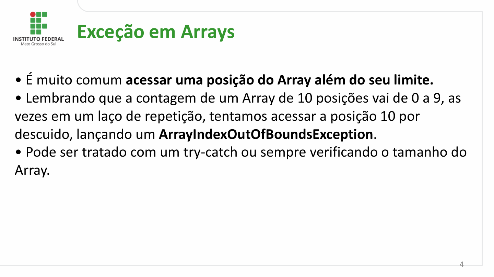

Exceção em Arrays

- É muito comum acessar uma posição do Array além do seu limite.
- Lembrando que a contagem de um Array de 10 posições vai de 0 a 9, as
vezes em um laço de repetição, tentamos acessar a posição 10 por
descuido, lançando um ArrayIndexOutOfBoundsException.
- Pode ser tratado com um try-catch ou sempre verificando o tamanho do
Array.

                                                                                                           4

## Página 5

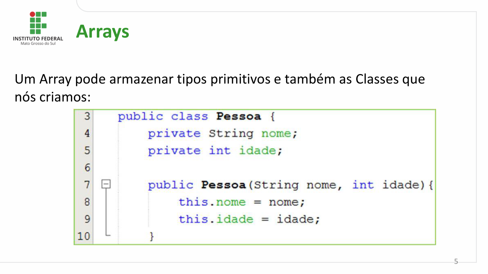

Arrays

Um Array pode armazenar tipos primitivos e também as Classes que
nós criamos:

                                                                                                           5

## Página 6

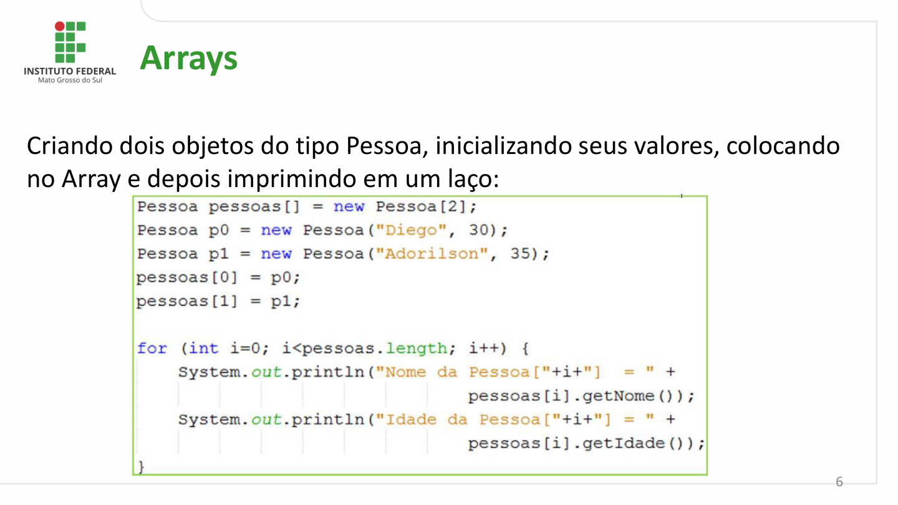

Arrays

Criando dois objetos do tipo Pessoa, inicializando seus valores, colocando
no Array e depois imprimindo em um laço:

                                                                                                           6

## Página 7

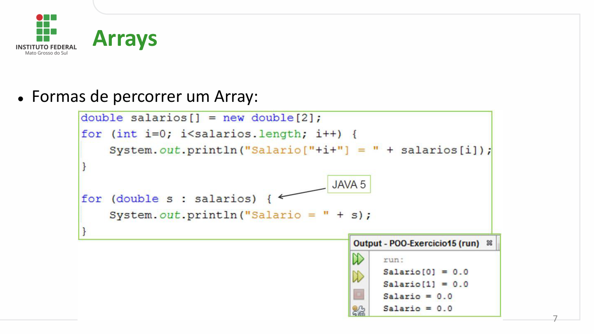

Arrays

- Formas de percorrer um Array:

                                                                                                           7

## Página 8

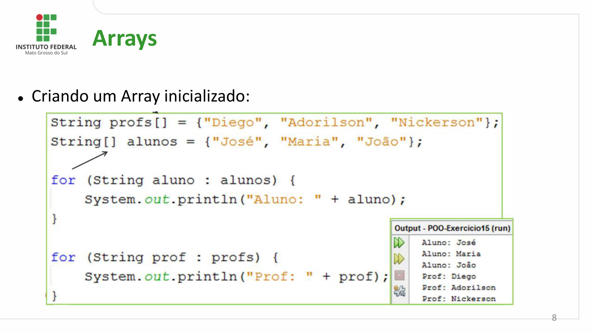

Arrays

- Criando um Array inicializado:

                                                                                                           8

## Página 9

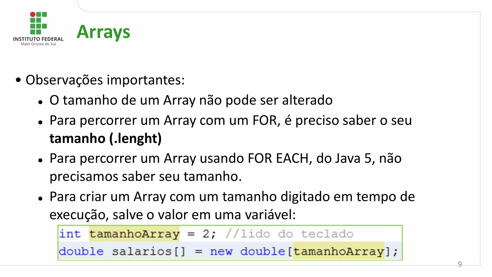

Arrays

- Observações importantes:
  - O tamanho de um Array não pode ser alterado
   - Para percorrer um Array com um FOR, é preciso saber o seu
    tamanho (.lenght)
   - Para percorrer um Array usando FOR EACH, do Java 5, não
     precisamos saber seu tamanho.
   - Para criar um Array com um tamanho digitado em tempo de
     execução, salve o valor em uma variável:

                                                                                                           9

## Página 10

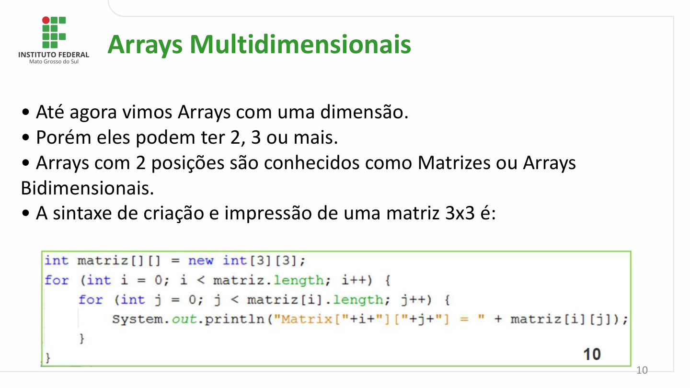

Arrays Multidimensionais

- Até agora vimos Arrays com uma dimensão.
- Porém eles podem ter 2, 3 ou mais.
- Arrays com 2 posições são conhecidos como Matrizes ou Arrays
Bidimensionais.
- A sintaxe de criação e impressão de uma matriz 3x3 é:

                                                                                                         10

## Página 11

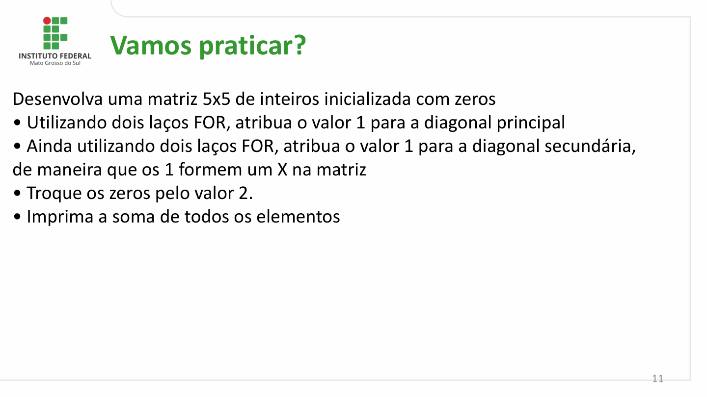

Vamos praticar?

Desenvolva uma matriz 5x5 de inteiros inicializada com zeros
- Utilizando dois laços FOR, atribua o valor 1 para a diagonal principal
- Ainda utilizando dois laços FOR, atribua o valor 1 para a diagonal secundária,
de maneira que os 1 formem um X na matriz
- Troque os zeros pelo valor 2.
- Imprima a soma de todos os elementos

                                                                                                           11

## Página 12

Dúvidas e
Questionamentos

                alana.neo @ifms.edu.br

                                                                           12
