Arquivo original: `Collections.pdf`

## Página 1

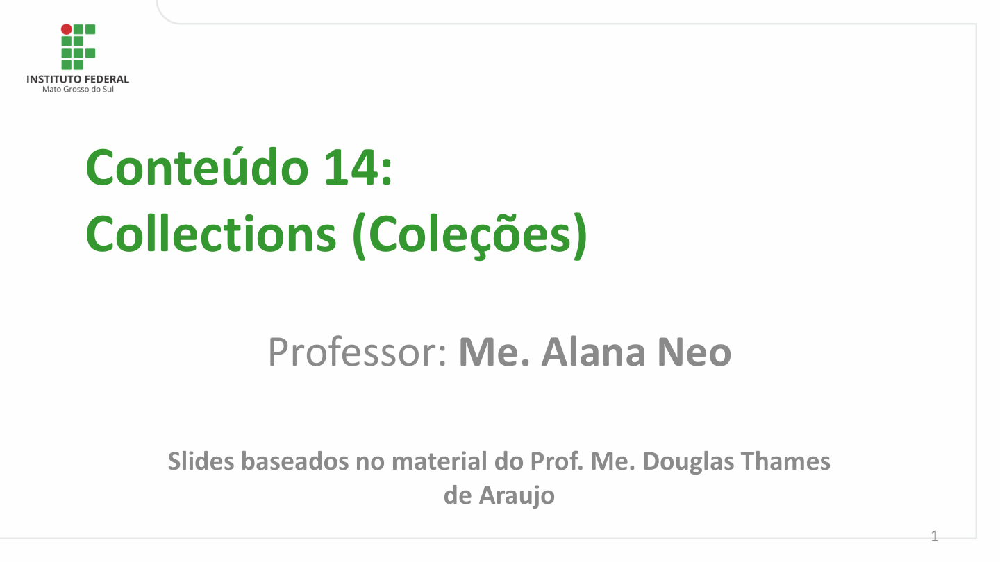

Conteúdo 14:
Collections (Coleções)

          Professor: Me. Alana Neo

       Slides baseados no material do Prof. Me. Douglas Thames
                         de Araujo

                                                                                                    1

## Página 2

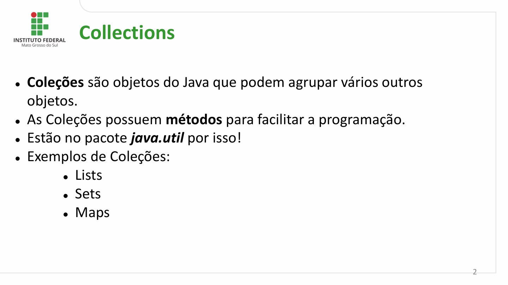

Collections

- Coleções são objetos do Java que podem agrupar vários outros
  objetos.
- As Coleções possuem métodos para facilitar a programação.
- Estão no pacote java.util por isso!
- Exemplos de Coleções:
       - Lists
      - Sets
     - Maps

                                                                                                          2

## Página 3

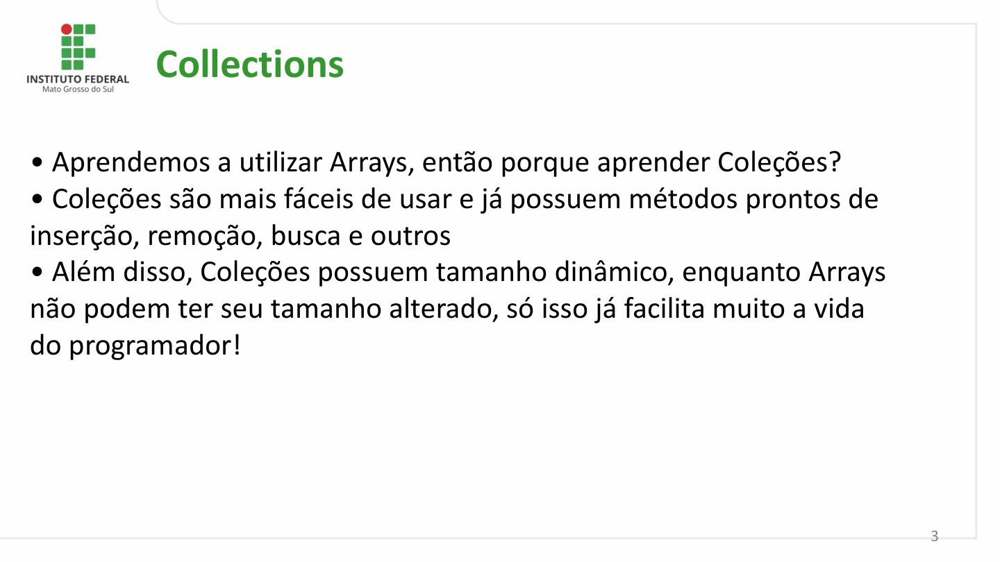

Collections

- Aprendemos a utilizar Arrays, então porque aprender Coleções?
- Coleções são mais fáceis de usar e já possuem métodos prontos de
inserção, remoção, busca e outros
- Além disso, Coleções possuem tamanho dinâmico, enquanto Arrays
não podem ter seu tamanho alterado, só isso já facilita muito a vida
do programador!

                                                                                                          3

## Página 4

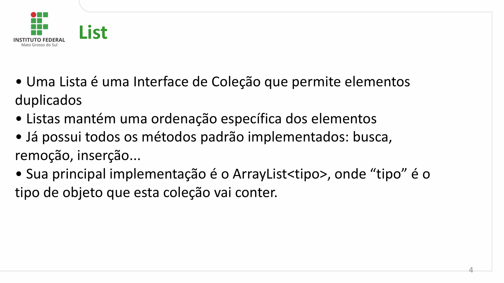

List

- Uma Lista é uma Interface de Coleção que permite elementos
duplicados
- Listas mantém uma ordenação específica dos elementos
- Já possui todos os métodos padrão implementados: busca,
remoção, inserção...
- Sua principal implementação é o ArrayList<tipo>, onde “tipo” é o
tipo de objeto que esta coleção vai conter.

                                                                                                          4

## Página 5

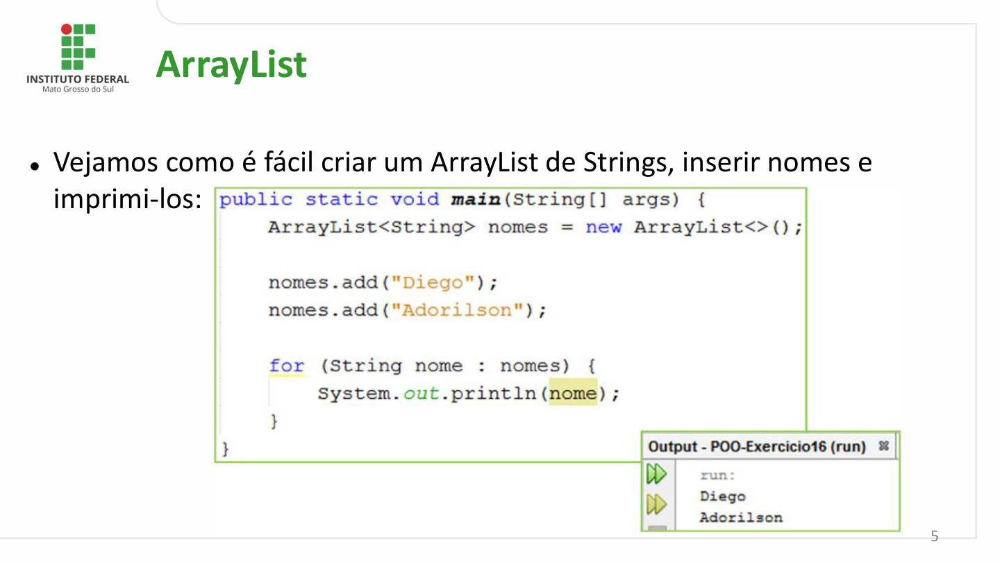

ArrayList

- Vejamos como é fácil criar um ArrayList de Strings, inserir nomes e
  imprimi-los:

                                                                                                          5

## Página 6

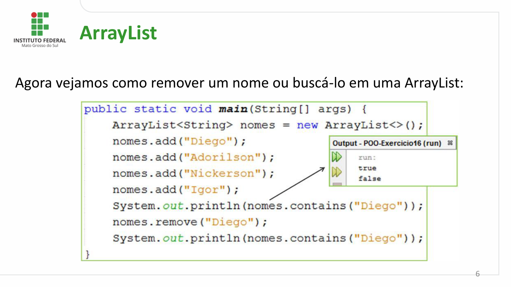

ArrayList

Agora vejamos como remover um nome ou buscá-lo em uma ArrayList:

                                                                                                          6

## Página 7

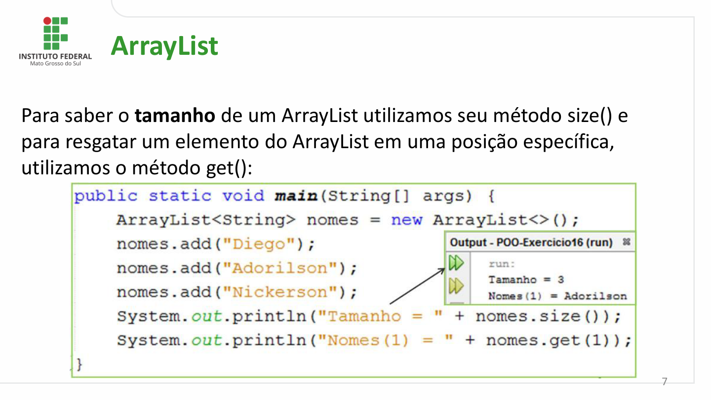

ArrayList

Para saber o tamanho de um ArrayList utilizamos seu método size() e
para resgatar um elemento do ArrayList em uma posição específica,
utilizamos o método get():

                                                                                                          7

## Página 8

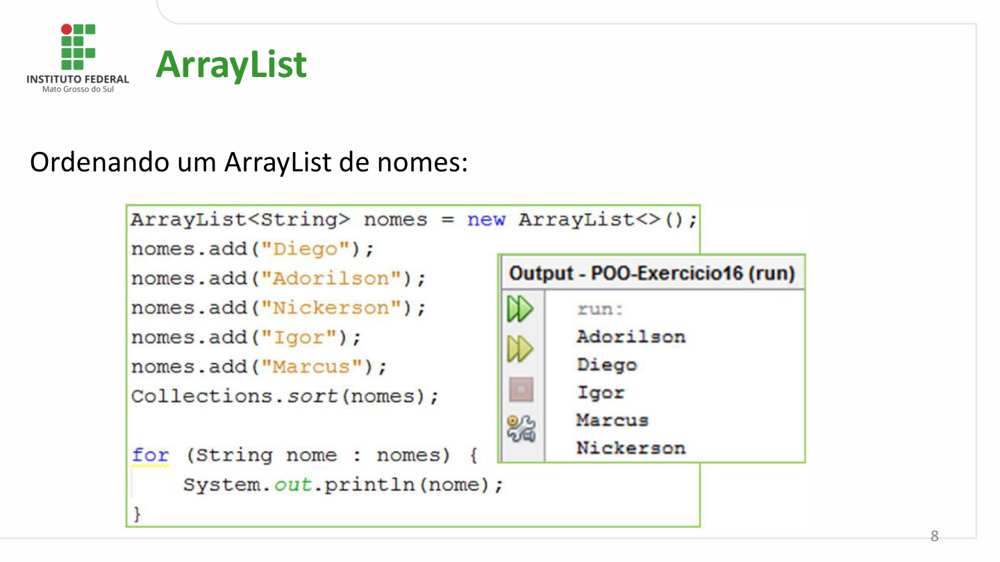

ArrayList

Ordenando um ArrayList de nomes:

                                                                                                          8

## Página 9

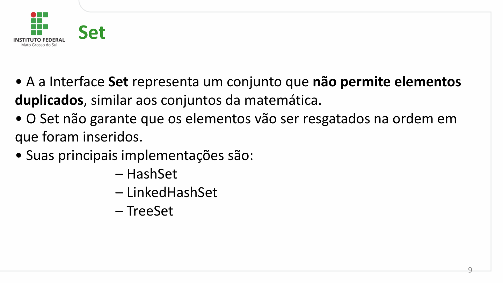

Set

- A a Interface Set representa um conjunto que não permite elementos
duplicados, similar aos conjuntos da matemática.
- O Set não garante que os elementos vão ser resgatados na ordem em
que foram inseridos.
- Suas principais implementações são:
             – HashSet
             – LinkedHashSet
             – TreeSet

                                                                                                          9

## Página 10

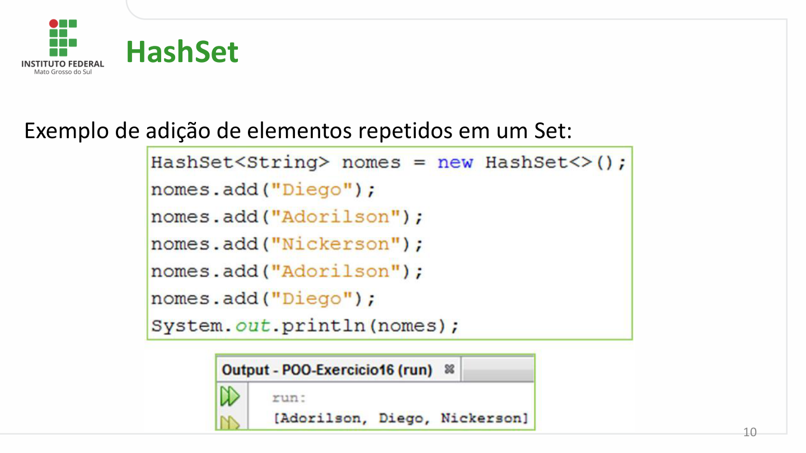

HashSet

Exemplo de adição de elementos repetidos em um Set:

                                                                                                         10

## Página 11

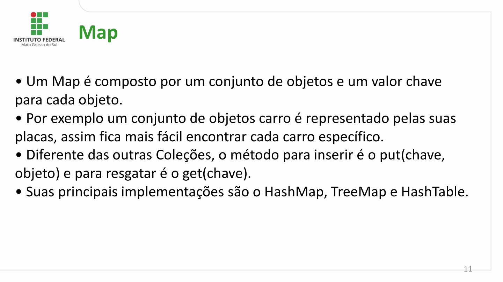

Map

- Um Map é composto por um conjunto de objetos e um valor chave
para cada objeto.
- Por exemplo um conjunto de objetos carro é representado pelas suas
placas, assim fica mais fácil encontrar cada carro específico.
- Diferente das outras Coleções, o método para inserir é o put(chave,
objeto) e para resgatar é o get(chave).
- Suas principais implementações são o HashMap, TreeMap e HashTable.

                                                                                                         11

## Página 12

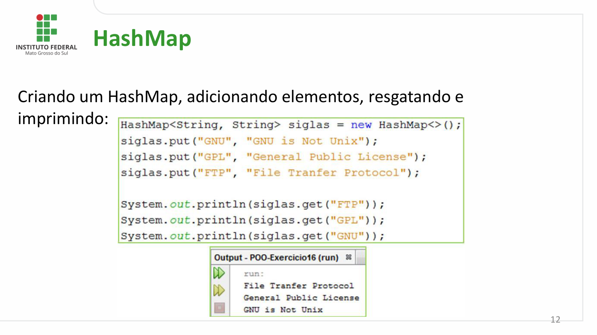

HashMap

Criando um HashMap, adicionando elementos, resgatando e
imprimindo:

                                                                                                         12

## Página 13

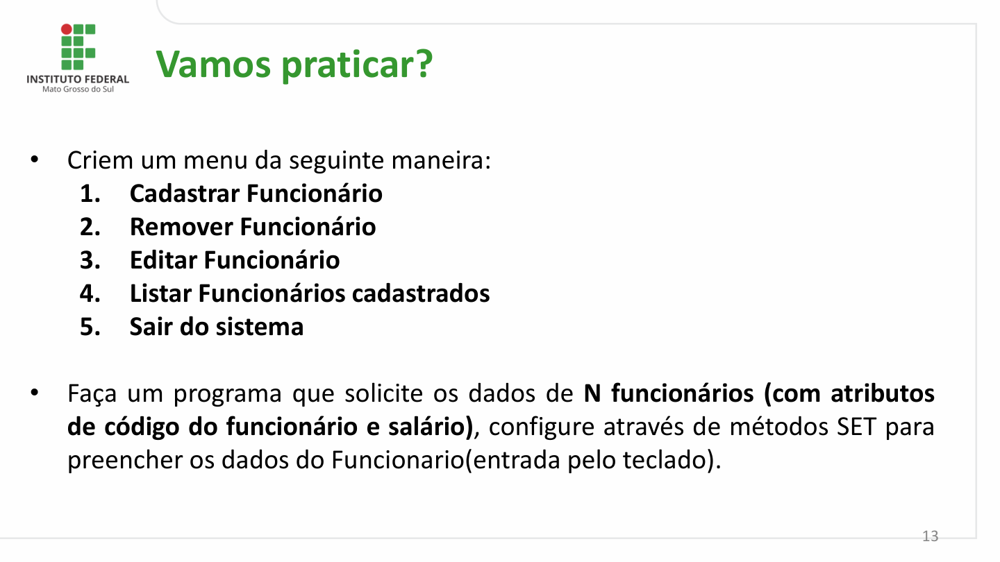

Vamos praticar?

-  Criem um menu da seguinte maneira:
     1.  Cadastrar Funcionário
     2.  Remover Funcionário
     3.   Editar Funcionário
     4.   Listar Funcionários cadastrados
     5.   Sair do sistema

-  Faça um programa que solicite os dados de N funcionários (com atributos
   de código do funcionário e salário), configure através de métodos SET para
   preencher os dados do Funcionario(entrada pelo teclado).

                                                                                                         13

## Página 14

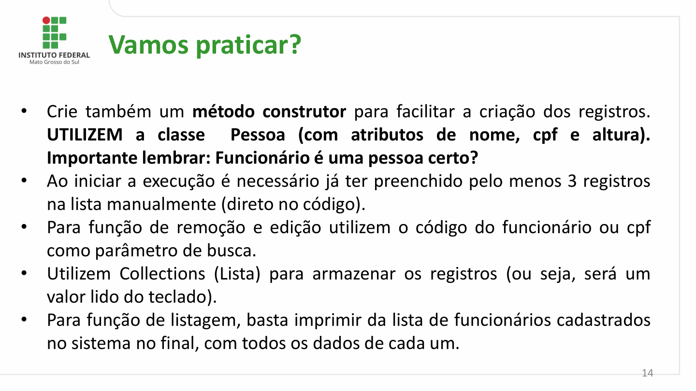

Vamos praticar?

-  Crie também um método construtor para facilitar a criação dos registros.
   UTILIZEM a  classe   Pessoa (com  atributos de nome,  cpf e  altura).
   Importante lembrar: Funcionário é uma pessoa certo?
-  Ao iniciar a execução é necessário já ter preenchido pelo menos 3 registros
   na lista manualmente (direto no código).
-  Para função de remoção e edição utilizem o código do funcionário ou cpf
  como parâmetro de busca.
-  Utilizem Collections (Lista) para armazenar os registros (ou seja, será um
   valor lido do teclado).
-  Para função de listagem, basta imprimir da lista de funcionários cadastrados
   no sistema no final, com todos os dados de cada um.

                                                                                                         14

## Página 15

Dúvidas e
Questionamentos

                alana.neo@ifms.edu.br

                                                                           15
